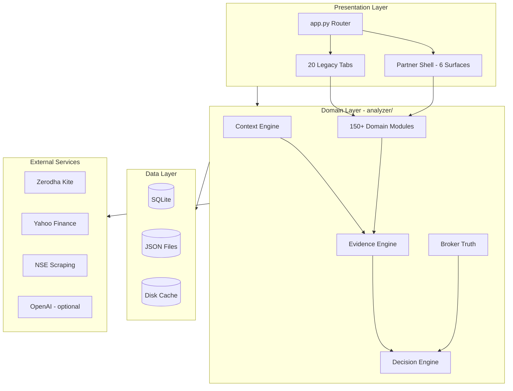
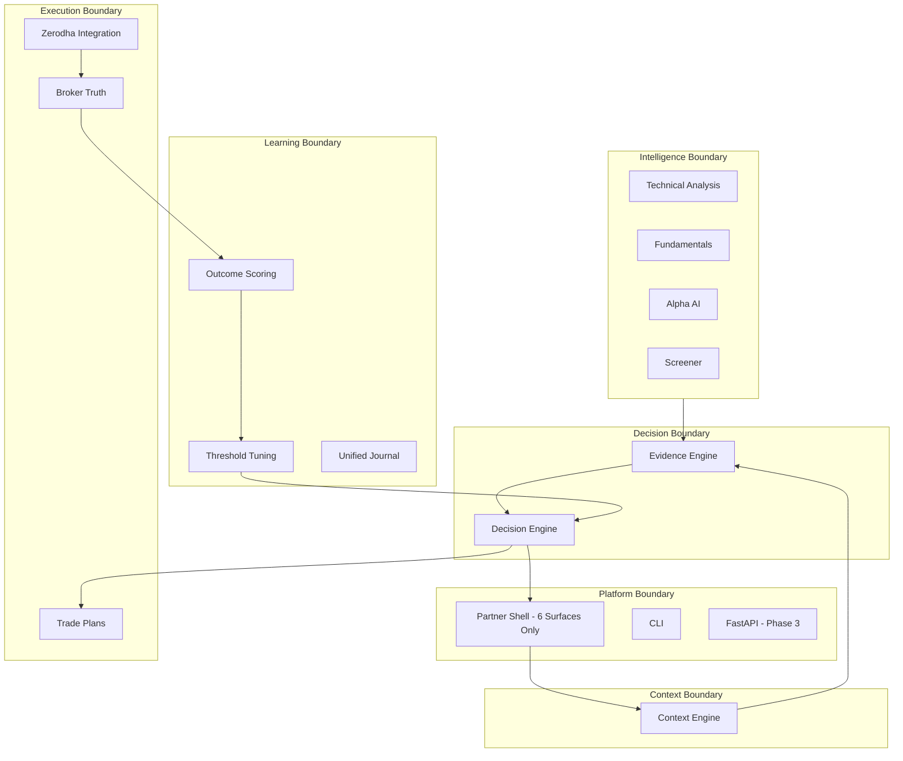
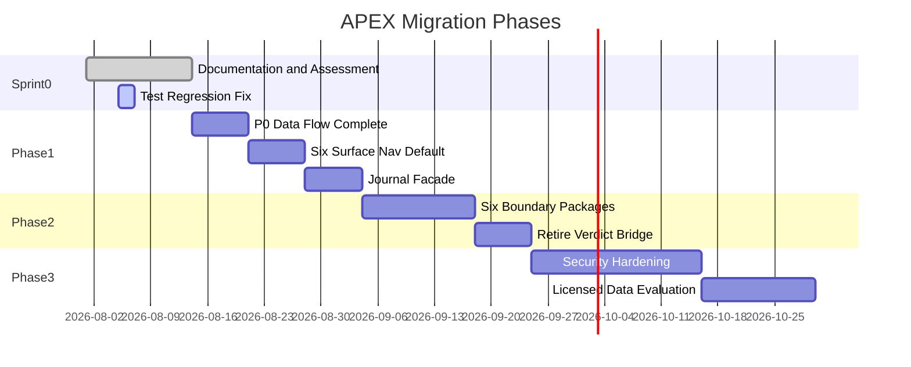
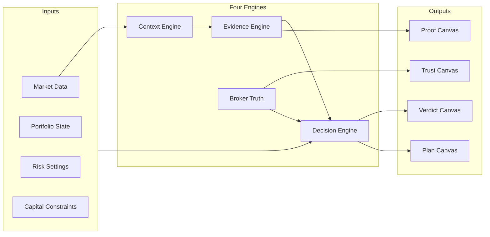

# APEX-001 — Sprint 0 Engineering Assessment

**Document ID:** APEX-001  
**Version:** 0.2  
**Status:** DRAFT — CTO Review (iteration 2)  
**Date:** 2026-08-05  
**Owner:** ChatGPT (CTO)  
**Author:** Cursor AI (Engineering Team)  
**Reviewers:** ChatGPT (CTO), Pratham Prakash (Founder) — pending  
**Supersedes:** APEX-001 v0.1  
**References:** [APEX-000](./APEX-000_Company_Constitution.md), [APEX-999](./APEX-999_Engineering_Handbook.md), [README](./README.md)

---

## Executive Summary

**Read time:** ~3 minutes  
**Audience:** Pratham Prakash (Founder), ChatGPT (CTO), executive stakeholders

### Governance context

| Role | Name / System |
|------|---------------|
| Founder & CEO | Pratham Prakash — final business decisions, release approval |
| CTO & Chief Product Architect | ChatGPT — architecture, standards, all doc/code review |
| Engineering Team | Cursor AI — implementation and documentation under approval |

Decision authority: see [APEX-000 §Governance](./APEX-000_Company_Constitution.md#governance--roles) and [README §Decision Authority Matrix](./README.md#decision-authority-matrix).

### Current State

The `stock-analyzer` repository is a **mature, production-used investment platform** — not a prototype. It contains ~71,000 lines of Python, 401 source files, 509 automated tests, and 38 prior architecture documents. A four-engine decision architecture (Context → Evidence → Decision → Broker Truth) is **94% complete**. The product serves a single-trader, India-focused daily workflow with Zerodha integration, MIS trading, options analytics, and institutional-style research.

The product identity is evolving from **Stock Analyzer V2** to **APEX** — an AI Investment Operating System.

### Business Implications

| Finding | Business impact |
|---------|----------------|
| **Substantial domain asset** | 12+ months of Indian-market logic is reusable. A greenfield rebuild would delay market entry by 6–12 months and destroy validated learning loops. |
| **Dual navigation (20 tabs + 6 surfaces)** | Users cannot answer *"What should I do today?"* in under 60 seconds. Morning readiness grade: C+. This directly limits retention and word-of-mouth. |
| **Local-only viability; SaaS blocked** | Product works for founder's daily workflow today. Commercial hosted deployment is blocked by security debt — no revenue path to cloud users until Phase 3. |
| **Trust gap (coach vs broker P&L)** | Partially fixed by Broker Truth engine. Remaining gap risks user trust if learning metrics overstate performance. Impacts CDQS (North Star). |
| **NSE scraping dependency** | Options features break on cloud deployment. Limits addressable market to local Mac users unless licensed data is procured. |

### Technical Implications

| Finding | Technical impact |
|---------|-----------------|
| Four-engine migration complete (94/100) | Phase 1 can build on canonical decision pipeline — no engine rewrite needed |
| 9 test failures (509 total) | CI regression blocks confident Phase 1 delivery — must fix before implementation |
| 19 import cycles, flat namespace | Package extraction possible via strangler pattern; not blocking Phase 1 |
| No API layer, Streamlit monolith | Scales to single user; ceiling for multi-client without FastAPI (Phase 3) |
| 5 critical security items | C1–C3 block any hosted deploy; C4 blocks cloud options; C5 partially mitigated |

### Recommended Direction

**Evolutionary migration in three phases over 8–10 weeks:**

1. **Phase 1 (weeks 1–3):** Product unification — six partner surfaces as sole navigation; DecisionArtifact end-to-end; consolidate overlapping daily drivers and journals.
2. **Phase 2 (weeks 4–6):** Architecture hygiene — 6 deployable boundaries (not 16 domains); retire legacy bridges; split god modules.
3. **Phase 3 (weeks 7–10):** Platform readiness — security hardening, licensed data evaluation, optional API layer — gated on Founder SaaS decision.

**Explicitly rejected:** Greenfield rewrite, 16-domain microservices, immediate React migration.

### Expected Outcome

| Horizon | Outcome |
|---------|---------|
| Sprint 0 complete | Approved baseline; tests green; governance docs in place |
| Phase 1 complete | User answers daily question on Today surface in <60s; morning readiness ≥ B |
| Phase 3 complete | Hosted deploy path viable; CDQS measurable on Trust surface |
| 12-month | APEX positioned as credible AI Investment OS for Indian retail investors |

---

## Business Impact

Every major recommendation below includes value across four dimensions and expected ROI.

### BI-1: Evolutionary migration (not rewrite)

| Dimension | Value |
|-----------|-------|
| **Business** | Preserves 12+ months of market-specific IP; Phase 1 starts in weeks, not months |
| **Customer** | Continuous improvement without feature regression during transition |
| **Engineering** | 509 tests and four-engine architecture remain valid; incremental delivery |
| **Operational** | No big-bang deploy; autopilot and daily loop uninterrupted |
| **ROI** | **High.** Estimated 6–12 months saved vs greenfield. Cost: legacy bridge maintenance (~2 weeks engineering). |

### BI-2: Six-surface UX unification (Phase 1)

| Dimension | Value |
|-----------|-------|
| **Business** | Differentiated product identity; supports premium positioning on discipline, not data |
| **Customer** | Time to First Value drops from ~5 min (tab exploration) to <60s (Today verdict) |
| **Engineering** | Eliminates duplicate verdict paths; reduces maintenance of 20 tab renderers |
| **Operational** | Simpler support — one workflow, not two navigation paradigms |
| **ROI** | **Very high.** ~3 weeks engineering. Directly improves retention and CDQS measurability. |

### BI-3: Six boundaries over 16 domains

| Dimension | Value |
|-----------|-------|
| **Business** | Faster time-to-market for Phase 2; avoids over-engineering tax |
| **Customer** | No user-visible change — internal packaging only |
| **Engineering** | 8–10 week migration vs 20 weeks; lower regression surface |
| **Operational** | Clearer ownership as team grows |
| **ROI** | **High.** Saves ~10 weeks engineering. Revisit 16-domain split only at scale. |

### BI-4: Security hardening before hosted deploy (Phase 3)

| Dimension | Value |
|-----------|-------|
| **Business** | Unlocks SaaS revenue path; required for any external users |
| **Customer** | Data protection, credential safety, session isolation |
| **Engineering** | ~3–4 weeks focused work; prevents catastrophic breach |
| **Operational** | Compliance foundation for future regulatory requirements |
| **ROI** | **Infinite downside protection.** No ROI on revenue until SaaS decision (OQ1). Mandatory if hosted. |

### BI-5: Unified journal facade (Phase 1)

| Dimension | Value |
|-----------|-------|
| **Business** | Enables Trust surface — prerequisite for CDQS North Star |
| **Customer** | Single honest account of what happened vs what was recommended |
| **Engineering** | Eliminates triple-store confusion; simplifies learning loop |
| **Operational** | One API for outcome queries |
| **ROI** | **High.** ~1 week engineering. Directly enables North Star metric. |

### BI-6: Fix test regression (immediate)

| Dimension | Value |
|-----------|-------|
| **Business** | Restores confidence in release process |
| **Customer** | Prevents shipping broken decision logic |
| **Engineering** | 509/509 pass rate restores CI as quality gate |
| **Operational** | Unblocks Phase 1 entry |
| **ROI** | **Critical path.** ~1–2 days engineering. Zero revenue impact; high risk reduction. |

---

## Engineering Scorecard

Maturity scored 1–5: **1 = Ad hoc · 2 = Developing · 3 = Defined · 4 = Managed · 5 = Optimizing**

| Dimension | Score | Trend | Reasoning |
|-----------|-------|-------|-----------|
| **Architecture** | 3.5 | ↑ | Four-engine model implemented (94/100). Flat namespace and 19 import cycles prevent score 4. 6-boundary plan defined. |
| **Security** | 1.5 | → | 5 critical items unresolved. Acceptable for local single-user. Blocks enterprise and SaaS entirely. |
| **Testing** | 3.0 | ↓ | 509 tests exist with domain coverage. Regression (9 failures) drops from 4.0. No coverage tooling. |
| **UX / Product** | 2.5 | ↑ | Partner canvases built; P0 data flow in progress. Dual nav and C+ morning readiness cap score. |
| **Performance** | 2.5 | → | Streamlit rerun tax on non-Home pages. No profiling baseline. Adequate for single user. |
| **Documentation** | 4.0 | ↑ | 38 legacy docs + new APEX governance system. Gap: APEX-002–009 not yet authored. |
| **Scalability** | 2.0 | → | Single-process monolith. SQLite/JSON. No API. Scales to 1 user; not to 1,000. |
| **Developer Experience** | 3.0 | → | CI pipeline, 509 tests, GETTING_STARTED.md. Flat namespace and import cycles hurt onboarding. God modules increase fear-of-change. |

**Composite Engineering Maturity: 2.8 / 5.0 (Developing → Defined transition)**

Target after Phase 1: **3.2**. Target after Phase 3: **3.8**.

---

## Product Maturity

| Subsystem | Stage | Evidence | Next stage gate |
|-----------|-------|----------|-----------------|
| **Context Engine** | Production | 12+ consumers migrated; snapshot composition stable | Merge pulse/macro caches |
| **Evidence Engine** | Production | Canonical assembler; migration adapters complete | UI consumes EvidencePacket natively in Proof |
| **Decision Engine** | Production | Sole verdict authority; 94/100 compliance | Retire verdict_bridge |
| **Broker Truth** | Beta → Production | Reconciliation works; learning integration partial | ≥90% broker-verified outcomes |
| **Alpha AI Research** | Production (local) | Full report pipeline; optional LLM; 1008 LOC | Split god module; cloud data path |
| **Intraday MIS Workflow** | Production (local) | Nightly prep, morning suggestions, live alerts, EOD scoring | Consolidate 6 daily drivers |
| **Options Analytics** | Beta | NSE scraping; breaks on cloud; 4 overlapping advisors | Licensed data; advisor consolidation |
| **Portfolio / Zerodha** | Production (local) | Kite sync, live P&L, CSV import | Multi-broker abstraction (deferred) |
| **Learning Loop** | Beta | Threshold tuning, calibration; triple journal blocks Trust | Unified journal facade |
| **Partner Shell (6 surfaces)** | MVP → Beta | Canvases built; P0 data flow incomplete; dual nav | Phase 1 unification |
| **Autopilot / Scheduling** | Production (Mac) | 10 launchd schedules; Telegram alerts | Linux/cloud scheduler abstraction |
| **Legacy Tabs (20 pages)** | Production (legacy) | Fully functional; constitution violation | Hide/retire in Phase 1 |
| **Security / Auth** | Prototype | Single-user; no auth; plaintext secrets | Phase 3 hardening |
| **API Layer** | Prototype | CLI only; no REST | Phase 3 FastAPI (if needed) |
| **Sibling Apps** | Out of scope | Separate products in repo | Extract to separate repos |

---

## Architecture Diagrams

### Current Architecture (As-Is)

### Target Architecture (To-Be — Phase 2)

### Migration Strategy (Phase Timeline)

### Decision Flow (Canonical Pipeline)

---

## Decision Log

### Accepted Decisions

| ID | Decision | Rationale | Date | ADR |
|----|----------|-----------|------|-----|
| D-001 | Product evolves to APEX; repo stays `stock-analyzer` | Preserve Git history and CI | 2026-08-05 | — |
| D-002 | Evolutionary migration, not rewrite | 40k+ LOC domain asset; 509 tests; 94/100 engine compliance | 2026-08-05 | ADR-002 |
| D-003 | Six deployable boundaries, not 16 domains | Architecture critique; current team size; change velocity | 2026-08-05 | ADR-001 |
| D-004 | Streamlit retained Phase 1–2 | Partner canvases exist; UI rewrite doesn't improve decisions | 2026-08-05 | ADR-003 |
| D-005 | Six partner surfaces as sole navigation (target) | Product Constitution; APEX-000 N5 | 2026-08-05 | — |
| D-006 | Four-engine model as canonical pipeline | 94/100 compliance; constitution AI philosophy | 2026-08-05 | — |
| D-007 | Sprint 0 is documentation-only | Understand before implement; APEX-000 N9 | 2026-08-05 | — |
| D-008 | Sibling apps out of APEX scope | No domain overlap | 2026-08-05 | — |

### Rejected Decisions

| ID | Decision | Rationale | Date |
|----|----------|-----------|------|
| R-001 | Greenfield rewrite | No technical justification; 6–12 month delay | 2026-08-05 |
| R-002 | 16-domain microservices now | Over-engineered for single-trader scale | 2026-08-05 |
| R-003 | Immediate React/Next.js migration | Fails product gate; no decision quality improvement | 2026-08-05 |
| R-004 | Delete legacy tabs immediately | Surface parity not verified; user workflow risk | 2026-08-05 |
| R-005 | Merge sibling apps into APEX | Unrelated domain | 2026-08-05 |

### Deferred Decisions

| ID | Decision | Owner | Trigger to resolve |
|----|----------|-------|-------------------|
| DEF-001 | Hosted multi-tenant SaaS | Founder | Revenue strategy defined |
| DEF-002 | Licensed NSE data provider | Founder | SaaS decision + budget |
| DEF-003 | APEX UI rebrand timing | Founder | Phase 1 complete |
| DEF-004 | Multi-broker support | Founder | User demand signal |
| DEF-005 | FastAPI + Postgres | CTO | Multi-client or multi-user requirement |
| DEF-006 | Sibling app repo extraction | CTO | Phase 1 hygiene sprint |

### Future RFCs

| RFC | Topic | Priority |
|-----|-------|----------|
| RFC-001 | Hosted multi-tenant SaaS deployment model | High — blocks Phase 3 |
| RFC-002 | Licensed NSE data provider selection | High — blocks cloud options |
| RFC-003 | Streamlit long-term vs frontend rewrite | Medium |
| RFC-004 | Multi-broker integration architecture | Low |

---

## Risk Register

Probability: **L** Low · **M** Medium · **H** High  
Impact: **L** Low · **M** Medium · **H** High · **C** Critical  
Priority: P × I matrix

### Technical Risks

| ID | Risk | P | I | Priority | Mitigation | Owner |
|----|------|---|---|----------|------------|-------|
| TR-01 | Test regression (9/509 failing) | H | H | **P0** | Fix before Phase 1; CI gate | Principal Eng |
| TR-02 | 19 import cycles block package extraction | M | M | P2 | Strangler migration; lazy imports | Principal Eng |
| TR-03 | God module changes cause regressions | M | M | P2 | Incremental split; test per module | Principal Eng |
| TR-04 | Streamlit scalability ceiling | L | M | P3 | FastAPI path in Phase 3 | CTO |
| TR-05 | SQLite schema drift without migrations | M | M | P2 | Alembic evaluation in Phase 2 | Principal Eng |

### Business Risks

| ID | Risk | P | I | Priority | Mitigation | Owner |
|----|------|---|---|----------|------------|-------|
| BR-01 | Dual navigation causes user churn | H | H | **P0** | Phase 1 UX unification | CPO |
| BR-02 | Trust failure (coach vs broker P&L) | M | C | **P0** | Broker Truth + journal facade | Principal Eng |
| BR-03 | Over-engineering delays market entry | M | H | P1 | 6-boundary model; CTO gate | CTO |
| BR-04 | Feature parity gap during tab retirement | M | M | P2 | Surface parity checklist | CPO |

### Market Risks

| ID | Risk | P | I | Priority | Mitigation | Owner |
|----|------|---|---|----------|------------|-------|
| MR-01 | NSE ToS / scraping enforcement | M | H | P1 | Licensed data path (RFC-002) | Founder |
| MR-02 | Zerodha API changes or rate limits | L | H | P2 | Provider abstraction exists | Principal Eng |
| MR-03 | Competing AI investment products | M | M | P3 | Differentiate on discipline/CDQS | Founder |

### Operational Risks

| ID | Risk | P | I | Priority | Mitigation | Owner |
|----|------|---|---|----------|------------|-------|
| OR-01 | Mac-only autopilot limits user base | H | M | P2 | Cloud scheduler abstraction (Phase 3) | Principal Eng |
| OR-02 | `tmp/` accidental commit (109 files) | M | L | P3 | `.gitignore` in Phase 1 | Principal Eng |
| OR-03 | Kite token expiry disrupts daily loop | M | M | P2 | Token refresh automation exists | Principal Eng |

### AI Risks

| ID | Risk | P | I | Priority | Mitigation | Owner |
|----|------|---|---|----------|------------|-------|
| AIR-01 | LLM hallucination in Alpha AI | M | H | P1 | Facts-only prompt; env gate; validation | Principal Eng |
| AIR-02 | False confidence from evidence without broker truth | M | C | **P0** | CDQS metric; Trust surface | CTO |
| AIR-03 | Learning loop optimizes proxy not real P&L | M | H | P1 | Broker Truth as primary source | Principal Eng |

### Security Risks

| ID | Risk | P | I | Priority | Mitigation | Owner |
|----|------|---|---|----------|------------|-------|
| SR-01 | No authentication (C1) | C* | C | **P0** | Phase 3 auth middleware | CTO |
| SR-02 | Plaintext secrets in .env (C2) | H | C | **P0** | OS keychain / secrets manager | CTO |
| SR-03 | XSRF/CORS disabled (C3) | H | H | **P0** | Production Streamlit config | CTO |
| SR-04 | Unencrypted SQLite (PII/financial) | M | H | P1 | Encryption or Postgres migration | CTO |

*Certain if deployed to any shared/hosted environment.

### Dependency Risks

| ID | Risk | P | I | Priority | Mitigation | Owner |
|----|------|---|---|----------|------------|-------|
| DR-01 | NSE scraping fails on cloud (C4) | H | H | **P0** | Licensed data; graceful degradation | Founder |
| DR-02 | Yahoo Finance unreliable | M | M | P2 | Kite-first routing; data health panel | Principal Eng |
| DR-03 | OpenAI cost/latency | L | L | P4 | Optional; env-gated | Principal Eng |
| DR-04 | Streamlit framework lock-in | M | M | P3 | FastAPI extraction path documented | CTO |

---

## 1. Purpose

Establish a verified, evidence-based baseline of the `stock-analyzer` repository before any APEX production work begins. This document answers: *What do we have, what is reusable, what is risky, and what is the lowest-risk path to APEX?*

Sprint 0 mandates understanding before implementation. This assessment is the authoritative input for Phase 1 planning.

---

## 2. Scope

### In scope

- Repository structure, module inventory, and dependency analysis
- Architecture compliance against the four-engine constitution
- Technical debt, security posture, and test health
- Reusable vs legacy component classification
- APEX migration recommendations with tradeoffs
- Executive strategy, business impact, and risk register

### Out of scope

- Implementation of any code changes
- Product branding or UI redesign execution
- Licensed data vendor selection or procurement
- Multi-broker integration design
- Sibling apps — out of product scope
- `tmp/` scratch artifacts — hygiene note only

---

## 3. Background

The `stock-analyzer` repository has been under active development since at least mid-2025. Between 2026-07-15 and 2026-07-25, the team completed a five-step engine migration (docs 10–16). A frozen four-engine constitution exists in `docs/architecture/08_Final_Investment_OS_Architecture.md`. An adversarial review recommends **6 deployable boundaries** over 16 domains.

Module count has grown (163 → ~199). Test count has grown (437 → 509). This document supersedes informal audit summaries and APEX-001 v0.1 for planning purposes.

---

## 4. Problem Statement

The repository contains substantial, production-used domain logic and a partially migrated architecture, but lacks a single APEX-aligned **executive engineering strategy** that:

1. Reconciles prior V2 audits with current codebase state
2. Connects technical findings to business impact and ROI
3. Defines measurable KPIs and product maturity stages
4. Provides a decision log, risk register, and phased migration path
5. Enables Sprint 0 exit and Phase 1 entry with clear acceptance criteria

---

## 5. Goals

| ID | Goal | Rationale |
|----|------|-----------|
| G1 | Inventory reusable modules with reuse tier | Prevents accidental deletion of business logic |
| G2 | Measure four-engine compliance (currently 94/100) | Confirms migration foundation |
| G3 | Identify blocking risks with P×I priority | Security and data are go/no-go gates |
| G4 | Recommend phased migration (6 boundaries) | Avoids over-engineering |
| G5 | Define KPIs including CDQS North Star | Enables outcome measurement |
| G6 | Provide decision log for institutional memory | Prevents re-litigation of settled decisions |

---

## 6. Non-Goals

- Rewriting `analyzer/` or replacing Streamlit in Sprint 0
- APEX pricing, GTM, or commercial model
- FastAPI, Postgres, or auth in Sprint 0
- Licensed NSE data procurement (flag only)
- Repository rename

---

## 7. Current State

### 7.1 Repository metrics (measured 2026-08-05)

| Metric | Value | Source |
|--------|-------|--------|
| Python files | 401 | `find` |
| LOC — `analyzer/` | 40,749 | `wc -l` |
| LOC — `ui/` | 17,160 | `wc -l` |
| LOC — `tests/` | 10,117 | `wc -l` |
| LOC — `scripts/` | 1,759 | `wc -l` |
| Test modules | 91 | `tests/test_*.py` |
| Tests executed | 509 | `unittest discover` |
| Test result | 3 failures, 6 errors | Regression vs 437/437 (Jul 2026) |
| Architecture docs (legacy) | 27 | `docs/architecture/` |
| Design docs (legacy) | 11 | `docs/design/` |

### 7.2 Four-engine compliance: 94/100

| Engine | Status |
|--------|--------|
| Context Engine | ✅ 12+ consumers migrated |
| Evidence Engine | ✅ Canonical assembler |
| Decision Engine | ✅ ACT/WAIT/PASS/REDUCE/DEFENSIVE |
| Broker Truth | ✅ Reconciliation + learning |

**Remaining debt:** `verdict_bridge.py` (~800 LOC), coach script display strings, parallel context caches.

### 7.3 UX: dual navigation (constitution violation)

Partner Shell (6 surfaces) partially implemented. 20 legacy tabs remain primary navigation. Morning readiness: **C+**.

### 7.4 Security: 5 critical items (C1–C5)

Local single-user viable. Hosted/multi-user **blocked**.

### 7.5 Technology stack

Python 3.12 · Streamlit ≥1.37 · pandas · plotly · kiteconnect · SQLite/JSON · macOS launchd · No ML training pipeline · Optional OpenAI LLM.

---

## 8. Proposed State

Phase 1–3 targets summarized in Executive Summary and Architecture Diagrams. Six partner surfaces as sole navigation. Six deployable boundaries. DecisionArtifact end-to-end. Security hardening before hosted deploy.

---

## 9. Architecture

### 9.1 Reuse tier classification

**Tier 1 — Extend:** `context_engine/`, `evidence_engine/`, `decision_engine/`, `broker_truth/`

**Tier 2 — Keep:** Research, TA, intraday, options, portfolio, learning, market data, broker modules (see v0.1 §9.1 for module list)

**Tier 3 — Adapt:** Partner canvas UI components

**Tier 4 — Retire/consolidate:** Legacy watchlist, 14 legacy tabs, verdict_bridge (gradual), triple journal, 6 daily drivers → 2, dead modules, sibling apps

### 9.2 Hub modules (change with caution)

`zerodha.py` (567 LOC), `data.py`, `market_session.py`, `watchlist_history.py` (643 LOC), `verdict_bridge.py` (800+ LOC), `investment_os.py` (520 LOC)

### 9.3 Import graph

19 documented cycles. Lazy import mitigation. Acceptable for Phase 1 if new code respects Context → Evidence → Decision direction.

---

## 10. Tradeoffs

| Decision | Gain | Cost |
|----------|------|------|
| Evolutionary migration | 40k+ LOC preserved; continuous delivery | Legacy bridges during transition |
| 6 boundaries over 16 domains | 8–10 weeks vs 20 | Less granular ownership until scale |
| Streamlit Phase 1–2 | Zero frontend rewrite | Scalability ceiling |
| Defer FastAPI/Postgres | Focus on product unification | Multi-client blocked |
| Rule-based over ML | Explainability; constitution aligned | No adaptive models |

---

## 11. Alternatives Considered

See Decision Log (Rejected: R-001 through R-005). Greenfield rewrite, 16-domain microservices, immediate React migration, immediate tab deletion, and sibling app merge all rejected with documented rationale.

---

## 12. Risks

Comprehensive register in **Risk Register** section above. Summary: 4 P0 items (test regression, dual nav, trust/P&L, security C1–C3 if deployed).

---

## 13. Migration Strategy

| Phase | Duration | Focus |
|-------|----------|-------|
| **Sprint 0** | Current | Documentation, assessment, test fix, approval |
| **Phase 1** | Weeks 1–3 | Product unification: surfaces, data flow, journal facade |
| **Phase 2** | Weeks 4–6 | Architecture hygiene: 6 boundaries, bridge retirement |
| **Phase 3** | Weeks 7–10 | Platform readiness: security, data, optional API |

See Migration Strategy Gantt in Architecture Diagrams.

---

## 14. Dependencies

**Internal:** Four-engine migration (complete), Product Constitution (APEX-000), P0 Data Flow Matrix (in progress), test suite (regressed).

**External:** Zerodha Kite, Yahoo Finance, NSE scraping, OpenAI (optional), macOS launchd, Streamlit Cloud.

**Stakeholder:** Open Questions OQ1–OQ7 require Founder/CTO resolution.

---

## 15. Open Questions

| ID | Question | Owner |
|----|----------|-------|
| OQ1 | Hosted SaaS on roadmap? | Founder |
| OQ2 | Budget for licensed NSE data? | Founder |
| OQ3 | Six-surface constitution confirmed? | Founder + CTO |
| OQ4 | APEX rebrand timing? | Founder |
| OQ5 | Extract sibling apps? | CTO |
| OQ6 | Streamlit long-term vs rewrite? | CTO |
| OQ7 | Multi-broker priority? | Founder |

---

## 16. Success Metrics (KPIs)

### North Star

| KPI | Definition | Current | Phase 1 Target | Phase 3 Target |
|-----|------------|---------|----------------|----------------|
| **CDQS** | Broker-verified outcomes matching confidence band / ACT verdicts acted upon | Not measured | Measurable on Trust | ≥ 0.60 |
| **Time to First Value** | Seconds from app open to actionable Today verdict | ~300s (tab exploration) | < 60s | < 30s |
| **Navigation Complexity** | Default-visible nav items | 20 tabs | 6 surfaces | 6 surfaces |
| **Test Health** | Pass rate in CI | 98.2% (500/509) | 100% | 100% |
| **Documentation Coverage** | APEX catalog docs approved | 3 of 10 planned | 6 of 10 | 10 of 10 |
| **Technical Debt Score** | Critical + High open items | 15 | ≤ 10 | ≤ 5 |
| **Recommendation Trust** | User can explain WHY for ACT verdict | Qualitative low | Qualitative medium | Qualitative high |
| **User Confidence** | Self-reported trust in daily verdict | Not measured | Baseline survey | +20% |
| **Decision Latency** | Time from data fetch to DecisionArtifact | Not profiled | < 5s (Today) | < 2s |
| **Developer Onboarding** | Hours to first meaningful PR | ~16h (estimated) | < 8h | < 4h |
| **Architecture Compliance** | Four-engine score | 94/100 | ≥ 96/100 | ≥ 98/100 |
| **Morning Readiness** | CPO grade | C+ | B | A- |

---

## 17. Acceptance Criteria

Sprint 0 complete when:

- [ ] **AC1:** APEX-000 approved by Founder + CTO
- [ ] **AC2:** APEX-001 approved by CTO
- [ ] **AC3:** APEX-999 approved by CTO
- [ ] **AC4:** Test suite 509/509 pass in CI
- [ ] **AC5:** Open Questions assigned with deferral or resolution
- [ ] **AC6:** Phase 1 backlog sequenced (APEX-009)
- [ ] **AC7:** No production code changes in Sprint 0

---

## 18. Future Evolution

| Document | Purpose | Target |
|----------|---------|--------|
| APEX-002 | Module Inventory | Sprint 1 |
| APEX-003 | Product Vision | Sprint 1 |
| APEX-004 | PRD | Sprint 2 |
| APEX-005 | Architecture Blueprint | Sprint 1 |
| APEX-006 | Security Strategy | Phase 3 entry |
| APEX-007 | Design System | Phase 1 |
| APEX-009 | Phase 1 Plan | Sprint 0 exit |

---

## CTO Recommendation

### Summary

Approve APEX-001 v0.2 **after** test regression fix (ETS-001) and Founder resolution of OQ1 (SaaS roadmap). The repository is a **strong foundation** for APEX. Phase 1 product unification delivers the highest ROI.

### Priority Actions

| Priority | Action | Confidence | Business Impact | Engineering Cost | Expected ROI |
|----------|--------|------------|-----------------|------------------|--------------|
| **P0** | Fix test regression (509/509) | 95% | Restores release confidence | 1–2 days | Risk elimination |
| **P0** | Complete P0 data flow (DecisionArtifact → canvases) | 90% | Enables Today as product | 1 week | Very high |
| **P0** | Six-surface nav as default | 85% | Time to First Value < 60s | 2 weeks | Very high |
| **P1** | Unified journal facade | 90% | Enables CDQS North Star | 1 week | High |
| **P1** | Consolidate daily drivers (6 → 2) | 80% | Verdict consistency | 1 week | High |
| **P2** | Six-boundary package restructure | 85% | Developer onboarding | 2 weeks | Medium |
| **P3** | Security hardening | 95% | Unlocks SaaS | 3–4 weeks | Revenue gate |

### Recommended Next Steps

1. **Founder:** Resolve OQ1 (SaaS roadmap) and OQ3 (six-surface confirmation) within 1 week
2. **Principal Engineer:** Execute ETS-001 (test regression fix); target 509/509 by 2026-08-07
3. **CTO:** Approve APEX-000, APEX-001 v0.2, APEX-999 after review
4. **All:** Begin APEX-002 (Module Inventory) and APEX-009 (Phase 1 Plan) upon Sprint 0 exit
5. **Do not begin Phase 1 implementation** until AC1–AC7 satisfied

### Approval Recommendation

| Document | Recommendation |
|----------|----------------|
| APEX-000 | **Approve with review** — aligns V2 constitutions into single authority |
| APEX-001 v0.2 | **Approve after iteration** — fix tests; resolve OQ1/OQ3 |
| APEX-999 | **Approve with review** — standard handbook; refine quarterly |

---

## Appendix A — Validation Checklist

| Item | Status |
|------|--------|
| Technically correct (2026-08-05) | ✅ |
| No internal contradictions | ✅ |
| No duplicated sections | ✅ |
| Assumptions explicit | ✅ |
| Risks with P×I priority | ✅ |
| Migration path with Gantt | ✅ |
| Business impact per recommendation | ✅ |
| Mermaid architecture diagrams | ✅ |
| CTO recommendation with ROI | ✅ |
| Multi-audience (Founder + engineering) | ✅ |

---

## Appendix B — Related Documents

| Document | Path |
|----------|------|
| Company Constitution | [APEX-000](./APEX-000_Company_Constitution.md) |
| Engineering Handbook | [APEX-999](./APEX-999_Engineering_Handbook.md) |
| Documentation Index | [README](./README.md) |
| Legacy four-engine constitution | `docs/architecture/08_Final_Investment_OS_Architecture.md` |
| Legacy technical debt | `docs/architecture/03_Technical_Debt.md` |

---

*Repository: stock-analyzer · Product: APEX · Document: APEX-001 v0.2*
