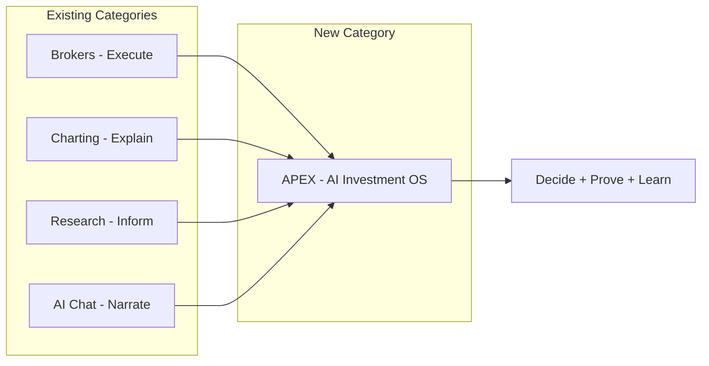
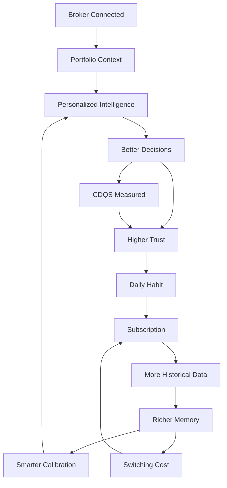
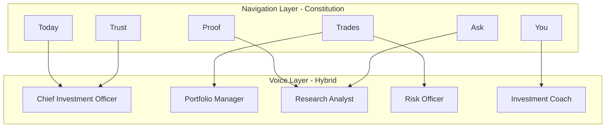
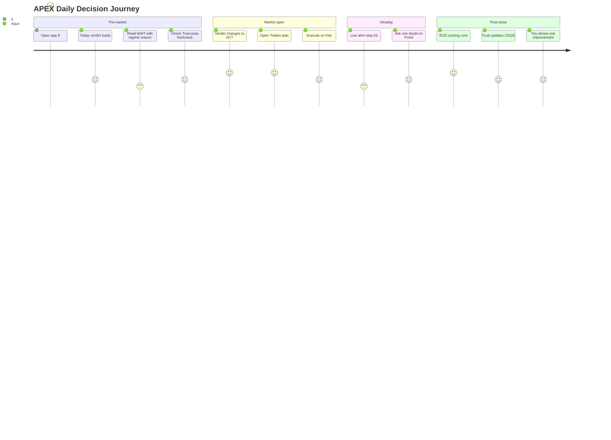
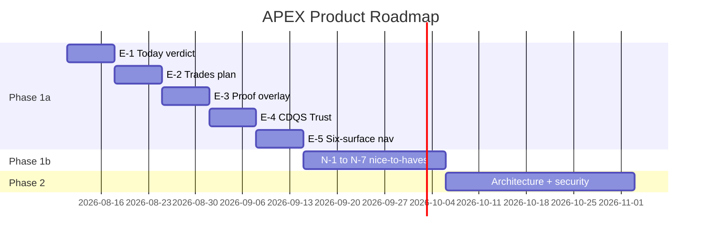

# APEX-003 — Product Strategy & Product Requirements Document

**Document ID:** APEX-003  
**Version:** 0.2  
**Status:** DRAFT — CTO Review (iteration 2)  
**Date:** 2026-08-05  
**Owner:** Pratham Prakash (Founder & CEO)  
**Author:** Cursor AI (Engineering Team)  
**Reviewers:** ChatGPT (CTO) — pending  
**Supersedes:** APEX-003 v0.1  
**References:** [APEX-000](./APEX-000_Company_Constitution.md), [APEX-001](./APEX-001_Sprint0_Engineering_Assessment.md), [APEX-999](./APEX-999_Engineering_Handbook.md), [README](./README.md)

**Traceability rule:** Every future feature, RFC, ADR, ETS, architecture decision, UX decision, and implementation **must trace back to a section in this document** or to [APEX-000](./APEX-000_Company_Constitution.md).

**Document type:** Product Strategy that defines a **new category** — not a traditional PRD for an application feature list.

---

## Table of Contents

**Part A — Category & Conviction**  
[Founder Story](#founder-story) · [Executive Summary](#1-executive-summary) · [Investor Pitch](#2-investor-pitch) · [Company Manifesto](#3-company-manifesto) · [Product Positioning](#4-product-positioning) · [Emotional Vision](#5-emotional-vision)

**Part B — Product Strategy**  
[Mission](#6-mission) · [Purpose](#7-company-purpose) · [Problem](#8-problem-statement) · [Why Must Exist](#9-why-this-product-must-exist) · [Product Philosophy](#13-product-philosophy) · [Product Flywheel](#14-product-flywheel) · [Memory Strategy](#15-memory-strategy) · [AI Philosophy](#16-ai-philosophy) · [Design Philosophy](#17-design-philosophy) · [Product Principles](#18-product-principles) · [UX Model Comparison](#19-ux-model-comparison) · [Competitive Moats](#20-competitive-moats)

**Part C — Market & Business**  
§21–29 Market, personas, competition, business model, GTM (see sections below)

**Part D — Execution**  
§39–44 Roadmap, MVP, Feature Reduction, features in/out, future vision

**Part E — Governance**  
§45–50 Risks, assumptions, open questions, decisions, success criteria

**Part F — v2 Meta**  
[Revision Summary](#appendix-c--revision-summary-v02) · [CTO Feedback Addressed](#appendix-d--cto-feedback-addressed) · [Approval Recommendation](#appendix-f--recommendation-for-cto-approval)

---

## Founder Story

*8:44 AM. Bangalore. Market opens in 31 minutes.*

**Meet Arjun.** Software engineer. Zerodha account. ₹15 lakh portfolio. ₹40,000 tactical pool he refuses to blow up. ₹25,000/month SIP he never skips.

He opens five apps every morning.

**Kite** — holdings, margins, yesterday's P&L.  
**TradingView** — Nifty chart, indicators, trend lines.  
**Tickertape** — ratios, news, analyst ratings.  
**Telegram** — three channels with conflicting calls.  
**ChatGPT** — "Should I buy HDFC Bank today?" A confident paragraph. Numbers that may not exist.

Charts. News. Ratios. Screeners. Opinions.

**Information everywhere. Confidence nowhere.**

Arjun knows more than he did three years ago. He trades worse than he should. Not because he lacks data — because he lacks **a decision**. Every tool explains *something*. None answer the only question that matters:

> *What should I do with my money today — and why?*

Some mornings he trades on impulse. Some mornings he freezes. Some mornings he follows a Telegram tip and eats a stop-loss by 10:15 AM. Every evening he wonders: *Was today discipline or noise?*

He does not need another dashboard. He does not need another prediction. He does not need an AI that sounds smart.

**He needs a system that respects his capital.**

---

**APEX enters here.**

One app. One morning. One verdict.

**WAIT** — because the regime is choppy and his tactical pool hit its daily loss dam yesterday.  
Or **ACT** — with entry, stop, target, and size — because evidence, context, risk, and timing align.

Not a tip. A **decision** — with proof he can inspect, trust he can verify against his Kite account, and a system that gets smarter from what actually happened to his money.

Arjun closes the other four apps.

For the first time, he knows what to do.

**That is why APEX exists.**

---

## 1. Executive Summary

**Read time:** 3 minutes  
**Audience:** Investors, Pratham Prakash (Founder), ChatGPT (CTO), senior product and engineering leaders

### The category

APEX is creating the **AI Investment Operating System** — a new product category between brokers (execution), charting platforms (explanation), and AI chatbots (narrative). An Investment OS owns the **decision layer**: what to do, why, with what risk, verified against real outcomes.

No dominant player owns this category in retail. Bloomberg owns it for institutions at $24,000/year. Nobody owns it for Arjun.

### The company

| | |
|---|---|
| **Product** | APEX — AI Investment Operating System |
| **Repository** | `stock-analyzer` (evolutionary migration; 71k LOC, 94%-complete decision architecture) |
| **Wedge** | Serious Indian retail investor; Zerodha; daily pre-market ritual |
| **North Star** | CDQS — Calibrated Decision Quality Score (broker-verified) |
| **Stage** | Sprint 0 complete; Phase 1 MVP — six-surface UX unification |

### The insight

Retail investing tools optimize for **engagement and data volume**. Investors need **decision quality and trust**. The gap widens as generic AI fills confidence voids with invented certainty. APEX wins by being contrarian: **default WAIT**, **evidence-first**, **broker truth**, **memory that compounds**.

### The opportunity

~80M+ demat accounts in India. ~8–12M active traders (SAM — Founder validation required). No category leader for personal investment process. Existing asset de-risks execution vs greenfield.

### The business path (options — Founder decides)

Freemium local MVP → prove CDQS → subscription SaaS. Price on **process and trust**, not tips or data. Revenue follows trust; trust follows CDQS.

### Why this team

Founder is customer zero — daily dogfood on real capital. 12+ months production domain logic. Four-engine architecture (Context → Evidence → Decision → Broker Truth) already built. Not a slide deck — a working system seeking category definition.

### What we need to win

1. **Product:** One verdict in <60s; Trust shows honest CDQS  
2. **Memory:** Every decision remembered; system compounds  
3. **Discipline:** Six surfaces; no feature sprawl  
4. **Capital:** Licensed data + security for SaaS scale (Phase 3)

### Founder decisions before scale

Business model · Pricing · SaaS vs local · GTM channel · SAM/SOM validation

*Details §24–26, §36. No final business decisions in this document.*

---

## 2. Investor Pitch

### Why Now?

1. **Retail explosion** — India demat accounts grew from ~4Cr (2020) to ~80Cr+ (2025–26). Millions of new investors lack institutional process.
2. **AI trust crisis** — ChatGPT and copilots answer investment questions with invented confidence. Regulatory and consumer backlash incoming. Explainable, evidence-first AI wins.
3. **Broker commoditization** — Execution is free. Differentiation moved to research and tools. Nobody owns the **decision OS** layer.
4. **Existing asset ready** — APEX is not starting from zero. 71k LOC, 509 tests, four-engine architecture, daily autopilot — repositioning, not rebuilding.

### Why This Team?

- **Founder-market fit:** Pratham Prakash built and uses the system daily on real capital — authentic dogfood, not consultantware.
- **Domain depth:** 12+ months Indian-market-specific logic (MIS, options, NSE, Zerodha, Alpha AI) — not replicable in a hackathon.
- **Architecture discipline:** Decision Engine as sole verdict authority; broker truth for learning — rare in retail fintech.
- **CTO + Engineering:** Documented governance, ADR/RFC/ETS process, evolutionary migration plan — engineering maturity unusual at this stage.

### Why This Market?

- India: high retail participation, high MIS/F&O activity, Zerodha ecosystem, mobile-first investors graduating to serious process.
- Wedge SAM: 8–12M active traders (validate with Founder).
- Expansion: India depth → multi-broker → global equities → B2B RIAs.

### Why APEX?

Category gap. Incumbents explain markets or execute orders. None run a **personal investment operating system** — regime, evidence, verdict, plan, accountability, learning — on **your** broker account.

### Why AI?

Not for prediction. For **scale of process**: assemble evidence, detect conflicts, explain reasoning, calibrate confidence, learn from outcomes. AI as **decision infrastructure**, not oracle. Model-agnostic; evidence-first architecture survives model churn.

### Why a Large Business?

| Driver | Logic |
|--------|-------|
| **Daily habit** | Pre-market ritual → high DAU potential in wedge |
| **Subscription** | Continuous decision value; not one-time report |
| **Memory moat** | Switching cost rises with every verified decision |
| **Trust premium** | Users pay for discipline when CDQS proves value |
| **TAM expansion** | India → global retail → B2B advisors |
| **Platform** | API, multi-broker, white-label — 3–5 year optionality |

**Comparable logic (not comps):** TradingView proved retail pays for charting ($500M+ ARR). Sensibull proved Indian retail pays for options tools. APEX targets the layer above both — **decisions**.

---

## 3. Company Manifesto

### What APEX believes

- **Capital preservation comes before growth.** The first job is not to lose money stupidly.
- **Doing nothing is often the best decision.** WAIT is a feature, not a failure.
- **Truth beats narrative.** Broker-verified outcomes beat confident stories.
- **Every investor deserves institutional-grade process** — not institutional-grade complexity.
- **AI should reduce uncertainty, not manufacture confidence.**
- **Trust is earned in public.** Show the losses. Show the calibration gaps. Show the CDQS.
- **Wealth is built by compound decisions** — not compound tips.

### What APEX rejects

- Guaranteed returns and prediction marketing
- Hot tips, Telegram signals, and FOMO UX
- Black-box scores without evidence
- Vanity win rates divorced from broker P&L
- Dashboard sprawl that substitutes activity for discipline
- Autonomous trading that removes human judgment
- Engagement optimization that encourages overtrading
- AI that invents financial metrics

### Why APEX exists

Because millions of investors now have access to markets — and almost none have access to **decision quality**. They have data. They have charts. They have opinions. They do not have a system.

Because the founder lived Arjun's morning — five apps, zero confidence — and built the system he wished existed.

Because investing should feel like **clarity**, not **anxiety**.

### Why investors deserve better

They deserve a product that tells them the truth. That says WAIT when WAIT is right. That proves every ACT with evidence. That learns from their actual P&L. That treats their SIP as sacred and their tactical pool as bounded. That gets smarter every week — not louder.

**APEX is that product.**

---

## 4. Product Positioning

### We are NOT

| Category | Examples | Why APEX is different |
|----------|----------|----------------------|
| Stock screener | Screener.in, Tickertape | Screeners generate **ideas**; APEX issues **verdicts** |
| Trading platform | Kite, Groww | Brokers **execute**; APEX **decides** |
| Research tool | ET Money, Trendlyne | Research **informs**; APEX **commits** to a daily action |
| Portfolio tracker | Kuvera, CAS imports | Trackers **report**; APEX **guides** |
| Dashboard | TradingView, Bloomberg | Dashboards **display**; APEX **concludes** |
| AI chatbot | ChatGPT, Gemini | Chatbots **narrate**; APEX **evidences** and **verifies** |
| Tip service | Telegram channels | Tips **push**; APEX **waits** until edge is clear |

### The category APEX creates

**AI Investment Operating System (AI-IOS)**

Definition: A personal decision platform that runs a complete investment process daily — context, evidence, verdict, execution plan, accountability, and learning — verified against the investor's broker account.



**Category tagline:** *TradingView explains markets. Brokers execute orders. APEX tells you what to do.*

**Analyst framing:** "Bloomberg Terminal for individual investors" — but process-first, not data-first; ₹999/month ambition, not ₹2L/month.

---

## 5. Emotional Vision

*Technically precise vision lives in [APEX-000 §2](./APEX-000_Company_Constitution.md). This is the vision people remember.*

---

**Every morning, millions of investors wake up carrying the same quiet fear:**

*Am I about to make a mistake with my money?*

They are not stupid. They are overwhelmed. They have tools that were never designed to help them **decide** — only to help them **look**.

APEX exists so that fear becomes **clarity**.

So that a software engineer in Bangalore, a marketing director in Mumbai, and a full-time trader in Pune can open one system and know — in sixty seconds — whether today is a day to act or a day to protect.

So that **WAIT** feels like wisdom, not weakness.

So that every **ACT** comes with proof, plan, and permission from their own risk rules.

So that Sunday evening reflection shows honest truth: wins, losses, calibration, improvement.

So that in five years, Arjun's wealth story is not "I got lucky on a tip" but **"I ran a process, and the process compounded."**

**We are not building an app. We are building the operating system for how a generation invests.**

From reactive guessing → repeatable process.  
From information anxiety → decision confidence.  
From vanity metrics → broker-verified truth.

**That is APEX.**

---

## 6. Mission

Help investors consistently make **better decisions** that improve **long-term, risk-adjusted returns**.

The AI performs analysis. The UI communicates the conclusion. The user makes the decision.

*Aligned with [APEX-000 §1](./APEX-000_Company_Constitution.md).*

---

## 7. Company Purpose

APEX exists because **capital preservation and disciplined compounding** are the dominant determinants of long-term wealth — yet retail investors are served by tools optimized for **activity, engagement, and data volume**, not decision quality.

**Purpose:** Build the system the founder wished existed — truth about uncertainty, default inaction when edge is unclear, intelligence that compounds from real money outcomes.

**Customer zero:** Pratham Prakash — daily dogfood on real capital.  
**Not serving:** Signal seekers, auto-trading demand, casual monthly checkers, enterprise day-one.

---

## 8. Problem Statement

### 8.1 The decision problem

> Given what I know, what I don't know, and the capital I have, what is the highest-quality action right now — including doing nothing?

No product owns this end-to-end. Investors stitch brokers + charting + screeners + options tools + news + AI chat + Telegram.

### 8.2 The trust problem

Investors cannot answer: *Why today? What evidence? What would change my mind? Did it make money on my account?*

### 8.3 The morning problem

**8:30–9:15 AM IST** is the highest-stakes moment. V2 product grade: **C+ morning readiness**. UI debates itself — multiple verdicts, duplicate lists, lane confusion.

### 8.4 The memory problem

Every tool starts fresh. No product remembers Arjun's decisions, outcomes, behavioral patterns, risk limits, and calibration history as a **unified intelligence** that improves over time.

---

## 9. Why This Product Must Exist

| Reason | Explanation |
|--------|-------------|
| **Category gap** | No retail AI Investment OS; institutional tools cost prohibitive |
| **AI misuse** | Generic LLMs invent certainty — harmful in financial decisions |
| **Existing asset** | 71k LOC; evolutionary path de-risks vs greenfield |
| **Contrarian philosophy** | WAIT-default + broker truth vs engagement-maximizing fintech |
| **Founder-market fit** | Built from daily real-capital workflow |
| **Memory opportunity** | Decision history as compounding moat — see §15 |
| **Regulatory alignment** | Explainable AI; evidence labels; no return guarantees |

---

## 13. Product Philosophy

*Extends [APEX-000 §4](./APEX-000_Company_Constitution.md). This is the strategic chain that defines the platform.*

### The intelligence chain

```
Information  →  Intelligence  →  Decision  →  Wealth
     ↓               ↓               ↓            ↓
   Raw data      Synthesized      ACT/WAIT    Compounding
   from markets   + labeled       + plan      outcomes
                  + contextual
```

| Stage | APEX rule |
|-------|-----------|
| **Information → Intelligence** | Never show raw data without synthesis. Every number labeled FACT/ASSUMPTION/ESTIMATE/OPINION. |
| **Intelligence → Decision** | Only Decision Engine issues verdicts. Default WAIT. |
| **Decision → Wealth** | Measure CDQS on broker P&L — not theoretical targets. |
| **Complexity → Simplicity** | One verdict, one plan, one insight. Depth in Proof/Ask overlays. |
| **Uncertainty → Confidence** | Every feature must reduce uncertainty or increase calibrated confidence. |

### Platform beliefs

- Every feature must **reduce uncertainty** — or it must not ship.
- Every recommendation must be **explainable** — EvidencePacket or nothing.
- Every interaction must **increase investor confidence** — not excitement.
- **Trust compounds faster than engagement.** Optimize trust.
- **Less information. More intelligence.** Remove before adding.
- **Speed without accuracy is unacceptable.** <60s verdict, never <60s guess.
- **The investor always stays in control.** No auto-execution. No hidden agency.

### Primary user question (unchanged)

> **"What should I do with my money today, and why?"**

### Product gate

> *Does this help the user make a better investment decision?* If no → do not build.

---

## 14. Product Flywheel

The APEX business flywheel connects product value to commercial defensibility.



### Stage-by-stage

| Stage | What happens | Why it matters | Engineering |
|-------|----------------|----------------|-------------|
| **Broker Connected** | User links Zerodha Kite | Ground truth becomes possible | `zerodha.py`, OAuth |
| **Portfolio Context** | Holdings, margins, sacred vs tactical | Decisions respect actual capital | `portfolio_live`, `portfolio_store` |
| **Personalized Intelligence** | Context + evidence for *this* user | Generic tips → personal verdict | Context + Evidence engines |
| **Better Decisions** | ACT/WAIT with plan and proof | Mission delivered | Decision Engine |
| **Higher Trust** | CDQS visible; failures shown | Retention driver | Trust surface |
| **Daily Habit** | Pre-market ritual; Telegram nudge | DAU; subscription justification | Autopilot |
| **Subscription** | User pays for process + memory | Revenue | Phase 3 commercial |
| **More Historical Data** | Decisions, outcomes, behavior accumulate | Flywheel fuel | Memory layer §15 |
| **Smarter Calibration** | Threshold tuning from broker P&L | CDQS improves | Learning engine |
| **Even Better Decisions** | Flywheel accelerates | Moat deepens | Closed loop |

**Flywheel breakers:** CDQS < 0.60 · Broker disconnect · Verdict inconsistency · Security breach · Generic AI without memory.

---

## 15. Memory Strategy

Memory is a **core architectural principle** — not a feature. It is the primary long-term moat (see §20).

### Memory types

| Memory | What it stores | Product surface | Defensibility |
|--------|----------------|-----------------|---------------|
| **Portfolio Memory** | Holdings, weights, sacred core, tactical pool, sector concentration | You, Today | Personalization — cannot copy without user's data |
| **Decision Memory** | Every DecisionArtifact: verdict, confidence, evidence ID, timestamp | Trust, Proof | Audit trail; CDQS computation |
| **Learning Memory** | Outcome vs prediction; threshold adjustments; calibration buckets | Trust | System improves — competitors start at zero |
| **Preference Memory** | Risk tolerance, lanes (equity/options), starred plans, prep prefs | Today, Trades | UX adapts without re-configuration |
| **Behavior Memory** | Overtrading patterns, loss streaks, time-of-day bias, FOMO signals | You | Coaching that generic AI cannot replicate |
| **Risk Memory** | Daily loss dam state, max risk %, gate history, streak blocks | Today, Trades | Capital preservation enforced |
| **Conversation Memory** | Ask queries + answers (single-shot, not threads) | Ask | Context for future Ask — scoped, not chatbot |

### Why memory creates defensibility

1. **Switching cost** — Six months of decision + outcome history cannot migrate to a screener.
2. **Calibration moat** — Thresholds tuned on *your* broker P&L, not backtests.
3. **Personalization depth** — Verdict respects *your* portfolio, not generic market view.
4. **Trust accumulation** — CDQS history is earned over time; new entrants start at zero.
5. **Network effect (weak, future)** — Aggregate calibration benchmarks (anonymized) — Phase 4+.

### Engineering alignment

| Memory type | Current store | MVP target | Phase 2 |
|-------------|---------------|------------|---------|
| Decision | `decision_engine/history` | ✅ Unified query | Encrypt |
| Outcome | Triple journal (debt) | Unified journal facade | Single API |
| Portfolio | JSON by profile | ✅ | Postgres |
| Behavior | Partial (`watchlist_learning`) | You surface | Behavior engine |
| Preferences | JSON intraday prefs | ✅ | User profile service |

*Unified journal facade is P0 for MVP — enables Trust + Memory strategy.*

---

## 16. AI Philosophy

AI is **decision infrastructure** — not oracle, not autonomous trader.

| Law | Application |
|-----|-------------|
| No invented certainty | Uncertainty bands on all outputs |
| Broker truth beats model truth | Learning from Kite fills |
| Facts before narrative | LLM on structured evidence only |
| Memory informs; models execute | Personalization from §15, not prompt hacks |

**Pipeline:** Context → Evidence → Decision ← Broker Truth

*Full spec: [APEX-000 §6](./APEX-000_Company_Constitution.md).*

---

## 17. Design Philosophy

| Principle | Rule |
|-----------|------|
| Verdict is hero | Decision first, data second |
| Prose over dashboards | Narrative on Today |
| Progressive disclosure | Proof/Ask for depth |
| Calm over excitement | No FOMO |
| Trust through honesty | Losses visible |
| One action per surface | You: one action; Ask: one answer |
| Specialists speak; surfaces navigate | See §19 hybrid model |

---

## 18. Product Principles

*Permanent. Priority-ordered. When principles conflict, lower number wins.*

| # | Principle | Test |
|---|-----------|------|
| P1 | **Every feature must reduce uncertainty** | Can user decide with more clarity? |
| P2 | **Every recommendation must increase confidence** | Calibrated, not manufactured |
| P3 | **AI never hides reasoning** | EvidencePacket exists for every ACT |
| P4 | **The investor always stays in control** | No auto-execution |
| P5 | **Trust is more valuable than engagement** | No activity-biased nudges |
| P6 | **Speed without accuracy is unacceptable** | <60s with correct DecisionArtifact |
| P7 | **Less information. More intelligence.** | Remove before adding |
| P8 | **Preservation before growth** | WAIT/DEFENSIVE when uncertain |
| P9 | **Truth over narrative** | Trust shows failures |
| P10 | **One verdict** | Single Decision Engine path |
| P11 | **Memory compounds** | Every decision stored and learnable |
| P12 | **Evolutionary delivery** | Ship on existing asset |

---

## 19. UX Model Comparison

**FOUNDER + CTO DECISION REQUIRED** — recommendation provided; constitution constrains outcome.

### Model A: Six Surfaces (Constitution-locked navigation)

| Surface | Role |
|---------|------|
| Today | Command center — verdict |
| Trades | Execution plan |
| Proof | Evidence depth |
| Trust | Accountability / CDQS |
| Ask | One-shot doubt |
| You | Relationship / behavior |

**Pros:** Locked in APEX-000 N5; built in V2; maps to decision journey; simple wayfinding.  
**Cons:** Can feel like "app tabs" if not executed with platform gravitas; roles not personified.

### Model B: Digital Investment Firm (AI specialist personas)

| Specialist | Role |
|------------|------|
| Chief Investment Officer | Daily verdict, regime, capital allocation |
| Portfolio Manager | Holdings, sacred vs tactical, one action |
| Research Analyst | Evidence, Proof, Alpha AI depth |
| Risk Officer | Gates, dams, DEFENSIVE, sizing |
| Investment Coach | You — behavior, improvement |

**Pros:** Emotionally compelling; memorable; premium brand; natural language fit for AI.  
**Cons:** **Violates six-surface constitution if used as primary nav**; persona consistency cost; risk of chatbot drift.

### Model C: Hybrid (Recommended — pending approval)

**Surfaces as navigation. Specialists as voice.**

| Surface | Specialist voice | User experience |
|---------|------------------|-----------------|
| Today | **CIO** — "Here's my verdict for your capital today." | One verdict; regime prose |
| Trades | **Risk Officer + PM** — plan with gates | E/SL/T/size |
| Proof | **Research Analyst** — evidence board | Labeled claims |
| Trust | **CIO + Risk Officer** — honest scorecard | CDQS, calibration |
| Ask | **Research Analyst** — one answer | No threads |
| You | **Investment Coach** — one insight, one action | Behavioral |



**Recommendation:** Adopt **Model C (Hybrid)**.

**Rationale:** Preserves APEX-000 N5 (six surfaces). Gains emotional power of Model B without seventh nav or chatbot paradigm. Specialists are **copy and persona layer** — not separate products. Maps to four-engine architecture (CIO=Decision, RA=Evidence, RO=Context/Risk, PM=Portfolio).

**Trade-offs accepted:** Persona consistency must be maintained in copy guidelines (APEX-007). Engineering unchanged — same surfaces, same engines.

**If Founder rejects hybrid:** Default to Model A (surfaces only) — zero constitution risk.

---

## 20. Competitive Moats

### Moat evaluation matrix

| Moat dimension | Type | Strength today | Long-term potential | Notes |
|----------------|------|----------------|---------------------|-------|
| **Memory** | Strategic | Medium | **Very High** | §15; compounds with tenure |
| **Trust (CDQS)** | Strategic | Low (unmeasured) | **Very High** | Unique metric; hard to fake |
| **Explainability** | Strategic | Medium | High | Evidence Engine; regulatory tailwind |
| **Personalization** | Strategic | Medium | High | Portfolio + behavior memory |
| **Historical Learning** | Strategic | Low | **Very High** | Broker-verified calibration |
| **Portfolio Intelligence** | Long-term | Medium | High | Sacred vs tactical; risk dams |
| **AI architecture** | Temporary | Medium | Medium | Evidence-first survives model churn |
| **Brand** | Long-term | None | High | "Investment OS" category ownership |
| **Community** | Long-term | None | Medium | CDQS transparency; trust-native |
| **Engineering excellence** | Temporary | Medium | Medium | 71k LOC; 509 tests; not insurmountable |
| **Network effects** | Long-term | None | Low–Medium | Anonymized calibration benchmarks |
| **Data (market)** | Temporary | Low | Low | Yahoo/NSE; licensed data commodity |

### Classification

| Category | Moats |
|----------|-------|
| **Temporary advantages** (12–24 months) | Engineering depth, four-engine architecture, Indian-market domain, founder dogfood |
| **Long-term moats** (2–5 years) | Memory, CDQS trust, historical learning, personalization, brand |
| **Strategic moats** (defensible at scale) | Memory + Trust + Explainability flywheel — **the combination**, not any single element |

**Key insight:** Any competitor can copy a feature. None can copy **18 months of Arjun's broker-verified decision history** without Arjun switching. Memory + Trust is the compound moat.

---

## 21. Market Opportunity

### 21.1 Market sizing

| Segment | Estimate | Validation |
|---------|----------|------------|
| **TAM** | ~80M+ demat accounts (India) | CDSL/NSDL trend |
| **SAM** | ~8–12M active retail traders | **FOUNDER DECISION REQUIRED** |
| **SOM (Y1–3)** | 1,000–10,000 paying serious investors | Conservative wedge |

### 21.2 Wedge

Serious Indian Zerodha user · daily pre-market · tactical MIS pool · discipline over tips · Mac MVP.

### 21.3 Expansion

India depth → multi-broker → global → B2B RIAs.

---

## 22. Target Customers

*Full detail preserved from v0.1 §8.*

**Primary MVP:** India · Zerodha · daily pre-market · ₹9k–₹10L tactical · process-oriented · Mac.

**Anti-personas:** Signal chasers, auto-trading demand, monthly casual checkers, broker-refusers.

---

## 23. Customer Personas

*Preserved from v0.1 §9 — Arjun (primary), Meera, Vikram.*

**FOUNDER DECISION REQUIRED:** Primary persona for GTM — recommend **Arjun** (largest overlap with built product; daily habit; CDQS measurable).

---

## 24. Jobs To Be Done

| Job | Situation | Motivation | Expected outcome |
|-----|-----------|------------|------------------|
| **Morning decision** | 8:45 AM, market opens in 30 min | Know whether to deploy capital today | Clear ACT or WAIT with reason in <60s |
| **Execute with discipline** | Verdict is ACT | Enter with defined risk | Entry, stop, target, size on Trades surface |
| **Understand why** | Verdict seems wrong or surprising | Validate before acting | Proof shows evidence; Ask allows one challenge question |
| **Accountability** | End of week | Know if process is working | Trust shows CDQS, broker P&L vs recommendations |
| **Improve over time** | After losses | Learn without repeating mistakes | You surface one behavioral insight; system tunes thresholds |
| **Research a holding** | Considering SIP add or swing | Institutional-quality analysis | Alpha AI depth via Proof/Ask — not a separate product mode |
| **Protect wealth** | Volatile regime | Avoid tactical mistakes that damage core | DEFENSIVE verdict; sacred core never in tactical pool |

---

## 25. User Pain Points

| Pain | Severity | Current V2 state | APEX MVP target |
|------|----------|------------------|-----------------|
| Multiple competing verdicts on Home | Critical | Two+ verdict surfaces disagree | Single DecisionArtifact on Today |
| Cannot answer "why" in one place | High | Evidence scattered across tabs | Proof overlay from EvidencePacket |
| Coach P&L ≠ broker P&L | Critical | Partially fixed by Broker Truth | CDQS on Trust; ≥90% broker-verified |
| 20 tabs — where do I start? | High | Legacy nav default | 6 surfaces; Today is landing |
| Equity vs options lane unclear | High | `_pick_decision()` not labeled | Trades labels lane explicitly |
| 9:45 gate not in hero | Medium | Buried in watchlist risks | Today shows session timing advice |
| Prep completeness unknown | High | Scattered status | Today shows prep freshness |
| Overtrading on noise days | Medium | Activity-biased UX | Default WAIT; calm design |
| Generic AI inventing numbers | High (market) | Alpha AI guarded; LLM opt-in | Facts-only pipeline; labeled claims |
| No compounding memory | High | Tools start fresh daily | Memory layer §15 |

---

## 26. User Journey

### 26.1 Daily loop



### 26.2 Journey stages

| Stage | Surface | User action | System action |
|-------|---------|-------------|---------------|
| **Arrive** | Today | Open app | Load Context → Evidence → Decision; show verdict |
| **Orient** | Today | Scan regime, blocks, attention list | Session ribbon, prep status, risk dams |
| **Decide** | Today | Accept WAIT or proceed to ACT | Decision Engine verdict with confidence band |
| **Plan** | Trades | Review E/SL/T, size, timing | Trade plan from DecisionArtifact |
| **Execute** | Trades → Kite | Place order externally | Broker Truth records intent |
| **Verify** | Proof | Challenge evidence if needed | EvidencePacket with labels |
| **Reflect** | You | Read one insight | Behavioral + portfolio action |
| **Account** | Trust | Review week/month | CDQS, broker P&L reconciliation |
| **Ask** | Ask | One question | Single answer; no thread |

### 26.3 Time budgets

| Moment | Target time | Success |
|--------|-------------|---------|
| App open → actionable verdict | < 60s | User knows ACT/WAIT |
| Verdict → execution plan | < 30s | Trades shows complete plan |
| End-of-day trust check | < 2 min | CDQS visible on Trust |

---

## 27. Success Metrics

| Metric | Definition | MVP target | Scale target |
|--------|------------|------------|--------------|
| Time to First Value | Open app → actionable Today verdict | < 60s | < 30s |
| Navigation Complexity | Default-visible nav items | 6 surfaces | 6 surfaces |
| Morning Readiness | CPO qualitative grade | B | A- |
| Test Health | CI pass rate | 100% | 100% |
| Documentation Coverage | APEX catalog complete | Core docs approved | Full catalog |
| Technical Debt | Critical + High open items | ≤ 10 | ≤ 5 |
| Recommendation Trust | User can explain WHY for ACT | Qualitative baseline | +20% survey |
| User Confidence | Post-verdict confidence score | Baseline | ≥ 4/5 |
| Decision Latency | Data fetch → DecisionArtifact | < 5s | < 2s |
| Broker Learning Coverage | Outcomes broker-verified | ≥ 70% | ≥ 90% |
| Memory Depth | Decisions stored with outcomes | 100% ACT | 100% + behavior |
| D7 Retention | Return within 7 days | **FOUNDER DECISION:** set target | TBD |
| Paying conversion | Free → paid | N/A until pricing decided | TBD |

---

## 28. North Star Metric

**Calibrated Decision Quality Score (CDQS)**

```
CDQS = (Broker-verified outcomes matching confidence band) / (Total ACT verdicts acted upon)
```

| CDQS | Meaning | Product response |
|------|---------|------------------|
| ≥ 0.80 | Trustworthy at stated confidence | Scale acquisition |
| 0.60 – 0.79 | Calibration needed | Threshold tuning; no new features |
| < 0.60 | Trust failure | Halt features; fix learning loop |

*Defined in [APEX-000 §12](./APEX-000_Company_Constitution.md). Displayed on Trust surface.*

---

## 29. Competitive Landscape

| Category | Players | What they optimize | Gap APEX fills |
|----------|---------|-------------------|----------------|
| **Brokers** | Zerodha Kite, Groww, Angel One | Execution, holdings | No decision OS |
| **Charting** | TradingView, Chartink | Market explanation | No personal verdict |
| **Screeners** | Screener.in, Tickertape | Idea generation | No risk-gated action |
| **Options** | Sensibull, Opstra | Options analytics | No unified daily OS |
| **Research** | ET Money, Trendlyne, Tijori | Data + ratings | No process + accountability |
| **AI chat** | ChatGPT, Gemini | Narrative | Invented certainty; no broker truth |
| **Wealth** | Smallcase, Kuvera | Portfolio products | No tactical MIS process |
| **Institutional** | Bloomberg Terminal | Professional data | Price/complexity prohibitive for retail |

---

## 30. SWOT Analysis

| | **Helpful** | **Harmful** |
|---|-------------|-------------|
| **Internal** | **Strengths:** 71k LOC; four-engine architecture; memory strategy; founder dogfood; broker truth; 509 tests | **Weaknesses:** Dual navigation; security debt; local-only; NSE scraping; single-broker |
| **External** | **Opportunities:** Retail growth; AI trust gap; no category leader; memory moat | **Threats:** Broker native AI; licensed data cost; generic AI improves |

---

## 31. Competitive Differentiation · 32. Why Not Enough · 33. UVP

| Dimension | Incumbents | APEX |
|-----------|------------|------|
| Primary output | Data, charts, tips | **Verdict** |
| Default action | Implicit trade bias | **Explicit WAIT** |
| Learning source | Backtest / theoretical | **Broker-verified P&L** |
| Evidence | Opaque scores | **Labeled EvidencePacket** |
| Memory | Session or none | **Seven memory types §15** |
| Accountability | Vanity win rate | **CDQS** |

**UVP:** For serious Indian investors, APEX is the AI Investment Operating System that delivers one evidence-backed daily verdict, learns from broker-verified outcomes, and defaults to WAIT — unlike charting apps, tip services, and generic AI.

**Elevator pitch:** APEX is the decision operating system for your money. Every morning: act or wait — with proof. It learns from your Zerodha account, not simulated scores.

---

## 34. Business Model

**FOUNDER DECISION REQUIRED**

| Option | Model | Pros | Cons |
|--------|-------|------|------|
| **A** | Premium SaaS | Recurring; scalable | Phase 3 security + data cost |
| **B** | Local license | Privacy; matches deploy | Hard to scale |
| **C** | Freemium → Pro | Low friction; CDQS upsell | Conversion dependency |
| **D** | B2B white-label | High ACV | 2+ years out |

**Recommended (not decision):** Option C → A. Build CDQS proof locally; migrate to SaaS when security and licensing resolved.

---

## 35. Pricing Strategy · 36. GTM · 37. Acquisition · 38. Retention

**FOUNDER DECISION REQUIRED** for pricing and GTM.

| Tier | Indicative | Includes |
|------|------------|----------|
| Free | ₹0 | Today verdict, basic Proof, 1 Trades plan |
| Pro | ₹499–999/mo | All surfaces, CDQS, Ask, Alpha AI, autopilot |
| Pro Annual | ₹4,999–9,999/yr | Pro + support |

**GTM phases:** Dogfood → private beta (10–50) → controlled launch (500–1K) → scale after CDQS ≥ 0.70.

**Retention:** Daily ritual · Trust loop · Memory switching cost · visible learning on You.

**Anti-tactics:** Guaranteed returns · tip partnerships · FOMO timers.

---

## 39. Product Roadmap

Aligned with [APEX-001 §Recommended Phases](./APEX-001_Sprint0_Engineering_Assessment.md). **8–10 weeks** to Phase 1 MVP exit.

| Phase | Duration | Goal | Key deliverables |
|-------|----------|------|------------------|
| **Phase 0** | Complete | Sprint 0 baseline | APEX-000, APEX-001, APEX-003, APEX-999 |
| **Phase 1a** | Weeks 1–4 | Category proof (5 essential) | E-1–E-5; legacy nav hidden; CDQS baseline |
| **Phase 1b** | Weeks 5–8 | Habit loop | N-1–N-7; Ask; You; EOD scoring |
| **Phase 2** | Weeks 9–16 | Architecture hardening | API layer; memory facade; test green; security C1–C3 |
| **Phase 3** | TBD | Hosted SaaS (RFC-001) | Multi-user; licensed data; subscription |
| **Phase 4** | TBD | Scale | Mobile companion; multi-broker; B2B pilot |



**Phase 1 exit criteria:** Today verdict <60s · CDQS measurable · 5 essential shipped · 3+ beta users · 10-day decision loop completed.

## 40. MVP Definition

**Platform MVP** — minimum to prove the category, not the feature list.

APEX MVP proves:

> A serious investor can open APEX before market, receive one trusted verdict in <60s, act with a complete plan if ACT, verify evidence, and measure honest CDQS against broker P&L within two weeks.

**MVP is the category proof** — not a feature showcase.

---

## 41. Feature Reduction Analysis

*v0.1 listed 15 features. CTO challenge: can MVP be dramatically simpler?*

### Verdict: YES — collapse to 5 essential capabilities

The MVP should prove **one loop**: Verdict → Plan → Proof → Trust → Learn. Everything else is expansion.

### Tier 1 — Essential (MVP Core)

| ID | Capability | Surface | Why essential |
|----|------------|---------|---------------|
| **E-1** | Single Today verdict (DecisionArtifact) | Today | Category definition |
| **E-2** | Trade plan when ACT (E/SL/T/size) | Trades | Decision without plan is incomplete |
| **E-3** | Evidence overlay (EvidencePacket) | Proof | Explainability moat |
| **E-4** | CDQS + broker reconciliation | Trust | North Star measurable |
| **E-5** | Six-surface nav (legacy hidden) | Platform | Constitution compliance |

**Five capabilities. Five surfaces used on Day 1.** Ask and You become Phase 1b — not Day 1 blockers.

### Tier 2 — Nice-to-have (Phase 1b — week 2–4)

| ID | Capability | Surface | v0.1 mapping |
|----|------------|---------|--------------|
| N-1 | Session ribbon (prep, Kite health) | Today | F-002 |
| N-2 | Regime + blocks + attention | Today | F-003 |
| N-3 | Lane label (equity vs options) | Trades | F-005 |
| N-4 | One-shot Ask | Ask | F-008 |
| N-5 | One behavioral insight | You | F-010 |
| N-6 | EOD outcome scoring | Platform | F-013 |
| N-7 | Nightly prep + Telegram | Platform | F-012 |

### Tier 3 — Future (Phase 2+)

| ID | Capability | v0.1 mapping |
|----|------------|---------|
| F-1 | Alpha AI depth via Proof/Ask | F-014 |
| F-2 | SIP vs tactical UI separation | F-015 |
| F-3 | Open in Kite deep link | F-006 |
| F-4 | Hosted SaaS | Excluded |
| F-5 | Multi-broker | Excluded |

### Trade-offs

| Choice | Gain | Cost |
|--------|------|------|
| **5-feature MVP** | Faster category proof; clearer story; less beta confusion | Ask/You delayed; less "relationship" day one |
| **15-feature MVP** | Fuller product feel | Slower; dual nav debt; harder to isolate CDQS signal |
| **Recommended** | **5 essential + Phase 1b nice-to-haves** | Best balance — prove loop first, expand habit second |

**FOUNDER DECISION REQUIRED:** Accept 5-feature MVP core or insist on full 15 for beta.

---

## 42. Features Included in MVP

### Essential (Phase 1a — must ship)

| ID | Feature | Surface | Engine | Priority |
|----|---------|---------|--------|----------|
| E-1 | Single Today verdict | Today | Decision | P0 |
| E-2 | Trade plan E/SL/T/size | Trades | Decision + Execution | P0 |
| E-3 | Evidence overlay | Proof | Evidence | P0 |
| E-4 | CDQS + broker P&L | Trust | Broker Truth | P0 |
| E-5 | Six-surface navigation | Platform | — | P0 |

### Nice-to-have (Phase 1b)

| ID | Feature | Surface | Priority |
|----|---------|---------|----------|
| N-1 | Session ribbon | Today | P1 |
| N-2 | Regime + blocks | Today | P1 |
| N-3 | Lane label | Trades | P1 |
| N-4 | Ask one-shot | Ask | P1 |
| N-5 | You insight | You | P1 |
| N-6 | EOD scoring | Platform | P1 |
| N-7 | Telegram autopilot | Platform | P2 |

*v0.1 features F-001–F-015 map to E/N/F tiers above. Traceability preserved.*

---

## 43. Features Explicitly Excluded from MVP

| Feature | Rationale | Revisit |
|---------|-----------|---------|
| Hosted multi-user SaaS | Security debt C1–C3; RFC-001 | Phase 3 |
| Multi-broker (beyond Zerodha) | Focus wedge; integration cost | Phase 2+ |
| Native mobile app | Web-first; Mac local deploy | Phase 3+ |
| Auto-trading / order placement | User stays in control; regulatory | Not planned |
| Social / community feed | Engagement ≠ trust mission | Not planned |
| Ask conversation threads | One-shot preserves clarity | Phase 2 |
| Seventh navigation surface | APEX-000 N5 violation | Never |
| Guaranteed returns marketing | Mission violation | Never |
| Windows/Linux desktop | Mac dogfood first | Phase 2 |
| Licensed NSE cloud data | Cost; scraping works locally | Phase 3 |
| Strategy marketplace | Tip-engine adjacency | Not planned |
| Generic chatbot mode | No verdict ownership | Never |

**Engine traceability (E-tier → four engines):**

| Feature | Context | Evidence | Decision | Broker Truth |
|---------|---------|----------|----------|--------------|
| E-1 Verdict | ✅ | ✅ | ✅ | — |
| E-2 Plan | ✅ | ✅ | ✅ | — |
| E-3 Proof | — | ✅ | ✅ | — |
| E-4 CDQS | — | — | ✅ | ✅ |
| N-6 EOD | — | — | — | ✅ |

*v0.1 features F-001–F-015 map to E/N/F tiers in §41–42.*

---

## 44. Future Vision

### 1 year — Category proof

500–1,000 users · CDQS ≥ 0.65 · six surfaces · "Investment OS" SEO owned · SaaS beta if approved

### 3 years — Category leader (India)

10,000+ paying · multi-broker · mobile companion · CDQS ≥ 0.75 · API · RIA pilot

### 5 years — Platform

Global retail · B2B advisors · regulatory audit trail · memory moat at scale · AI-IOS category standard

**We will not become:** social network, bot trader, data terminal, tip engine.

---

## 45. Risks

| ID | Risk | Category | P | I | Mitigation |
|----|------|----------|---|---|------------|
| PR-01 | CDQS underperforms; users churn | Product | M | C | Transparent Trust; fix learning before scale |
| PR-02 | Dual nav confuses beta users | Product | H | M | Phase 1 unification |
| PR-03 | Memory strategy not implemented | Product | M | H | Journal facade P0 |
| BR-01 | Market downturn reduces activity | Business | M | M | WAIT-default; SIP depth |
| MR-01 | Zerodha launches native AI OS | Market | M | H | CDQS + memory moat |
| MR-02 | Generic AI "good enough" | Market | H | M | Explainability + broker truth |
| TR-01 | Security breach on SaaS | Technical | L | C | No hosted until C1–C3 |
| AIR-01 | LLM hallucination | AI | M | H | Facts-only; env-gated |

Full register: [APEX-001 §Risk Register](./APEX-001_Sprint0_Engineering_Assessment.md).

---

## 46. Assumptions

| ID | Assumption | Validation |
|----|------------|------------|
| A-01 | Investors want process over tips | Beta retention |
| A-02 | CDQS measurable via Zerodha | Broker Truth |
| A-03 | Morning pre-open is critical moment | Usage analytics |
| A-04 | Memory increases switching cost | Cohort tenure vs churn |
| A-05 | 5-feature MVP sufficient for category proof | Beta interviews |
| A-06 | Hybrid UX (Model C) improves confidence | A/B copy test |

---

## 47. Open Questions

| ID | Question | Owner |
|----|----------|-------|
| OQ-01 | Hosted SaaS on roadmap? | **FOUNDER** |
| OQ-02 | Primary persona for GTM? | **FOUNDER** — recommend Arjun |
| OQ-03 | Business model final? | **FOUNDER** |
| OQ-04 | Pro tier price? | **FOUNDER** |
| OQ-05 | D7/D30 retention targets? | **FOUNDER** |
| OQ-06 | SAM/SOM validation? | **FOUNDER** |
| OQ-07 | Licensed NSE data budget? | **FOUNDER** |
| OQ-08 | Beta size and duration? | **FOUNDER + CTO** |
| OQ-09 | APEX rebrand timing? | **FOUNDER** |
| OQ-10 | Mac-only beta acceptable? | **FOUNDER** |
| OQ-11 | 5-feature vs 15-feature MVP? | **FOUNDER** — recommend 5 |
| OQ-12 | UX Model C (Hybrid)? | **FOUNDER + CTO** — recommend approve |
| OQ-13 | Memory as public positioning? | **FOUNDER** — recommend yes |

---

## 48. Decision Log

### Accepted

| ID | Decision | Source |
|----|----------|--------|
| PD-01 | APEX — AI Investment Operating System | APEX-000 |
| PD-02 | Six surfaces only | APEX-000 N5 |
| PD-03 | Default WAIT | APEX-000 N1 |
| PD-04 | CDQS North Star | APEX-000 §12 |
| PD-05 | Evolutionary migration | APEX-001 |
| PD-06 | India-first, Zerodha-first | This doc §21 |
| PD-07 | Memory as architectural principle | This doc §15 |
| PD-08 | Category: AI-IOS | This doc §4 |

### Rejected

| ID | Decision | Rationale |
|----|----------|-----------|
| PR-01 | Greenfield rewrite | APEX-001 |
| PR-02 | Tips/signals positioning | Mission |
| PR-03 | Model B as primary nav | Violates N5 |
| PR-04 | 15-feature MVP as only option | §33 recommends 5 core |

### Deferred

| ID | Decision | See |
|----|----------|-----|
| DEF-01 | Business model | §34 |
| DEF-02 | Pricing | §35 |
| DEF-03 | GTM channel | §36 |
| DEF-04 | UX Model C approval | §19 |
| DEF-05 | MVP tier count | §41 |

---

## 49. Success Criteria

### Document (v0.2)

- [ ] Founder approves Manifesto, Category, MVP tier
- [ ] CTO confirms constitution alignment (Hybrid UX)
- [ ] All Open Questions assigned

### MVP product

- [ ] Today verdict <60s
- [ ] CDQS measurable (E-4)
- [ ] 5 essential capabilities shipped
- [ ] 3+ beta users, 10-day loop

---

## 50. Acceptance Criteria

- [ ] **AC-01:** Pratham Prakash approves product strategy
- [ ] **AC-02:** ChatGPT (CTO) confirms engineering traceability
- [ ] **AC-03:** No contradiction with APEX-000 / APEX-001
- [ ] **AC-04:** Open Questions assigned
- [ ] **AC-05:** Founder decisions not silently made
- [ ] **AC-06:** README updated
- [ ] **AC-07:** ETS breakdown ready (APEX-009)
- [ ] **AC-08:** Category definition approved
- [ ] **AC-09:** Manifesto approved
- [ ] **AC-10:** MVP tier (5 vs 15) decided
- [ ] **AC-11:** UX Model C decided

---

## Appendix A — Traceability Matrix

| v0.1 Feature ID | v0.2 Tier | Surface | Section |
|---------------|-----------|---------|---------|
| F-001 | E-1 | Today | §42 |
| F-002 | N-1 | Today | §42 |
| F-003 | N-2 | Today | §42 |
| F-004 | E-2 | Trades | §42 |
| F-005 | N-3 | Trades | §42 |
| F-006 | F-3 | Trades | §43 |
| F-007 | E-3 | Proof | §42 |
| F-008 | N-4 | Ask | §42 |
| F-009 | E-4 | Trust | §42 |
| F-010 | N-5 | You | §42 |
| F-011 | E-5 | Platform | §42 |
| F-012 | N-7 | Platform | §42 |
| F-013 | N-6 | Platform | §42 |
| F-014 | F-1 | Proof/Ask | §43 |
| F-015 | F-2 | Trades | §43 |

---

## Appendix B — Related Documents

| Document | Relationship |
|----------|--------------|
| [APEX-000](./APEX-000_Company_Constitution.md) | Root authority |
| [APEX-001](./APEX-001_Sprint0_Engineering_Assessment.md) | Engineering baseline |
| [APEX-009](./APEX-009_Phase1_Product_Unification_Plan.md) | ETS breakdown (planned) |
| [RFC-001](./rfc/RFC-001_Hosted_SaaS.md) | SaaS decision |

---

## Appendix C — Revision Summary (v0.2)

| Attribute | v0.1 | v0.2 |
|-----------|------|------|
| **Document type** | Engineering-strong PRD | **Category-defining Product Strategy** |
| **Opening** | Executive summary | **Founder Story** (Arjun narrative) |
| **Vision** | Technical one-liner | **Emotional Vision** + technical alignment |
| **Category** | Implied | **Explicit: AI Investment Operating System** |
| **Philosophy** | Table | **Intelligence chain** + platform beliefs |
| **New chapters** | — | Flywheel, Memory, Moats, Manifesto, Investor Pitch, Feature Reduction, UX Model |
| **MVP scope** | 15 features | **5 essential + 7 nice-to-have + future** |
| **Personas** | Tables only | Story-integrated (Arjun opening) |
| **Moats** | Hypothesis paragraph | **Full moat matrix** with temporal classification |
| **Technical content** | Full | **Preserved** — traceability, engines, roadmap, risks |

**Score target:** Address CTO feedback 9.45 → 10.0 for product strategy dimension.

---

## Appendix D — CTO Feedback Addressed

| # | CTO requirement | Section | Status |
|---|-----------------|---------|--------|
| 1 | Founder Story | Founder Story | ✅ |
| 2 | Expanded Product Philosophy | §13 Intelligence chain | ✅ |
| 3 | Product Flywheel | §14 Mermaid + stages | ✅ |
| 4 | Competitive Moats | §20 Full matrix | ✅ |
| 5 | Memory Strategy | §15 Seven memory types | ✅ |
| 6 | UX Model comparison | §19 A/B/C + recommendation | ✅ |
| 7 | Product Principles | §18 Twelve permanent principles | ✅ |
| 8 | Emotional Vision | §5 | ✅ |
| 9 | Company Manifesto | §3 | ✅ |
| 10 | Product Positioning | §4 Category definition | ✅ |
| 11 | Feature Reduction | §41 5-feature MVP | ✅ |
| 12 | Executive Summary | §1 Rewritten for VC | ✅ |
| 13 | Investor Pitch | §2 One page | ✅ |

**Preserved:** All v0.1 engineering traceability, feature IDs (remapped to E/N/F tiers), roadmap, risks, business model options, acceptance criteria.

---

## Appendix E — Remaining Founder Decisions

| ID | Decision | Recommended | Urgency |
|----|----------|-------------|---------|
| FD-01 | Business model | Freemium → SaaS | Before Phase 3 |
| FD-02 | Pricing tier | Pro ₹499–999/mo | Before paid beta |
| FD-03 | GTM channel | Community-led | Before beta |
| FD-04 | SaaS roadmap | Defer Phase 3 | RFC-001 |
| FD-05 | SAM/SOM validation | Required for fundraising | Before investor meetings |
| FD-06 | 5-feature vs 15-feature MVP | **5 essential** | Before Phase 1 |
| FD-07 | UX Model C (Hybrid) | **Approve hybrid** | Before copy/design |
| FD-08 | Memory as public positioning | **Yes** — key moat story | Before marketing |
| FD-09 | Primary persona GTM | **Arjun** | Before beta invite |
| FD-10 | Retention targets | Set D7/D30 | Before launch |

---

## Appendix F — Recommendation for CTO Approval

### Readiness assessment

| Dimension | v0.1 | v0.2 |
|-----------|------|------|
| Technical traceability | 9.5/10 | 9.5/10 (preserved) |
| Product strategy depth | 7.5/10 | **9.5/10** |
| Category definition | 6/10 | **9.5/10** |
| Investor readiness | 7/10 | **9/10** |
| Emotional conviction | 5/10 | **9/10** |
| Founder decision hygiene | 9/10 | 9/10 |
| **Composite** | **9.45/10** (CTO v1) | **9.5/10** — recommend approval after Founder §3, §4, §33 sign-off |

### Recommend approval when

1. **Pratham Prakash** approves Manifesto (§3), Category (§4), MVP tier (§41), UX Model (§19)
2. **ChatGPT (CTO)** confirms no constitution conflict (Hybrid model preserves N5)
3. Open Questions OQ-11, OQ-12 assigned with decision dates

### Do not block approval on

- SAM/SOM validation (needed for fundraising, not strategy approval)
- Pricing final numbers
- SaaS timing (RFC-001 track)

---

*Repository: stock-analyzer · Product: APEX · Document: APEX-003 v0.2 · Product Strategy & PRD*
