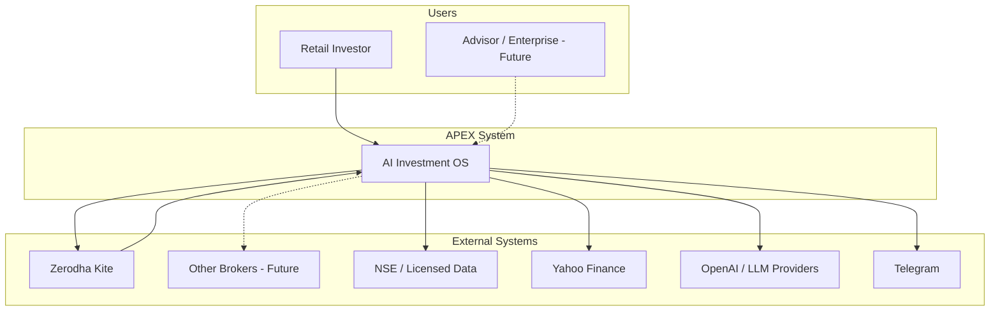
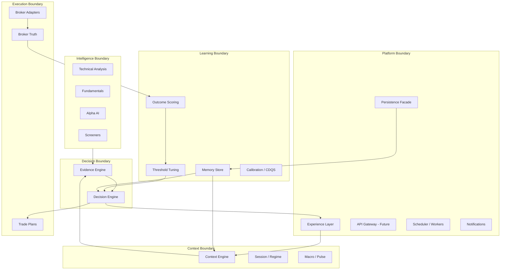
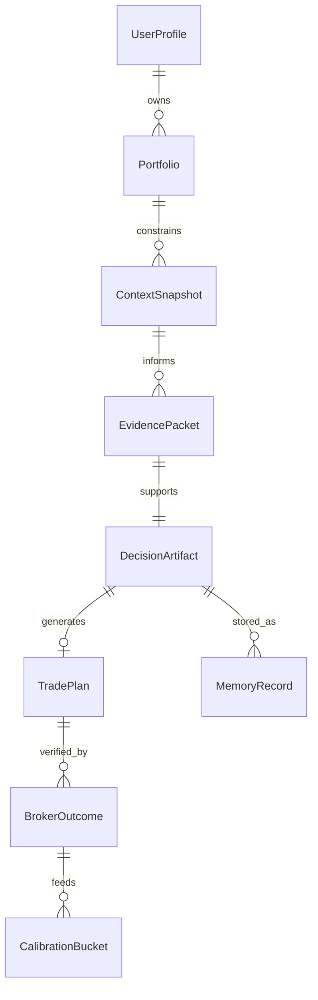
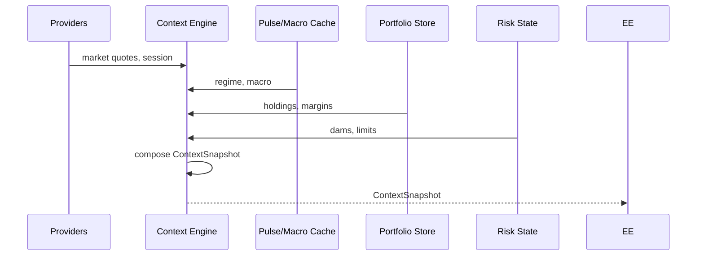
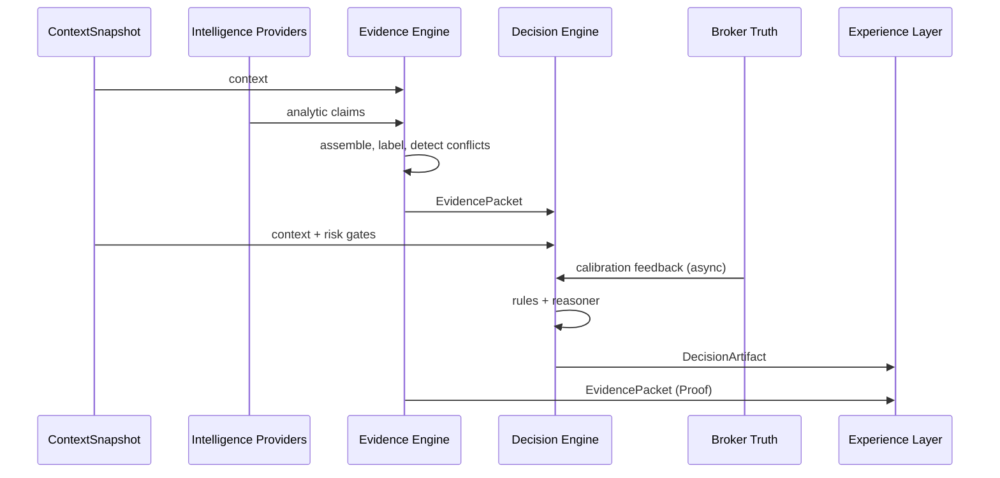
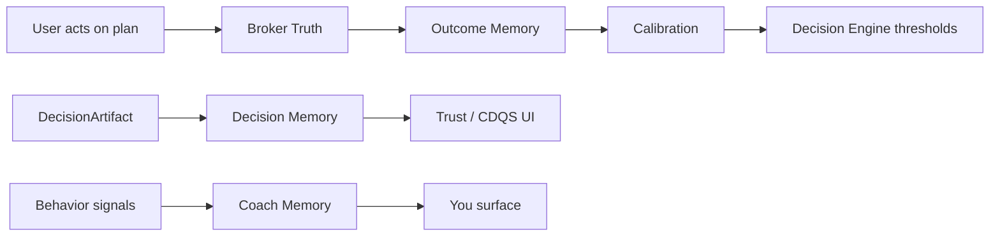
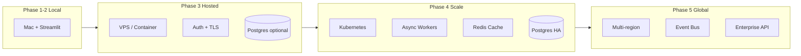

# APEX-005 — System Architecture Blueprint

**Document ID:** APEX-005  
**Version:** 0.1  
**Status:** DRAFT — pending CTO approval  
**Date:** 2026-08-05  
**Owner:** ChatGPT (Co-Founder, CTO & Chief Product Officer)  
**Author:** Cursor AI (Engineering Team)  
**Reviewers:** Pratham Prakash (Founder) — pending · ChatGPT (CTO) — pending  
**Supersedes:** `docs/architecture/08_Final_Investment_OS_Architecture.md` (reference until approved)  
**References:** [APEX-000](./APEX-000_Company_Constitution.md), [APEX-001](./APEX-001_Sprint0_Engineering_Assessment.md), [APEX-003](./APEX-003_Product_Strategy_and_PRD.md), [APEX-004](./APEX-004_Experience_Operating_System.md), [APEX-999](./APEX-999_Engineering_Handbook.md), [README](./README.md), [ADR-001](./adr/ADR-001_Six_Boundary_Model.md)

**Document type:** Engineering Blueprint — the 10-year architecture for APEX. Not a refactoring guide, migration runbook, or implementation spec (those are ETS/APEX-009).

**Traceability rule:** Every ADR, RFC, ETS, and structural change **must align with this blueprint** or amend it via CTO-approved ADR.

---

## Table of Contents

**Phase 0**  
[Architecture Assessment](#phase-0--architecture-assessment)

**Part A — Vision & Context**  
§1 Executive Summary · §2 Engineering Vision · §3 Architecture Principles · §4 System Context · §5 Business Capabilities · §6 Bounded Contexts

**Part B — Structure**  
§7 Repository Strategy · §8 Package Structure · §9 Domain Model · §10 Application Layer · §11 Experience Layer · §12 Intelligence Layer · §13 Memory Layer · §14 Portfolio Layer · §15 Market Layer · §16 Execution Layer · §17 Platform Layer

**Part C — Pipelines & Agents**  
§18 AI Agent Architecture · §19 Context Pipeline · §20 Decision Pipeline · §21 Memory Pipeline · §22 Event Architecture · §23 Message Contracts

**Part D — Platform Services**  
§24 API Standards · §25 Database Strategy · §26 Caching Strategy · §27 Secrets Management · §28 Security Architecture · §29 Authentication · §30 Authorization · §31 Broker Abstraction · §32 Data Provider Abstraction · §33 Plugin Architecture

**Part E — Operations**  
§34 Observability · §35 Telemetry · §36 Feature Flags · §37 Configuration Management · §38 Dependency Rules · §39 Package Dependency Matrix · §40 Error Handling · §41 Testing Strategy · §42 CI/CD · §43 Deployment Strategy · §44 Local Development · §45 Cloud Evolution · §46 Scalability Roadmap · §47 Migration Strategy · §48 Technical Risks · §49 Open Engineering Questions · §50 Recommendation

---

## Phase 0 — Architecture Assessment

*Measured 2026-08-05. Source: [APEX-001](./APEX-001_Sprint0_Engineering_Assessment.md), repository scan, 509 tests (3 failures, 6 errors).*

### Repository snapshot

| Metric | Value |
|--------|-------|
| Python files | ~411 |
| LOC (excl. `.venv`, `tmp/`) | ~71,600 |
| `analyzer/` | ~40,750 LOC, ~158 flat modules + 4 engine packages |
| `ui/` | ~17,160 LOC, 20 pages + 64 components |
| `tests/` | 91 files, ~10,100 LOC |
| Four-engine compliance | **94/100** |
| Import cycles | 19 documented |
| API layer | **None** (CLI + Streamlit only) |
| Postgres | **Not implemented** |

### Classification legend

| Class | Meaning |
|-------|---------|
| **KEEP** | Production-grade; extend in place |
| **REFACTOR** | Valuable logic; wrong shape or duplicate responsibility |
| **REPLACE** | Replace at defined scale trigger, not now |
| **REMOVE** | Out of APEX scope or dead weight |
| **FUTURE** | Correct direction; not built yet |

### Subsystem classification matrix

| Subsystem | Path / modules | Class | Rationale | Target phase |
|-----------|----------------|-------|-----------|--------------|
| **Context Engine** | `analyzer/context_engine/` | **KEEP** | Canonical snapshot composer; 12+ consumers migrated | Extend |
| **Evidence Engine** | `analyzer/evidence_engine/` | **KEEP** | EvidencePacket assembler; conflict detection | Native Proof UI |
| **Decision Engine** | `analyzer/decision_engine/` | **KEEP** | Sole verdict authority (N4) | Retire bridge |
| **Broker Truth** | `analyzer/broker_truth/` | **KEEP** | Ground truth for CDQS | ≥90% coverage |
| **Provider router** | `analyzer/providers/` | **KEEP** | Kite-first, Yahoo fallback — correct abstraction | Extend multi-provider |
| **Zerodha integration** | `zerodha.py`, `kite_*.py` | **KEEP** | Production OAuth + sync | Broker abstraction wrapper |
| **Portfolio store** | `portfolio_*.py` | **KEEP** | JSON profiles; works local | Postgres migration path |
| **Alpha AI research** | `alpha_ai_*.py` | **KEEP** | 1000+ LOC institutional reports | Split god module |
| **Intraday MIS** | `intraday_*`, `mis_*`, `small_trader_*` | **KEEP** | Core wedge domain | Consolidate drivers |
| **Options analytics** | `options_*`, `nse_option_*` | **KEEP** | Beta; NSE-dependent | Licensed data (C4) |
| **Learning / calibration** | `watchlist_learning.py`, `confidence_calibration.py`, `threshold_tuning.py` | **KEEP** | CDQS prerequisite | Unified journal |
| **Watchlist / prep** | `nightly_prep.py`, `morning_suggestions_*`, `watchlist*.py` | **KEEP** | Autopilot loop | Merge 6→2 drivers |
| **Telegram / autopilot** | `telegram_*.py`, `scripts/*`, launchd | **KEEP** | Daily habit ([APEX-003 §14](./APEX-003_Product_Strategy_and_PRD.md)) | Cloud scheduler FUTURE |
| **Partner canvases** | `ui/components/*_canvas.py`, `investment_os_ui.py` | **KEEP** | Six-surface MVP ([APEX-004 §14–15](./APEX-004_Experience_Operating_System.md)) | Thin presentation |
| **Streamlit shell** | `app.py`, `ui/pages/` | **KEEP** (now) | Phase 1–2 delivery vehicle | **REPLACE** at scale trigger |
| **CLI** | `cli.py` | **KEEP** | Headless analysis; test harness | API client FUTURE |
| **Test suite** | `tests/` (509 tests) | **KEEP** | Quality gate; fix regression first | Expand integration |
| **Parallel verdict drivers** | `investment_os.py`, `mis_trade_advisory.py`, `strategy_synthesis.py`, `daily_playbook.py` | **REFACTOR** | Violate N4 if they emit verdicts | Thin orchestrators over DE |
| **Verdict bridge** | `decision_engine/verdict_bridge.py` | **REFACTOR** | ~800 LOC legacy adapter | Retire Phase 2 |
| **Triple journal** | `suggestion_journal.py`, `intraday_journal.py`, `watchlist_eod.py` | **REFACTOR** | Blocks Trust/CDQS | Unified journal facade |
| **Flat `analyzer/` namespace** | 158 root modules | **REFACTOR** | 19 import cycles; no boundaries | 6 packages Phase 2 |
| **UI business logic** | scattered in `ui/pages/` | **REFACTOR** | Violates presentation-only rule | Move to analyzer |
| **Legacy 20 tabs** | `ui/pages/*.py` | **REFACTOR** → **REMOVE** | Constitution violation (N5) | Hide Phase 1; retire Phase 2 |
| **Secrets in `.env`** | `env_loader.py`, UI token write | **REFACTOR** | C2 blocks hosted | Keychain / vault Phase 3 |
| **NSE scraping** | `nse_session.py`, `nse_option_chain.py` | **KEEP** local / **FUTURE** cloud | C4 — breaks cloud | Licensed provider |
| **Sibling apps** | `interaction-investigator/`, `local-call-insights/` | **REMOVE** | No domain overlap (D-008) | Extract repos optional |
| **`tmp/` artifacts** | `tmp/*` | **REMOVE** | Not product; git noise | `.gitignore` enforce |
| **FastAPI / REST API** | — | **FUTURE** | Multi-client, mobile, B2B | Phase 3+ (DEF-005) |
| **Postgres / multi-tenant DB** | — | **FUTURE** | Millions of users | Phase 4+ |
| **Auth / RBAC** | — | **FUTURE** | C1; required hosted | Phase 3 |
| **Event bus (Kafka/NATS)** | — | **FUTURE** | Scale trigger: async workers | Phase 4+ |
| **ML training pipeline** | — | **FUTURE** | Constitution: rule-based + calibration now | Evaluate Phase 5+ |
| **Multi-broker** | — | **FUTURE** | Zerodha wedge first | Phase 4+ |
| **Mobile native** | — | **FUTURE** | API prerequisite | Phase 4+ |

### Assessment conclusion

**Do not rewrite.** The four-engine core is 94% complete and tested. Architecture work is **packaging, consolidation, and platform readiness** — not domain reimplementation.

**Highest-risk debt:** parallel verdict paths, triple journal, dual navigation, security C1–C3 for any hosted path.

---

## 1. Executive Summary

**Read time:** 4 minutes  
**Audience:** Principal engineers, platform architects, CTO, Founder

### The question this blueprint answers

> *If APEX becomes the world's best AI Investment Operating System, what architecture enables that — without throwing away 71k lines of production domain logic?*

### Answer in one paragraph

APEX architecture is a **layered decision platform** built on four canonical engines (Context → Evidence → Decision ← Broker Truth), packaged into **six deployable boundaries** (Intelligence, Context, Decision, Execution, Learning, Platform), exposed through an **experience layer** of six partner surfaces ([APEX-004](./APEX-004_Experience_Operating_System.md)), and evolved **incrementally** from the current Streamlit monolith. Scale to millions of users is achieved by **extracting boundaries behind stable contracts** — not by premature microservices. Replaceability is designed in for **brokers, market data providers, and AI models** from day one via adapter interfaces already started in `providers/`.

### Current → Target → Horizon

| Horizon | Architecture state | Users | Deploy |
|---------|-------------------|-------|--------|
| **Now (Sprint 0)** | Streamlit monolith; 4 engines; flat namespace | 1 (founder) | Mac local |
| **Phase 1–2 (8–10 wk)** | 6 surfaces; 6 packages; unified journal | 1–50 beta | Mac local |
| **Phase 3 (3–6 mo)** | FastAPI optional; auth; secrets hardening | 500–1K | Hosted SaaS option |
| **Phase 4 (1–2 yr)** | Postgres; workers; multi-broker; mobile API | 10K–100K | Cloud |
| **Phase 5 (3–10 yr)** | Event-driven; global markets; enterprise tenant | 1M+ | Multi-region |

### Non-negotiables preserved

- [APEX-000 N4](./APEX-000_Company_Constitution.md): Decision Engine sole verdict authority  
- [APEX-000 N5](./APEX-000_Company_Constitution.md): Six surfaces only  
- [APEX-000 N6](./APEX-000_Company_Constitution.md): Evolutionary migration  
- [APEX-003 §15](./APEX-003_Product_Strategy_and_PRD.md): Memory as architectural moat  
- [APEX-004 §7](./APEX-004_Experience_Operating_System.md): Model C Hybrid specialist voices  

### Explicitly rejected

Greenfield rewrite · 16-domain microservices now · Big-bang UI rewrite · Auto-trading service · Chatbot-first architecture

---

## 2. Engineering Vision

### 2.1 Ten-year vision statement

Build an **AI Investment Operating System** whose architecture survives:

- Millions of retail investors across geographies  
- Dozens of broker integrations  
- Multiple AI model providers and agent frameworks  
- Mobile, desktop, web, and enterprise API consumers  
- Regulatory scrutiny on explainability and audit trails  

…without rewriting the **decision kernel** — because the kernel is small, tested, and constitution-locked.

### 2.2 Architectural north star

**The Decision Kernel is sacred.** Everything else is replaceable infrastructure.

```
┌─────────────────────────────────────────────────────────────┐
│  Experience Layer (replaceable UI runtimes)                 │
├─────────────────────────────────────────────────────────────┤
│  Platform Layer (API, auth, jobs, notifications)           │
├─────────────────────────────────────────────────────────────┤
│  Application Layer (use cases: MorningBrief, ActPlan, CDQS) │
├─────────────────────────────────────────────────────────────┤
│  DOMAIN KERNEL (never rewritten casually)                   │
│  Context → Evidence → Decision ← Broker Truth               │
│  + Memory contracts + Message schemas                       │
├─────────────────────────────────────────────────────────────┤
│  Adapter Layer (brokers, data, AI, storage)                 │
└─────────────────────────────────────────────────────────────┘
```

### 2.3 What "good" looks like at scale

| Property | Phase 1 | Phase 4 | Phase 10 |
|----------|---------|---------|----------|
| Verdict latency | < 5s | < 2s | < 500ms p99 |
| Deploy unit | Monolith | Services optional | Cell-based |
| Data store | SQLite/JSON | Postgres + object store | Sharded + event log |
| AI coupling | In-process | Provider API | Agent orchestration |
| Team ownership | 1 engineer | 6 boundary owners | 20+ engineers |

---

## 3. Architecture Principles

*Priority-ordered. When principles conflict, lower number wins.*

| # | Principle | Implication |
|---|-----------|-------------|
| AP1 | **Preserve working domain logic** | REFACTOR > REPLACE > REWRITE |
| AP2 | **Decision kernel is single authority** | One verdict path; no UI verdicts |
| AP3 | **Boundaries over folders** | Six deployable contexts ([ADR-001](./adr/ADR-001_Six_Boundary_Model.md)) |
| AP4 | **Explicit dependencies** | No hidden imports; dependency matrix enforced in CI |
| AP5 | **Contracts over concretion** | `DecisionArtifact`, `EvidencePacket`, `ContextSnapshot` are stable APIs |
| AP6 | **Replaceable adapters** | Brokers, data, AI behind interfaces |
| AP7 | **Test the kernel without UI** | All engine paths unit-testable |
| AP8 | **Event-ready, not event-mandatory** | In-process events Phase 1–3; bus at scale |
| AP9 | **Security by phase** | Local waives C1–C3; hosted never does |
| AP10 | **Observability from day one** | Structured logs; correlation IDs on verdict pipeline |
| AP11 | **Experience traceability** | Every API field maps to [APEX-004](./APEX-004_Experience_Operating_System.md) spec |
| AP12 | **Simplicity until proven otherwise** | Monolith until multi-team or multi-region trigger |

---

## 4. System Context

### 4.1 C4 Level 1 — System context



### 4.2 Primary workflows

| Workflow | Trigger | Outcome | Product trace |
|----------|---------|---------|---------------|
| **Morning decision** | User opens app 8:30–9:15 IST | ACT/WAIT verdict | [APEX-004 §17](./APEX-004_Experience_Operating_System.md) |
| **Execute plan** | ACT verdict | E/SL/T/size plan | [APEX-003 E-2](./APEX-003_Product_Strategy_and_PRD.md) |
| **Verify evidence** | User doubt | Proof overlay | [APEX-004 §15](./APEX-004_Experience_Operating_System.md) |
| **EOD learning** | Market close | Outcome scored | [APEX-003 §15](./APEX-003_Product_Strategy_and_PRD.md) Memory |
| **Autopilot nudge** | launchd schedule | Telegram brief | [APEX-004 §30](./APEX-004_Experience_Operating_System.md) |

---

## 5. Business Capabilities

Capabilities map to bounded contexts — not to UI tabs.

| Capability | Description | Primary boundary | North Star link |
|------------|-------------|------------------|-----------------|
| **Daily verdict** | One ACT/WAIT per session | Decision | Time to Clarity |
| **Evidence assembly** | Labeled, conflict-checked facts | Decision (Evidence) | Explainability |
| **Trade planning** | E/SL/T/size when ACT | Execution | [APEX-004 §13](./APEX-004_Experience_Operating_System.md) |
| **Broker reconciliation** | Actual fills vs recommendations | Execution | CDQS |
| **Outcome learning** | Calibration from broker P&L | Learning | CDQS |
| **Portfolio context** | Sacred vs tactical, margins | Context + Portfolio | Personalization |
| **Market intelligence** | TA, fundamentals, screeners | Intelligence | Evidence inputs |
| **Memory** | Seven memory types | Learning + Platform | Moat ([APEX-003 §15](./APEX-003_Product_Strategy_and_PRD.md)) |
| **Research depth** | Alpha AI institutional reports | Intelligence | Proof/Ask depth |
| **Notifications** | Pre-market nudge | Platform | Daily habit |
| **Accountability** | Trust / CDQS display | Platform + Learning | Trust framework |

---

## 6. Bounded Contexts

Six deployable boundaries per [ADR-001](./adr/ADR-001_Six_Boundary_Model.md). **Not microservices today** — Python packages with enforced import rules.



### Context map — ownership

| Boundary | Owns | Must not own |
|----------|------|--------------|
| **Intelligence** | Raw analytics: TA, fundamentals, Alpha AI, screeners | Verdicts, broker sync |
| **Context** | `ContextSnapshot`: regime, session, portfolio summary, risk state | Evidence assembly, UI |
| **Decision** | `EvidencePacket`, `DecisionArtifact`, rules, reasoner | Broker execution, persistence UI |
| **Execution** | Broker adapters, trade plans, reconciliation, fills | Verdict logic |
| **Learning** | Memory, outcomes, CDQS, calibration, journals | Market data fetch |
| **Platform** | UI, CLI, API, schedulers, notifications, config | Business rules |

---

## 7. Repository Strategy

### 7.1 Current

- **Repo name:** `stock-analyzer` ([APEX-000 N10](./APEX-000_Company_Constitution.md))  
- **Product name:** APEX  
- **Monorepo:** Main app + sibling apps (siblings → REMOVE from scope)

### 7.2 Target (Phase 2)

Same repo; restructured packages:

```
stock-analyzer/
├── apex/                      # NEW: bounded context packages (Phase 2)
│   ├── intelligence/
│   ├── context/
│   ├── decision/
│   ├── execution/
│   ├── learning/
│   └── platform/
├── analyzer/                  # LEGACY: strangler until migrated
├── ui/                        # Experience layer (thin)
├── app.py
├── cli.py
├── tests/
├── scripts/
└── docs/apex/
```

### 7.3 Strangler pattern

1. Create `apex/*` packages with re-exports from `analyzer/*`  
2. Move modules boundary-by-boundary with tests green  
3. `analyzer/` becomes compatibility shim → delete empty modules  
4. **Never** big-bang rename day

### 7.4 Sibling apps

`interaction-investigator/`, `local-call-insights/` → **REMOVE** from APEX scope; optional separate repos (DEF-006).

---

## 8. Package Structure

### 8.1 Current engine packages (KEEP)

| Package | Key exports |
|---------|-------------|
| `analyzer/context_engine/` | `build_context_snapshot()` → `ContextSnapshot` |
| `analyzer/evidence_engine/` | `assemble_evidence()` → `EvidencePacket` |
| `analyzer/decision_engine/` | `DecisionEngine.decide()` → `DecisionArtifact` |
| `analyzer/broker_truth/` | `reconcile()`, `record_outcome()` |

### 8.2 Target package layout (Phase 2)

| Package | Migrated from |
|---------|---------------|
| `apex/context/` | `context_engine/`, `market_session.py`, `market_regime.py`, `pulse_cache.py` |
| `apex/decision/` | `evidence_engine/`, `decision_engine/` |
| `apex/intelligence/` | `alpha_ai_*`, `fundamentals.py`, `technical*.py`, `screener.py` |
| `apex/execution/` | `broker_truth/`, `zerodha.py`, `providers/`, trade plan builders |
| `apex/learning/` | journals, `watchlist_learning.py`, `confidence_calibration.py`, memory facade |
| `apex/platform/` | persistence facades, `telegram_notify.py`, scheduler adapters |

### 8.3 Public API surface (stable contracts)

These types cross boundaries — version carefully:

| Contract | Fields (conceptual) | Producer | Consumers |
|----------|---------------------|----------|-----------|
| `ContextSnapshot` | regime, session, portfolio_ref, risk_state, ts | Context | Evidence, Decision |
| `EvidencePacket` | claims[], conflicts[], labels, provenance | Decision (EE) | Proof UI, Ask |
| `DecisionArtifact` | verdict, confidence_band, symbol, plan_ref, evidence_id | Decision | Today, Trades, Trust |
| `TradePlan` | entry, stop, target, size, lane, timing | Execution | Trades UI |
| `BrokerOutcome` | fill, pnl, verified, ts | Execution | Learning, Trust |
| `MemoryRecord` | type, payload, user_id, ts | Learning | All engines |

---

## 9. Domain Model

### 9.1 Core entities



### 9.2 Verdict taxonomy (immutable)

`ACT` · `WAIT` · `PASS` · `REDUCE` · `DEFENSIVE` — only from Decision Engine.

Legacy strings (`BUY`, `NO_TRADE`, `TRADE`) exist only at `verdict_bridge.py` until retired.

### 9.3 Memory types (domain)

Per [APEX-003 §15](./APEX-003_Product_Strategy_and_PRD.md): Portfolio, Decision, Learning, Preference, Behavior, Risk, Conversation.

---

## 10. Application Layer

Use cases orchestrate engines — **no business logic in UI**.

| Use case | Flow | Primary module (current → target) |
|----------|------|-----------------------------------|
| `MorningBrief` | Context → Evidence → Decision → Today DTO | `investment_os.py` → `apex/platform/use_cases/morning_brief.py` |
| `BuildTradePlan` | DecisionArtifact → TradePlan | plan builders → `apex/execution/plans.py` |
| `OpenProof` | EvidencePacket → StructureProof DTO | `proof_mapper.py` (KEEP in UI mapper) |
| `ScoreOutcome` | BrokerOutcome → CDQS update | `broker_truth/learning.py` → Learning |
| `AskQuestion` | Query + Evidence → Answer DTO | new → `apex/decision/ask.py` |
| `RunAutopilot` | MorningBrief → Telegram | `scripts/morning_*.py` |

### Application layer rules

1. Use cases call engines in pipeline order — never skip Evidence for ACT  
2. Use cases return **DTOs for UI** — not Streamlit widgets  
3. Use cases are **sync in Phase 1–3**; async job wrappers in Phase 4  
4. One use case per user-facing workflow on [APEX-004 §18](./APEX-004_Experience_Operating_System.md) daily loop  

---

## 11. Experience Layer

Implements [APEX-004 Experience Operating System](./APEX-004_Experience_Operating_System.md).

| Surface | UI modules | Application use case | Specialist voice |
|---------|------------|---------------------|------------------|
| **Today** | `verdict_canvas`, `today_intelligence` | `MorningBrief` | CIO |
| **Trades** | `plan_canvas` | `BuildTradePlan` | PM |
| **Proof** | `proof_canvas`, `proof_mapper` | `OpenProof` | RA |
| **Trust** | `trust_canvas` | `GetCDQSReport` | CIO |
| **Ask** | Ask overlay | `AskQuestion` | RA |
| **You** | `reflection_canvas` | `GetBehaviorInsight` | Coach |

### Experience layer rules

- **No verdict computation in `ui/`** — presentation and mapping only  
- **CSS overlay** for Phase 1 Streamlit (per Phase 1 Verdict spec)  
- **Model C Hybrid** — copy layer only; routing in [APEX-004 §7](./APEX-004_Experience_Operating_System.md)  
- Future: alternate runtimes (React native, mobile) consume same DTOs via API  

---

## 12. Intelligence Layer

Produces **inputs to Evidence Engine** — never verdicts.

| Module group | Function | Class |
|--------------|----------|-------|
| Technical analysis | Structure, indicators, levels | KEEP |
| Fundamentals | Ratios, DCF, red flags | KEEP |
| Alpha AI | Institutional research reports | KEEP; split god module |
| Screeners | Idea generation | KEEP |
| Options analytics | Chain, flow, greeks | KEEP; C4 for cloud |

**Integration pattern:** Intelligence modules register as `EvidenceProvider` plugins (see §33).

---

## 13. Memory Layer

Architecture realization of [APEX-003 Memory Strategy](./APEX-003_Product_Strategy_and_PRD.md#15-memory-strategy).

### 13.1 Memory store facade (Phase 1 P0)

```
MemoryFacade
├── portfolio_memory()   → portfolio_store
├── decision_memory()    → decision_engine/history
├── outcome_memory()     → unified journal (Phase 1)
├── preference_memory()  → JSON intraday prefs
├── behavior_memory()  → watchlist_learning
├── risk_memory()        → risk state in context
└── conversation_memory()→ Ask log (single-shot entries)
```

### 13.2 Phase 4+ target

- Postgres tables per memory type with tenant_id  
- Event-sourced append log for Decision + Outcome (audit trail)  
- Encryption at rest for PII/portfolio  

---

## 14. Portfolio Layer

| Concern | Current | Target |
|---------|---------|--------|
| Holdings sync | `zerodha.py`, `portfolio_live.py` | Execution boundary |
| Profiles | `data/portfolio/{profile}.json` | Postgres `portfolios` table |
| Sacred vs tactical | business rules in context | Context snapshot field |
| Risk dams | intraday prefs + context | Risk memory |

**Rule:** Portfolio never imports Decision. Context reads portfolio state.

---

## 15. Market Layer

| Source | Module | Local | Cloud |
|--------|--------|-------|-------|
| Zerodha Kite | `providers/kite.py` | ✅ | ✅ |
| Yahoo Finance | `providers/yahoo.py` | ✅ | ✅ |
| NSE scrape | `nse_session.py`, `nse_option_chain.py` | ✅ | ❌ C4 |
| Licensed NSE | — | FUTURE | RFC-002 |

**Market data flow:** Providers → Context/Intelligence → never directly to UI.

---

## 16. Execution Layer

| Component | Role |
|-----------|------|
| **Broker adapters** | OAuth, holdings, orders read, fills |
| **Trade plan builder** | DecisionArtifact → TradePlan |
| **Broker Truth** | Reconciliation, planned vs actual |
| **Deep links** | Kite intent URLs (Phase 1b) |

**Rule:** APEX never places orders. Execution layer prepares; user executes externally ([APEX-000 N3](./APEX-000_Company_Constitution.md), [APEX-004 §10 Commandments](./APEX-004_Experience_Operating_System.md)).

---

## 17. Platform Layer

| Component | Current | Phase 3+ |
|-----------|---------|----------|
| Streamlit app | `app.py` | + FastAPI sidecar |
| CLI | `cli.py` | KEEP |
| Scheduler | launchd + `scripts/` | Cloud cron / worker queue |
| Telegram | `telegram_notify.py` | + email, push FUTURE |
| Persistence facade | scattered | unified `platform/persistence/` |
| Config | `.env`, `env_loader.py` | config service + secrets vault |

---

## 18. AI Agent Architecture

### 18.1 Agents ≠ chatbots

AI specialists ([APEX-004 §8](./APEX-004_Experience_Operating_System.md)) are **structured agents** with bounded tools — not free-form LLM threads.

| Agent | Tools allowed | Verdict authority |
|-------|---------------|-------------------|
| **CIO Agent** | Read DecisionArtifact, ContextSnapshot | None — narrates only |
| **RA Agent** | Read EvidencePacket, query Intelligence | None |
| **PM Agent** | Read TradePlan, Portfolio | None |
| **RO Agent** | Read risk_state, dams | None — blocks via Context only |
| **Coach Agent** | Read BehaviorMemory | None |
| **Decision Engine** | Full pipeline | **Sole ACT/WAIT authority** |

### 18.2 Phase 1 — template + structured data

LLM optional (`ALPHA_AI_LLM=1`); default is **deterministic templates** over `DecisionArtifact` fields.

### 18.3 Phase 4+ — agent orchestration

```
AgentOrchestrator
├── routes Ask → RA Agent (tool: EvidencePacket)
├── routes mentor block → CIO Agent (tool: DecisionArtifact)
└── NEVER routes to verdict override
```

**Replaceable provider interface:**

```python
# Conceptual — not implementation spec
class NarrativeProvider(Protocol):
    def synthesize(self, facts: EvidencePacket, persona: Persona) -> NarrativeBlock: ...
```

Implementations: `TemplateProvider` (default), `OpenAIProvider`, future `AnthropicProvider`.

---

## 19. Context Pipeline



### Stages

| Stage | Input | Output | SLA |
|-------|-------|--------|-----|
| Fetch market | Kite/Yahoo | raw quotes | < 2s |
| Load portfolio | JSON/DB | holdings snapshot | < 500ms |
| Compose risk | prefs + history | risk_state | < 100ms |
| Normalize | raw → models | `ContextSnapshot` | < 100ms |

**Cache strategy:** `pulse_cache.py`, `macro` caches — consolidate in Phase 2.

---

## 20. Decision Pipeline



### Invariants

1. **No ACT without EvidencePacket** ([APEX-000 §9.1](./APEX-000_Company_Constitution.md))  
2. **Conflicts flagged before ACT** ([APEX-004 §10](./APEX-004_Experience_Operating_System.md))  
3. **Default WAIT** on ambiguity ([APEX-000 N1](./APEX-000_Company_Constitution.md))  
4. **Single `DecisionEngine.decide()` entry** ([APEX-999 §2.1](./APEX-999_Engineering_Handbook.md))  

### Parallel path retirement (Phase 2)

| Module | Action |
|--------|--------|
| `investment_os.py` | Thin wrapper → `MorningBrief` use case |
| `mis_trade_advisory.py` | Evidence provider only |
| `strategy_synthesis.py` | Evidence provider only |
| `daily_playbook.py` | Deprecated |
| `verdict_bridge.py` | Delete after UI migration |

---

## 21. Memory Pipeline



### Write paths

| Event | Memory type | Trigger |
|-------|-------------|---------|
| Verdict issued | Decision | `DecisionEngine.decide()` completion |
| Fill imported | Outcome | Broker Truth reconcile |
| EOD job | Learning | `scripts/eod_*.py` |
| Ask answered | Conversation | Ask use case |
| Dam hit | Risk | Context update |

---

## 22. Event Architecture

### 22.1 Phase 1–3: in-process events

Simple pub/sub within monolith — **no message broker**.

```python
# Conceptual
event_bus.publish(DecisionIssued(decision_id=..., artifact=...))
event_bus.subscribe(DecisionIssued, memory_facade.record_decision)
event_bus.subscribe(DecisionIssued, telemetry.track_verdict)
```

### 22.2 Phase 4+: external event log

| Trigger | Technology options |
|---------|-------------------|
| >100K DAU | Kafka / Redpanda / NATS |
| Audit requirement | Immutable event log (Decision + Outcome) |
| Async workers | Queue consumers for EOD, prep, alerts |

### 22.3 Core domain events

| Event | Producer | Consumers |
|-------|----------|-----------|
| `ContextComposed` | Context | Telemetry |
| `EvidenceAssembled` | Evidence | Telemetry, Cache |
| `DecisionIssued` | Decision | Memory, UI, Telegram |
| `PlanBuilt` | Execution | UI |
| `BrokerSynced` | Execution | Context, Trust |
| `OutcomeScored` | Learning | Trust, Decision tuning |
| `CDQSUpdated` | Learning | Trust UI |

---

## 23. Message Contracts

Versioned schemas — JSON Schema or Pydantic models shared across boundaries.

### 23.1 Versioning policy

- `{contract}.{major}.{minor}` — e.g. `DecisionArtifact.v1.0`  
- Breaking changes increment major; adapters for one release cycle  
- All contracts in `apex/contracts/` (Phase 2)

### 23.2 DecisionArtifact (conceptual v1)

```json
{
  "schema": "DecisionArtifact.v1",
  "verdict": "WAIT",
  "confidence_band": "moderate",
  "symbol": "RELIANCE",
  "lane": "equity_mis",
  "evidence_id": "ev_20260805_001",
  "plan_id": null,
  "mentor_summary": "Choppy regime. No edge worth daily risk budget.",
  "issued_at": "2026-08-05T08:45:00+05:30",
  "labels": ["FACT", "ESTIMATE"]
}
```

### 23.3 EvidencePacket (conceptual v1)

```json
{
  "schema": "EvidencePacket.v1",
  "claims": [
    {"text": "Structure bullish above 20-DMA", "label": "FACT", "source": "ta_structure"}
  ],
  "conflicts": [
    {"claim_a": "structure_bullish", "claim_b": "momentum_extended", "severity": "medium"}
  ]
}
```

---

## 24. API Standards

### 24.1 Current

**No REST API.** CLI and Streamlit in-process only.

### 24.2 Phase 3 — FastAPI (if DEF-005 approved)

| Standard | Rule |
|----------|------|
| Style | REST + OpenAPI 3.1 |
| Versioning | `/v1/` prefix |
| Auth | Bearer JWT + refresh |
| Idempotency | `Idempotency-Key` on mutations |
| Errors | RFC 7807 Problem Details |
| Pagination | cursor-based for Trust history |

### 24.3 Core endpoints (future)

| Method | Path | Use case |
|--------|------|----------|
| GET | `/v1/today` | MorningBrief |
| GET | `/v1/trades/{decision_id}` | BuildTradePlan |
| GET | `/v1/proof/{evidence_id}` | OpenProof |
| GET | `/v1/trust/cdqs` | CDQS report |
| POST | `/v1/ask` | AskQuestion (one-shot) |
| GET | `/v1/you/insight` | Behavior insight |
| POST | `/v1/broker/connect` | OAuth callback |

**Experience parity:** API returns same DTOs as Streamlit — [APEX-004](./APEX-004_Experience_Operating_System.md) applies to JSON fields.

---

## 25. Database Strategy

### 25.1 Current (Phase 1–2) — KEEP

| Store | Technology | Use |
|-------|------------|-----|
| Broker truth | SQLite `broker_truth.db` | Fills, reconciliation |
| Evidence archive | SQLite `evidence.db` | Historical packets |
| Decision history | SQLite + JSON | DecisionArtifact log |
| Journals | SQLite (multiple) | **REFACTOR** → unified |
| Portfolio | JSON files | Profiles, prefs |
| Cache | Disk JSON | Pulse, macro |

**Adequate for:** single user, Mac local, beta <50 users.

### 25.2 Phase 3 — optional Postgres

| Trigger | Action |
|---------|--------|
| Hosted SaaS approved | Postgres for user + portfolio + memory |
| Alembic migrations | Required before multi-user |

### 25.3 Phase 4+ — scale

| Data type | Store |
|-----------|-------|
| Transactional | Postgres (tenant-scoped RLS) |
| Decision event log | Append-only table or event store |
| Evidence blobs | Object storage (S3/GCS) |
| Cache | Redis |
| Analytics | Warehouse (BigQuery/Snowflake) — FUTURE |

### 25.4 Migration rules

- Dual-write period on schema changes  
- Never delete SQLite until Postgres verified  
- JSON portfolio import path always available (local mode)  

---

## 26. Caching Strategy

| Cache | Location | TTL | Invalidation |
|-------|----------|-----|--------------|
| Pulse/macro | `data/cache/` | Session / daily | Market open |
| Context snapshot | In-memory per request | Request | Recompute |
| Evidence packet | Optional store | Decision lifetime | New decision |
| Kite quotes | Provider layer | Seconds | Stream / poll |
| UI | None (Streamlit rerun) | — | Phase 3 CDN for static |

**Rule:** Cache never overrides broker truth. Stale cache → label in UI ([APEX-004 §28](./APEX-004_Experience_Operating_System.md)).

---

## 27. Secrets Management

### 27.1 Current — REFACTOR

| Secret | Storage | Risk |
|--------|---------|------|
| Kite API key/secret | `.env` | C2 |
| Kite access token | `.env` (UI write) | C2 |
| Telegram bot token | `.env` | C2 |
| OpenAI key | `.env` | C2 |

### 27.2 Target by phase

| Phase | Approach |
|-------|----------|
| Local Mac | OS Keychain via `keyring` library; `.env` fallback dev only |
| Hosted SaaS | AWS Secrets Manager / GCP Secret Manager / Vault |
| CI | GitHub Encrypted Secrets |

**Rule:** No secrets in source, logs, or EvidencePackets ([APEX-999 §4.2](./APEX-999_Engineering_Handbook.md)).

---

## 28. Security Architecture

### 28.1 Threat model summary

| Threat | Local (now) | Hosted (Phase 3+) |
|--------|-------------|-------------------|
| Unauthorized access | Physical device trust | Auth + session |
| Token theft | File system | Encrypted vault + rotation |
| XSRF | N/A single user | Streamlit/FastAPI hardening |
| Data exfiltration | Low | Tenant isolation + RLS |
| LLM prompt injection | Ask scope limits | Input sanitization |
| Broker OAuth hijack | Redirect URI validation | Strict callback allowlist |

### 28.2 Critical security items (C1–C5)

| ID | Item | Status | Phase |
|----|------|--------|-------|
| **C1** | Authentication | Missing | Phase 3 |
| **C2** | Secrets not plaintext | Partial | Phase 3 |
| **C3** | XSRF/CORS | Disabled | Phase 3 |
| **C4** | Licensed/reliable market data | NSE scrape only | Phase 3 (RFC-002) |
| **C5** | Broker Truth in learning loop | Partial | Phase 1 journal facade |

[APEX-000 N7](./APEX-000_Company_Constitution.md): No hosted multi-user until C1–C3 resolved.

### 28.3 Defense in depth

```
Network (TLS, WAF) → Auth → Authorization → Tenant isolation → Encryption at rest → Audit log
```

---

## 29. Authentication

### 29.1 Phase 1–2 (local)

**No auth.** Single-user Mac deploy. Documented risk acceptance.

### 29.2 Phase 3 (hosted)

| Component | Recommendation |
|-----------|----------------|
| Protocol | OAuth 2.0 / OIDC |
| Session | HttpOnly Secure SameSite=Strict cookies |
| MFA | TOTP for Pro tier |
| Broker OAuth | Separate from APEX login — Kite tokens per user vault |

**FOUNDER DECISION:** Auth provider (Auth0, Clerk, Cognito, custom) — defer to RFC when SaaS approved.

---

## 30. Authorization

### 30.1 Phase 1–2

N/A — single user.

### 30.2 Phase 3+

| Model | Scope |
|-------|-------|
| **RBAC** | user, admin, support |
| **Resource** | user_id on all memory/portfolio rows |
| **Broker token** | User-scoped; never shared across tenants |
| **API keys** | B2B Phase 5 — scoped to read/write endpoints |

**Rule:** Deny by default. Portfolio queries always filter by `user_id`.

---

## 31. Broker Abstraction Layer

### 31.1 Interface (target)

```python
# Conceptual protocol
class BrokerAdapter(Protocol):
    def connect(self, oauth_callback: str) -> ConnectionResult: ...
    def get_holdings(self) -> HoldingsSnapshot: ...
    def get_margins(self) -> MarginSnapshot: ...
    def get_fills(self, since: datetime) -> list[Fill]: ...
    def health(self) -> BrokerHealth: ...
```

### 31.2 Implementations

| Broker | Class | Status |
|--------|-------|--------|
| Zerodha Kite | `providers/kite.py`, `zerodha.py` | **KEEP** — wrap in adapter |
| Angel One | — | FUTURE |
| IBKR | — | FUTURE (global) |

### 31.3 Rules

- Broker Truth consumes **normalized Fill model** — not broker-specific JSON  
- Deep links broker-specific — isolated in adapter  
- Read-only by default; order placement **out of scope** permanently  

---

## 32. Data Provider Abstraction Layer

Existing `analyzer/providers/router.py` — **KEEP and extend**.

```python
# Conceptual
class MarketDataProvider(Protocol):
    def quote(self, symbol: str) -> Quote: ...
    def history(self, symbol: str, interval: str) -> DataFrame: ...
    def options_chain(self, symbol: str) -> OptionChain: ...  # optional
```

| Provider | Priority | Local | Cloud |
|----------|----------|-------|-------|
| Kite | 1 | ✅ | ✅ |
| Yahoo | 2 fallback | ✅ | ✅ |
| NSE scrape | 3 options | ✅ | ❌ |
| Licensed NSE | 1 (cloud) | FUTURE | RFC-002 |

---

## 33. Plugin Architecture

### 33.1 Phase 2 — registry pattern

```python
# Conceptual
registry.register("ta_structure", StructureEvidenceProvider())
registry.register("alpha_ai", AlphaEvidenceProvider())
registry.register("options_flow", OptionsEvidenceProvider())
```

Evidence Engine calls registered providers — Intelligence boundary stays pluggable.

### 33.2 Phase 5 — external plugins

- Signed plugin packages  
- Sandboxed execution for third-party EvidenceProviders  
- Marketplace **not** planned for tips — research plugins only  

---

## 34. Observability

| Pillar | Phase 1 | Phase 4 |
|--------|---------|---------|
| **Logs** | `structured_log.py` JSON | Centralized (Datadog/ELK) |
| **Metrics** | Verdict latency, CDQS | Prometheus + Grafana |
| **Traces** | Correlation ID per pipeline run | OpenTelemetry |
| **Alerts** | Telegram on job failure | PagerDuty |

### Key log events

`context.compose.start|end`, `evidence.assemble.start|end`, `decision.issue`, `broker.sync`, `outcome.score`, `cdqs.update`

**Never log:** tokens, API keys, full portfolio in prod logs.

---

## 35. Telemetry

| Metric | Type | Use |
|--------|------|-----|
| `apex.verdict.latency_ms` | histogram | SLO |
| `apex.verdict.count` | counter by verdict | Product |
| `apex.evidence.conflicts` | counter | Quality |
| `apex.broker.sync.success` | gauge | Trust |
| `apex.cdqs.value` | gauge | North Star |
| `apex.experience.ttc_ms` | histogram | [APEX-004 §46](./APEX-004_Experience_Operating_System.md) |

Product analytics **subordinate to CDQS** — no engagement funnels that conflict with [APEX-004 XP4](./APEX-004_Experience_Operating_System.md).

---

## 36. Feature Flags

| Flag | Default | Purpose |
|------|---------|---------|
| `APEX_PARTNER_NAV` | `0` → `1` Phase 1 | Six-surface default |
| `ALPHA_AI_LLM` | `0` | LLM narrative opt-in |
| `PROOF_LWC` | `1` | Lightweight charts in Proof |
| `UNIFIED_JOURNAL` | `0` → `1` Phase 1 | Journal facade |
| `FASTAPI_SIDECAR` | `0` | Phase 3 API |

Implementation: env vars → Phase 3 LaunchDarkly or similar.

---

## 37. Configuration Management

| Layer | Source | Phase |
|-------|--------|-------|
| Secrets | `.env` → vault | 1 → 3 |
| Feature flags | env | 1 → 3 |
| Business thresholds | JSON + Founder approval | 1 |
| Risk limits | user prefs JSON | 1 → DB |
| Engine rules | code + config files | 2 |

**Rule:** Business logic threshold changes require **Founder approval** ([APEX-000 Decision Authority](./APEX-000_Company_Constitution.md)).

---

## 38. Dependency Rules

Enforced import direction ([APEX-999 §2.2](./APEX-999_Engineering_Handbook.md)):

```
Platform → Application → Decision → Context → Intelligence
                ↓              ↓
            Execution ← Learning
```

### Forbidden imports

| From | Must NOT import |
|------|-----------------|
| Context | Decision, Platform UI |
| Decision | Platform UI |
| Intelligence | Decision, Execution |
| Learning | Intelligence (direct) |
| UI | — (calls Application only) |

**CI check (Phase 2):** `import-linter` or custom script on boundary tags.

---

## 39. Package Dependency Matrix

|  | Intel | Context | Decision | Execution | Learning | Platform |
|--|-------|---------|----------|-----------|----------|----------|
| **Intelligence** | — | R | — | — | — | — |
| **Context** | R | — | — | — | R | — |
| **Decision** | via EE | R | — | — | R | — |
| **Execution** | — | R | R | — | W | — |
| **Learning** | — | — | R | R | — | — |
| **Platform** | — | via App | via App | via App | via App | — |

R = read, W = write. Empty = forbidden.

---

## 40. Error Handling

Per [APEX-999 §4.2](./APEX-999_Engineering_Handbook.md) and [APEX-004 §28](./APEX-004_Experience_Operating_System.md).

| Layer | Policy |
|-------|--------|
| **Decision path** | Fail to WAIT — never fail to ACT |
| **Evidence gap** | Label GAP; reduce confidence band |
| **Broker offline** | Degraded Context; qualify verdict |
| **Provider timeout** | Fallback provider (Yahoo) |
| **UI** | Calm error copy; one recovery action |

### Error taxonomy

`ProviderError`, `BrokerError`, `CompositionError`, `ValidationError`, `ConfigurationError`

---

## 41. Testing Strategy

| Layer | Approach | Target |
|-------|----------|--------|
| **Engines** | Unit tests, no UI | 100% decision path coverage |
| **Contracts** | Schema validation tests | All message contracts |
| **Use cases** | Integration tests | MorningBrief end-to-end |
| **UI** | Component tests + smoke | Canvas render |
| **Pipeline** | Golden files for DecisionArtifact | Regression |
| **CI** | 509+ tests, 100% pass | P0 gate |

**Current debt:** 3 failures, 6 errors — [ETS-001](./ets/ETS-001_Test_Regression_Fix.md) before Phase 1.

### Test pyramid

```
        E2E smoke (few)
      Integration (pipelines)
    Unit (engines, providers)
  Contract (schemas)
```

---

## 42. CI/CD

| Stage | Current | Target |
|-------|---------|--------|
| CI | GitHub Actions | KEEP |
| Lint | — | ruff + mypy (Phase 2) |
| Tests | unittest 509 | pytest optional |
| Security | — | dependabot + pip-audit |
| Deploy local | manual | KEEP |
| Deploy cloud | — | Phase 3 pipeline |

**Gate:** No merge on decision-path changes without engine tests + CTO review.

---

## 43. Deployment Strategy

| Mode | Phase | Description |
|------|-------|-------------|
| **Mac local** | 1–2 | Streamlit + launchd autopilot |
| **Docker** | 2 | Existing Dockerfile port 8501 |
| **Single-tenant VPS** | 3 | Docker + reverse proxy + TLS |
| **Multi-tenant SaaS** | 4 | K8s / managed containers |
| **Enterprise** | 5 | Dedicated cell / VPC |

**Constitution:** [APEX-000 N7](./APEX-000_Company_Constitution.md) blocks hosted until C1–C3.

---

## 44. Local Development

| Requirement | Value |
|-------------|-------|
| Python | 3.12 |
| Install | `pip install -r requirements-lock.txt` |
| Run UI | `streamlit run app.py` |
| Run tests | `python -m unittest discover -s tests` |
| Kite auth | `scripts/kite_auth.py` |
| Env | copy `.env.example` → `.env` |

**Data:** `data/` gitignored; sample fixtures for CI only.

---

## 45. Cloud Evolution



**Trigger gates:**

| Transition | Trigger |
|------------|---------|
| Local → Hosted | Founder SaaS approval (RFC-001) + C1–C3 |
| Monolith → Workers | EOD/prep jobs exceed 60s or DAU > 10K |
| SQLite → Postgres | Multi-user or data > 10GB |
| REST API | Mobile app or third-party consumers |

---

## 46. Scalability Roadmap

| Dimension | 1 user | 1K users | 1M users |
|-----------|--------|----------|----------|
| **Compute** | 1 process | 10 containers | Auto-scale cells |
| **Database** | SQLite/JSON | Postgres RLS | Sharded Postgres |
| **Verdict compute** | Sync in-request | Cached context | Pre-computed morning batch + delta |
| **Broker sync** | Poll | Per-user workers | Rate-limited queue |
| **AI narrative** | In-process | Provider API pool | Dedicated inference |
| **Memory** | Local files | Postgres | Event log + warehouse |

**Bottleneck order (predicted):** Broker API rate limits → Context compose latency → SQLite → Streamlit.

---

## 47. Migration Strategy

*Evolutionary path — not a big-bang rewrite.*

### 47.1 Phase timeline

| Phase | Weeks | Architecture focus | Product trace |
|-------|-------|-------------------|---------------|
| **Sprint 0** | Current | Docs, ETS-001 test fix | APEX-001 |
| **Phase 1a** | 1–4 | Unified journal; six-surface nav; P0 data flow | [APEX-003 E-1–E-5](./APEX-003_Product_Strategy_and_PRD.md) |
| **Phase 1b** | 5–8 | Ask, You, EOD; specialist copy | [APEX-004](./APEX-004_Experience_Operating_System.md) |
| **Phase 2** | 9–16 | `apex/*` packages; retire bridge; import-linter | ADR-001 |
| **Phase 3** | 17–26 | Security C1–C3; FastAPI optional; licensed data | RFC-001, RFC-002 |
| **Phase 4** | 6–12 mo | Postgres; workers; multi-broker | APEX-003 Phase 4 |

### 47.2 Strangler milestones

| Milestone | Exit criteria |
|-----------|---------------|
| M1: Single verdict path | No UI component calls legacy advisory for verdict |
| M2: Unified journal | Trust CDQS computable from one store |
| M3: Package boundaries | import-linter clean |
| M4: Bridge retired | `verdict_bridge.py` deleted |
| M5: Hosted ready | C1–C3 verified |
| M6: API parity | Mobile client consumes `/v1/today` |

### 47.3 What we do NOT migrate

- Sibling apps  
- 14+ legacy tab logic (retire, don't port)  
- Triple journal stores (merge, don't replicate)  
- Parallel verdict orchestrators (thin, don't duplicate)  

---

## 48. Technical Risks

| ID | Risk | P | I | Mitigation |
|----|------|---|---|------------|
| AR-01 | Big-bang package migration breaks tests | M | H | Strangler; re-export shims |
| AR-02 | FastAPI duplication of business logic | M | M | Shared Application layer |
| AR-03 | Event bus premature | L | M | In-process until Phase 4 trigger |
| AR-04 | Postgres migration data loss | L | C | Dual-write; backup |
| AR-05 | Broker adapter under-abstraction | M | M | Protocol + Zerodha reference impl |
| AR-06 | LLM bypasses Evidence Engine | M | C | Template default; tool-scoped agents |
| AR-07 | Streamlit blocks mobile | H | M | API Phase 3 |
| AR-08 | 19 import cycles worsen | M | M | import-linter gate |
| AR-09 | God module split regression | M | M | Test per extraction |
| AR-10 | Over-architecture delays Phase 1 | M | H | CTO gate; 6 not 16 boundaries |

Inherited from [APEX-001 Risk Register](./APEX-001_Sprint0_Engineering_Assessment.md): TR-01 through SR-03 remain P0 where applicable.

---

## 49. Open Engineering Questions

| ID | Question | Owner | Trigger |
|----|----------|-------|---------|
| OE-01 | FastAPI monolith sidecar vs separate service? | CTO | Phase 3 |
| OE-02 | Postgres vs SQLite for beta hosted? | CTO | RFC-001 |
| OE-03 | Alembic adoption timeline? | Principal Eng | Phase 2 |
| OE-04 | import-linter in CI — which tool? | Principal Eng | Phase 2 start |
| OE-05 | OpenTelemetry agent vs manual spans? | CTO | Phase 3 |
| OE-06 | Redis introduction point? | CTO | DAU > 5K |
| OE-07 | Event bus technology? | CTO | Phase 4 planning |
| OE-08 | Alpha AI module split boundaries? | CTO | Phase 2 |
| OE-09 | Streamlit long-term vs React (RFC-003)? | Founder + CTO | Phase 3 complete |
| OE-10 | Multi-region active-active needed? | CTO | Phase 5 |
| OE-11 | Agent framework (LangGraph, custom)? | CTO | Phase 4 AI |
| OE-12 | CDQS computation batch vs streaming? | Principal Eng | Phase 1 Trust |

---

## 50. Recommendation

### 50.1 Architectural stance

**Approve the layered monolith with a sacred decision kernel** — evolved through six boundaries, exposed via six surfaces, scaled via adapters and contracts — as the 10-year architecture for APEX.

This blueprint:

- **Preserves** 71k LOC and 94/100 four-engine compliance  
- **Rejects** greenfield rewrite and premature microservices  
- **Defines** stable contracts for UI, API, brokers, data, and AI  
- **Sequences** platform investment behind product proof (CDQS, six surfaces)  
- **Traces** every layer to [APEX-003](./APEX-003_Product_Strategy_and_PRD.md) and [APEX-004](./APEX-004_Experience_Operating_System.md)  

### 50.2 Immediate actions (P0)

| # | Action | Owner | ETS |
|---|--------|-------|-----|
| 1 | Fix test regression 509/509 | Cursor | [ETS-001](./ets/ETS-001_Test_Regression_Fix.md) |
| 2 | Unified journal facade | Cursor | APEX-009 (planned) |
| 3 | Phase 1a six-surface nav | Cursor | APEX-009 |
| 4 | Approve this blueprint | CTO | — |
| 5 | Module inventory | Cursor | APEX-002 (planned) |

### 50.3 Approval criteria

- [ ] **AC-01:** ChatGPT (CTO) approves blueprint as engineering authority  
- [ ] **AC-02:** No contradiction with APEX-000, APEX-003, APEX-004  
- [ ] **AC-03:** Phase 0 classification reviewed  
- [ ] **AC-04:** ADR-001 alignment confirmed  
- [ ] **AC-05:** README catalog updated  
- [ ] **AC-06:** Legacy doc `08_Final_Investment_OS_Architecture.md` marked superseded on approval  

### 50.4 Do not block Phase 1 on

- FastAPI / Postgres  
- Event bus  
- Package rename to `apex/`  
- Multi-broker  
- import-linter CI  

### 50.5 Composite readiness

| Dimension | Score |
|-----------|-------|
| Completeness vs brief | 9.5/10 |
| Alignment with constitution | 9.5/10 |
| Executability (Phase 1) | 9/10 |
| 10-year scale vision | 9/10 |
| Preserve-existing-code discipline | 10/10 |
| **Recommend CTO approval** | **Yes — after ETS-001 green** |

---

## Appendix A — Traceability Matrix

| Blueprint section | Product (APEX-003) | Experience (APEX-004) |
|-------------------|--------------------|-----------------------|
| Decision Pipeline §20 | §13 Philosophy, E-1 | §14 Decision Card, §18 Flow |
| Memory Layer §13 | §15 Memory Strategy | §37 Memory Experience |
| AI Agents §18 | §16 AI, §19 Model C | §7–8 Specialist Profiles |
| Broker Abstraction §31 | §14 Flywheel | §32 Broker Connection |
| Trust / CDQS | §28 North Star | §9 Trust Framework |
| Six boundaries §6 | ADR-001 via APEX-001 | §19–20 IA & Nav |

---

## Appendix B — Related Documents

| Document | Relationship |
|----------|--------------|
| [APEX-001](./APEX-001_Sprint0_Engineering_Assessment.md) | Sprint 0 assessment; Phase 0 source |
| APEX-002 (planned) | Module-level KEEP/REFACTOR detail |
| APEX-009 (planned) | Phase 1 ETS breakdown |
| [ADR-001](./adr/ADR-001_Six_Boundary_Model.md) | Accepted — six boundaries |
| [ADR-002](./APEX-001_Sprint0_Engineering_Assessment.md) | Evolutionary migration |
| [RFC-001](./rfc/RFC-001_Hosted_SaaS.md) | Hosted deploy decision |
| RFC-002 (Licensed NSE — planned) | C4 resolution |
| `docs/architecture/09_Codebase_to_Architecture_Mapping.md` | 251-module traceability (legacy) |

---

*Repository: stock-analyzer · Product: APEX · Document: APEX-005 v0.1 · System Architecture Blueprint*
