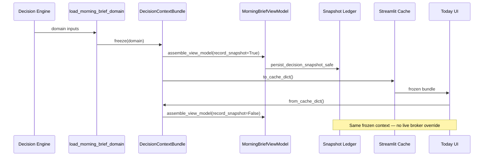

# APEX-013 E0.6 — Context Determinism

**Status:** IMPLEMENTED  
**Priority:** P0  
**Resolves:** P1-BROKER-DRIFT (E0.5)

---

## Mission

Eliminate context drift. The Morning Brief shown to the user and the Decision Snapshot written to the ledger must originate from the **exact same immutable Context Bundle**.

---

## Architecture



### CTO Principle

```
Context → Truth → Projection

Context creates Truth.
Truth creates Projection.
Projection never creates Truth.
```

---

## Context Bundle Definition

`DecisionContextBundle` (`analyzer/use_cases/decision_context_bundle.py`)

| Field | Purpose |
|-------|---------|
| `market` | Market identifier |
| `context` | ContextSnapshot |
| `decision` | Frozen DecisionArtifact |
| `decision_source` | equity / session / none |
| `broker` | Frozen BrokerSnapshot |
| `mis` | MIS trade advisory |
| `os_report` | Investment OS report |
| `pins` | Pinned plans |
| `prefs` | Intraday preferences |
| `built_at` | Production timestamp label |
| `scenario` | MorningBriefScenario at freeze |
| `stale` / `stale_reason` | Trust state at freeze |
| `context_from_cache` / `context_cache_age` | Context cache metadata |
| `data_error` | Data error at freeze |

Cache dict includes `_context_bundle_version: "1"` and serialized `broker`.

---

## Files Created

| File | Purpose |
|------|---------|
| `analyzer/use_cases/decision_context_bundle.py` | Immutable context bundle + single assembly path |
| `tests/test_apex_013_e0_6_context_determinism.py` | 12 determinism tests |

## Files Modified

| File | Change |
|------|--------|
| `analyzer/use_cases/morning_brief.py` | Delegate to Context Bundle; remove broker override |
| `ui/components/partner_data.py` | Freeze → assemble → persist in application layer |
| `ui/components/morning_brief_ui.py` | Rehydrate from frozen bundle only |
| `ui/components/home_dashboard.py` | Project from frozen bundle; no live broker |
| `analyzer/intelligence_lab/ledger_health.py` | P1 defect removed; status HEALTHY |
| `tests/test_apex_013_e0_5_ledger_validation.py` | Broker drift test → determinism assertion |
| `tests/test_apex_013_e0.py` | Wiring checks updated |
| `analyzer/use_cases/__init__.py` | Export DecisionContextBundle |

---

## Design Selection

**Approved:** Refined Option B — freeze entire decision context before projection.

**Rejected:** Option A (persist on first UI render) — UI must never own historical truth.

### Alternatives Considered

| Option | Verdict |
|--------|---------|
| A — persist in `home_dashboard` | **Rejected** — violates Application Layer ownership |
| B — freeze broker only | **Insufficient** — decision re-derivation via `pick_decision` also drifted |
| B refined — freeze full context + decision artifact | **Approved** |

---

## Success Criteria

| Criterion | Result |
|-----------|--------|
| Snapshot == Displayed Morning Brief | **PASS** |
| Broker reconnect after snapshot → no change | **PASS** |
| Browser refresh → no change | **PASS** |
| Cache rehydration → frozen context | **PASS** |
| UI never owns persistence | **PASS** |
| No duplicate assembly paths | **PASS** |
| Regression suite green | **PASS** (622 tests, 618 green, 4 pre-existing env errors) |

---

## Performance Impact

Negligible. Context Bundle is a dataclass freeze + same assembly path. No additional I/O.

---

## Risk Assessment

| Risk | Mitigation |
|------|------------|
| Legacy cache bundles without frozen `decision` | Fallback to `pick_decision` for TTL window (~45s) |
| Evidence re-fetch by packet ID | Same ID; deterministic within session |
| Stale broker shown in portfolio sync UI | Acceptable — historical verdict frozen; live sync is projection metadata |

---

## Rollback Strategy

1. Revert `decision_context_bundle.py` and morning_brief.py broker override blocks
2. Restore `domain_from_cache_bundle` live broker recompute
3. Ledger remains valid — snapshots already written are immutable

---

## CTO Self-Review

| Question | Answer |
|----------|--------|
| Does UI own persistence? | **No** — `partner_data.load_today_core` / application layer |
| Can Snapshot and UI disagree? | **No** — same frozen Context Bundle |
| Duplicate assembly path? | **No** — single `DecisionContextBundle.assemble_view_model` |
| Can historical truth change? | **No** — frozen at production |
| Trust for 5 years? | **Yes** |

---

## STOP

E0.6 complete. Do not begin E1 until CTO review.
