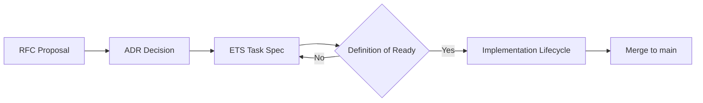
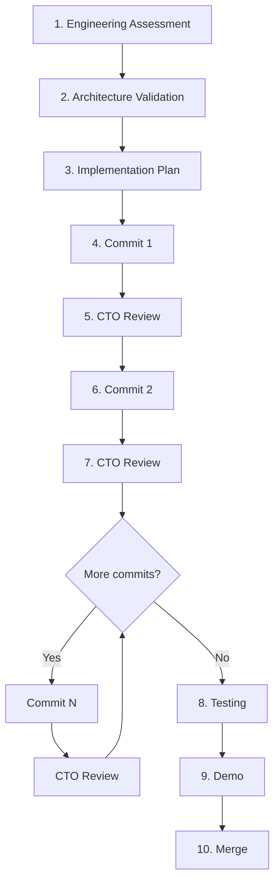
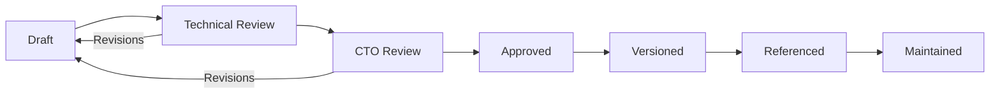

# APEX-999 — Engineering Handbook

**Document ID:** APEX-999  
**Version:** 0.1  
**Status:** DRAFT — pending CTO approval  
**Date:** 2026-08-05  
**Owner:** ChatGPT (CTO)  
**Author:** Cursor AI (Engineering Team)  
**Reviewers:** ChatGPT (CTO) — pending  
**References:** [APEX-000](./APEX-000_Company_Constitution.md), [README](./README.md)

---

## Purpose

Permanent engineering reference for all contributors to APEX. Defines standards, workflows, checklists, and definitions of ready/done. Every engineer reads this before their first PR.

If this handbook conflicts with APEX-000, **APEX-000 wins**.

---

## 0. Governance

Roles and ownership are defined in [APEX-000 §Governance & Roles](./APEX-000_Company_Constitution.md#governance--roles) and [README §Decision Authority Matrix](./README.md#decision-authority-matrix).

| Role | Name / System |
|------|---------------|
| Founder & CEO | Pratham Prakash |
| CTO & Chief Product Architect | ChatGPT |
| Engineering Team | Cursor AI |

This handbook is owned by the **CTO**, authored and maintained by **Cursor** under CTO review.

---

## 1. Engineering Standards

### 1.1 Core principles

1. **Architecture first** — respect four-engine pipeline and six boundaries
2. **Product first** — pass the product gate (APEX-000 §4.5) before writing code
3. **Evolutionary migration** — extend, don't rewrite; strangler over big-bang
4. **Documentation first** — ADR for architecture changes; ETS for implementation tasks
5. **Testability first** — decision paths testable without UI
6. **Security first** — no shortcuts on C1–C3 even for internal tools

### 1.2 Decision authority

Full matrix: [README §Decision Authority Matrix](./README.md#decision-authority-matrix).

| Change type | Owner | Required approval |
|-------------|-------|-------------------|
| Business strategy | Founder | Founder |
| Product vision | Founder + CTO | Founder + CTO |
| Constitution amendment | Founder + CTO | Founder + CTO |
| Architecture change | CTO | CTO + ADR |
| Technology stack change | CTO | CTO + ADR |
| Repository structure | CTO | CTO |
| Design system | CTO | CTO |
| Business logic change | Founder | **Founder** |
| Major refactoring | — | **Founder + CTO** |
| New domain boundary | CTO | CTO + ADR |
| Feature in decision path | Cursor | Product gate + Founder if business logic |
| Implementation | Cursor | Approved ETS + CTO code review |
| Bug fix / test fix | Cursor | CTO code review |
| Documentation (APEX/ADR/RFC/ETS) | Cursor | Technical Review + CTO |
| Release | Founder + CTO | **Founder + CTO** |

### 1.3 Engineering team (Cursor) constraints

Cursor executes under approved ETS specs. Cursor **must not**:

- Change product direction or make business decisions
- Change architecture without CTO approval and ADR
- Introduce major dependencies without justification and approval
- Delete working business logic without Founder approval
- Perform large-scale rewrites without approved migration plan (Founder + CTO)

**Ambiguous requirements protocol:**

1. Explain assumptions explicitly
2. Present alternatives
3. Explain trade-offs
4. Recommend the best option
5. **Wait for approval before proceeding**

### 1.4 Prohibited actions

- Rewriting working business logic without ADR justification
- Parallel verdict paths outside Decision Engine
- Invented financial metrics in AI output
- Committing secrets, `.env`, or `tmp/` artifacts
- Deploying to shared/hosted environment with C1–C3 unresolved
- Adding a seventh navigation surface
- Skipping tests for decision-path code

---

## 2. Architecture Standards

### 2.1 Four-engine pipeline (mandatory for all verdicts)

```
Context Engine → Evidence Engine → Decision Engine
                                        ↑
                              Broker Truth
```

**Rules:**
- Only `DecisionEngine.decide()` emits ACT/WAIT/PASS/REDUCE/DEFENSIVE
- Context Engine composes; it does not verdict
- Evidence Engine assembles; it does not verdict
- Broker Truth is ground truth for learning
- Legacy strings (`BUY`, `NO_TRADE`) exist only at `verdict_bridge.py` boundary until retired

### 2.2 Six deployable boundaries

| Boundary | Owns | May import from |
|----------|------|-----------------|
| Intelligence | TA, fundamentals, Alpha AI, screener | Context (read), Shared utils |
| Context | Market snapshot | External data providers |
| Decision | Evidence + verdict | Context, Intelligence (via Evidence) |
| Execution | Broker, trade plans, reconciliation | Decision (read verdict) |
| Learning | Outcomes, tuning, calibration | Execution (Broker Truth), Decision |
| Platform | UI, notifications, persistence | All (presentation only) |

**Dependency rule:** No reverse imports. Decision never imports from Platform. Context never imports from Decision.

### 2.3 Module size limits

| Metric | Threshold | Action if exceeded |
|--------|-----------|-------------------|
| File LOC | 500 | Split into fetch/score/format/persist |
| Function LOC | 80 | Extract helpers |
| Cyclomatic complexity | 15 | Refactor or document exception |
| Import fan-in | 20+ modules | Evaluate hub extraction |

### 2.4 New module checklist

- [ ] Assigned to one of six boundaries
- [ ] No import cycles introduced
- [ ] Tests in `tests/test_<module>.py`
- [ ] If in decision path: Evidence Engine integration via migration adapter
- [ ] Documented in APEX-002 module inventory

---

## 3. Folder Standards

### 3.1 Repository layout

```
stock-analyzer/
├── analyzer/                  # Domain logic
│   ├── context_engine/        # Context boundary
│   ├── evidence_engine/       # Decision boundary (evidence)
│   ├── decision_engine/       # Decision boundary (verdict)
│   ├── broker_truth/          # Execution boundary
│   └── *.py                   # Legacy flat modules (migrating)
├── ui/
│   ├── pages/                 # Legacy tabs (retiring)
│   └── components/            # Partner canvases + shared UI
├── tests/                     # Unit tests (mirror analyzer structure)
├── scripts/                   # Background jobs, autopilot
├── docs/
│   ├── apex/                  # APEX canonical docs
│   ├── architecture/          # V2 legacy (reference only)
│   └── design/                # V2 UX specs (reference only)
├── data/                      # Runtime persistence (gitignored)
├── app.py                     # Streamlit entry
├── cli.py                     # CLI entry
└── requirements-lock.txt      # Pinned deps for CI
```

### 3.2 Naming conventions

| Element | Convention | Example |
|---------|------------|---------|
| Python modules | snake_case | `intraday_signals.py` |
| Classes | PascalCase | `DecisionArtifact` |
| Functions | snake_case | `build_context_snapshot()` |
| Tests | `test_<module>.py` | `test_decision_engine.py` |
| APEX docs | `APEX-NNN_Title.md` | `APEX-001_Sprint0_Engineering_Assessment.md` |
| ADRs | `ADR-NNN_Title.md` | `ADR-001_Six_Boundary_Model.md` |
| Constants | UPPER_SNAKE | `MAX_DAILY_LOSS_PCT` |

### 3.3 Prohibited locations

- Business logic in `ui/` (presentation only — call `analyzer/`)
- Secrets in source code (use env / keychain)
- Scratch files in repo root (use `tmp/` — gitignored)
- New modules at `analyzer/` root without boundary assignment (temporary only during migration)

---

## 4. Coding Standards

### 4.1 Python

- **Version:** 3.12 (CI/Docker target)
- **Style:** PEP 8; line length 100 (soft)
- **Type hints:** Required on public functions in decision path
- **Docstrings:** Required on public module APIs; Google style
- **Imports:** stdlib → third-party → local; no wildcard imports

### 4.2 Error handling

- Fail explicitly in decision path — never silently return ACT on error
- Use structured logging (`analyzer/structured_log.py`) for events
- External API failures: degrade gracefully; surface in data health panel
- Never log secrets, tokens, or raw session IDs

### 4.3 Data labeling (AI outputs)

Every claim in evidence or reports must be labeled:

| Label | Meaning |
|-------|---------|
| FACT | Verified from data source with provenance |
| ASSUMPTION | Explicit assumption stated |
| ESTIMATE | Computed with stated method |
| OPINION | Subjective assessment |
| GAP | Missing data acknowledged |

### 4.4 Security coding

- Parameterize all data access (no SQL string concatenation)
- Validate and allow-list user inputs at trust boundaries
- Never write secrets to filesystem from UI
- Use `yaml.safe_load` only (never `yaml.load`)
- No `pickle` on untrusted data

---

## 5. Testing Standards

### 5.1 Framework

- **Framework:** Python stdlib `unittest`
- **Run:** `python3 -m unittest discover -s tests -v`
- **CI gate:** 100% pass rate; `py_compile` syntax check

### 5.2 Requirements

| Code type | Test requirement |
|-----------|-----------------|
| Decision path | ≥1 test per public function; mock external APIs |
| Evidence/Context engines | Integration tests with fixture snapshots |
| UI components | Render tests with mocked `st.session_state` |
| Bug fix | Regression test required |
| New module | `tests/test_<module>.py` required |

### 5.3 Test isolation

- Use temp SQLite databases — never touch production `data/`
- Mock filesystem, network, Kite API, OpenAI
- Tests must pass without `.env` secrets (use test fixtures)

### 5.4 Coverage (target)

- Formal coverage tooling: planned (Phase 2)
- Interim: every module in decision path has dedicated test file
- CI blocks merge on any test failure

---

## 6. Documentation Standards

### 6.1 When to write docs

| Trigger | Document type |
|---------|---------------|
| Architecture change | ADR |
| Proposal needing discussion | RFC |
| Implementation task | ETS |
| Sprint milestone | APEX-XXX assessment/plan |
| New boundary or domain | APEX-005 update |

### 6.2 APEX document requirements

All APEX-XXX documents must contain the 18 sections defined in the documentation lifecycle (see [README](./README.md)). Executive-facing docs (APEX-001) additionally require: Executive Summary, Business Impact, Scorecard, Risk Register, Decision Log, CTO Recommendation.

### 6.3 Code documentation

- Public APIs: docstrings with args, returns, raises
- Non-obvious business logic: inline comment with *why*
- TODO/FIXME: prohibited in committed code — use ETS or issue tracker

### 6.4 Document lifecycle

See [README § Documentation Lifecycle](./README.md#documentation-lifecycle).

States: Draft → Technical Review → CTO Review → Approved → Versioned → Referenced → Maintained

---

## 7. Git Strategy

### 7.1 Branching

| Branch | Purpose |
|--------|---------|
| `main` | Production-ready; protected |
| `feature/<ets-id>-<description>` | Feature work |
| `fix/<ets-id>-<description>` | Bug fixes |
| `docs/<apex-id>-<description>` | Documentation only |

### 7.2 Commit messages

```
<type>(<scope>): <summary>

<body — why, not what>

<footer — refs ETS-001, APEX-001>
```

Types: `feat`, `fix`, `docs`, `refactor`, `test`, `chore`

### 7.3 PR requirements

- Linked ETS or APEX doc
- Tests pass
- No secrets committed
- Decision-path changes: Principal Eng review
- Architecture changes: CTO review

### 7.4 Prohibited

- Force push to `main`
- Committing `.env`, `data/`, `tmp/`, credentials
- Skipping CI hooks
- Amend pushed commits without explicit approval

---

## 8. Review Process

### 8.1 Code review

| PR type | Required reviewers |
|---------|-------------------|
| Decision path | Principal Engineer |
| Architecture / boundary | CTO |
| Security-related | CTO |
| Documentation (APEX/ADR) | CTO |
| UI / canvas | CPO or delegate + Principal Eng |

### 8.2 Review checklist

- [ ] Passes product gate (APEX-000 §4.5)
- [ ] Respects four-engine pipeline
- [ ] Tests included and passing
- [ ] No secrets or PII in logs
- [ ] No new import cycles
- [ ] ADR if architectural change

### 8.3 Documentation review

1. Author completes draft
2. Technical Review: Principal Engineer validates accuracy
3. CTO Review: strategy alignment with APEX-000
4. Founder Review: required for APEX-000 and business-impacting RFCs
5. Status updated to Approved; version incremented

---

## 9. Release Process

### 9.1 Local (primary)

- `streamlit run app.py` or `scripts/run_app.sh`
- Autopilot via `bash scripts/install_all_schedules.sh`
- Manual validation: Today surface loads, DecisionArtifact present

### 9.2 CI

- GitHub Actions on push/PR: unittest + py_compile
- Block merge on failure

### 9.3 Streamlit Cloud (limited)

- `SIMPLE_CLOUD_MODE=1` — trimmed nav
- No Kite live data; no autopilot
- Not a production target until security hardening

### 9.4 Release checklist

- [ ] 509/509 tests pass
- [ ] No critical security debt introduced
- [ ] CHANGELOG or release note (if user-visible)
- [ ] Autopilot schedules verified (local deploy)

---

## 10. Security Checklist

Run before any deploy to a non-local environment:

- [ ] Authentication implemented (C1)
- [ ] Secrets in keychain/vault, not plaintext .env (C2)
- [ ] XSRF and CORS enabled (C3)
- [ ] Licensed or reliable data source for production features (C4)
- [ ] Broker Truth integrated in learning loop (C5)
- [ ] No secrets in git history or logs
- [ ] SQLite encrypted or migrated to Postgres with RLS
- [ ] HTTPS enforced; HSTS configured
- [ ] Session cookies: Secure, HttpOnly, SameSite
- [ ] Input validation on all user-facing fields

**Local single-user deploy:** C1–C3 waived with documented risk acceptance.

---

## 11. Performance Checklist

- [ ] Today surface DecisionArtifact latency < 5s
- [ ] No redundant context fetches (use `build_context_snapshot()`)
- [ ] Kite client lifecycle cached (`st.cache_resource` or equivalent)
- [ ] Background hooks not re-run on every widget interaction
- [ ] Large DataFrames not duplicated in session state
- [ ] Disk cache TTL appropriate (not unbounded growth)

---

## 12. Accessibility Checklist

- [ ] Verdict readable without color alone (text label present)
- [ ] Sufficient contrast on canvas overlays
- [ ] Keyboard-navigable critical actions (where Streamlit permits)
- [ ] Error messages actionable (not generic "Error")
- [ ] Screen reader: verdict text not buried in chart-only output

---

## 13. Definition of Ready

A work item is **ready** when:

- [ ] Linked to ETS or APEX doc with acceptance criteria
- [ ] Product gate passed (if user-facing)
- [ ] Dependencies identified and available
- [ ] No blocking Open Questions
- [ ] Test strategy defined
- [ ] Boundary assignment clear (which of six)
- [ ] Estimated effort assigned

---

## 14. Definition of Done

A work item is **done** when:

- [ ] Acceptance criteria met
- [ ] Tests written and passing (509/509 CI green)
- [ ] Code reviewed and approved
- [ ] No new critical/high security debt
- [ ] Documentation updated (module inventory, ADR if applicable)
- [ ] No TODO/FIXME in committed code
- [ ] Merged to `main`

For documentation tasks:

- [ ] Document status: Approved
- [ ] Version incremented
- [ ] Referenced in README catalog
- [ ] Dependent docs reviewed for alignment

---

## 15. Engineering Workflow

High-level flow from proposal to merge:



1. **Propose** — RFC for significant changes; skip for small fixes  
2. **Decide** — ADR for architecture; CTO approval  
3. **Specify** — ETS with acceptance criteria  
4. **Implement** — **mandatory lifecycle below** — no code before Assessment approved  
5. **Release** — per §9 checklist  

---

### 15.1 Mandatory Implementation Lifecycle (ETS)

**Every ETS implementation follows this lifecycle.** No exceptions. No code before **Engineering Assessment** is approved by the CTO.



#### Stage definitions

| # | Stage | Owner | Output | Gate |
|---|-------|-------|--------|------|
| 1 | **Engineering Assessment** | Cursor | Reuse analysis, current vs target, risks — **no code** | CTO approves assessment |
| 2 | **Architecture Validation** | CTO (+ Cursor) | Confirms alignment with APEX-000, APEX-005, no duplicate paths | CTO sign-off recorded in ETS |
| 3 | **Implementation Plan** | Cursor | Scoped commits, files to touch, test plan, rollback | CTO approves plan |
| 4–7 | **Commit → CTO Review** (repeat) | Cursor → CTO | Small, reviewable commits; one logical change per commit | CTO approves each commit or requests revision |
| 8 | **Testing** | Cursor | CI green; new tests; manual checklist if ETS specifies | All acceptance criteria met |
| 9 | **Demo** | Cursor (+ Founder if UX) | Working demo of ETS success criteria | CTO confirms demo |
| 10 | **Merge** | Cursor | PR to `main`; ETS status → Complete | Founder + CTO if release-impacting |

#### Rules

- **No code** until stages 1–3 are approved (documented in the ETS header status).  
- **One concern per commit** — each commit message states: Why · What · Architecture impact · Test impact · Rollback.  
- **CTO Review after every implementation commit** — not batched at the end.  
- **Commits 1…N** — the diagram shows two cycles; large ETS specs may require more. Each cycle follows the same pattern.  
- **Demo before merge** — Founder may attend for product-facing ETS (e.g. broker UX).  
- **Documentation-only work** skips stages 4–9 unless the ETS explicitly includes code.

#### ETS status progression

| Status | Lifecycle stage |
|--------|-----------------|
| `DRAFT — Assessment` | Stage 1 in progress |
| `Assessment Approved — Awaiting Architecture Validation` | Stage 1 done |
| `Architecture Validated — Awaiting Implementation Plan` | Stage 2 done |
| `Plan Approved — Implementation in progress` | Stage 3 done; commits allowed |
| `In Review — Commit N` | Stage 4–7 |
| `Testing` | Stage 8 |
| `Demo Complete` | Stage 9 |
| `Complete` | Merged; stage 10 |

#### Branch naming

`feature/<ets-id>-<short-description>` — e.g. `feature/ets-002-1-broker-session`

#### Commit message template (mandatory for ETS commits)

```
<type>(<scope>): <summary>

Why: <business/engineering reason>
What: <files and behavior changed>
Architecture: <boundary impact — or "none">
Tests: <added/updated/pass status>
Rollback: <revert commit / feature flag>

Refs: ETS-002.1
```

---

## 16. Review Workflow (Documentation)



---

## 17. Document Lifecycle

Full specification: [README § Documentation Lifecycle](./README.md#documentation-lifecycle).

| State | Who acts | Output |
|-------|----------|--------|
| Draft | Author | Initial content |
| Technical Review | Principal Eng | Accuracy sign-off or revision list |
| CTO Review | CTO | Strategy alignment or revision list |
| Approved | CTO | Authoritative document |
| Versioned | Author | Immutable version tag (e.g. v1.0) |
| Referenced | Dependent doc authors | Cross-links verified |
| Maintained | Owner | Periodic review per cadence |

Major revisions to Approved documents restart at Draft.

---

## Appendix — Quick Reference

| Need | Go to |
|------|-------|
| Mission and non-negotiables | APEX-000 |
| Current state and strategy | APEX-001 |
| Doc numbering and catalog | README |
| **ETS implementation lifecycle** | **§15.1 (this doc)** |
| Architecture decisions | `docs/apex/adr/` |
| Proposals | `docs/apex/rfc/` |
| Task specs | `docs/apex/ets/` |
| Legacy V2 audits | `docs/architecture/` (reference only) |

---

*Repository: stock-analyzer · Product: APEX · Document: APEX-999*
