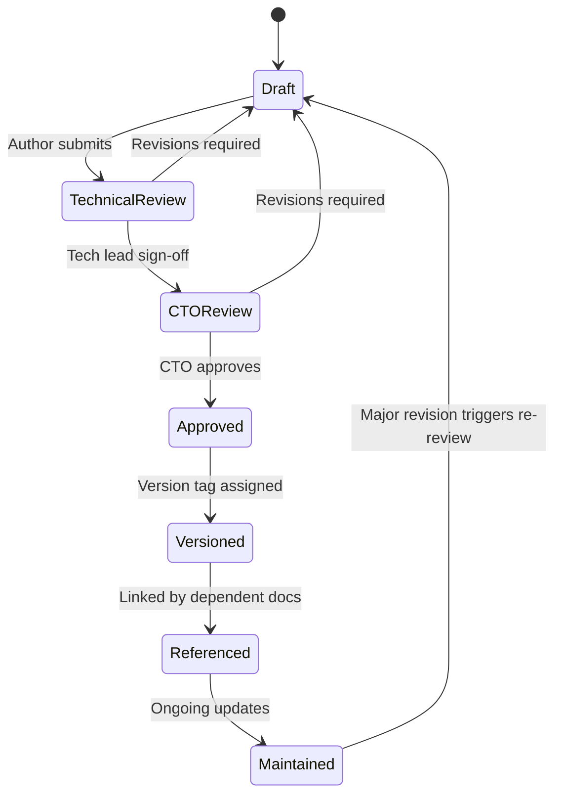
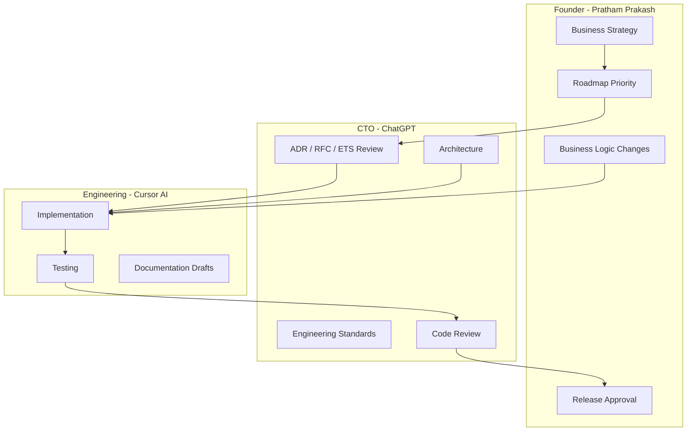

# APEX Documentation System

**Repository:** `stock-analyzer`  
**Product:** APEX — AI Investment Operating System  
**Owner:** CTO  
**Last updated:** 2026-08-06

---

## Purpose

Central registry for all APEX engineering documentation. Defines numbering, lifecycle, repository layout, and document catalog.

Every APEX document references [APEX-000](./APEX-000_Company_Constitution.md) as the highest authority. Engineering practice is governed by [APEX-999](./APEX-999_Engineering_Handbook.md).

**Product Operating System (v1.0):** structured product/engineering/design/AI/QA docs live at [../product-os/README.md](../product-os/README.md) (`product/`, `engineering/`, `design/`, `ai/`, `qa/` at repo root). Use that tree for specs and placeholders; use this `docs/apex/` tree for implementation-era canonical docs.

---

## Document Identifier System

Identifiers are **permanent**, **unique**, and **never reused**. Format: `{PREFIX}-{NNN}_{Title}.md`

### Prefix Registry

| Prefix | Purpose | Numbering | Example |
|--------|---------|-----------|---------|
| **APEX** | Core product & engineering documents | APEX-000 … APEX-998 | APEX-001 Sprint 0 Assessment |
| **ADR** | Architecture Decision Records | ADR-001 … ADR-999 | ADR-001 Six-Boundary Model |
| **RFC** | Requests for Comments (proposals pre-approval) | RFC-001 … RFC-999 | RFC-001 Hosted SaaS Model |
| **ETS** | Engineering Task Specifications (implementation units) | ETS-001 … ETS-999 | ETS-001 Fix Test Regression |

### Reserved Numbers

| ID | Document | Status |
|----|----------|--------|
| **APEX-000** | Company Constitution | DRAFT |
| **APEX-001** | Sprint 0 Engineering Assessment | DRAFT |
| **APEX-999** | Engineering Handbook | DRAFT |

Numbers **002–998** are allocated by CTO on creation. Gaps are intentional for category grouping.

### Planned APEX Catalog

| ID | Title | Owner | Status |
|----|-------|-------|--------|
| APEX-000 | Company Constitution | Founder + CTO | DRAFT |
| APEX-001 | Sprint 0 Engineering Assessment | ChatGPT (CTO) | DRAFT |
| APEX-002 | Module Inventory & Reuse Classification | Cursor | Planned |
| APEX-003 | Product Strategy & PRD | Pratham Prakash (Founder) | DRAFT v0.2 |
| APEX-004 | Experience Operating System (XOS) | ChatGPT (CTO) | DRAFT v0.1 |
| APEX-005 | System Architecture Blueprint | ChatGPT (CTO) | DRAFT v0.1 |
| APEX-006 | Security Strategy | CTO | Planned |
| APEX-007 | Design System | Design + CTO | Planned |
| APEX-008 | Data Provider Strategy | CTO | Planned |
| **APEX-012** | Single Truth Migration | CTO | **Phase 0 — guardrails** |
| **APEX-013** | Decision Snapshot (Intelligence Lab) | CTO | **E0.6 IMPLEMENTED** — [Context Determinism](./APEX-013_E0_6_Context_Determinism.md) |
| **APEX-014** | V2 Architecture & Release Record | CTO | **APPROVED — FROZEN** — [V2 Architecture and Release](./APEX-014_V2_Architecture_and_Release.md) (v2.0.0-rc1) |
| APEX-999 | Engineering Handbook | CTO | DRAFT |

### ADR / RFC / ETS Catalog

| ID | Title | Status |
|----|-------|--------|
| ADR-001 | Six deployable boundaries (not 16 domains) | Accepted — see APEX-001 §Decision Log |
| ADR-002 | Evolutionary migration over greenfield rewrite | Accepted |
| ADR-003 | Streamlit retained for Phase 1–2 | Accepted |
| RFC-001 | Hosted multi-tenant SaaS deployment | Open — pending OQ1 |
| RFC-002 | Licensed NSE data provider selection | Open — pending OQ2 |
| ETS-001 | Restore test suite to 509/509 pass | Planned |
| ETS-002.1 | Broker authentication & session management | Phase A complete — frozen pending approval |
| ETS-003 | Today Surface product specification | DRAFT — product spec; no implementation |
| ETS-003a | Morning Brief experience specification | APPROVED — experience spec |
| ETS-003b | Morning Brief data wiring (Trust-first) | APPROVED v0.2 — Milestone 1 implemented |
| ETS-003c | Verdict Canvas trust bind (L0 hero) | IMPLEMENTED — awaiting CTO review |
| **APEX-012** | Single Truth Migration | **Phase 0 IMPLEMENTED** — guardrails + lifecycle markers |
| **APEX-013** | Decision Snapshot (Intelligence Lab) | **E0.6 IMPLEMENTED** — [Context Determinism](./APEX-013_E0_6_Context_Determinism.md) |

---

## Documentation Lifecycle

Every document progresses through these states. **No document is permanent until APPROVED.**



### State Definitions

| State | Meaning | Exit Criteria | Actor |
|-------|---------|---------------|-------|
| **Draft** | Work in progress; not authoritative | Author marks ready for review | Cursor |
| **Technical Review** | Engineering validates technical accuracy | No factual errors; tradeoffs documented | Cursor |
| **CTO Review** | Strategy alignment with APEX-000 | ChatGPT sign-off or revision list | ChatGPT (CTO) |
| **Approved** | Authoritative; safe to reference in decisions | Approval recorded in document header | ChatGPT (CTO); Founder if APEX-000 |
| **Versioned** | Immutable snapshot tagged (e.g. v1.0) | Git tag or version field updated | Cursor |
| **Referenced** | Other approved documents cite this doc | Dependency links verified | Cursor |
| **Maintained** | Updated when codebase or strategy changes | Review cadence per doc type | Document owner |

### Required Document Header

```markdown
**Document ID:** APEX-XXX
**Version:** 0.1
**Status:** Draft | Technical Review | CTO Review | Approved
**Date:** YYYY-MM-DD
**Owner:** Role
**Author:** Name
**Reviewers:** Names
**Supersedes:** None | APEX-XXX vN
**References:** APEX-000, ...
```

### Review Cadence (post-approval)

| Document type | Review frequency | Reviewer |
|---------------|------------------|----------|
| APEX-000 Constitution | Annual or on strategic pivot | Founder + CTO |
| APEX-001 Assessment | Per major sprint milestone | CTO |
| ADR | Immutable once accepted; superseded by new ADR | CTO |
| RFC | Closed on accept/reject/defer | CTO (+ Founder if business-impacting) |
| ETS | Closed on task completion | CTO (code review) |
| APEX-999 Handbook | Quarterly | CTO |

### Review Workflow by Role

| Step | Actor | Action |
|------|-------|--------|
| 1. Draft | Cursor (Engineering) | Author content per APEX-999 standards |
| 2. Technical Review | Cursor (Engineering) | Validate technical accuracy against codebase |
| 3. CTO Review | ChatGPT (CTO) | Strategy alignment, challenge assumptions, approve or revise |
| 4. Founder Review | Pratham Prakash | Required for APEX-000, business-impacting RFCs, releases |
| 5. Approved | CTO | Update status; assign version |
| 6. Versioned | Cursor | Git commit; immutable version in header |
| 7. Maintained | Document owner | Periodic review per cadence above |

---

## Implementation Lifecycle (ETS)

**Every ETS implementation follows this lifecycle.** Full specification: [APEX-999 §15.1](./APEX-999_Engineering_Handbook.md#151-mandatory-implementation-lifecycle-ets).

```
Engineering Assessment
        ↓
Architecture Validation
        ↓
Implementation Plan
        ↓
Commit 1 → CTO Review → Commit 2 → CTO Review → … (repeat per commit)
        ↓
Testing
        ↓
Demo
        ↓
Merge
```

| Rule | Detail |
|------|--------|
| **No code before approval** | Stages 1–3 documented and CTO-approved in the ETS |
| **Small commits** | One logical change per commit; CTO reviews each |
| **Demo before merge** | Working proof of acceptance criteria |
| **Status in ETS header** | Tracks current lifecycle stage |

---

## Repository Structure

```
docs/
├── apex/                          ← APEX canonical documentation (this system)
│   ├── README.md                  ← Index, lifecycle, numbering (this file)
│   ├── APEX-000_Company_Constitution.md
│   ├── APEX-001_Sprint0_Engineering_Assessment.md
│   ├── APEX-002_...md             ← Future core docs
│   ├── adr/
│   │   └── ADR-001_Six_Boundary_Model.md
│   ├── rfc/
│   │   └── RFC-001_Hosted_SaaS.md
│   ├── ets/
│   │   └── ETS-001_Test_Regression.md
│   └── APEX-999_Engineering_Handbook.md
│
├── architecture/                  ← V2 legacy audits (reference only)
│   └── 01–21, AI_Trading_*.md     ← Superseded by APEX series for new work
│
└── design/                        ← V2 UX/design specs (reference)
    └── Product_Constitution_LOCKED.md  ← Merged into APEX-000; kept for history
```

### Migration Policy for Legacy Docs

| Legacy path | APEX equivalent | Action |
|-------------|-----------------|--------|
| `docs/architecture/08_Final_Investment_OS_Architecture.md` | APEX-005 | Reference until APEX-005 approved |
| `docs/design/Product_Constitution_LOCKED.md` | APEX-000 §Product Philosophy | Merged; legacy file retained |
| `docs/architecture/03_Technical_Debt.md` | APEX-001 §Risk Register | Active until APEX-006 Security Strategy |
| `docs/architecture/02_Module_Inventory.md` | APEX-002 (planned) | Supersede on APEX-002 approval |

New engineering work references `docs/apex/` only. Legacy docs are read-only historical context.

---

## Roles & Ownership

### Founder & CEO — Pratham Prakash

| Responsibility |
|----------------|
| Company vision · Product vision · Business strategy · Customer validation |
| Roadmap prioritization · Final business decisions · Product direction approval · Release approval |

### CTO & Chief Product Architect — ChatGPT

| Responsibility |
|----------------|
| System architecture · Engineering standards · Software quality · Product architecture · AI architecture |
| Technical strategy · Design reviews · Reviews every RFC, ADR, and ETS |
| Reviews implementation plans and Cursor output · Challenges assumptions |
| Protects long-term maintainability · Ensures alignment with APEX vision |

### Engineering Team — Cursor AI

Acts as Principal Software Engineer, Principal Solutions Architect, Staff Backend Engineer, Senior Frontend Engineer, DevOps Engineer, Database Engineer, QA Automation Engineer, and Technical Writer.

| Cursor executes | Cursor must NOT |
|---------------|-----------------|
| Repository analysis · Engineering documentation · RFC/ADR/ETS creation | Change product direction |
| Architecture diagrams · Approved implementation · Unit/integration tests | Change architecture without approval |
| Documentation updates · Approved refactoring | Introduce major dependencies without justification |
| | Delete working business logic without approval |
| | Large-scale rewrites without approved migration plan |
| | Make business decisions |

**When requirements are ambiguous:** (1) Explain assumptions · (2) Present alternatives · (3) Explain trade-offs · (4) Recommend best option · (5) **Wait for approval before proceeding**.

### Documentation Responsibilities by Role

| Role | Documentation responsibility |
|------|------------------------------|
| **Founder** | Approves APEX-000, product vision, roadmap, business-impacting RFCs, releases |
| **CTO** | Owns all standards; approves every APEX/ADR/RFC/ETS; triages and reviews |
| **Cursor (Engineering)** | Authors drafts; conducts Technical Review; implements after approval |
| **Product Manager** | Co-authors APEX-003, APEX-004; validates business impact sections |

---

## Decision Authority Matrix

Authoritative ownership for every decision class. When in doubt, escalate to the listed owner.

| Domain | Owner | Approval required for changes |
|--------|-------|-------------------------------|
| **Business strategy** | Founder | Founder |
| **Product vision** | Founder + CTO | Founder + CTO |
| **Architecture** | CTO | CTO (+ ADR for structural changes) |
| **Engineering standards** | CTO | CTO |
| **Design system** | CTO | CTO |
| **Technology stack** | CTO | CTO (+ ADR for stack changes) |
| **Repository structure** | CTO | CTO |
| **Implementation** | Cursor | Per ETS; code review by CTO |
| **Testing** | Cursor | CI green; CTO review for decision-path changes |
| **Documentation** | Cursor | CTO review for APEX/ADR/RFC/ETS |
| **Code reviews** | CTO | CTO sign-off |
| **Release approval** | Founder + CTO | Founder + CTO |
| **Major refactoring** | — | **Founder + CTO** |
| **Architecture changes** | — | **CTO** (+ ADR) |
| **Business logic changes** | — | **Founder** (+ CTO review if architectural impact) |



---

## Quick Links

| Document | Purpose |
|----------|---------|
| [APEX-000](./APEX-000_Company_Constitution.md) | Mission, values, non-negotiables |
| [APEX-001](./APEX-001_Sprint0_Engineering_Assessment.md) | Sprint 0 baseline & strategy |
| [APEX-003](./APEX-003_Product_Strategy_and_PRD.md) | Product strategy & MVP requirements |
| [APEX-004](./APEX-004_Experience_Operating_System.md) | Experience Constitution (XOS) |
| [APEX-005](./APEX-005_System_Architecture_Blueprint.md) | System Architecture Blueprint |
| [APEX-999](./APEX-999_Engineering_Handbook.md) | Engineering standards & workflow |
