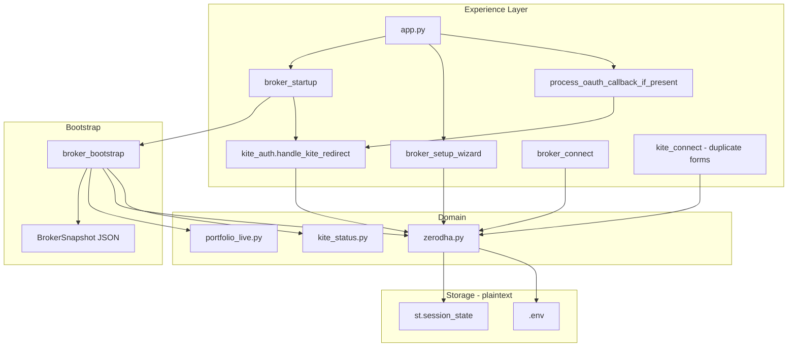
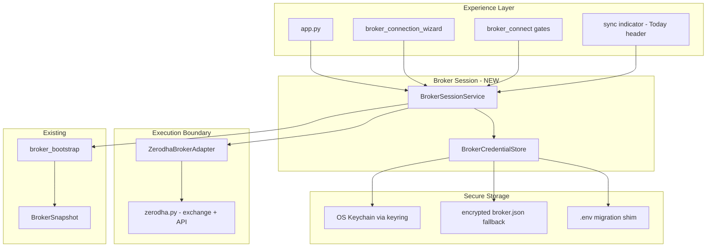
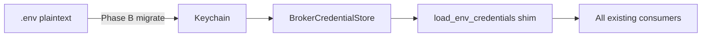

# ETS-002.1 — Broker Authentication & Session Management

**Document ID:** ETS-002.1  
**Version:** 0.1  
**Status:** DRAFT — **Stage 1: Engineering Assessment complete · awaiting Stage 2: Architecture Validation**  
**Lifecycle stage:** 1 of 10 — see [APEX-999 §15.1](../APEX-999_Engineering_Handbook.md#151-mandatory-implementation-lifecycle-ets)  
**Date:** 2026-08-05  
**Owner:** ChatGPT (CTO)  
**Author:** Cursor AI (Engineering Team)  
**Reviewers:** Pratham Prakash (Founder) — pending · ChatGPT (CTO) — pending  
**References:** [APEX-000](../APEX-000_Company_Constitution.md), [APEX-001](../APEX-001_Sprint0_Engineering_Assessment.md), [APEX-003](../APEX-003_Product_Strategy_and_PRD.md), [APEX-004](../APEX-004_Experience_Operating_System.md), [APEX-005](../APEX-005_System_Architecture_Blueprint.md), [APEX-999](../APEX-999_Engineering_Handbook.md), [Broker Authentication Audit](../../architecture/Broker_Authentication_Audit.md)

**Priority:** P0 — blocks premium UX and CDQS (broker-verified outcomes require reliable session)  
**Estimated effort:** 2–3 weeks (3 implementation phases)  
**Depends on:** ETS-001 (509/509 tests green) recommended before merge

---

## Implementation Lifecycle Status

Per [APEX-999 §15.1](../APEX-999_Engineering_Handbook.md#151-mandatory-implementation-lifecycle-ets) — **no code until Stage 3 approved.**

| Stage | Status | Owner | Notes |
|-------|--------|-------|-------|
| 1. Engineering Assessment | ✅ **Complete** | Cursor | This document §2–§3 |
| 2. Architecture Validation | ⏳ **Pending** | CTO | Validate vs APEX-005 §31, no duplicate OAuth |
| 3. Implementation Plan | ⏳ **Pending** | Cursor | §7 below — approve before any commit |
| 4–7. Commits + CTO Review | 🔒 **Blocked** | Cursor → CTO | Planned: A-1…A-6, B-1…B-6, C-1…C-5 |
| 8. Testing | 🔒 **Blocked** | Cursor | CI green + §9 acceptance criteria |
| 9. Demo | 🔒 **Blocked** | Cursor | Appendix A E2E checklist |
| 10. Merge | 🔒 **Blocked** | Cursor | Branch `feature/ets-002-1-broker-session` |

**Current gate:** CTO **Architecture Validation** (Stage 2).

---

## Table of Contents

1. [Objective](#1-objective)  
2. [Engineering Assessment](#2-engineering-assessment)  
3. [Current Architecture](#3-current-architecture)  
4. [Target Architecture](#4-target-architecture)  
5. [Architecture Impact Analysis](#5-architecture-impact-analysis)  
6. [Migration Strategy](#6-migration-strategy)  
7. [Implementation Plan](#7-implementation-plan)  
8. [Files to Modify / Create / Delete](#8-files-to-modify--create--delete)  
9. [Acceptance Criteria](#9-acceptance-criteria)  
10. [Risk Assessment](#10-risk-assessment)  
11. [Rollback Strategy](#11-rollback-strategy)  
12. [Recommendation for Approval](#12-recommendation-for-approval)

---

## 1. Objective

Eliminate the **#1 usability failure** in the current product: users repeatedly entering Kite API Key, API Secret, and login credentials.

### Target experience

| Run | User action | System behavior |
|-----|-------------|-----------------|
| **First launch** | Choose broker → OAuth login → done | App credentials stored securely; portfolio syncs |
| **Every subsequent launch** | Open APEX | Session restored · token validated · portfolio syncs · Today loads |
| **Daily (token expired ~6 AM IST)** | Tap **Sign In** once (OAuth only) | No API forms · no secret re-entry |
| **Reconnect / Disconnect** | Explicit settings action | Graceful re-auth or clean disconnect |

### Out of scope (this ETS)

- Multi-broker implementation (architecture only)  
- Hosted SaaS auth (C1) — separate Phase 3 track  
- Auto-trading / order placement  
- Licensed NSE data (C4)

---

## 2. Engineering Assessment

*Repository analyzed 2026-08-05. No code changed for this document.*

### 2.1 What already exists (reuse — do not duplicate)

The repository contains **substantial, production-grade broker integration**. Phase 1 broker UX (2026-07-16) already removed most sidebar API forms. The **protocol layer is correct**; **orchestration and storage** are broken or immature.

| Asset | Location | Maturity | Reuse decision |
|-------|----------|----------|----------------|
| **OAuth exchange** | `analyzer/zerodha.py` → `exchange_request_token()`, `generate_session` via kiteconnect 5.2.0 | Code correct; never reliably reached in Streamlit | **KEEP** — single exchange path |
| **Login URL** | `get_kite_login_url()` | ✅ Kite v3 aligned | **KEEP** |
| **Credential load** | `load_env_credentials()`, `hydrate_kite_access_token()` | Works; plaintext `.env` | **REFACTOR** → secure store |
| **Token persist** | `save_access_token_to_env()`, `_save_env_value()` | Plaintext `.env` write | **REFACTOR** → secure store |
| **App credential save** | `save_zerodha_api_credentials_to_env()` | One-time wizard | **REFACTOR** → keychain |
| **OAuth callback UI** | `ui/components/kite_auth.py` | Partial fixes; debug leaks secrets | **REFACTOR** |
| **Early OAuth gate** | `process_oauth_callback_if_present()` in `app.py` | Addresses audit §9 | **KEEP** — consolidate duplicates |
| **Startup pipeline** | `ui/components/broker_startup.py` | Duplicates OAuth path | **REFACTOR** — thin wrapper |
| **Bootstrap / sync** | `ui/broker/bootstrap.py` | 10/10 tests; solid | **KEEP** |
| **Broker snapshot** | `ui/broker/state.py` → `data/broker/session_state.json` | Good UX state | **KEEP** — extend health fields |
| **Connect gates** | `ui/components/broker_connect.py` | No API forms | **KEEP** |
| **One-time wizard** | `ui/components/broker_setup_wizard.py` | Blocks app until keys saved | **REFACTOR** → unified wizard |
| **Health / status** | `analyzer/kite_status.py` | Probe + levels | **KEEP** — wire to sync indicator |
| **Provider abstraction** | `analyzer/providers/kite.py`, `providers/router.py` | Market data layer | **KEEP** — unchanged |
| **CLI auth** | `scripts/kite_auth.py` | Reliable fallback | **KEEP** — uses same exchange |
| **OAuth tests** | `tests/test_kite_oauth.py` | Callback order covered | **EXTEND** |
| **Bootstrap tests** | `tests/test_broker_bootstrap.py` | 10/10 | **EXTEND** |

### 2.2 Root causes of repeated credential prompts

| # | Root cause | Evidence | Fix category |
|---|------------|----------|--------------|
| RC-1 | **OAuth callback not reliably executed** | [Broker Authentication Audit](../../architecture/Broker_Authentication_Audit.md): zero live `generate_session` in `oauth.log` | Consolidate startup; remove skip races |
| RC-2 | **Duplicate OAuth paths** | `process_oauth_callback_if_present()` + `run_broker_startup()` both handle callback | Single `BrokerSessionService` |
| RC-3 | **Plaintext `.env` + stale token** | `ZERODHA_ACCESS_TOKEN` present but expired → appears "configured" but sync fails | Validate on startup; clear expired tokens |
| RC-4 | **API forms still exist in two places** | `broker_setup_wizard.py` + `kite_connect.render_kite_connect()` lines 96–109 | One wizard; deprecate forms in kite_connect |
| RC-5 | **Kite token expires daily (~6 AM IST)** | By design — user must re-OAuth, not re-enter API secret | OAuth-only reconnect UX |
| RC-6 | **Secrets in debug output** | `kite_auth.py` prints `api_secret`; `exchange_request_token` prints session data | **P0 security fix** — remove immediately in Phase A |
| RC-7 | **`_broker_startup_done` skip** | Second run in same Streamlit session skips bootstrap | Correct for session; cold start must restore from store |
| RC-8 | **No secure storage** | C2 debt — [APEX-001 SR-02](../APEX-001_Sprint0_Engineering_Assessment.md) | `keyring` + encrypted fallback |

### 2.3 What can be reused unchanged

- `exchange_request_token()` / Kite SDK integration  
- `broker_bootstrap()` / `BrokerSnapshot`  
- `kite_connection_status()` / probe logic  
- `post_kite_login_sync()` / portfolio sync  
- `render_broker_sign_in_button()` / connect gates  
- `scripts/kite_auth.py` CLI  
- Broker Truth engine (`analyzer/broker_truth/`) — consumes fills, not auth

### 2.4 What must be refactored

| Component | Why |
|-----------|-----|
| Credential persistence | Move from plaintext `.env` to `BrokerCredentialStore` |
| OAuth orchestration | Single service; remove duplicate paths and debug prints |
| First-run UX | Unified wizard per [APEX-004 §32](../APEX-004_Experience_Operating_System.md) |
| `load_env_credentials()` | Read from store; `.env` migration shim only |
| `kite_connect.render_kite_connect()` | Remove API key/secret forms; OAuth button only |
| Startup order in `app.py` | Document and enforce single pipeline |

### 2.5 What must NOT be created

- Second OAuth implementation  
- Second Kite client factory  
- Parallel token exchange in UI layer  
- New broker API wrapper duplicating `zerodha.py`

### 2.6 Classification summary (Phase 0 style)

| Subsystem | Class |
|-----------|-------|
| `zerodha.py` OAuth + API | **KEEP** / **REFACTOR** storage delegation |
| `ui/broker/*` | **KEEP** |
| `kite_auth.py` | **REFACTOR** |
| `broker_startup.py` | **REFACTOR** |
| `broker_setup_wizard.py` | **REFACTOR** → merge |
| `kite_connect.py` credential forms | **REFACTOR** → remove forms |
| `BrokerCredentialStore` (new) | **FUTURE** → implement Phase B |
| `BrokerSessionService` (new) | **FUTURE** → implement Phase A |
| `BrokerAdapter` protocol (new) | **FUTURE** → thin wrapper Phase C |

---

## 3. Current Architecture

### 3.1 Component diagram (as-is)



### 3.2 Current startup sequence (`app.py`)

```
1. load_app_env()
2. st.set_page_config()
3. process_oauth_callback_if_present()  ← may st.rerun()
4. init_nav_state()
5. ensure_broker_configured()         ← blocks if no API key/secret
6. run_broker_startup()               ← may again handle OAuth
7. page routing
```

**Problem:** Steps 3 and 6 both process OAuth. Step 5 requires API key/secret in `.env` before OAuth can complete on first run (correct for Kite Connect model, but poor UX if keys not persisted securely).

### 3.3 Current credential flow

| Credential | Storage today | Lifetime | User re-entry frequency |
|------------|---------------|----------|-------------------------|
| API Key | `.env` `ZERODHA_API_KEY` | Permanent (app registration) | **Should be once** — currently re-prompted if `.env` lost or forms shown |
| API Secret | `.env` `ZERODHA_API_SECRET` | Permanent | **Should be once** |
| Access Token | `.env` + `session_state` | Until ~6 AM IST next day | **Daily OAuth** — acceptable |
| Request Token | URL query param | Single use | Never manual (except CLI fallback) |

### 3.4 Known defects (documented)

From [Broker Authentication Audit](../../architecture/Broker_Authentication_Audit.md):

- OAuth exchange never logged in production  
- `st.query_params` empty on redirect (fallback: `st.context.url`)  
- Historical Home-page early-return (fixed in `app.py`)  
- Port mismatch was 8501 vs 8502 — **`scripts/run_app.sh` now uses 8501** ✅

**New defect (this assessment):**

- `handle_kite_redirect()` and `exchange_request_token()` contain **`print()` of secrets** — violates ETS security requirements and [APEX-999 §4.2](../APEX-999_Engineering_Handbook.md)

---

## 4. Target Architecture

### 4.1 Design principles

1. **Single session authority** — one `BrokerSessionService`; UI never calls `generate_session` directly  
2. **Single credential store** — `BrokerCredentialStore` interface; no raw `.env` writes from UI  
3. **OAuth before skip flags** — callback processed before `_broker_startup_done` or nav init  
4. **Fail to disconnected, not confused** — expired token → clear state → Sign In only  
5. **BrokerAdapter-ready** — Zerodha first; interface matches [APEX-005 §31](../APEX-005_System_Architecture_Blueprint.md)  
6. **Experience-aligned** — wizard copy and health indicator per [APEX-004 §32](../APEX-004_Experience_Operating_System.md)

### 4.2 Target component diagram



### 4.3 Target startup sequence

```
1. load_app_env()                    # non-secret config only
2. st.set_page_config()
3. BrokerSessionService.process_oauth_callback_if_present()
   → if callback: exchange · persist · bootstrap · rerun
4. init_nav_state()
5. BrokerSessionService.ensure_app_credentials()
   → if missing: render BrokerConnectionWizard (step 1 only) · return
6. BrokerSessionService.restore_and_validate()
   → load tokens from store · probe Kite · set BrokerSnapshot
7. broker_bootstrap(force_sync=needs_sync)
8. page routing → Today
```

### 4.4 BrokerCredentialStore interface (conceptual)

```python
class BrokerCredentialStore(Protocol):
    def get_app_credentials(self, broker: str) -> AppCredentials | None: ...
    def save_app_credentials(self, broker: str, creds: AppCredentials) -> None: ...
    def get_access_token(self, broker: str) -> str | None: ...
    def save_access_token(self, broker: str, token: str) -> None: ...
    def clear_access_token(self, broker: str) -> None: ...
    def clear_all(self, broker: str) -> None: ...
```

**Implementations:**

| Store | When |
|-------|------|
| `KeychainCredentialStore` | Mac local (primary) — service name `apex.broker.zerodha` |
| `EncryptedFileStore` | Fallback — `data/broker/credentials.enc` (Fernet + machine id) |
| `EnvShimStore` | Migration / CI — reads `.env`, writes migrate-on-first-load to keychain |

### 4.5 BrokerSessionService responsibilities

| Method | Purpose |
|--------|---------|
| `process_oauth_callback_if_present()` | Detect `request_token` · exchange · persist · bootstrap · rerun |
| `ensure_app_credentials()` | Return False → show wizard if API key/secret missing |
| `restore_and_validate()` | Load token · probe · return `SessionState` |
| `get_login_url()` | Zerodha OAuth URL |
| `disconnect()` | Clear access token + snapshot + session flags |
| `get_health()` | Map `kite_connection_status()` → [APEX-004 sync indicator](../APEX-004_Experience_Operating_System.md) |

### 4.6 First-run wizard (target UX)

Aligned with [APEX-004 §31–32](../APEX-004_Experience_Operating_System.md):

```
Step 0: Welcome to APEX — Connect your broker
Step 1: Choose broker → [Zerodha] (only option)
Step 2: One-time app setup → API Key + Secret → saved to Keychain (never .env plaintext)
Step 3: Redirect URL helper (copy + link to developers.kite.trade)
Step 4: Sign in with Zerodha → OAuth
Step 5: Portfolio sync progress → Done → Today
```

**Second run:** Steps 0–4 skipped entirely if valid session.

### 4.7 Multi-broker readiness (architecture only)

```python
class BrokerAdapter(Protocol):
    broker_id: str
    def login_url(self) -> str: ...
    def exchange_callback(self, request_token: str) -> AccessToken: ...
    def validate_session(self) -> SessionHealth: ...
    def fetch_portfolio(self) -> HoldingsSnapshot: ...
```

Phase C registers `ZerodhaBrokerAdapter` only. Angel/IBKR — **FUTURE**.

---

## 5. Architecture Impact Analysis

### 5.1 Alignment with APEX documents

| Document | Impact |
|----------|--------|
| [APEX-000 N7](../APEX-000_Company_Constitution.md) | Local keychain satisfies single-user; hosted still blocked until C1–C3 |
| [APEX-003 §14 Flywheel](../APEX-003_Product_Strategy_and_PRD.md) | **Broker Connected** stage unblocked — reliable sync |
| [APEX-004 §9 Trust](../APEX-004_Experience_Operating_System.md) | Sync indicator always reflects real state |
| [APEX-005 §16 Execution](../APEX-005_System_Architecture_Blueprint.md) | Implements `BrokerAdapter` first slice |
| [APEX-999 §2.1](../APEX-999_Engineering_Handbook.md) | No change to four-engine pipeline |

### 5.2 Boundary placement

| New module | Boundary | Rationale |
|------------|----------|-----------|
| `analyzer/broker/credentials.py` | **Execution** | Broker secrets + session |
| `analyzer/broker/session.py` | **Execution** | Orchestrates auth lifecycle |
| `analyzer/broker/zerodha_adapter.py` | **Execution** | Wraps `zerodha.py` |
| `ui/components/broker_connection_wizard.py` | **Platform** | Presentation only |

**Rule:** `ui/` calls `BrokerSessionService` only — never `exchange_request_token()` directly (except deprecated CLI).

### 5.3 Security impact

| Before | After |
|--------|-------|
| API secret in `.env` plaintext | Keychain / encrypted file |
| Access token in `.env` plaintext | Keychain; `.env` token migrated out |
| Secrets in `print()` debug | Removed; structured log with masks only |
| Logs may contain tokens | Audit + redaction filter on oauth_log |

**Resolves:** C2 partial (local). Hosted vault remains Phase 3.

### 5.4 Test impact

| Area | New tests |
|------|-----------|
| Credential store | round-trip, migration from `.env`, clear |
| Session service | restore valid · restore expired · OAuth callback order |
| Security | assert no secret in logs |
| Integration | mock Kite · bootstrap after restore |
| Regression | extend `test_kite_oauth.py`, `test_broker_bootstrap.py` |

### 5.5 Performance impact

Negligible. Keychain read < 10ms. One Kite `profile()` probe on cold start (already done).

---

## 6. Migration Strategy

**Evolutionary — no big-bang.** Three implementation phases after approval.

### Phase A — OAuth reliability + security (Week 1)

**Goal:** OAuth works end-to-end; secrets removed from debug output.

| Action | Risk |
|--------|------|
| Remove all secret `print()` from `kite_auth.py`, `zerodha.py`, `app.py` | Low |
| Consolidate OAuth into `BrokerSessionService` | Medium |
| Delete duplicate OAuth block from `run_broker_startup()` | Medium |
| Expired token → auto-clear from store + disconnected state | Low |
| Manual E2E verification checklist (audit §10) | — |

**Storage:** Still `.env` — no keychain yet. **Behavior fix only.**

### Phase B — Secure credential storage (Week 2)

**Goal:** API key/secret entered once; stored in Keychain.

| Action | Risk |
|--------|------|
| Add `keyring` dependency | Low |
| Implement `KeychainCredentialStore` + `EnvShimStore` | Medium |
| Migrate on first launch: if `.env` has keys → import to keychain → strip from `.env` | Medium |
| Unified `broker_connection_wizard.py` | Low |
| Remove credential forms from `kite_connect.py` | Low |

### Phase C — Adapter extraction + polish (Week 3)

**Goal:** Multi-broker-ready; APEX-004 health indicator wired.

| Action | Risk |
|--------|------|
| `ZerodhaBrokerAdapter` implements protocol | Low |
| Settings: Disconnect / Reconnect flows | Low |
| Today sync indicator uses `get_health()` | Low |
| Deprecate `broker_setup_wizard.py` (redirect to unified wizard) | Low |
| Documentation update APEX-005 / README | — |

### Migration data flow



**Backward compatibility:** `load_env_credentials()` remains the public read API until Phase C complete — internally delegates to store.

---

## 7. Implementation Plan

### 7.1 Planned commits (Stage 3 — subject to CTO approval)

Each row = one commit → **CTO Review** before the next commit starts.

#### Phase A — OAuth reliability + security

| Commit | Scope | Tests |
|--------|-------|-------|
| **A-1** | `BrokerSessionService` skeleton + package init | unit |
| **A-2** | Move OAuth into service; thin `kite_auth.py` | extend oauth tests |
| **A-3** | Remove secret `print()` debug output | grep / security test |
| **A-4** | Simplify `broker_startup.py` — no duplicate OAuth | startup order test |
| **A-5** | Expired token auto-clear | unit |
| **A-6** | `app.py` startup order cleanup | manual E2E prep |

→ **CTO Review** → **Testing (Stage 8 partial)** → **Demo (OAuth E2E)** before Phase B commits.

#### Phase B — Secure credential storage

| Commit | Scope | Tests |
|--------|-------|-------|
| **B-1** | `BrokerCredentialStore` + keychain | unit |
| **B-2** | `.env` migration shim | migration test |
| **B-3** | Wire `zerodha.py` to store | integration |
| **B-4** | Unified `broker_connection_wizard.py` | smoke |
| **B-5** | Remove forms from `kite_connect.py` | manual |
| **B-6** | `.env.example` update | — |

→ **CTO Review** → **Testing** → **Demo (second-launch auto-restore)**.

#### Phase C — Adapter + polish

| Commit | Scope | Tests |
|--------|-------|-------|
| **C-1** | `ZerodhaBrokerAdapter` | unit |
| **C-2** | Disconnect / reconnect settings | manual |
| **C-3** | Today sync indicator | visual |
| **C-4** | Deprecate old wizard shim | — |
| **C-5** | Docs update | — |

→ **CTO Review** → **Testing (full §9)** → **Demo (full success criteria)** → **Merge**.

### 7.2 Phase A tasks (detail)

| ID | Task | Files | Tests |
|----|------|-------|-------|
| A-1 | Create `BrokerSessionService` skeleton | `analyzer/broker/session.py`, `__init__.py` | unit |
| A-2 | Move OAuth logic from `kite_auth` into service | `session.py`, `kite_auth.py` | extend oauth tests |
| A-3 | Remove debug prints exposing secrets | `kite_auth.py`, `zerodha.py`, `app.py` | grep test |
| A-4 | Simplify `run_broker_startup()` — no duplicate OAuth | `broker_startup.py` | startup order test |
| A-5 | Clear expired token on probe failure | `session.py`, `bootstrap.py` | unit |
| A-6 | E2E manual checklist pass | — | documented |

**Commit discipline:** One task per commit per §15.1; CTO review before next commit.

### 7.3 Phase B tasks (detail)

| ID | Task | Files | Tests |
|----|------|-------|-------|
| B-1 | `BrokerCredentialStore` protocol + keychain impl | `analyzer/broker/credentials.py` | unit |
| B-2 | Env migration shim | `credentials.py` | migration test |
| B-3 | Wire `save_*` / `load_*` in `zerodha.py` to store | `zerodha.py` | integration |
| B-4 | Unified `broker_connection_wizard.py` | new UI component | smoke |
| B-5 | Strip forms from `kite_connect.py` | `kite_connect.py` | manual |
| B-6 | Update `.env.example` — secrets optional after migrate | `.env.example` | — |

### 7.4 Phase C tasks (detail)

| ID | Task | Files | Tests |
|----|------|-------|-------|
| C-1 | `ZerodhaBrokerAdapter` | `analyzer/broker/zerodha_adapter.py` | unit |
| C-2 | Settings disconnect/reconnect | `ui/pages/` or settings surface | manual |
| C-3 | Sync indicator on Today | verdict canvas / header | visual |
| C-4 | Deprecate old wizard | `broker_setup_wizard.py` | — |
| C-5 | Update docs | `docs/apex/ets/`, GETTING_STARTED | — |

### 7.5 Dependencies

```
ETS-001 (tests green) ──recommended──► Phase A
Phase A E2E pass ──required──► Phase B
Phase B migration verified ──required──► Phase C
```

### 7.6 Founder decisions (not engineering)

| ID | Question | Default if deferred |
|----|----------|---------------------|
| FD-1 | Require **Connect** app (₹500/mo) vs allow Personal (holdings only)? | Keep current behavior — both supported with messaging |
| FD-2 | Auto-prompt OAuth at 8:45 AM if expired? | No — user opens app; sync indicator shows stale |
| FD-3 | Bundle API key for SaaS later? | Out of scope — local keychain only |

---

## 8. Files to Modify / Create / Delete

### 8.1 Create

| File | Purpose |
|------|---------|
| `docs/apex/ets/ETS-002.1_Broker_Auth_Session.md` | This document |
| `analyzer/broker/__init__.py` | Package init |
| `analyzer/broker/credentials.py` | `BrokerCredentialStore` |
| `analyzer/broker/session.py` | `BrokerSessionService` |
| `analyzer/broker/zerodha_adapter.py` | Phase C — `BrokerAdapter` |
| `ui/components/broker_connection_wizard.py` | Unified first-run UX |
| `tests/test_broker_session.py` | Session service tests |
| `tests/test_broker_credentials.py` | Credential store tests |

### 8.2 Modify

| File | Change |
|------|--------|
| `analyzer/zerodha.py` | Delegate persist/load to store; remove debug prints |
| `ui/components/kite_auth.py` | Thin wrappers → session service; remove prints |
| `ui/components/broker_startup.py` | Remove duplicate OAuth; call session service |
| `ui/components/broker_setup_wizard.py` | Deprecate → delegate to unified wizard (Phase C) |
| `ui/components/kite_connect.py` | Remove API credential forms (Phase B) |
| `ui/components/broker_connect.py` | Use session service for login URL |
| `ui/broker/bootstrap.py` | Clear expired tokens; read via store |
| `app.py` | Single startup pipeline; remove debug prints |
| `.env.example` | Document keychain migration |
| `requirements-lock.txt` | Add `keyring` (Phase B) |
| `docs/apex/README.md` | ETS catalog entry |

### 8.3 Delete

| File | When | Notes |
|------|------|-------|
| None in Phase A–B | — | Strangler only |
| `broker_setup_wizard.py` | Phase C optional | Merge into unified wizard; keep shim re-export |

### 8.4 Do not touch

- `analyzer/broker_truth/*` — consumes outcomes after sync  
- `analyzer/providers/kite.py` — market data  
- Four-engine pipeline  
- Decision / Evidence / Context engines

---

## 9. Acceptance Criteria

### 9.1 Functional

- [ ] **AC-F1:** First-time user completes wizard once (API key/secret + OAuth) — portfolio syncs  
- [ ] **AC-F2:** Second launch (new process): no API key/secret prompts — portfolio auto-loads  
- [ ] **AC-F3:** Expired token: user sees **Sign In** only — no API forms  
- [ ] **AC-F4:** OAuth callback completes without manual `request_token` paste (Safari/Chrome, port 8501)  
- [ ] **AC-F5:** Reconnect flow works from Trust / Portfolio gate  
- [ ] **AC-F6:** Disconnect clears session; reconnect requires OAuth only  
- [ ] **AC-F7:** Sync indicator on Today reflects connected / stale / offline ([APEX-004](../APEX-004_Experience_Operating_System.md))  
- [ ] **AC-F8:** CLI `scripts/kite_auth.py token` still works (uses same store after Phase B)

### 9.2 Security

- [ ] **AC-S1:** No API secret or access token in logs, stdout, UI, or exception messages  
- [ ] **AC-S2:** After Phase B: API secret not in plaintext `.env` (migrated to keychain)  
- [ ] **AC-S3:** OAuth log uses masked tokens only (existing `_mask_token`)  
- [ ] **AC-S4:** `.env` in `.gitignore`; no credential commits

### 9.3 Engineering

- [ ] **AC-E1:** Existing tests pass (509/509 or post-ETS-001 baseline)  
- [ ] **AC-E2:** New tests: session restore, OAuth order, credential migration, no-secret-in-logs  
- [ ] **AC-E3:** No duplicate `exchange_request_token` call sites in UI  
- [ ] **AC-E4:** `load_env_credentials()` single read path via store  
- [ ] **AC-E5:** Documentation updated (GETTING_STARTED, ETS status)

### 9.4 Quality gates (from brief)

- [ ] Existing code reused — no parallel OAuth  
- [ ] Secure secret handling (Phase B minimum)  
- [ ] Automatic login on subsequent launch  
- [ ] CTO review passes

---

## 10. Risk Assessment

| ID | Risk | P | I | Mitigation |
|----|------|---|---|------------|
| R-1 | Keychain unavailable in CI/Docker | M | M | `EnvShimStore` for tests; encrypted file fallback |
| R-2 | OAuth still fails on Streamlit edge case | M | H | Keep CLI fallback; expand context.url tests |
| R-3 | Migration corrupts existing `.env` | L | H | Backup `.env` before migrate; dry-run flag |
| R-4 | Regression in portfolio sync | M | H | `test_broker_bootstrap` + E2E checklist |
| R-5 | keyring adds dependency weight | L | L | Optional extra; graceful fallback |
| R-6 | User has Personal app — expects live quotes | M | M | Existing messaging in `kite_status` — no change |
| R-7 | Phase A without Phase B leaves plaintext | H | M | Phase A explicitly labeled interim; Phase B within 1 week |
| R-8 | Breaking autopilot scripts reading `.env` | M | M | Shim writes through to `os.environ`; scripts unchanged |

---

## 11. Rollback Strategy

### 11.1 Phase-level rollback

| Phase | Rollback |
|-------|----------|
| **A** | Revert commits A-1…A-6; OAuth returns to current dual-path |
| **B** | Set `APEX_CREDENTIAL_STORE=env` flag → force `.env` reads; keychain ignored |
| **C** | Adapter is additive; remove adapter registration |

### 11.2 Feature flag

```bash
# Force legacy .env-only mode (emergency)
APEX_BROKER_CREDENTIAL_STORE=env
```

Default: `keychain` on Darwin, `env` in CI.

### 11.3 Data rollback

- Before Phase B migration: copy `.env` → `.env.backup.ets0021`  
- Keychain entries deletable via Settings → Disconnect → "Reset broker configuration"  
- `data/broker/session_state.json` safe to delete — rebuilds on sync

### 11.4 Commit rollback

Each phase is 3–6 atomic commits on a feature branch `feat/ets-002-1-broker-session`. Revert branch merge if E2E fails.

---

## 12. Recommendation for Approval

### 12.1 Proceed?

**Recommend approval** to implement **Phase A immediately** after ETS-001 green (or in parallel if OAuth blocked on founder dogfood).

Phase A alone fixes the **production OAuth failure** and **secret leakage** with minimal architectural surface.

Phase B is required to meet **"Connect once"** for API key/secret and C2 local security.

### 12.2 Approval gates (lifecycle stages)

| Stage | Gate | Approver | Unlocks |
|-------|------|----------|---------|
| **2** | Architecture Validation | CTO | Implementation Plan finalization |
| **3** | Implementation Plan | CTO | Commit A-1 (first code) |
| **4–7** | Per-commit review | CTO | Next commit |
| **8–9** | Testing + Demo | CTO (+ Founder if UX) | Merge PR |
| **10** | Merge | CTO | ETS Complete |

Phase A/B/C grouping is for planning only — **each commit still gets its own CTO review.**

| Gate | Approver | Required for |
|------|----------|--------------|
| **G3** | Founder + CTO | Ship unified wizard copy (APEX-004 alignment) |

### 12.3 Explicit non-goals for this ETS

- Hosted multi-user auth (C1)  
- Angel One / second broker  
- Automatic token refresh (Kite does not issue refresh tokens)  
- Removing one-time Kite Connect app registration (API key/secret are Zerodha developer requirements)

### 12.4 Success narrative

After ETS-002.1:

> Arjun connects Zerodha once. Every morning he opens APEX. The sync dot is green. His portfolio is there. He reads **Wait** on Today. He never thinks about API keys again — even when the daily session expires, he taps **Sign In** once and returns.

That is the premium investment product experience this ETS delivers.

---

## Appendix A — Manual E2E Verification (Phase A)

Run after Phase A implementation:

| # | Step | Pass |
|---|------|------|
| 1 | `python scripts/kite_auth.py check` with valid token | All OK |
| 2 | Clear access token only · launch app | Sign In gate — no API forms |
| 3 | Complete OAuth in Safari @ `:8501` | `oauth.log` shows exchange + save |
| 4 | URL clears to `/` without query params | |
| 5 | Portfolio holdings > 0 | |
| 6 | Kill app · relaunch | Auto-sync — no login if token valid |
| 7 | Simulate expired token (invalid value) | Sign In only — no API secret prompt |

---

## Appendix B — Traceability

| Requirement | Section |
|-------------|---------|
| APEX-005 Broker Abstraction §31 | §4.6 |
| APEX-004 Broker Connection §32 | §4.6 |
| APEX-004 Sync indicator §14.2 | §4.2 |
| APEX-001 C2 security | §5.3, Phase B |
| APEX-003 Flywheel Broker Connected | §1 |

---

*Repository: stock-analyzer · Product: APEX · Document: ETS-002.1 v0.1 · Assessment — implementation blocked pending approval*
