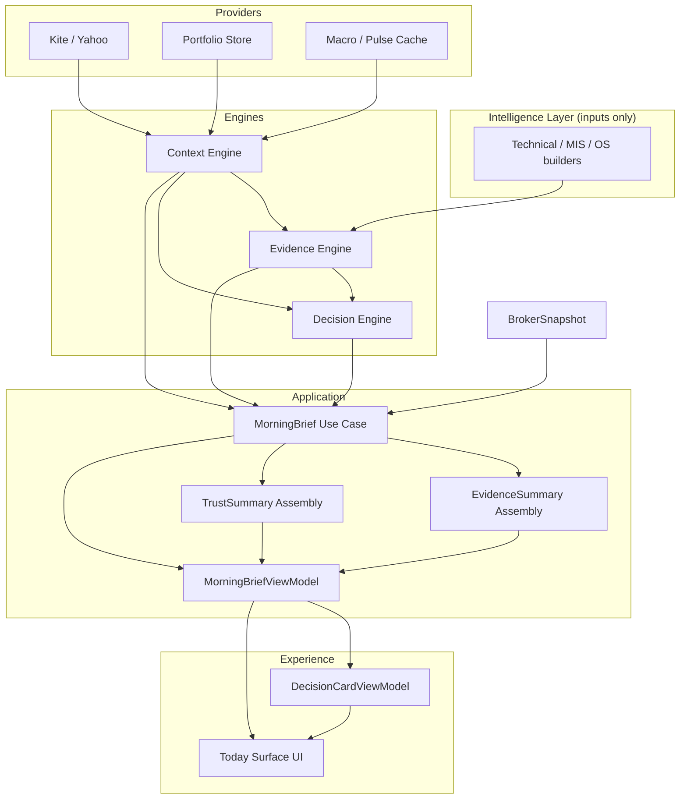
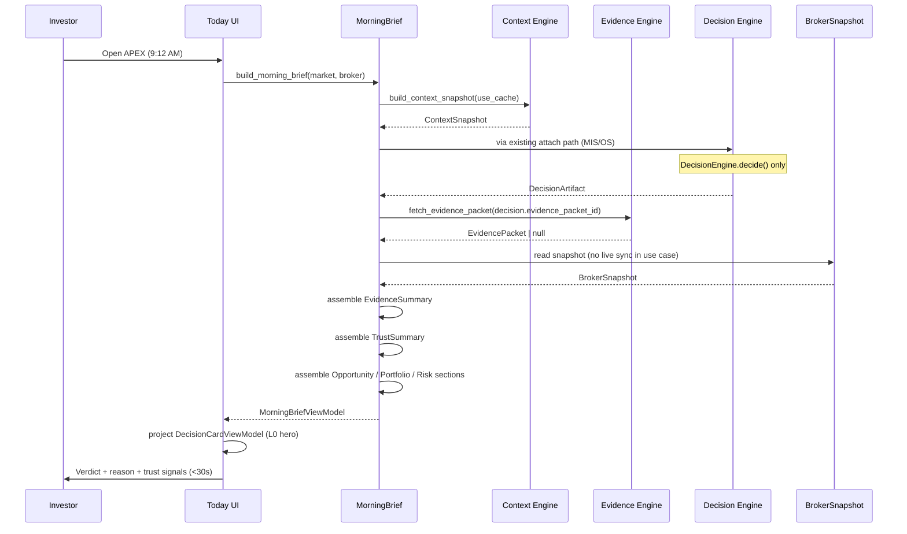

# ETS-003b — Morning Brief Data Wiring (Revised)

**Trust-First Data Contract for the Signature APEX Experience**

**Document ID:** ETS-003b  
**Version:** 0.2 (CTO Revision)  
**Status:** APPROVED — Implementation Milestone 1 complete · awaiting CTO review  
**Date:** 2026-08-05  
**Owner:** ChatGPT (CTO / CPO)  
**Author:** Cursor AI (Engineering — Principal PM / Architect)  
**Reviewers:** Pratham Prakash (Founder) — pending · ChatGPT (CTO) — **APPROVED v0.2**  
**Supersedes:** ETS-003b v0.1 (Decision-only wiring — rejected)  
**References:** [APEX-003](../APEX-003_Product_Strategy_and_PRD.md), [APEX-004](../APEX-004_Experience_Operating_System.md), [APEX-005](../APEX-005_System_Architecture_Blueprint.md), [ETS-002.1](./ETS-002.1_Broker_Auth_Session.md), [ETS-003](./ETS-003_Today_Surface_Product_Spec.md), [ETS-003a](./ETS-003a_Morning_Brief_Experience_Spec.md)

**Scope:** Data wiring specification only. No code, no Streamlit changes, no new engines.

---

## Executive Summary (Answer First)

**Why this revision:** APEX is a **trusted decision platform**, not a recommendation engine. Returning only a verdict (`DecisionCardViewModel`) is architecturally incomplete. Customers buy **confidence to act with their own money** — that requires **Decision + Evidence + Trust** in every Morning Brief response.

**What changes:** `MorningBrief` use case must assemble a **`MorningBriefViewModel`** with six answerable questions (see §4). `DecisionCardViewModel` becomes a **hero projection** of that richer contract — not the root DTO.

**What does NOT change:** `DecisionEngine` remains the **sole verdict owner**. No new Trust Engine. Trust is a **presentation assembly** derived from existing intelligence.

**Implementation status:** Any code written under v0.1 is **non-authoritative** until this spec is approved and implementation is re-executed against v0.2.

---

## Table of Contents

1. [Product Philosophy](#1-product-philosophy)  
2. [Architecture Revision](#2-architecture-revision)  
3. [Pipeline Diagrams](#3-pipeline-diagrams)  
4. [Six Trust Questions](#4-six-trust-questions)  
5. [MorningBriefViewModel](#5-morningbriefviewmodel)  
6. [DecisionCardViewModel (Hero Projection)](#6-decisioncardviewmodel-hero-projection)  
7. [Data Contracts](#7-data-contracts)  
8. [MorningBrief Use Case Responsibilities](#8-morningbrief-use-case-responsibilities)  
9. [Trust Summary Assembly](#9-trust-summary-assembly)  
10. [Evidence Summary Assembly](#10-evidence-summary-assembly)  
11. [Stale & Freshness Policy](#11-stale--freshness-policy)  
12. [Failure States](#12-failure-states)  
13. [Caching & Performance](#13-caching--performance)  
14. [Engineering Rationale](#14-engineering-rationale)  
15. [Delta from v0.1](#15-delta-from-v01)  
16. [Acceptance Criteria](#16-acceptance-criteria)  
17. [Founder Decisions Required](#17-founder-decisions-required)  
18. [CTO Decisions Required](#18-cto-decisions-required)  
19. [Implementation Risks](#19-implementation-risks)  
20. [Recommendation After Approval](#20-recommendation-after-approval)

---

## 1. Product Philosophy

### 1.1 What APEX sells

| APEX sells | APEX does NOT sell |
|------------|-------------------|
| Clarity | Raw information |
| Confidence to decide | Hot tips |
| Transparent reasoning | Black-box scores |
| Permission to wait | Engagement / screen time |

### 1.2 Trust is first-class

Trust is not marketing copy on the Today surface. It is a **required section of the Morning Brief data contract** — as mandatory as the verdict word.

> **Product principle:** Customers do not trust conclusions. Customers trust transparent reasoning.  
> **Therefore:** Decision alone is insufficient. **Decision + Evidence + Trust = Product.**

### 1.3 Constitutional alignment

| Document | Rule |
|----------|------|
| [APEX-000 §9.1](../APEX-000_Company_Constitution.md) | No ACT without EvidencePacket |
| [APEX-004 §10](../APEX-004_Experience_Operating_System.md) | Conflicts flagged before ACT |
| [APEX-005 §10](../APEX-005_System_Architecture_Blueprint.md) | Use cases return DTOs; pipeline order Context → Evidence → Decision |
| [ETS-003a §23](./ETS-003a_Morning_Brief_Experience_Spec.md) | FACT / ASSUMPTION / OPINION / ESTIMATE labels on all claims |

---

## 2. Architecture Revision

### 2.1 Rejected flow (v0.1)

```
Market Data → Decision Engine → DecisionCardViewModel → UI
```

**Defect:** Verdict without explicit evidence and trust metadata. UI assembles trust ad hoc. Violates “trust in architecture, not copy.”

### 2.2 Required flow (v0.2)

```
Market Data
    ↓
Context Intelligence          ← ContextSnapshot (regime, session, risk_mode, restrictions)
    ↓
Decision Engine               ← sole verdict owner → DecisionArtifact
    ↓
Evidence Engine               ← EvidencePacket (via decision.evidence_packet_id)
    ↓
Trust Summary (assembly)      ← presentation model — NOT a new engine
    ↓
Morning Brief (use case)      ← MorningBriefViewModel
    ↓
Experience Layer              ← DecisionCard hero + optional depth zones
```

### 2.3 Layer boundaries (APEX-005)

```
┌─────────────────────────────────────────────────────────────┐
│ Experience Layer (ui/)                                       │
│  • Renders MorningBriefViewModel                             │
│  • DecisionCardViewModel = hero projection only              │
│  • No verdict computation · no trust scoring in UI           │
└───────────────────────────┬─────────────────────────────────┘
                            │ MorningBriefViewModel
┌───────────────────────────▼─────────────────────────────────┐
│ Application Layer (MorningBrief use case)                    │
│  • Orchestrates engines in pipeline order                    │
│  • Assembles TrustSummary + EvidenceSummary                  │
│  • Applies stale/freshness policy                            │
│  • Returns complete view model or qualified failure VM       │
└───────────────────────────┬─────────────────────────────────┘
                            │
        ┌───────────────────┼───────────────────┐
        ▼                   ▼                   ▼
 Context Engine      Evidence Engine     Decision Engine
        │                   │                   │
        └───────────────────┴───────────────────┘
                            │
                     BrokerSnapshot (ETS-002.1)
                     Portfolio / MIS / OS (legacy builders → thin wrappers)
```

### 2.4 No new engine

| Concept | What it is | What it is NOT |
|---------|------------|----------------|
| **TrustSummary** | Presentation DTO assembled in `MorningBrief` use case | Trust Engine |
| **EvidenceSummary** | Subset projection of `EvidencePacket` | Duplicate of Proof overlay |
| **Trust score** | Qualitative band + labeled confidence | Opaque 0–100 hype score |

Existing engines unchanged. `broker_truth/` calibration feeds Trust **indirectly** (freshness, portfolio scope) — not a new pipeline stage.

---

## 3. Pipeline Diagrams

### 3.1 Architecture diagram



### 3.2 Sequence diagram (Morning open)



### 3.3 Data flow (contracts)

```
ContextSnapshot ──────────────────────────────┐
DecisionArtifact ─────────────────────────────┤
EvidencePacket ───────────────────────────────┼──► MorningBriefViewModel
BrokerSnapshot ───────────────────────────────┤         │
MIS / OS / Pins (legacy) ─────────────────────┘         │
                                                        ├──► decision (section)
                                                        ├──► evidence (section)
                                                        ├──► trust (section)
                                                        ├──► opportunity (section)
                                                        ├──► portfolio (section)
                                                        └──► risk (section)
                                                                  │
                                                                  ▼
                                                    DecisionCardViewModel (hero slice)
```

---

## 4. Six Trust Questions

Every Morning Brief **must** answer these in the view model. If any cannot be answered, the brief is **incomplete** and must surface a qualified gap — never silent omission.

| # | Question | View model section | Required fields |
|---|----------|-------------------|-----------------|
| **1** | What should I do? | `decision.verdict` | `verdict`, `verdict_display`, `cta` |
| **2** | Why? | `decision.reason` + `evidence.key_reasons` | `reason`, `key_reasons[]` |
| **3** | How confident is APEX? | `decision.confidence` + `trust.recommendation_confidence` | `confidence_level`, `confidence_band`, `uncertainty_note` |
| **4** | What evidence supports this? | `evidence` | `key_reasons`, `supporting_signals`, `conflicting_signals` |
| **5** | Is the information fresh? | `trust.data_freshness` | `context_age`, `decision_age`, `broker_sync`, `stale`, `stale_label` |
| **6** | Does this consider MY portfolio? | `trust.portfolio_sync_status` + `portfolio` | `personalized`, `scope`, `holdings_count`, `cash_available_inr` |

**Incomplete brief rule:** Missing evidence packet on ACT → downgrade presentation to WAIT-equivalent with explicit `trust.gap: "Evidence unavailable"`. Never show ACT without answerable Q4.

---

## 5. MorningBriefViewModel

Root DTO returned by `MorningBrief` use case. **Single object** passed to Experience Layer. Nested dataclasses preferred over six separate top-level types unless testing demands split.

### 5.1 Structure

```
MorningBriefViewModel
├── meta
│     built_at              # "HH:MM IST"
│     scenario              # normal | no_broker | … (see §12)
│     market                # e.g. NSE
│     session_phase         # regular | pre_open | weekend | …
│
├── decision                # Q1, Q2, Q3 (verdict authority)
│     verdict               # ACT | WAIT | PASS | REDUCE | DEFENSIVE (from artifact)
│     verdict_display       # Wait | Trade | Pause | Connect | Rest (hero word)
│     reason                # CIO mentor line (≤18 words default)
│     confidence_level      # 0–100 int
│     confidence_band       # high | medium | low | unknown
│     last_updated          # ISO or display from DecisionArtifact.timestamp
│     valid_until           # computed stale horizon (see §11)
│     cta_label
│     cta_action            # done | plan | week | connect
│     decision_id           # traceability
│     decision_source       # equity | session | none
│
├── evidence                # Q4
│     key_reasons           # str[] max 3 — primary "why" bullets
│     supporting_signals    # EvidenceLine[] max 5 — labeled FACT/ESTIMATE/…
│     conflicting_signals   # EvidenceLine[] max 3
│     evidence_packet_id    # for Proof deep-link
│     evidence_available    # bool
│     gap_note              # if packet missing
│
├── trust                   # Q3, Q5, Q6 (trust architecture)
│     why_this_is_recommended   # 1–2 sentences — transparent reasoning summary
│     recommendation_confidence # mirrors decision + uncertainty vector summary
│     data_freshness
│         context_fresh       # bool
│         context_age_sec     # float | null
│         decision_fresh      # bool
│         decision_age_min    # float | null
│         broker_sync_state   # synced | stale | offline | not_configured
│         broker_last_sync    # display string
│     portfolio_sync_status
│         personalized        # bool — broker connected + holdings known
│         scope               # full | market_only | stale | unavailable
│         summary             # one line for L0/L1
│     stale                   # bool
│     stale_label             # user-visible; never hidden
│     gaps                    # str[] — unanswered trust questions
│
├── opportunity             # ACT only; hidden otherwise (ETS-003a §10)
│     visible
│     symbol
│     setup
│     lane                    # MIS
│
├── portfolio
│     ready
│     holdings_count
│     cash_available_inr
│     tactical_pool_inr       # optional from prefs
│     sacred_core_excluded    # bool
│     summary
│
└── risk
      level                   # low | medium | high | paused
      warnings                # str[] max 3 — RO voice
      session_ribbon          # str[] max 4 — ambient chips
```

### 5.2 EvidenceLine (shared sub-type)

```python
# Conceptual — implementation uses TypedDict or dataclass
EvidenceLine:
    label: str           # human label
    value: str           # short display value
    type: str            # FACT | ESTIMATE | OPINION | ASSUMPTION | GAP
    source: str          # kite | yahoo | internal_model | …
    confidence: str      # high | medium | low | none
```

### 5.3 Completeness gate

Before returning `MorningBriefViewModel`, use case runs `_completeness_check()`:

| Condition | Action |
|-----------|--------|
| `decision.verdict == ACT` and not `evidence.evidence_available` | Set `scenario` qualified; force `verdict_display` to Wait or Pause; add trust gap |
| Broker disconnected but verdict implies personalization | Set `trust.portfolio_sync_status.scope = market_only`; add gap if copy claims "your portfolio" |
| Stale decision | Set `trust.stale = true`; populate `stale_label`; do NOT hide prior verdict |
| Any of six questions unanswerable | Append to `trust.gaps[]`; never empty array on NORMAL scenario |

---

## 6. DecisionCardViewModel (Hero Projection)

**Not the root contract.** A thin slice of `MorningBriefViewModel` for L0 hero rendering (ETS-003a §9).

### 6.1 Derivation

```python
# Conceptual
def project_decision_card(brief: MorningBriefViewModel) -> DecisionCardViewModel:
    return DecisionCardViewModel(
        verdict_word=brief.decision.verdict_display,
        verdict_key=map_verdict_key(brief.decision.verdict_display),
        reason=brief.decision.reason,
        confidence_level=brief.decision.confidence_level,
        last_updated=brief.decision.last_updated,
        valid_until=brief.decision.valid_until,
        portfolio_ready=brief.portfolio.ready,
        portfolio_status=brief.portfolio.summary,
        sync_label=brief.trust.data_freshness.broker_sync_state,
        best_opportunity=brief.opportunity if brief.opportunity.visible else None,
        risk_level=brief.risk.level,
        coach_message=derive_coach(brief),  # from trust + scenario
        cta_label=brief.decision.cta_label,
        cta_action=brief.decision.cta_action,
        stale=brief.trust.stale,
        stale_label=brief.trust.stale_label,
        trust_summary=brief.trust.why_this_is_recommended,  # NEW — hero trust line
        evidence_teaser=brief.evidence.key_reasons[:1],       # NEW — optional ghost
    )
```

### 6.2 Fields added vs v0.1

| Field | Purpose |
|-------|---------|
| `valid_until` | When recommendation expires (stale policy) |
| `trust_summary` | One-line transparent reasoning for hero |
| `evidence_teaser` | First key reason for "Why" popover seed |

### 6.3 UI rule

Experience Layer **must not** re-derive trust or evidence from raw engines. It reads `MorningBriefViewModel` only. `DecisionCardViewModel` is optional convenience — UI may read `brief.decision` + `brief.trust` directly.

---

## 7. Data Contracts

### 7.1 Engine inputs (existing — no schema change)

| Engine output | Module | Used for |
|---------------|--------|----------|
| `ContextSnapshot` | `analyzer/context_engine` | Session, regime, restrictions, freshness |
| `DecisionArtifact` | `analyzer/decision_engine` | Verdict, confidence, explainability, packet id |
| `EvidencePacket` | `analyzer/evidence_engine` | Items, conflicts, gaps |
| `BrokerSnapshot` | `ui/broker/state` + ETS-002.1 | Sync, holdings, cash |

### 7.2 Application output

| DTO | Owner | Consumers |
|-----|-------|-----------|
| `MorningBriefViewModel` | `MorningBrief` use case | Today, Trades context, Ask context, future `/v1/today` |
| `DecisionCardViewModel` | `project_decision_card()` | Verdict canvas L0 |

### 7.3 Serialization (cache)

Streamlit cache stores **plain dict** serialization of `MorningBriefViewModel` — not domain objects with `MappingProxyType`. Reuse `snapshot_cache` pattern from v0.1.

**Cache key fields for invalidation:**

- `market`, `period`
- `broker.state`, `broker.last_sync_at`
- `decision.decision_id`
- `context.snapshot_id`

---

## 8. MorningBrief Use Case Responsibilities

**File (target):** `analyzer/use_cases/morning_brief.py`

| Responsibility | Owner |
|----------------|-------|
| Orchestrate Context → Decision attach path | MorningBrief |
| Fetch EvidencePacket when `decision.evidence_packet_id` present | MorningBrief |
| Assemble TrustSummary | MorningBrief |
| Assemble EvidenceSummary | MorningBrief |
| Bind BrokerSnapshot (injected or disk read) | MorningBrief |
| Stale / freshness evaluation | MorningBrief |
| Scenario detection (weekend, no broker, …) | MorningBrief |
| Return complete MorningBriefViewModel | MorningBrief |
| **Verdict computation** | **DecisionEngine ONLY** |
| **Trust scoring algorithm** | **NOT in scope** — qualitative assembly only |
| Streamlit / HTML | **UI ONLY** |

### 8.1 Public API (conceptual)

```python
def build_morning_brief(
    *,
    market: str,
    period: str = "1y",
    broker: BrokerSnapshot | None = None,
    use_cache: bool = True,
) -> MorningBriefViewModel: ...

def project_decision_card(brief: MorningBriefViewModel) -> DecisionCardViewModel: ...
```

---

## 9. Trust Summary Assembly

**Function:** `_assemble_trust_summary(brief_inputs) -> TrustSection`

### 9.1 `why_this_is_recommended`

Priority order (deterministic templates — no LLM required):

1. `DecisionArtifact.explainability.why` if present  
2. `DecisionArtifact.reason`  
3. First `evidence.key_reasons[0]`  
4. Scenario-specific fallback (weekend, no broker, …)

Max 2 sentences. Must include at least one **label** (FACT/OPINION) when evidence available.

### 9.2 `recommendation_confidence`

| Input | Output |
|-------|--------|
| `decision.confidence` | `confidence_level` 0–100 |
| `decision.uncertainty.overall` | band: high if overall ≤30, medium ≤60, else low |
| Missing decision | `unknown` + gap note |

### 9.3 `data_freshness`

| Signal | Source |
|--------|--------|
| Context age | `context_engine.cache.cache_age_sec()` |
| Decision age | `DecisionArtifact.timestamp` vs now (IST) |
| Broker sync | `BrokerSnapshot.state`, `last_sync_at` |

### 9.4 `portfolio_sync_status`

| Broker state | `personalized` | `scope` |
|--------------|----------------|---------|
| `connected`, holdings > 0 | true | full |
| `connected`, holdings = 0 | true | full (empty portfolio is valid) |
| `limited` | true | stale |
| `not_configured` | false | market_only |
| `disconnected` / `expired` | false | unavailable |

---

## 10. Evidence Summary Assembly

**Function:** `_assemble_evidence_summary(packet, decision) -> EvidenceSection`

### 10.1 Source

- Primary: `fetch_evidence_packet(decision.evidence_packet_id)`  
- Fallback: `DecisionArtifact.explainability` + `supporting_evidence_ids` metadata  
- Never: UI-side evidence fetch in Experience Layer

### 10.2 Projection rules

| Field | Rule |
|-------|------|
| `key_reasons` | Top 3 from `explainability.why`, `why_now`, capital/execution rec — deduped |
| `supporting_signals` | Up to 5 items — prefer FACT > ESTIMATE > OPINION; one per category if possible |
| `conflicting_signals` | From `EvidencePacket.conflicts` — max 3 human-readable lines |
| `gap_note` | From `EvidencePacket.gaps` if any |

### 10.3 ACT gate

If `decision.verdict == ACT` and `evidence_packet_id` empty or fetch fails:

- `evidence_available = false`  
- `gap_note = "Evidence unavailable — wait for proof before acting"`  
- Trust assembly triggers completeness downgrade (§5.3)

---

## 11. Stale & Freshness Policy

| Artifact | Fresh | Stale | Display |
|----------|-------|-------|---------|
| Decision | Same calendar day IST + age ≤15 min (market open) | Prior day or age >15 min | `trust.stale_label` — **shown, not hidden** |
| Context | Cache age ≤60s (market open) | >60s | "Market context refreshing" |
| Broker | `state == connected` | `limited` or sync >24h | "Holdings as of {time}" |

**`valid_until`:** `decision.timestamp + 15 minutes` during regular session; end of calendar day otherwise.

**Stale-while-revalidate:** Show last same-day artifact with `stale_label`; background refresh via cache TTL (ETS-003a §20).

---

## 12. Failure States

Each scenario returns a **complete** `MorningBriefViewModel` with explicit trust gaps — never null root, never crash UI.

| Scenario | `decision.verdict_display` | Trust behavior |
|----------|---------------------------|----------------|
| `no_broker` | Connect | `scope=market_only`; gap: "Connect for personalized risk" |
| `broker_disconnected` | Connect | `broker_sync_state=offline` |
| `weekend` | Rest | Freshness N/A; coach message only |
| `market_closed` | Rest | Frozen or Wait; session summary |
| `decision_unavailable` | Wait | gap: "No equity recommendation" |
| `data_unavailable` | Pause | gap: error detail; all freshness false |

---

## 13. Caching & Performance

| Layer | Policy | Reuse |
|-------|--------|-------|
| Context | `build_context_snapshot(use_cache=True)` | Existing 60s / 86400s TTL |
| Morning Brief bundle | `@st.cache_data(ttl=45)` | `partner_data.load_today_core` |
| Evidence packet | In-memory per request; optional 45s memo keyed by packet id | No duplicate store |
| Trust/Evidence assembly | Pure functions on cached inputs | Recompute on render if broker changes |

**Budget (unchanged from ETS-003a §21):** TTFMV ≤3s ceiling; readable verdict ≤15s system.

**No duplicate caching layers.**

---

## 14. Engineering Rationale

### 14.1 Why TrustSummary is not an engine

A Trust Engine would imply new scoring authority — competing with DecisionEngine and CDQS on Trust surface. Founder intent is **transparent reasoning**, not another black box. Assembly from existing artifacts keeps:

- Single verdict owner (N4)  
- Evidence mandatory for ACT (N9)  
- CDQS remains outcome-based on Trust surface (not reimplemented on Today)

### 14.2 Why MorningBriefViewModel is the root DTO

- **API-ready:** Future `GET /v1/today` returns one JSON document ([APEX-005 §24](APEX-005_System_Architecture_Blueprint.md))  
- **Testable:** Six questions map to explicit fields  
- **UI-agnostic:** React/Streamlit consume same contract  
- **Proof/Ask alignment:** `evidence_packet_id` links to Proof without re-fetch in UI

### 14.3 Why DecisionCardViewModel remains

Hero canvas needs a stable, minimal projection (ETS-003a L0). Deriving from root VM prevents drift between hero and depth zones.

### 14.4 Relationship to existing code (v0.1 prototype)

Exploratory implementation exists with `MorningBriefResult` + `DecisionCardViewModel` only. **Must be refactored** to:

1. Fetch and project EvidencePacket  
2. Add Trust section assembly  
3. Rename/root `MorningBriefViewModel`  
4. Move hero mapping to `project_decision_card()`

Do not merge v0.1 as-is.

---

## 15. Delta from v0.1

| Area | v0.1 (rejected) | v0.2 (this spec) |
|------|-----------------|------------------|
| Root DTO | `DecisionCardViewModel` | `MorningBriefViewModel` |
| Evidence | Ad hoc in UI (`_evidence_summary`) | `EvidenceSection` in use case |
| Trust | Sync dot + copy only | `TrustSection` with 6-question contract |
| Pipeline | Decision → Card | Context → Decision → Evidence → Trust → Brief |
| ACT without evidence | Possible in edge cases | Completeness gate blocks |
| Engine additions | None | None (unchanged) |

---

## 16. Acceptance Criteria

### 16.1 Architecture AC

- [ ] **AC-A01:** No UI module calls `DecisionEngine` or `fetch_evidence_packet` directly for Today hero  
- [ ] **AC-A02:** `MorningBriefViewModel` is the sole use case return type  
- [ ] **AC-A03:** `DecisionCardViewModel` is derivable only from `MorningBriefViewModel`  
- [ ] **AC-A04:** No new engine package introduced  

### 16.2 Trust AC

- [ ] **AC-T01:** All six trust questions (§4) have non-empty answers in NORMAL scenario  
- [ ] **AC-T02:** ACT + missing evidence → qualified downgrade + visible gap  
- [ ] **AC-T03:** Stale state always sets `trust.stale_label` — never silent  
- [ ] **AC-T04:** `portfolio_sync_status.scope` correct for all broker states  

### 16.3 Evidence AC

- [ ] **AC-E01:** `evidence.key_reasons` populated when packet exists  
- [ ] **AC-E02:** Conflicts surfaced in `conflicting_signals` when packet has conflicts  
- [ ] **AC-E03:** All lines carry FACT/ESTIMATE/OPINION/ASSUMPTION type  

### 16.4 Test AC

- [ ] **AC-X01:** Unit tests for Trust assembly (all broker states)  
- [ ] **AC-X02:** Unit tests for Evidence projection  
- [ ] **AC-X03:** Unit tests for completeness gate (ACT without evidence)  
- [ ] **AC-X04:** Existing broker session tests remain green  

---

## 17. Founder Decisions Required

| ID | Decision | Recommendation |
|----|----------|----------------|
| **FD-B01** | Approve Trust as mandatory Morning Brief section (not Trust surface only) | Approve |
| **FD-B02** | ACT blocked in UI when evidence unavailable | Approve |
| **FD-B03** | Show `conflicting_signals` on Today (below fold) or Proof-only | Below fold max 1 line; full in Proof |
| **FD-B04** | Accept qualitative confidence bands (not numeric hype) | Approve |

---

## 18. CTO Decisions Required

| ID | Decision | Recommendation |
|----|----------|----------------|
| **CD-B01** | Approve ETS-003b v0.2 as implementation authority | Approve |
| **CD-B02** | Reject v0.1 code path — refactor required | Approve |
| **CD-B03** | `MorningBriefViewModel` as `/v1/today` canonical schema | Approve |
| **CD-B04** | Evidence fetch inside use case (not lazy in UI) | Approve |
| **CD-B05** | Proceed to ETS-003c implementation sprint after approval | Gate on B01–B04 |

---

## 19. Implementation Risks

| Risk | Severity | Mitigation |
|------|----------|------------|
| Evidence fetch latency | Medium | Cache packet 45s; hero renders decision first, evidence populates T+1 |
| v0.1 code merge pressure | High | Explicit reject; branch revert or refactor checklist §15 |
| Over-building TrustSection | Medium | Start with deterministic templates; no ML trust score |
| Duplicate Proof content | Low | EvidenceSection is teaser; Proof remains full overlay |
| Circular imports (broker in use case) | Medium | Accept ETS-002.1 debt; inject BrokerSnapshot from UI bootstrap |

---

## 20. Recommendation After Approval

**Upon Founder + CTO sign-off on ETS-003b v0.2:**

1. **Revert or refactor** v0.1 prototype to match this contract  
2. Implement `MorningBriefViewModel` + Trust/Evidence assembly  
3. Wire `project_decision_card()` — minimal UI diff  
4. Add tests per §16.4  
5. **ETS-003c** — Verdict Canvas bind to trust fields (stale badge, evidence teaser) — separate sprint  

**Do not begin until CD-B01 approved and recorded in document header.**

---

## Appendix A — Example MorningBriefViewModel (WAIT day)

```yaml
meta:
  built_at: "09:12 IST"
  scenario: normal
  session_phase: regular

decision:
  verdict: WAIT
  verdict_display: Wait
  reason: "No setup passes your rules today."
  confidence_level: 62
  confidence_band: medium
  last_updated: "2026-08-05T09:10:00+05:30"
  valid_until: "2026-08-05T09:25:00+05:30"
  cta_label: "See why we're waiting"
  cta_action: done

evidence:
  key_reasons:
    - "FACT: Range regime — no breakout confirmation."
    - "OPINION: Preserving capital is valid today."
  supporting_signals:
    - { label: "Regime", value: "Sideways", type: FACT, source: internal_model }
  conflicting_signals: []
  evidence_available: true
  evidence_packet_id: "ep_abc123"

trust:
  why_this_is_recommended: "FACT: Range regime. OPINION: No edge meets your rules — waiting is the disciplined choice."
  recommendation_confidence: medium
  data_freshness:
    context_fresh: true
    context_age_sec: 12
    decision_fresh: true
    broker_sync_state: synced
    broker_last_sync: "09:06 IST"
  portfolio_sync_status:
    personalized: true
    scope: full
    summary: "Portfolio synced · 8 holdings · ₹38,200 tactical"
  stale: false
  gaps: []

opportunity:
  visible: false

portfolio:
  ready: true
  holdings_count: 8
  cash_available_inr: 38200
  summary: "Portfolio synced · 8 holdings · synced 6m ago"

risk:
  level: low
  warnings: ["Dam 62% — one loss to daily limit"]
  session_ribbon: ["Prep ✓", "Dam 62%", "Open"]
```

---

*Repository: stock-analyzer · Product: APEX · Document: ETS-003b v0.2 · Trust-first Morning Brief data contract.*
