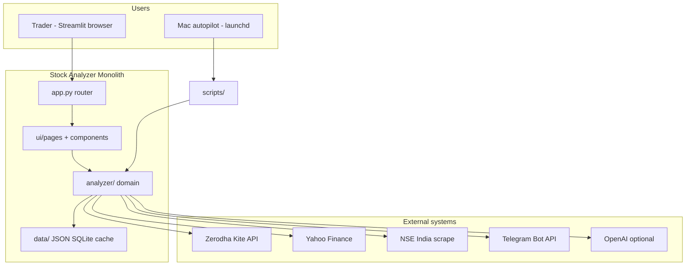
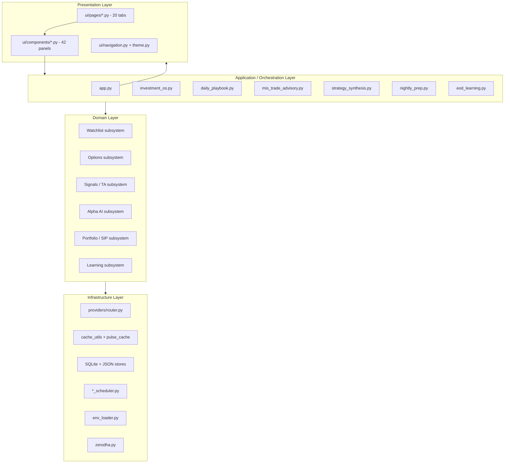
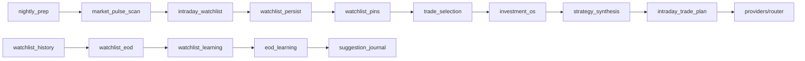

# 01 — Project Architecture

**Audit date:** 2026-07-15  
**Auditor role:** Principal Software Architect / Staff Engineer  
**Scope:** `/stock-analyzer` (main app), excluding implementation changes  
**Codebase scale:** ~163 `analyzer/` modules (~33k LOC), 68 `ui/` files, 19 `scripts/`, 76 `tests/`

---

## Executive summary

Stock Analyzer is a **single-process Streamlit monolith** targeting **Indian retail MIS/F&O traders**. It combines:

- Nightly equity/options watchlist preparation
- Intraday trade advisory and execution planning
- Portfolio sync via Zerodha Kite
- Institutional-style Alpha AI research reports
- Self-learning loops (journal → EOD scoring → threshold tuning)
- Mac-local autopilot (launchd + Python schedulers)
- Telegram notifications

The architecture is **modular in code** but **not modular in deployment**. Business logic predominantly lives in `analyzer/`; `ui/` is largely presentational. Two sibling apps (`interaction-investigator/`, `local-call-insights/`) are **not integrated** with the main product.

**Strengths:** Rich domain coverage, closed feedback loops, provider abstraction (Kite-first), extensive test surface.  
**Risks:** Flat 163-file package, 19+ import cycles, overlapping subsystems (journal, learning, advisory), no auth/multi-tenancy, Streamlit scaling ceiling.

---

## Overall architecture

### Architectural style

| Aspect | Current state |
|--------|---------------|
| Pattern | Layered monolith (UI → Domain → Data/Providers) |
| UI framework | Streamlit 1.37+ (session-state router, not native multipage) |
| Domain packaging | Flat `analyzer/` namespace (no bounded contexts) |
| Persistence | SQLite (`journal.db`), JSON files (`data/intraday/`), disk cache |
| External I/O | Yahoo, NSE scrape, Zerodha Kite REST/WebSocket, Telegram, optional OpenAI |
| Background work | In-process hooks on app rerun + macOS launchd scripts |
| Extension model | JSON-backed learned strategies (not plugin registry) |

### System context diagram



---

## Layer diagram



### Layer responsibilities

| Layer | Responsibility | Violations observed |
|-------|----------------|---------------------|
| **Presentation** | Render widgets, collect input, navigate | Minor orchestration in `unified_hub.py`, `kite_auth.py` (OAuth), `env_loader` writes from UI |
| **Application** | Compose daily workflows, verdicts, OS boot | Some logic duplicated across `daily_playbook`, `investment_os`, `mis_trade_advisory` |
| **Domain** | Scoring, plans, watchlists, research | `alpha_ai_report.py` mixes fetch + score + format; `zerodha.py` mixes auth + portfolio + LTP |
| **Infrastructure** | I/O, cache, persistence, schedulers | `watchlist_history.py` mixes persistence + EOD scoring + session dating |

---

## Folder responsibilities

| Path | Files | Responsibility |
|------|------:|----------------|
| `app.py` | 1 | Streamlit entry, sidebar, tab router, background lifecycle hooks |
| `cli.py` | 1 | Terminal CLI parallel to Streamlit |
| `analyzer/` | 163 | All domain logic, schedulers, persistence, integrations |
| `analyzer/providers/` | 4 | Kite-first / Yahoo-fallback data routing |
| `ui/pages/` | 20 | Tab-level renderers (thin shells) |
| `ui/components/` | 42 | Reusable panels (watchlist, cockpit, kite, autopilot) |
| `ui/navigation.py` | 1 | Cross-tab state machine |
| `ui/theme.py` | 1 | Nav registry, CSS tokens, color maps |
| `scripts/` | 19 | Cron/launchd entry points for autopilot |
| `tests/` | 76 | Unit + smoke tests (heavy mocking) |
| `data/` | runtime | Gitignored: prefs, pins, journal, cache, telegram DB |
| `interaction-investigator/` | standalone | Contact-center log RCA (separate Streamlit app) |
| `local-call-insights/` | standalone | CSV call analytics (separate app) |
| `.streamlit/` | config | Server config (XSRF/CORS disabled for local dev) |
| `.github/workflows/` | CI | unittest + lockfile install |

---

## Major subsystems

### 1. Investment OS (daily copilot)

**Purpose:** Seven-question decision pipeline for MIS trading.  
**Modules:** `investment_os.py`, `unified_hub.py`, `investment_os_ui.py`  
**Flow:** Cached pulse + pins + prefs + journal → Market → Sector → Stock → Strategy → Risk → Execution → Review

### 2. Watchlist & prep pipeline

**Purpose:** Nightly scan → top-N equity picks with E/S/T plans.  
**Modules:** `nightly_prep.py`, `intraday_pulse_source.py`, `intraday_watchlist.py`, `watchlist_persist.py`, `watchlist_pins.py`, `trade_selection.py`  
**Storage:** `data/intraday/pinned_watchlist.json`, `watchlist_history` SQLite tables

### 3. Market pulse & scanning

**Purpose:** Universe scan across intraday/short/long horizons.  
**Hub:** `market_pulse_scan.py` (685 LOC)  
**Cache:** `pulse_cache.py` → `data/cache/`

### 4. Options stack

**Purpose:** Expiry-day CE/PE selection, gates, live coach, sideways strategies.  
**Hubs:** `nse_options.py`, `options_expiry_watchlist.py`, `live_options_coach.py`, `sideways_options_advisor.py`  
**Learning:** `options_watchlist_learning.py`, `options_watchlist_history.py`

### 5. Strategy synthesis & advisory

**Purpose:** Multi-pillar weighted voting → trade verdict.  
**Hub:** `strategy_synthesis.py`  
**Consumers:** `mis_trade_advisory.py`, `investment_os.py`, `live_options_coach.py`

### 6. Learning & calibration loop

**Purpose:** Close the loop from suggestions → outcomes → auto-tuning.  
**Pipeline:** `suggestion_journal` → `suggestion_validator` → `suggestion_learning` → `threshold_tuning` / `watchlist_learning` / `options_watchlist_learning`  
**Orchestrator:** `eod_learning.py`

### 7. Alpha AI research

**Purpose:** Institutional-style single-stock reports (15 sections).  
**Hub:** `alpha_ai_report.py` (1008 LOC)  
**Optional LLM:** `alpha_ai_llm.py`

### 8. Portfolio & wealth

**Purpose:** Kite holdings sync, SIP planning, risk.  
**Modules:** `portfolio_store.py`, `portfolio_live.py`, `sip_planner.py`, `wealth_plan.py` (unwired)

### 9. Kite / Zerodha integration

**Purpose:** OAuth, live LTP, WebSocket ticker, holdings import.  
**Hub:** `zerodha.py` (567 LOC), `kite_stream.py`, `kite_status.py`, `providers/kite.py`

### 10. Autopilot & schedulers

**Purpose:** Unattended nightly prep, morning picks, EOD scoring on Mac.  
**Hub:** `autopilot_status.py`, `scripts/autopilot_daily.py`, 6+ `*_scheduler.py` modules

### 11. Notifications

**Purpose:** Telegram broadcasts, subscriptions, formatted alerts.  
**Modules:** `telegram_notify.py`, `telegram_subscriptions.py`, `suggestions_telegram.py`, `watchlist_telegram.py`

---

## Module relationships (dependency hubs)

Highest fan-out modules (change ripple risk):

| Module | Approx. downstream imports | Role |
|--------|---------------------------|------|
| `market_pulse_scan.py` | 22 | Scanning hub |
| `alpha_ai_report.py` | 22 | Research hub |
| `strategy_synthesis.py` | 21 | Signal fusion |
| `autopilot_status.py` | 15 | Scheduler aggregator |
| `mis_trade_advisory.py` | 14 | MIS gate |
| `intraday_watchlist.py` | 12+ | Prep builder |
| `watchlist_history.py` | 10+ | Persistence + EOD |

### Subsystem coupling diagram



---

## Data flow

### A. Nightly prep → morning trade

```text
1. TRIGGER: User button / autopilot / post_close_scan_scheduler
2. market_pulse_scan (or cached pulse)
3. intraday_watchlist.build_intraday_watchlist()
   └── reads watchlist_learning.get_watchlist_strategy() [learned gates]
4. watchlist_persist → sync_auto_top_picks → pinned_watchlist.json
5. save_watchlist_snapshot → journal.db
6. MORNING: trade_selection (user stars 1–2 symbols)
7. investment_os.build_investment_os() reads pins + pulse cache + prefs
8. strategy_synthesis (optional deep mode)
9. intraday_trade_plan → qty / max loss / E/S/T
10. User executes on Zerodha Kite (external)
11. trade_journal.json + intraday_journal (manual log)
```

### B. EOD learning loop

```text
1. TRIGGER: app background hook / scripts/validate_suggestions.py / post_close_scan
2. watchlist_eod.score_session_plan() — compare entry/stop/target vs close
3. watchlist_learning.run_watchlist_learning_cycle() — tune gates
4. suggestion_validator.validate_pending_suggestions()
5. suggestion_learning.build_learning_report()
6. threshold_tuning.apply_threshold_tuning()
7. mis_eod_summary → optional Telegram
8. NEXT DAY: intraday_watchlist uses updated strategy JSON
```

### C. Alpha AI report

```text
1. UI: alpha_ai.py → user enters symbol
2. alpha_ai_report.build_alpha_ai_report()
3. data.fetch_stock_data → fundamentals → combined.analyze
4. Enrichment: peers, DCF, news, macro, monte carlo, red flags
5. Optional: alpha_ai_llm narrative
6. Output: structured report dict → UI render / PDF export
```

### D. Live data path

```text
providers/router.fetch_intraday_bars()
  ├── kite_status.market_data_available() → providers/kite
  └── fallback → providers/yahoo → yfinance

kite_stream.start_kite_ticker_on_app_start()
  └── WebSocket LTP cache for Nifty 50 + indices
```

---

## Control flow

### Streamlit app boot

```text
load_app_env()
→ st.set_page_config + theme CSS
→ init_nav_state() + apply_pending_nav_tab()

IF nav_tab == "Home":
    render_app_navigation()
    render_unified_home()  # FAST PATH — return early
ELSE:
    handle_kite_redirect()
    hydrate_kite_access_token()
    start_kite_ticker_on_app_start()
    _hydrate_saved_portfolio()
    _maybe_* (7 background hooks)
    render_app_navigation()
    dispatch to ui/pages/*.py by tab name
```

### Navigation control

- State: `st.session_state["nav_tab"]`, `nav_group`
- Cross-tab jumps: `request_nav_tab("Track Record")` → `_nav_tab_request` → rerun
- Registry: `ui/theme.py` → `NAV_GROUPS` / `SIMPLE_NAV_GROUPS`
- Cloud trim: `SIMPLE_CLOUD_MODE=1` → 4 tabs only

### Background hooks (non-Home only)

| Hook | Guard | Action |
|------|-------|--------|
| `_maybe_validate_suggestions_eod` | market closed, once/session | `eod_learning.run_eod_learning_cycle()` |
| `_maybe_score_watchlist_eod` | market closed, once/session | `watchlist_learning` + prune + MIS summary |
| `_maybe_post_close_scan` | schedule window | `post_close_scan_scheduler` |
| `_maybe_watchlist_live_alerts` | market open | LTP vs plan alerts |
| `_maybe_prep_morning_nag` | pre-market | Telegram nag |
| `_maybe_session_reminders` | phase-based | session nudges |
| `_maybe_autopilot_health_alert` | always | failure detection |

### Script / autopilot control (parallel path)

```text
launchd (macOS) → scripts/autopilot_daily.py
  → nightly_prep_scheduler
  → morning_suggestions_scheduler
  → trade_selection_scheduler
  → post_close_scan_scheduler
  → validate_suggestions (EOD)
```

---

## Duplicate functionality map

| Concern | Overlapping modules | Recommendation |
|---------|---------------------|----------------|
| **Journal** | `suggestion_journal`, `trade_journal`, `intraday_journal` | Merge under `journal/` package with adapters |
| **Learning** | `suggestion_learning`, `watchlist_learning`, `options_watchlist_learning`, `threshold_tuning`, `confidence_calibration` | Unified `LearningService` facade |
| **Daily guidance** | `daily_advisor`, `morning_briefing`, `session_advisory`, `mis_trade_advisory`, `daily_playbook`, `investment_os` | `investment_os` becomes canonical; others become data providers |
| **Options advisors** | `options_signal`, `sideways_options_advisor`, `live_options_coach`, `options_entry_gate` | Extract shared gate; register strategies |
| **Watchlist builders** | `watchlist.py`, `intraday_watchlist.py`, `options_expiry_watchlist.py` | Deprecate `watchlist.py`; keep two tracks (equity/options) |
| **Telegram formatters** | `suggestions_telegram`, `watchlist_telegram` | Single `telegram_formatters` module |

---

## Dead / underused code

| Module | Status |
|--------|--------|
| `wealth_plan.py` | **Dead in production** — tests only |
| `morning_briefing.py` | CLI/scripts only — no Streamlit tab |
| `strategy_research.py` | Manual script only |
| `kite_health.py` | `scripts/kite_auth.py` diagnostic only |
| Alpha submodules (`dcf_model`, `etf_analyzer`, etc.) | Only via `alpha_ai_report` — not independently reusable |

---

## Plugin architecture opportunities

| Extension point | Today | Ideal |
|-----------------|-------|-------|
| Equity strategies | JSON gates in `watchlist_learning` | `StrategyPlugin` registry with backtest metadata |
| Synthesis pillars | Hardcoded in `strategy_synthesis.py` | Registered pillar providers |
| Scorers / features | `suggestion_features.DEFAULT_FEATURE_WEIGHTS` | Feature plugin manifest |
| Data providers | `providers/router.py` if/else | Provider interface + DI |
| Schedulers | One file per job | Scheduler registry in `autopilot_status` |
| Telegram templates | Multiple format modules | Template registry |

---

## Performance bottlenecks

| Bottleneck | Location | Impact |
|------------|----------|--------|
| Full app rerun on non-Home tabs | `app.py` | Kite hydrate + 7 hooks every interaction |
| Live Options Coach 5s fragment | `live_options_advisor.py` | Aggressive polling |
| Cold `market_pulse_scan` | Market Pulse tab | Multi-ticker fetch |
| `synthesize_equity` deep mode | `investment_os` | Network-heavy on Home |
| `alpha_ai_report` | Alpha AI tab | 15-section pipeline |
| NSE scrape fragility | `nse_options.py`, `nse_session.py` | 403/rate limits on cloud |
| Duplicate LTP fetches | WebSocket + REST fragments | Redundant Kite calls |

---

## Security surface (architecture-level)

| Area | Risk |
|------|------|
| No Streamlit authentication | Single-user assumption; unsafe multi-tenant deploy |
| `.env` plaintext writes from UI | `env_loader.save_env_key()` |
| Kite token in session state | XSS/session leak vector if hosted publicly |
| `enableXsrfProtection = false` | CSRF on hosted instances |
| SQLite / JSON on disk | No encryption at rest |
| NSE scraping | ToS/legal exposure vs licensed data |
| Telegram subscriber DB | Chat IDs stored locally |

---

## SOLID violations (systemic)

| Principle | Violation |
|-----------|-----------|
| **SRP** | `zerodha.py`, `alpha_ai_report.py`, `watchlist_history.py`, `market_pulse_scan.py` — multiple reasons to change |
| **OCP** | New strategies require editing `strategy_synthesis.py` / `intraday_watchlist.py` |
| **LSP** | No provider interface — Kite/Yahoo not interchangeable types |
| **ISP** | UI imports large analyzer modules for single functions |
| **DIP** | Direct `yfinance`, `kiteconnect`, file path imports throughout |

---

## Circular dependencies (documented)

19 import cycles detected; mitigated by lazy imports. Critical cycles:

1. `kite_status` ↔ `kite_options_chain` ↔ `nse_options`
2. `candle_narrative` ↔ `options_signal`
3. `watchlist_history` ↔ `watchlist_eod` ↔ `watchlist_learning` ↔ `intraday_watchlist`
4. `trade_selection` ↔ `watchlist_pins` ↔ `watchlist_history`
5. `affordable_invest` → `market_pulse_scan` → options chain → `affordable_invest`

---

## Technology stack

| Component | Technology |
|-----------|------------|
| Language | Python 3.12 (CI) |
| UI | Streamlit ≥1.37 |
| Data | pandas, numpy |
| Charts | Plotly |
| Market data | yfinance, Kite Connect, NSE HTTP |
| Persistence | SQLite, JSON files |
| PDF | fpdf2 |
| LLM | OpenAI API (optional) |
| CI | GitHub Actions + requirements-lock.txt |

---

## Related documents

- [02_Module_Inventory.md](./02_Module_Inventory.md) — per-module catalog
- [03_Technical_Debt.md](./03_Technical_Debt.md) — ranked issues
- [04_Improvement_Plan.md](./04_Improvement_Plan.md) — prioritized roadmap
