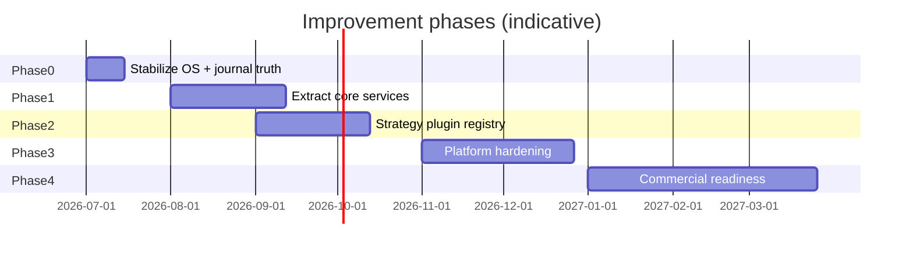

# 04 — Improvement Plan

**Audit date:** 2026-07-15  
**Principle:** Document only — no implementation in this audit.  
**North star:** Investment Operating System validated on real Zerodha P&L before commercial SaaS.

---

## Roadmap overview



| Phase | Timeline | Theme | Success metric |
|-------|----------|-------|----------------|
| **0** | Weeks 1–2 | Truth & clarity | Every trade tagged; Zerodha P&L required for Review AI |
| **1** | Weeks 3–8 | Service extraction | 5 facades; 50% cycle reduction |
| **2** | Weeks 9–14 | Strategy plugins | 10 registered strategies; synthesis uses registry |
| **3** | Weeks 15–22 | Platform | Auth, observability, licensed data eval |
| **4** | Weeks 23+ | Commercial | Paid beta with 10 dogfood users |

---

## Phase 0 — Stabilize the Investment OS (P0)

**Goal:** Make the OS trustworthy for personal trading before any refactor.

| # | Initiative | Addresses debt | Actions | Do not |
|---|------------|----------------|---------|--------|
| 0.1 | **Journal truth protocol** | C5, H3 | Require Zerodha P&L on Log; tag which OS module failed; block Review AI insights until P&L logged | Add new indicators |
| 0.2 | **Canonical daily driver** | H4 | Declare `investment_os` sole verdict source; deprecate `daily_playbook` UI panel | Rewrite synthesis |
| 0.3 | **Wire or remove `wealth_plan`** | H9 | Surface SIP/₹10Cr on SIP tab OR delete module | Leave dead code |
| 0.4 | **Docs sync** | L6 | Update README/GETTING_STARTED for Home-first OS flow | — |
| 0.5 | **Reduce options poll** | H10 | Change Live Options Coach fragment 5s → 15–30s | Feature additions |

**Exit criteria:** 30 sessions logged with module tags; coach P&L never shown without "unverified" label.

---

## Phase 1 — Extract core services (P1)

**Goal:** Create testable boundaries without changing user-visible behavior.

### 1A. Package structure (no logic change)

```
analyzer/
├── core/           # session, markets, prefs
├── data/           # providers, cache, fetch
├── domain/
│   ├── watchlist/
│   ├── options/
│   ├── synthesis/
│   ├── alpha/
│   └── portfolio/
├── learning/
├── journal/
├── notifications/
└── schedulers/
```

| # | Initiative | Priority | Effort | Risk |
|---|------------|----------|--------|------|
| 1.1 | Create `journal/` facade | P1 | M | Low — unify 3 stores behind API |
| 1.2 | Create `learning/` facade | P1 | M | Low — single `run_eod_learning()` entry |
| 1.3 | Extract `MarketDataService` from `providers/router` | P1 | M | Medium — 40+ call sites |
| 1.4 | Split `zerodha.py` → auth / portfolio / marketdata | P1 | L | Medium — OAuth regression test |
| 1.5 | Move `_maybe_*` hooks out of `app.py` → `schedulers/app_hooks.py` | P2 | S | Low |
| 1.6 | Thin `intraday_watchlist` UI components | P2 | M | Low — move orchestration to analyzer |

**Exit criteria:** `journal` and `learning` facades used by OS, Track Record, and EOD script; zero new import cycles.

---

## Phase 2 — Strategy plugin registry (P2)

**Goal:** Open/closed principle for strategies — core of commercial differentiation.

### Target design

```python
# Conceptual — not implemented
class StrategyPlugin(Protocol):
    name: str
    asset_class: Literal["equity", "options"]
    def evaluate(self, ctx: MarketContext) -> StrategyVote: ...

REGISTRY: dict[str, StrategyPlugin]  # populated at import or YAML
```

| # | Initiative | Priority | Effort |
|---|------------|----------|--------|
| 2.1 | Define `StrategyPlugin` protocol + `StrategyVote` types | P1 | S |
| 2.2 | Extract ORB, VWAP, breakdown, sideways from hardcoded paths | P1 | L |
| 2.3 | Refactor `strategy_synthesis` to iterate registry | P1 | M |
| 2.4 | YAML manifest: name, weight, enabled, min_confidence | P2 | M |
| 2.5 | Wire `watchlist_learning` to disable underperforming plugins | P2 | M |
| 2.6 | Backtest CI gate per plugin | P3 | L |

**First 10 plugins (from existing code):**

1. ORB breakout (`opening_range_confirm`)
2. VWAP reclaim (`intraday_signals`)
3. Trend follow (`market_regime` + MTF)
4. Breakdown short (`intraday_watchlist` bearish path)
5. Sideways iron condor (`sideways_options_advisor` — split)
6. CE momentum (`options_expiry_watchlist`)
7. PE hedge (`options_reversal_alerts`)
8. Sector tailwind (`watchlist_learning` flag)
9. Gap fade (`gift_nifty`)
10. Delivery quality filter (`delivery_quality`)

**Exit criteria:** Adding plugin #11 requires zero edits to `strategy_synthesis.py`.

---

## Phase 3 — Platform hardening (P3)

**Goal:** Safe deploy beyond personal Mac.

| # | Initiative | Addresses | Priority |
|---|------------|-----------|----------|
| 3.1 | Streamlit auth (OAuth/Google) or migrate API to FastAPI + thin UI | C1 | P1 |
| 3.2 | Secrets → OS keychain / Streamlit secrets only; remove UI `.env` write | C2 | P1 |
| 3.3 | Re-enable XSRF/CORS for hosted; separate local config | C3 | P1 |
| 3.4 | Evaluate licensed data (TrueData/GDFL/NSE NOW) — POC | C4 | P1 |
| 3.5 | Observability: structlog JSON + health route + Sentry | M14 | P2 |
| 3.6 | SQLite → Postgres for journal/subscribers (optional) | H7 | P3 |
| 3.7 | Docker compose: app + cron sidecar | M8 | P2 |
| 3.8 | Schema migrations (Alembic) | H7 | P2 |

**Exit criteria:** App runs on Fly.io with auth; no plaintext tokens in repo or UI writes.

---

## Phase 4 — Commercial readiness (P4)

**Goal:** Paid beta only after personal OS validation.

| # | Initiative | Priority | Dependency |
|---|------------|----------|------------|
| 4.1 | Multi-user prefs + journal isolation | P1 | Phase 3 auth |
| 4.2 | Billing (Razorpay/Stripe India) | P2 | 4.1 |
| 4.3 | Explainability API: "why this stock" JSON endpoint | P1 | Phase 2 plugins |
| 4.4 | 90-day track record export (marketing proof) | P1 | Phase 0 journal |
| 4.5 | Onboarding funnel: beginner → equity-only → one trade | P2 | OS stable |
| 4.6 | Strategy marketplace (internal only first) | P3 | Phase 2 registry |
| 4.7 | Mobile-responsive Home (already started) | P2 | — |

**Exit criteria:** 10 external beta users; NPS survey; positive unit economics on ₹299/mo tier.

---

## Quick wins (can start anytime, low risk)

| Initiative | Effort | Impact |
|------------|--------|--------|
| Deprecate Batch Scanner tab → redirect to Screener | S | Removes M4 |
| Merge `risk.py` into `market_risk.py` | S | Removes L2 |
| Add `html.escape` consistently in UI HTML builders | S | Reduces M13 |
| `st.cache_resource` for Kite client singleton | S | Reduces P1 |
| Consolidate `install_*.sh` into `install_autopilot.sh` | S | Reduces L9 |
| Add `pyproject.toml` with ruff + mypy config | S | Reduces L10 |

---

## Refactor sequencing (dependency order)

```text
Phase 0 (truth)
    ↓
journal facade (1.1)
    ↓
learning facade (1.2)
    ↓
break watchlist cycle (1.4 + split watchlist_history)
    ↓
MarketDataService (1.3)
    ↓
StrategyPlugin registry (2.x)
    ↓
split god modules (alpha_ai_report, market_pulse_scan)
    ↓
auth + secrets (3.x)
    ↓
commercial (4.x)
```

**Do not start Phase 3 auth before Phase 0 journal truth — otherwise you scale untrustworthy advice.**

---

## Testing strategy per phase

| Phase | Test focus |
|-------|------------|
| 0 | E2E: scan → star → OS verdict → log P&L → Review AI |
| 1 | Contract tests for facades; import-cycle CI check |
| 2 | Per-plugin unit tests + synthesis integration |
| 3 | Auth penetration smoke; secrets scan in CI |
| 4 | Load test 50 concurrent users on pulse cache |

**Add CI job:** `import-linter` or custom script to fail on new cycles.

---

## Metrics to track

| Metric | Baseline (today) | Phase 0 target | Phase 4 target |
|--------|------------------|----------------|----------------|
| Import cycles | 19 | 15 | <5 |
| God modules (>500 LOC) | 10 | 10 | 3 |
| Journal stores | 3 | 1 facade | 1 DB |
| Home load time (cold) | ~2–5s | <2s | <1s |
| Modules with zero prod use | 1+ | 0 | 0 |
| Test count | 76 files | 80 | 120 |
| Dogfood sessions logged | ? | 30 | 90 |

---

## What NOT to do (explicit anti-patterns)

| Anti-pattern | Why |
|--------------|-----|
| React frontend rewrite before Phase 2 | Loses Streamlit velocity; no plugin benefit yet |
| Add 50 indicators before journal truth | Features without accountability |
| ML/XGBoost before 90 logged sessions | No training data; overfits coach scores |
| Multi-user before auth hardening | Critical security debt |
| Licensed data before product-market fit | ₹50k+/yr cost; scrape works for solo user |
| Merge `interaction-investigator` into main app | Unrelated product boundary |

---

## Resource estimate (solo developer)

| Phase | Calendar | Focus % |
|-------|----------|---------|
| 0 | 2 weeks | 80% product truth |
| 1 | 6 weeks | 60% refactor / 40% trading |
| 2 | 6 weeks | 50/50 |
| 3 | 8 weeks | 70% infra |
| 4 | 12+ weeks | 40% growth / 60% engineering |

---

## Decision log (recommended)

| Decision | Recommendation | Rationale |
|----------|----------------|-----------|
| Keep Streamlit vs FastAPI | Streamlit through Phase 2; FastAPI for Phase 4 API | Speed now; API for billing |
| Keep SQLite vs Postgres | SQLite through Phase 2; Postgres Phase 3+ | Solo user scale |
| Equity-only default | Yes for beginner mode | Past options blow-up |
| Single canonical Home | Yes — Investment OS | User's stated vision |
| Deprecate `daily_advisor` tab | Merge into Home/SIP | Overlap with OS |
| Licensed NSE data | POC in Phase 3 only | Cost gate |

---

## Related documents

- [01_Project_Architecture.md](./01_Project_Architecture.md)
- [02_Module_Inventory.md](./02_Module_Inventory.md)
- [03_Technical_Debt.md](./03_Technical_Debt.md)
- [UPGRADE.md](../../UPGRADE.md) — existing tier roadmap (align Tier 3–4 with this plan)

---

## Immediate next 5 actions (when implementation resumes)

1. **Journal facade design doc** — schema for unified trade record with OS module tags  
2. **Tag Review AI** — which of 7 modules failed on losing days  
3. **Import-cycle CI check** — fail build on new cycles  
4. **Deprecate `daily_playbook` UI** — link to Home OS  
5. **Wire `wealth_plan` to SIP tab** or remove module  

*These are listed for continuity only — not implemented in this audit.*
