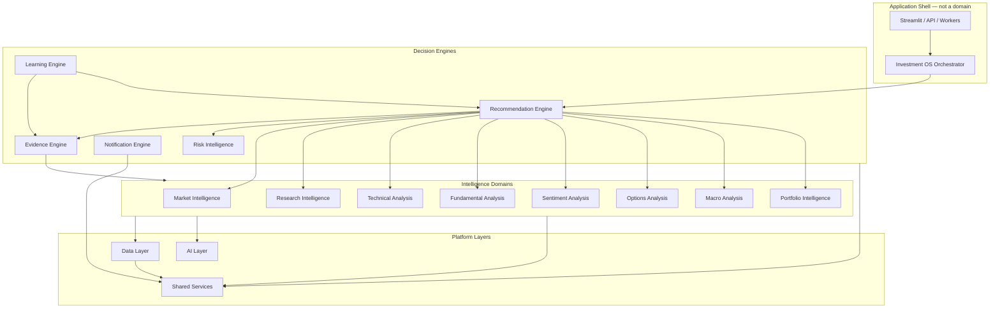
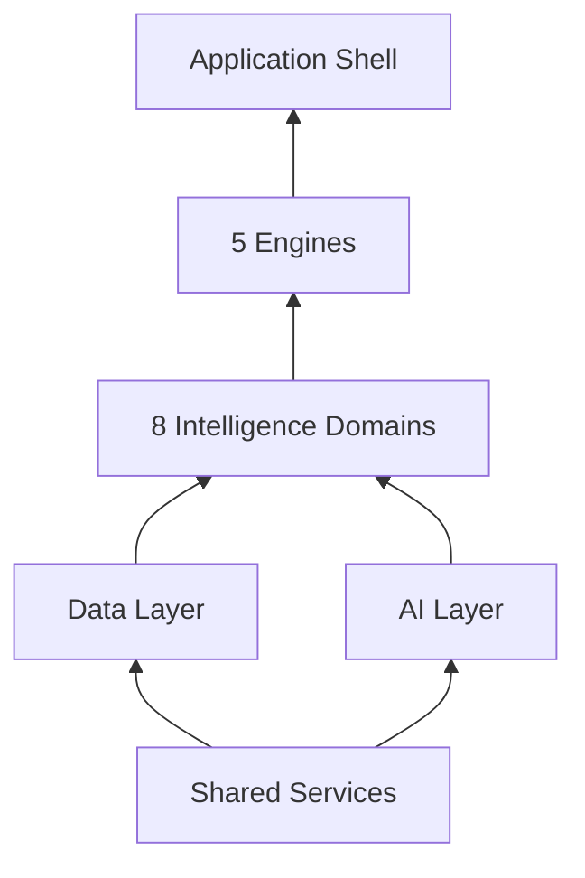

# 05 — Target Architecture: Institutional-Grade AI Investment Operating System

**Status:** Proposed (documentation only — no code changes)  
**Based on:** Audit docs 01–04 (2026-07-15)  
**Supersedes:** Flat `analyzer/` monolith over time via phased migration  
**North star:** Seven-question Investment OS validated on broker P&L before commercial scale

---

## 1. Executive summary

The current Stock Analyzer is a **capable domain monolith** with the right ingredients (pulse scan, synthesis, learning loop, Alpha AI, Kite integration) but the wrong **packaging** for institutional grade: flat modules, cyclic imports, overlapping journals/advisors, and UI-coupled orchestration.

This document defines a **modular target architecture** organized into **16 bounded domains**. Each domain owns a single class of investment intelligence, exposes explicit **ports (interfaces)** and **public APIs**, and depends only on domains below it in the dependency hierarchy.

### Design principles

| Principle | Application |
|-----------|-------------|
| **One question per domain** | Each domain answers one investor decision class |
| **Evidence before recommendation** | `Evidence Engine` materializes facts; `Recommendation Engine` never invents data |
| **Broker truth wins** | Learning Engine ingests verified P&L, not coach proxies alone |
| **Plugin strategies, not god files** | TA/Options/Macro produce votes; Recommendation aggregates |
| **Dependency rule** | Domains depend inward: Intelligence → Engines → Data/AI → Shared |
| **Deployable units** | Each domain is a Python package testable in isolation |
| **Institutional explainability** | Every score has traceable evidence IDs and assumption labels |

### Target system diagram



---

## 2. Domain dependency hierarchy

**Allowed dependency direction** (higher may call lower; never reverse):

```text
Layer 4: Application Shell (app.py, ui/, scripts/)
Layer 3: Recommendation Engine, Risk Intelligence, Learning Engine, Notification Engine, Evidence Engine
Layer 2: Market, Research, TA, FA, Sentiment, Options, Macro, Portfolio Intelligence
Layer 1: AI Layer, Data Layer
Layer 0: Shared Services
```



---

## 3. Repository folder structure (target)

```text
stock-analyzer/
├── docs/architecture/          # Architecture docs (this file)
├── apps/
│   ├── streamlit/              # Current UI migration target
│   │   ├── app.py
│   │   ├── pages/
│   │   └── components/
│   ├── api/                    # Future FastAPI (Phase 4)
│   │   └── main.py
│   └── workers/                # Schedulers / autopilot
│       └── jobs/
├── domains/
│   ├── market_intelligence/
│   ├── research_intelligence/
│   ├── technical_analysis/
│   ├── fundamental_analysis/
│   ├── sentiment_analysis/
│   ├── options_analysis/
│   ├── macro_analysis/
│   ├── portfolio_intelligence/
│   ├── risk_intelligence/
│   ├── evidence_engine/
│   ├── recommendation_engine/
│   ├── learning_engine/
│   └── notification_engine/
├── platform/
│   ├── data_layer/
│   └── ai_layer/
├── shared/
│   ├── core/                   # types, errors, clock, market session
│   ├── config/                 # env, feature flags
│   ├── persistence/            # repository abstractions
│   ├── security/               # secrets, auth (Phase 3)
│   └── observability/          # logging, metrics, tracing
├── contracts/                  # Shared Protocols / DTOs across domains
│   ├── types.py
│   ├── ports.py
│   └── events.py
├── tests/
│   ├── domains/
│   ├── platform/
│   └── integration/
└── analyzer/                   # LEGACY — shrink via strangler migration
```

**Packaging rule:** Each `domains/<name>/` contains:

```text
domains/<name>/
├── __init__.py          # Public API exports only
├── api.py               # Facade (public functions)
├── models.py            # Domain DTOs
├── ports.py             # Interfaces (Protocols) this domain exposes
├── services/            # Internal implementation
├── adapters/            # Optional: inbound adapters
└── tests/
```

---

## 4. Investment OS mapping to domains

The seven OS modules map to target domains as follows:

| OS module | Question | Primary domains | Engine |
|-----------|----------|---------------|--------|
| Market AI | Regime? | Market Intelligence, Macro Analysis | Recommendation |
| Sector AI | Strongest sectors? | Market Intelligence, Macro Analysis | Recommendation |
| Stock AI | Best risk/reward? | TA, FA, Evidence Engine | Recommendation |
| Strategy AI | Which strategy today? | TA, Options Analysis, Recommendation (plugins) | Recommendation |
| Risk AI | How much to buy? | Risk Intelligence | Risk |
| Execution AI | Entry/stop/target? | TA, Risk Intelligence | Recommendation |
| Review AI | What did I learn? | Learning Engine, Evidence Engine | Learning |

---

## 5. Domain specifications

---

### 5.1 Market Intelligence

#### Responsibilities

- Classify **market regime** (trending bull/bear, range-bound, unknown)
- Rank **sector strength** (sector index performance, rotation cues)
- Produce **session context** (open/closed, phase, holiday calendar)
- Maintain **universe snapshots** (Nifty 50 pulse, index bias)
- Answer: *"What is the current market environment?"*

#### Interfaces (ports)

```python
# contracts/ports.py — conceptual

class MarketRegimePort(Protocol):
    def detect_regime(self, index: str, *, as_of: datetime) -> MarketRegimeSnapshot: ...

class SectorRankingPort(Protocol):
    def rank_sectors(self, *, as_of: datetime) -> list[SectorRank]: ...

class SessionPort(Protocol):
    def session_status(self, *, as_of: datetime) -> SessionSnapshot: ...

class UniversePulsePort(Protocol):
    def pulse_snapshot(self, market: str, period: str, *, use_cache: bool) -> PulseSnapshot: ...
```

#### Dependencies

| Depends on | Why |
|------------|-----|
| Data Layer | Index OHLCV, sector index quotes |
| Macro Analysis | VIX, FII/DII context for regime |
| Shared Services | Clock (IST), cache, market calendar |

#### Public APIs

| API | Input | Output |
|-----|-------|--------|
| `get_market_regime(index="^NSEI")` | index, as_of | `MarketRegimeSnapshot` |
| `get_sector_rankings()` | as_of | `list[SectorRank]` |
| `get_session_status()` | as_of | `SessionSnapshot` |
| `get_universe_pulse(market, period)` | market, period | `PulseSnapshot` |
| `get_market_bias()` | — | `BULLISH \| BEARISH \| NEUTRAL` |

#### Folder structure

```text
domains/market_intelligence/
├── api.py                    # Public facade
├── models.py                 # MarketRegimeSnapshot, SectorRank, PulseSnapshot
├── ports.py                  # Outbound ports to Data Layer
├── services/
│   ├── regime_detector.py    # ← market_regime.py
│   ├── sector_ranker.py      # ← india_macro sectors + watchlist sector
│   ├── session_service.py    # ← market_session.py, session_phase.py
│   └── pulse_aggregator.py   # ← market_pulse_scan.py (scan portion)
└── tests/
```

#### Legacy migration map

`market_regime.py`, `market_session.py`, `session_phase.py`, `nse_holidays.py`, `market_pulse.py`, `market_pulse_scan.py` (partial), `intraday_pulse_source.py`, `pulse_cache.py` (adapter)

---

### 5.2 Research Intelligence

#### Responsibilities

- Generate **institutional research artifacts** (Alpha AI reports)
- Single-stock **investment thesis** synthesis (business, moat, valuation, scenarios)
- **Compare** and **screener** orchestration across universe
- Peer, DCF, ETF, earnings context
- Answer: *"Is this a good business at this price for my horizon?"*

#### Interfaces

```python
class ResearchReportPort(Protocol):
    def build_report(self, symbol: str, *, horizon: str, portfolio: PortfolioContext | None) -> ResearchReport: ...

class ComparePort(Protocol):
    def compare(self, symbols: list[str]) -> CompareReport: ...

class ScreenerPort(Protocol):
    def screen(self, criteria: ScreenerCriteria) -> ScreenerResult: ...
```

#### Dependencies

| Depends on | Why |
|------------|-----|
| Fundamental Analysis | Business quality, financials |
| Technical Analysis | Entry timing section |
| Sentiment Analysis | News section |
| Macro Analysis | Macro overlay |
| Portfolio Intelligence | Holdings-aware mode |
| Evidence Engine | FACT/ASSUMPTION labels |
| AI Layer | Optional narrative generation |
| Data Layer | OHLCV, fundamentals |

#### Public APIs

| API | Input | Output |
|-----|-------|--------|
| `build_research_report(symbol, horizon)` | symbol, options | `ResearchReport` |
| `compare_stocks(symbols)` | list[str] | `CompareReport` |
| `run_screener(criteria)` | `ScreenerCriteria` | `ScreenerResult` |
| `export_report_pdf(report)` | report | `bytes` |

#### Folder structure

```text
domains/research_intelligence/
├── api.py
├── models.py                 # ResearchReport, CompareReport, Section
├── services/
│   ├── report_orchestrator.py   # ← alpha_ai_report.py (split)
│   ├── sections/                # One file per report section
│   ├── compare_service.py       # ← compare.py
│   └── screener_service.py      # ← screener.py
├── adapters/
│   └── pdf_export.py            # ← alpha_ai_export.py
└── tests/
```

#### Legacy migration map

`alpha_ai_report.py`, `alpha_ai_export.py`, `alpha_ai_prompts.py`, `compare.py`, `screener.py`, `advisor.py`, `daily_advisor.py` (research portions), `peer_comparison.py`, `dcf_model.py`, `etf_analyzer.py`, `alpha_monte_carlo.py`, `alpha_red_flags.py`, `alpha_portfolio_mode.py`

---

### 5.3 Technical Analysis

#### Responsibilities

- Compute **indicators** (RSI, MACD, ADX, ATR, MAs, pivots)
- Detect **patterns** (candlesticks, opening range, horizons)
- **Multi-timeframe** consensus
- Produce **intraday narratives** and MIS signal rules
- Register **strategy plugins** (ORB, VWAP, breakout, fade)
- Answer: *"What does price action say?"*

#### Interfaces

```python
class IndicatorPort(Protocol):
    def enrich(self, ohlcv: OHLCV) -> OHLCV: ...

class SignalPort(Protocol):
    def signals(self, ohlcv: OHLCV, context: TAContext) -> SignalSet: ...

class StrategyPluginPort(Protocol):
    name: str
    def evaluate(self, ctx: StrategyContext) -> StrategyVote: ...

class StrategyRegistryPort(Protocol):
    def register(self, plugin: StrategyPluginPort) -> None: ...
    def evaluate_all(self, ctx: StrategyContext) -> list[StrategyVote]: ...
```

#### Dependencies

| Depends on | Why |
|------------|-----|
| Data Layer | OHLCV, intraday bars |
| Shared Services | Varsity constants, cache |
| Market Intelligence | Regime for strategy selection |

**Must NOT depend on:** Options Analysis (break `candle_narrative` ↔ `options_signal` cycle)

#### Public APIs

| API | Input | Output |
|-----|-------|--------|
| `compute_indicators(ohlcv)` | DataFrame | enriched DataFrame |
| `generate_signals(symbol, timeframe)` | symbol, tf | `SignalSet` |
| `analyze_mtf(symbol)` | symbol | `MTFReport` |
| `evaluate_strategies(ctx)` | `StrategyContext` | `list[StrategyVote]` |
| `build_trade_plan(action, levels, capital)` | levels | `TradePlan` |
| `confirm_opening_range(symbol)` | symbol | `ORConfirmResult` |

#### Folder structure

```text
domains/technical_analysis/
├── api.py
├── models.py                 # SignalSet, TradePlan, StrategyVote, MTFReport
├── plugins/
│   ├── registry.py
│   ├── orb_breakout.py
│   ├── vwap_reclaim.py
│   ├── trend_follow.py
│   └── range_fade.py
├── services/
│   ├── indicators.py         # ← indicators.py, ta.py
│   ├── signals.py            # ← signals.py, intraday_signals.py
│   ├── patterns.py           # ← candlesticks.py
│   ├── narrative.py          # ← candle_narrative.py (decoupled)
│   ├── horizons.py           # ← chart_horizon.py, multi_timeframe.py
│   ├── trade_plan.py         # ← intraday_trade_plan.py, trade_ladder.py
│   └── opening_range.py      # ← opening_range_confirm.py
└── tests/
```

#### Legacy migration map

`indicators.py`, `ta.py`, `signals.py`, `intraday_signals.py`, `candlesticks.py`, `candle_narrative.py`, `chart_horizon.py`, `multi_timeframe.py`, `opening_range_confirm.py`, `intraday_trade_plan.py`, `trade_ladder.py`, `varsity_knowledge.py`, `backtest.py`

---

### 5.4 Fundamental Analysis

#### Responsibilities

- Extract and score **financial metrics** (ROE, margins, leverage, growth)
- **Valuation** models (multiples, DCF inputs, margin of safety)
- **Business quality** heuristics (moat proxies)
- Earnings calendar and event risk
- Answer: *"Is the business healthy and fairly valued?"*

#### Interfaces

```python
class FundamentalsPort(Protocol):
    def analyze(self, symbol: str) -> FundamentalProfile: ...

class ValuationPort(Protocol):
    def value(self, symbol: str, profile: FundamentalProfile) -> ValuationResult: ...

class EarningsPort(Protocol):
    def upcoming_events(self, symbol: str) -> list[EarningsEvent]: ...
```

#### Dependencies

| Depends on | Why |
|------------|-----|
| Data Layer | Financial statements, price for multiples |
| Shared Services | Cache |

#### Public APIs

| API | Input | Output |
|-----|-------|--------|
| `get_fundamental_profile(symbol)` | symbol | `FundamentalProfile` |
| `score_fundamentals(profile)` | profile | `FundamentalScore` |
| `estimate_valuation(symbol)` | symbol | `ValuationResult` |
| `get_earnings_calendar(symbol)` | symbol | `list[EarningsEvent]` |

#### Folder structure

```text
domains/fundamental_analysis/
├── api.py
├── models.py
├── services/
│   ├── fundamentals.py       # ← fundamentals.py
│   ├── valuation.py            # ← dcf_model.py (moved from research)
│   ├── earnings.py             # ← earnings_calendar.py
│   └── quality_scoring.py
└── tests/
```

#### Legacy migration map

`fundamentals.py`, `dcf_model.py`, `earnings_calendar.py`, portions of `combined.py`, `market_risk.py` (fundamental slice)

---

### 5.5 Sentiment Analysis

#### Responsibilities

- Aggregate **news headlines** and classify fact vs rumor
- **Sentiment scoring** (bullish/bearish/neutral) per symbol and market
- Social/flow proxies where licensed data allows (future)
- Delivery quality and participation metrics as sentiment proxies
- Answer: *"What is the crowd saying — and is it credible?"*

#### Interfaces

```python
class NewsPort(Protocol):
    def fetch_headlines(self, symbol: str, *, limit: int) -> list[NewsItem]: ...

class SentimentPort(Protocol):
    def score(self, symbol: str, news: list[NewsItem]) -> SentimentSnapshot: ...
```

#### Dependencies

| Depends on | Why |
|------------|-----|
| Data Layer | News feeds, delivery data |
| AI Layer | Optional LLM summarization/classification |

#### Public APIs

| API | Input | Output |
|-----|-------|--------|
| `get_news(symbol, limit=10)` | symbol | `list[NewsItem]` |
| `get_sentiment(symbol)` | symbol | `SentimentSnapshot` |
| `get_delivery_quality(symbol)` | symbol | `DeliverySnapshot` |

#### Folder structure

```text
domains/sentiment_analysis/
├── api.py
├── models.py
├── services/
│   ├── news_feed.py          # ← news_feed.py
│   ├── sentiment_scorer.py
│   └── delivery_proxy.py     # ← delivery_quality.py
└── tests/
```

#### Legacy migration map

`news_feed.py`, `delivery_quality.py`; future: social APIs

---

### 5.6 Options Analysis

#### Responsibilities

- Fetch and normalize **options chains** (NSE + Kite NFO)
- Compute **IV, OI, PCR, max pain**, affordability filters
- **Entry gates** (timing, opening range, sideways blocks)
- Expiry watchlist CE/PE selection; live coach state
- Strategy plugins: directional, sideways, hedge
- Answer: *"What is the options market implying — and which leg?"*

#### Interfaces

```python
class OptionsChainPort(Protocol):
    def fetch_chain(self, underlying: str, expiry: date | None) -> OptionsChain: ...

class OptionsAnalyticsPort(Protocol):
    def analyze(self, chain: OptionsChain) -> ChainAnalytics: ...

class OptionsStrategyPort(Protocol):
    def advise(self, ctx: OptionsContext) -> OptionsAdvice: ...

class OptionsGatePort(Protocol):
    def assess_entry(self, leg: OptionLeg, *, as_of: datetime) -> GateResult: ...
```

#### Dependencies

| Depends on | Why |
|------------|-----|
| Data Layer | NSE/Kite chain fetch |
| Technical Analysis | Underlying trend, OR confirm (one-way) |
| Market Intelligence | Regime, VIX |
| Macro Analysis | India VIX |

**Must NOT depend on:** `candle_narrative` circular paths

#### Public APIs

| API | Input | Output |
|-----|-------|--------|
| `get_options_chain(index, expiry)` | underlying | `OptionsChain` |
| `analyze_chain(chain)` | chain | `ChainAnalytics` |
| `build_expiry_watchlist()` | prefs | `OptionsWatchlist` |
| `assess_entry_gate(leg)` | leg | `GateResult` |
| `get_live_coach_state(index)` | index | `CoachState` |
| `filter_affordable_legs(max_lot_inr)` | budget | `list[OptionLeg]` |

#### Folder structure

```text
domains/options_analysis/
├── api.py
├── models.py
├── plugins/
│   ├── directional_ce_pe.py
│   ├── sideways_range.py     # ← sideways_options_advisor.py (split)
│   └── reversal_hedge.py
├── services/
│   ├── chain_fetcher.py      # ← nse_options.py, kite_options_chain.py
│   ├── analytics.py          # ← options_analytics.py
│   ├── entry_gate.py         # ← options_entry_gate.py
│   ├── expiry_watchlist.py   # ← options_expiry_watchlist.py
│   ├── live_coach.py         # ← live_options_coach.py
│   ├── affordable_filter.py  # ← affordable_invest.py
│   └── flow_snapshot.py      # ← options_flow_snapshot.py
└── tests/
```

#### Legacy migration map

`nse_options.py`, `kite_options_chain.py`, `options_analytics.py`, `options_signal.py`, `options_entry_gate.py`, `options_expiry_watchlist.py`, `sideways_options_advisor.py`, `live_options_coach.py`, `affordable_invest.py`, `options_reversal_alerts.py`, `options_premium_chart.py`, `options_backtest.py`, `options_watchlist_history.py`

---

### 5.7 Macro Analysis

#### Responsibilities

- **India macro** snapshot: India VIX, Gift Nifty, sector indices, FII/DII
- **Global markets** impact on India open
- **Global correlation** cues (Fed, crude, USDINR proxies)
- Regime annotations (fear/greed, gap risk)
- Answer: *"What macro forces are driving today's tape?"*

#### Interfaces

```python
class MacroSnapshotPort(Protocol):
    def india_snapshot(self, *, as_of: datetime) -> IndiaMacroSnapshot: ...

class GlobalImpactPort(Protocol):
    def impact_on_india(self) -> GlobalImpactReport: ...

class GapCuePort(Protocol):
    def premarket_gap(self) -> GapCue: ...
```

#### Dependencies

| Depends on | Why |
|------------|-----|
| Data Layer | Yahoo macro symbols, NSE FII/DII |
| Shared Services | Cache (`macro_cache`) |

#### Public APIs

| API | Input | Output |
|-----|-------|--------|
| `get_india_macro()` | as_of | `IndiaMacroSnapshot` |
| `get_global_impact()` | — | `GlobalImpactReport` |
| `get_gift_nifty_cue()` | — | `GapCue` |
| `get_vix_regime()` | — | `str` |

#### Folder structure

```text
domains/macro_analysis/
├── api.py
├── models.py
├── services/
│   ├── india_macro.py        # ← india_macro.py
│   ├── global_markets.py     # ← global_markets.py
│   ├── global_impact.py      # ← global_impact.py
│   ├── gift_nifty.py         # ← gift_nifty.py
│   └── enrichment.py         # ← india_enrichment.py
└── tests/
```

#### Legacy migration map

`india_macro.py`, `global_markets.py`, `global_impact.py`, `gift_nifty.py`, `india_enrichment.py`, `macro_cache.py`

---

### 5.8 Portfolio Intelligence

#### Responsibilities

- **Holdings** import/sync (Kite, CSV)
- **SIP / wealth plan** projections and goal tracking
- **Portfolio risk**: concentration, sector overlap, correlation
- **Live P&L** and allocation vs targets
- Answer: *"How does this trade fit my portfolio and goals?"*

#### Interfaces

```python
class PortfolioPort(Protocol):
    def load(self, profile: str) -> Portfolio: ...
    def sync_from_broker(self, profile: str) -> SyncResult: ...

class SIPPort(Protocol):
    def plan(self, goals: SIPGoals) -> SIPPlan: ...

class PortfolioRiskPort(Protocol):
    def assess(self, portfolio: Portfolio) -> PortfolioRiskReport: ...
```

#### Dependencies

| Depends on | Why |
|------------|-----|
| Data Layer | Kite holdings, live LTP |
| Fundamental Analysis | Holding quality overlays |
| Market Intelligence | Sector exposure vs market |

#### Public APIs

| API | Input | Output |
|-----|-------|--------|
| `load_portfolio(profile)` | profile id | `Portfolio` |
| `sync_kite_holdings(profile)` | profile | `SyncResult` |
| `assess_portfolio_risk(portfolio)` | portfolio | `PortfolioRiskReport` |
| `build_sip_plan(goals)` | goals | `SIPPlan` |
| `build_wealth_plan(prefs)` | prefs | `WealthPlan` |

#### Folder structure

```text
domains/portfolio_intelligence/
├── api.py
├── models.py
├── services/
│   ├── portfolio_store.py    # ← portfolio_store.py
│   ├── live_portfolio.py     # ← portfolio_live.py
│   ├── risk.py               # ← portfolio_risk.py
│   ├── sip_planner.py        # ← sip_planner.py, sip_storage.py
│   └── wealth_plan.py        # ← wealth_plan.py
├── adapters/
│   └── kite_holdings.py      # ← zerodha.py (portfolio slice)
└── tests/
```

#### Legacy migration map

`portfolio.py`, `portfolio_store.py`, `portfolio_live.py`, `portfolio_risk.py`, `sip_planner.py`, `sip_storage.py`, `sip_export.py`, `sip_reminders.py`, `wealth_plan.py`, `kite_watchlist_store.py`

---

### 5.9 Risk Intelligence

#### Responsibilities

- **Position sizing** from capital and max risk %
- **Trade-level** R:R validation, stop width gates
- **Loss streak** and behavioral circuit breakers
- **Portfolio-level** exposure caps (sector, single-name)
- **Goal-based** risk (learning vs trading vs long-term)
- Answer: *"How much should I buy — and should I trade at all?"*

#### Interfaces

```python
class PositionSizePort(Protocol):
    def size(self, plan: TradePlan, budget: RiskBudget) -> PositionSizeResult: ...

class TradeRiskPort(Protocol):
    def validate(self, plan: TradePlan, budget: RiskBudget) -> RiskVerdict: ...

class CircuitBreakerPort(Protocol):
    def check(self, journal: JournalSummary) -> CircuitBreakerState: ...
```

#### Dependencies

| Depends on | Why |
|------------|-----|
| Technical Analysis | TradePlan, stop distance |
| Portfolio Intelligence | Exposure overlap |
| Learning Engine | Loss streak from verified P&L |
| Shared Services | User prefs |

#### Public APIs

| API | Input | Output |
|-----|-------|--------|
| `size_position(plan, capital, max_risk_pct)` | plan, budget | `PositionSizeResult` |
| `validate_trade_risk(plan, budget)` | plan | `RiskVerdict` |
| `check_circuit_breakers(user_id)` | user | `CircuitBreakerState` |
| `assess_goal_risk(symbol, goal)` | symbol, goal | `GoalRiskAssessment` |

#### Folder structure

```text
domains/risk_intelligence/
├── api.py
├── models.py                 # RiskBudget, PositionSizeResult, RiskVerdict
├── services/
│   ├── position_sizer.py     # ← intraday_trade_plan, watchlist_position_size
│   ├── trade_validator.py
│   ├── circuit_breaker.py    # ← mis_trade_advisory loss streak
│   ├── portfolio_exposure.py
│   └── goal_risk.py          # ← market_risk.py
└── tests/
```

#### Legacy migration map

`intraday_trade_plan.py` (risk slice), `watchlist_position_size.py`, `market_risk.py`, `risk.py`, `intraday_beginner_tips.py` (budget), `profit_targets.py`, `mis_trade_advisory.py` (risk flags)

---

### 5.10 Evidence Engine

#### Responsibilities

- Collect **evidence artifacts** from all intelligence domains
- Label each fact: **FACT · ASSUMPTION · ESTIMATE · OPINION**
- Attach **provenance** (source, timestamp, data quality)
- Build **explainability bundles** for Recommendation Engine
- Immutable **evidence IDs** for audit trail
- Answer: *"Why do we believe this — and what is uncertain?"*

#### Interfaces

```python
class EvidenceCollectorPort(Protocol):
    def collect(self, request: EvidenceRequest) -> EvidenceBundle: ...

class EvidenceStorePort(Protocol):
    def save(self, bundle: EvidenceBundle) -> str: ...  # returns evidence_id
    def get(self, evidence_id: str) -> EvidenceBundle: ...
```

#### Dependencies

| Depends on | Why |
|------------|-----|
| All Intelligence domains | Raw inputs |
| Data Layer | Source metadata, health |
| Shared Services | UUID, timestamps |

**Must NOT:** Score or recommend — evidence only

#### Public APIs

| API | Input | Output |
|-----|-------|--------|
| `collect_evidence(symbol, scope)` | symbol, domains[] | `EvidenceBundle` |
| `label_claim(text, source)` | text | `LabeledClaim` |
| `attach_provenance(claim, source)` | claim | `EvidenceItem` |
| `store_bundle(bundle)` | bundle | `evidence_id` |
| `explain_score(score_id)` | id | `ExplanationTrace` |

#### Folder structure

```text
domains/evidence_engine/
├── api.py
├── models.py                 # EvidenceBundle, EvidenceItem, Label, Provenance
├── services/
│   ├── collector.py
│   ├── labeler.py
│   ├── provenance.py
│   ├── store.py              # SQLite/JSON evidence archive
│   └── explainer.py          # Trace builder for UI
└── tests/
```

#### Legacy migration map

New domain — absorbs explainability intent from `strategy_synthesis` positives/negatives, `alpha_ai_report` labels, `suggestion_features` (feature vectors as evidence)

---

### 5.11 Recommendation Engine

#### Responsibilities

- **Orchestrate** intelligence domains for a decision context
- **Aggregate strategy votes** via weighted pillar model (plugin registry)
- Produce **unified verdict**: TRADE_OK, WAIT, NO_TRADE, STRONG_BUY, etc.
- Drive **Investment OS** seven-module responses
- **Watchlist construction** (top-N picks with plans)
- Answer: *"What should I do — and why?"* (with evidence IDs)

#### Interfaces

```python
class RecommendationPort(Protocol):
    def recommend(self, ctx: RecommendationContext) -> Recommendation: ...

class SynthesisPort(Protocol):
    def synthesize(self, target: str, asset_class: str, evidence: EvidenceBundle) -> SynthesisResult: ...

class WatchlistBuilderPort(Protocol):
    def build_watchlist(self, pulse: PulseSnapshot, gates: LearnedGates) -> Watchlist: ...
```

#### Dependencies

| Depends on | Why |
|------------|-----|
| Evidence Engine | All claims traceable |
| Market, TA, FA, Sentiment, Options, Macro, Portfolio | Intelligence inputs |
| Risk Intelligence | Final gate on size/trade |
| Learning Engine | Learned gates/weights |
| Technical Analysis | Strategy plugin registry |

**Central orchestrator** — must depend on intelligence, not be depended on by intelligence domains

#### Public APIs

| API | Input | Output |
|-----|-------|--------|
| `build_investment_os(ctx)` | OSContext | `InvestmentOSReport` |
| `synthesize_equity(symbol, levels)` | symbol | `SynthesisResult` |
| `synthesize_options(leg)` | leg | `SynthesisResult` |
| `build_intraday_watchlist(market)` | market | `Watchlist` |
| `get_mis_advisory()` | session | `MisAdvisory` |
| `run_nightly_prep(market)` | market | `PrepResult` |

#### Folder structure

```text
domains/recommendation_engine/
├── api.py
├── models.py                 # Recommendation, SynthesisResult, Watchlist, OSReport
├── services/
│   ├── os_orchestrator.py    # ← investment_os.py
│   ├── synthesis.py          # ← strategy_synthesis.py
│   ├── watchlist_builder.py  # ← intraday_watchlist.py (scoring/plan)
│   ├── mis_advisory.py       # ← mis_trade_advisory.py
│   ├── nightly_prep.py       # ← nightly_prep.py
│   ├── playbook.py           # ← daily_playbook.py (deprecated → OS)
│   └── pulse_enrichment.py   # ← market_pulse_scan.py (enrich portion)
└── tests/
```

#### Legacy migration map

`investment_os.py`, `strategy_synthesis.py`, `intraday_watchlist.py`, `mis_trade_advisory.py`, `nightly_prep.py`, `daily_playbook.py`, `market_pulse_scan.py` (orchestration), `unified_search.py` (recommendation ranking)

---

### 5.12 Learning Engine

#### Responsibilities

- **Ingest outcomes**: broker-verified P&L (primary), coach scores (secondary)
- **Validate** suggestions against market moves
- **Tune** learned gates: watchlist, options premium, pulse thresholds
- **Calibrate** confidence from historical hit rates
- **Offline research** (walk-forward, feature weight updates)
- Tag **which OS module failed** on losing trades
- Answer: *"What did we learn — and what should change tomorrow?"*

#### Interfaces

```python
class JournalPort(Protocol):
    def log_trade(self, entry: TradeRecord) -> str: ...
    def get_summary(self, *, days: int) -> JournalSummary: ...

class LearningCyclePort(Protocol):
    def run_eod(self, *, as_of: date) -> LearningResult: ...

class StrategyTuningPort(Protocol):
    def get_gates(self, asset: str) -> LearnedGates: ...
    def apply_tuning(self, report: LearningReport) -> TuningDelta: ...
```

#### Dependencies

| Depends on | Why |
|------------|-----|
| Evidence Engine | Link outcomes to evidence IDs |
| Data Layer | Market data for validation |
| Recommendation Engine | Read-only: current gates (no cycle — use events) |
| Shared Services | Persistence |

**Cycle breaking:** Learning publishes `GatesUpdated` events; Recommendation subscribes — no direct import of `watchlist_learning` from `intraday_watchlist`

#### Public APIs

| API | Input | Output |
|-----|-------|--------|
| `log_trade(record)` | TradeRecord (broker P&L required) | `trade_id` |
| `run_eod_learning(date)` | date | `LearningResult` |
| `get_learned_gates(asset="equity")` | asset | `LearnedGates` |
| `get_learning_report(days=14)` | window | `LearningReport` |
| `run_strategy_research()` | — | `ResearchVersion` |
| `tag_module_failure(trade_id, module)` | ids | void |

#### Folder structure

```text
domains/learning_engine/
├── api.py
├── models.py                 # TradeRecord, LearningReport, LearnedGates, TuningDelta
├── services/
│   ├── journal/
│   │   ├── unified_journal.py    # Merges 3 journal stores
│   │   ├── suggestion_store.py   # ← suggestion_journal.py
│   │   └── trade_log.py          # ← trade_journal.py, intraday_journal.py
│   ├── validation.py             # ← suggestion_validator.py
│   ├── aggregation.py            # ← suggestion_learning.py
│   ├── equity_tuning.py          # ← watchlist_learning.py
│   ├── options_tuning.py         # ← options_watchlist_learning.py
│   ├── threshold_tuning.py       # ← threshold_tuning.py
│   ├── calibration.py            # ← confidence_calibration.py
│   ├── eod_cycle.py              # ← eod_learning.py
│   ├── outcome_scoring.py        # ← watchlist_eod.py
│   └── offline_research.py       # ← strategy_research.py
├── adapters/
│   └── watchlist_history.py      # ← watchlist_history.py (persistence only)
└── tests/
```

#### Legacy migration map

All journal, learning, tuning, validation, EOD scoring modules

---

### 5.13 Notification Engine

#### Responsibilities

- **Deliver** alerts: Telegram (primary), webhooks (future), email (future)
- **Format** messages from domain DTOs (not raw strings in schedulers)
- **Subscription** management (chat IDs, alert preferences)
- **Throttle** and deduplicate alerts
- Session reminders, prep nags, EOD summaries, live level breaches
- Answer: *"What does the user need to know right now?"*

#### Interfaces

```python
class NotificationPort(Protocol):
    def send(self, msg: NotificationMessage, *, channel: str) -> SendResult: ...

class SubscriptionPort(Protocol):
    def subscribe(self, user: Subscriber) -> None: ...
    def preferences(self, user_id: str) -> AlertPreferences: ...

class TemplatePort(Protocol):
    def render(self, template: str, ctx: dict) -> str: ...
```

#### Dependencies

| Depends on | Why |
|------------|-----|
| Shared Services | Config, structured log |
| Recommendation Engine | Message content (read-only DTOs) |
| Learning Engine | EOD summary DTOs |

#### Public APIs

| API | Input | Output |
|-----|-------|--------|
| `send_telegram(message, alert_type)` | msg | `SendResult` |
| `format_morning_picks(watchlist)` | WL | `str` |
| `format_eod_summary(summary)` | summary | `str` |
| `subscribe_chat(chat_id, prefs)` | id | void |
| `send_session_reminder(phase)` | phase | `SendResult` |

#### Folder structure

```text
domains/notification_engine/
├── api.py
├── models.py                 # NotificationMessage, Subscriber, AlertPreferences
├── services/
│   ├── delivery.py           # ← telegram_notify.py
│   ├── subscriptions.py      # ← telegram_subscriptions.py
│   ├── templates/
│   │   ├── morning.py        # ← suggestions_telegram.py
│   │   ├── watchlist.py      # ← watchlist_telegram.py
│   │   └── eod.py            # ← mis_eod_summary formatting
│   ├── reminders.py            # ← session_reminders.py, prep_morning_nag.py
│   └── throttler.py
└── tests/
```

#### Legacy migration map

`telegram_notify.py`, `telegram_subscriptions.py`, `suggestions_telegram.py`, `watchlist_telegram.py`, `session_reminders.py`, `prep_morning_nag.py`, `autopilot_alerts.py`, `whatsapp_export.py`

---

### 5.14 Data Layer

#### Responsibilities

- **Unified market data access** (Kite-first, Yahoo fallback, licensed future)
- **Provider routing** with health and circuit breaking
- **Caching** (pulse, macro, intraday, options history)
- **Persistence adapters** (SQLite, JSON, future Postgres)
- **Data quality** metadata (stale, source, error)
- Answer: *"Give me trustworthy data for symbol X."*

#### Interfaces

```python
class MarketDataPort(Protocol):
    def ohlcv(self, symbol: str, period: str, interval: str) -> OHLCV: ...
    def ltp(self, symbol: str) -> float | None: ...
    def intraday_bars(self, symbol: str, interval: str) -> OHLCV: ...

class OptionsDataPort(Protocol):
    def chain(self, underlying: str, expiry: date | None) -> RawChain: ...

class BrokerPort(Protocol):
    def authenticate(self) -> AuthState: ...
    def holdings(self) -> list[Holding]: ...

class CachePort(Protocol):
    def get(self, key: str, ttl: int) -> tuple[Any, bool]: ...
    def set(self, key: str, value: Any) -> None: ...

class RepositoryPort(Protocol):
    def read(self, entity: str, id: str) -> Any: ...
    def write(self, entity: str, id: str, value: Any) -> None: ...
```

#### Dependencies

| Depends on | Why |
|------------|-----|
| Shared Services | Config, HTTP client, rate limiter |

**No domain logic** — adapters only

#### Public APIs

| API | Input | Output |
|-----|-------|--------|
| `fetch_ohlcv(symbol, period)` | symbol | DataFrame + `DataMeta` |
| `fetch_intraday(symbol, interval)` | symbol, tf | DataFrame |
| `get_live_ltp(symbol)` | symbol | price + source |
| `fetch_options_chain(underlying)` | index | chain |
| `kite_connect()` | credentials | client |
| `cache_get/set(key, ttl)` | key | cached |
| `data_health()` | — | `HealthReport` |

#### Folder structure

```text
platform/data_layer/
├── api.py
├── models.py                 # OHLCV, DataMeta, HealthReport, RawChain
├── providers/
│   ├── router.py             # ← providers/router.py
│   ├── kite/
│   │   ├── auth.py           # ← zerodha.py (auth slice)
│   │   ├── marketdata.py     # ← providers/kite.py, kite_stream.py
│   │   └── portfolio.py      # ← zerodha holdings slice
│   ├── yahoo/
│   │   └── marketdata.py     # ← providers/yahoo.py, data.py
│   ├── nse/
│   │   ├── session.py        # ← nse_session.py
│   │   ├── options.py        # ← nse_options fetch slice
│   │   └── reference.py      # ← nse_data.py
│   └── licensed/             # Future: TrueData, GDFL
├── cache/
│   ├── disk.py               # ← cache_utils.py
│   ├── pulse.py              # ← pulse_cache.py
│   └── macro.py              # ← macro_cache.py
├── persistence/
│   ├── sqlite.py
│   └── json_store.py
└── tests/
```

#### Legacy migration map

`data.py`, `intraday_data.py`, `providers/*`, `zerodha.py`, `kite_stream.py`, `kite_status.py`, `nse_session.py`, `nse_options.py` (fetch), `nse_data.py`, `cache_utils.py`, `pulse_cache.py`, `macro_cache.py`, `data_health.py`, `env_loader.py` (config slice)

---

### 5.15 AI Layer

#### Responsibilities

- **LLM orchestration** for narrative sections (Alpha AI, summaries)
- **Prompt management** and versioning
- **Guardrails**: no invented metrics, uncertainty language, token/cost caps
- **Optional ML models** (future): calibration, ranking — behind interfaces
- **Structured output** parsing (JSON schema validation)
- Answer: *"Generate human-readable insight without hallucinating numbers."*

#### Interfaces

```python
class LLMPort(Protocol):
    def complete(self, prompt: str, *, schema: dict | None) -> LLMResult: ...

class PromptPort(Protocol):
    def get(self, name: str, version: str) -> PromptTemplate: ...

class MLModelPort(Protocol):
    def predict(self, features: FeatureVector) -> Prediction: ...  # future
```

#### Dependencies

| Depends on | Why |
|------------|-----|
| Shared Services | Secrets (API keys), observability |
| Evidence Engine | Grounding context — LLM must cite evidence IDs |

**Must NOT:** Fetch market data directly

#### Public APIs

| API | Input | Output |
|-----|-------|--------|
| `generate_narrative(prompt_name, context)` | template, ctx | `str` (with citations) |
| `summarize_evidence(bundle)` | EvidenceBundle | `str` |
| `complete_structured(prompt, schema)` | prompt | typed dict |
| `estimate_cost(prompt)` | prompt | USD INR estimate |

#### Folder structure

```text
platform/ai_layer/
├── api.py
├── models.py                 # LLMResult, PromptTemplate, Prediction
├── services/
│   ├── llm_client.py         # ← alpha_ai_llm.py
│   ├── prompts.py            # ← alpha_ai_prompts.py
│   ├── guardrails.py         # Hallucination checks, metric allowlist
│   └── structured_output.py
├── models/                   # Future ML
│   └── registry.py
└── tests/
```

#### Legacy migration map

`alpha_ai_llm.py`, `alpha_ai_prompts.py`; interaction-investigator RCA LLM is separate app

---

### 5.16 Shared Services

#### Responsibilities

- **Core types** and domain-agnostic DTOs (`contracts/`)
- **Configuration** and feature flags
- **Clock & calendar** (IST, NSE holidays)
- **Security** (secrets vault interface, auth — Phase 3)
- **Observability** (structured logs, metrics, tracing)
- **Event bus** (in-process pub/sub for cycle breaking)
- **User preferences** (intraday prefs, UI prefs)
- Answer: *"Cross-cutting primitives every domain needs."*

#### Interfaces

```python
class ClockPort(Protocol):
    def now(self, tz: str) -> datetime: ...

class ConfigPort(Protocol):
    def get(self, key: str) -> str: ...

class EventBusPort(Protocol):
    def publish(self, event: DomainEvent) -> None: ...
    def subscribe(self, event_type: str, handler: Callable) -> None: ...

class SecretsPort(Protocol):
    def get_secret(self, name: str) -> str: ...  # keychain/env
```

#### Dependencies

**None** (lowest layer)

#### Public APIs

| API | Input | Output |
|-----|-------|--------|
| `now_ist()` | — | datetime |
| `is_trading_day(date)` | date | bool |
| `load_prefs()` | — | `IntradayPrefs` |
| `publish_event(event)` | DomainEvent | void |
| `get_logger(name)` | name | Logger |
| `get_config(key)` | key | value |

#### Folder structure

```text
shared/
├── core/
│   ├── types.py              # Symbol, Money, Percentage, Side
│   ├── errors.py             # DomainError hierarchy
│   ├── clock.py
│   └── markets.py            # ← markets.py, india.py
├── config/
│   ├── env.py                # ← env_loader.py (read-only in prod)
│   └── feature_flags.py      # ← app_mode.py
├── calendar/
│   └── nse.py                # ← nse_holidays.py
├── prefs/
│   ├── intraday.py           # ← intraday_prefs.py
│   └── ui.py                 # ← ui_preferences.py
├── events/
│   ├── bus.py
│   └── types.py              # GatesUpdated, TradeLogged, etc.
├── observability/
│   ├── logging.py            # ← structured_log.py
│   └── metrics.py            # future
├── security/
│   ├── secrets.py            # keychain adapter
│   └── auth.py               # Phase 3
└── tests/
```

#### Legacy migration map

`markets.py`, `india.py`, `nse_holidays.py`, `intraday_prefs.py`, `ui_preferences.py`, `app_mode.py`, `env_loader.py`, `structured_log.py`, `onboarding_state.py`, `setup_status.py`, `asset_class.py`

---

## 6. Application shell (non-domain)

Not one of the 16 domains — hosts delivery mechanisms:

```text
apps/
├── streamlit/     # Personal UI + dogfooding
├── api/           # Institutional API (REST/JSON)
└── workers/       # Schedulers detached from Streamlit rerun
```

**Workers migrate from:** `app.py` `_maybe_*` hooks and `scripts/*.py`

| Worker job | Domain APIs used |
|------------|------------------|
| `nightly_prep` | `recommendation_engine.run_nightly_prep` |
| `eod_learning` | `learning_engine.run_eod_learning` |
| `morning_telegram` | `notification_engine.send_morning_picks` |
| `live_alerts` | `notification_engine` + `recommendation_engine` |

---

## 7. Event-driven cycle breaking

Replace direct imports that cause 19 cycles:

| Event | Publisher | Subscribers |
|-------|-----------|-------------|
| `GatesUpdated` | Learning Engine | Recommendation Engine |
| `TradeLogged` | Learning Engine | Risk Intelligence (circuit breaker) |
| `PrepCompleted` | Recommendation Engine | Notification Engine |
| `EvidenceCollected` | Evidence Engine | Recommendation Engine |
| `RegimeChanged` | Market Intelligence | TA strategy registry |

Implementation: in-process `shared/events/bus.py` initially; message queue (Redis) in Phase 3.

---

## 8. Strangler migration from `analyzer/`

| Phase | Action |
|-------|--------|
| 1 | Create `domains/`, `platform/`, `shared/`, `contracts/` skeleton |
| 2 | Move `providers/` → `platform/data_layer/providers/`; re-export from `analyzer` |
| 3 | Extract `learning_engine` journal facade (highest pain) |
| 4 | Extract `recommendation_engine` OS + synthesis |
| 5 | Split intelligence domains (TA, Options, Macro first) |
| 6 | Introduce `evidence_engine` alongside synthesis |
| 7 | Deprecate `analyzer/` imports domain-by-domain |
| 8 | Move `ui/` → `apps/streamlit/` |

**Rule:** Each PR moves one module; `analyzer/X.py` becomes thin re-export until deleted.

---

## 9. Institutional-grade quality attributes

| Attribute | Target mechanism |
|-----------|------------------|
| **Explainability** | Evidence Engine + evidence IDs on every recommendation |
| **Auditability** | Immutable evidence store + journal with broker P&L |
| **Reliability** | Data Layer health + provider circuit breakers |
| **Security** | Shared security + no UI secret writes |
| **Scalability** | Workers off Streamlit; stateless API; Postgres |
| **Extensibility** | TA/Options strategy plugin registries |
| **Compliance-ready** | FACT/ASSUMPTION labels; no guaranteed return language |
| **Testability** | Domain unit tests; contract tests between layers |

---

## 10. Mapping summary: current → target

| Current cluster | Target domain(s) |
|-----------------|------------------|
| `market_regime`, `market_pulse_scan`, `market_session` | Market Intelligence |
| `alpha_ai_*`, `screener`, `compare`, `advisor` | Research Intelligence |
| `signals`, `indicators`, `strategy_synthesis` pillars | Technical Analysis |
| `fundamentals`, `dcf_model`, `earnings_calendar` | Fundamental Analysis |
| `news_feed`, `delivery_quality` | Sentiment Analysis |
| `nse_options`, `live_options_coach`, `sideways_*` | Options Analysis |
| `india_macro`, `gift_nifty`, `global_*` | Macro Analysis |
| `portfolio_*`, `sip_*`, `wealth_plan` | Portfolio Intelligence |
| `intraday_trade_plan`, `market_risk`, loss streak | Risk Intelligence |
| (new) | Evidence Engine |
| `investment_os`, `intraday_watchlist`, `nightly_prep` | Recommendation Engine |
| `*_learning`, `*_journal`, `eod_learning` | Learning Engine |
| `telegram_*`, `session_reminders` | Notification Engine |
| `providers`, `zerodha`, `cache_*`, `data.py` | Data Layer |
| `alpha_ai_llm` | AI Layer |
| `markets`, `prefs`, `env_loader`, `structured_log` | Shared Services |

---

## Related documents

- [01_Project_Architecture.md](./01_Project_Architecture.md) — As-is architecture
- [02_Module_Inventory.md](./02_Module_Inventory.md) — Per-module catalog
- [03_Technical_Debt.md](./03_Technical_Debt.md) — Ranked debt
- [04_Improvement_Plan.md](./04_Improvement_Plan.md) — Phased migration roadmap

---

*This document defines the **to-be** state. Implementation follows Phase 0–4 in `04_Improvement_Plan.md` without requiring a big-bang rewrite.*
