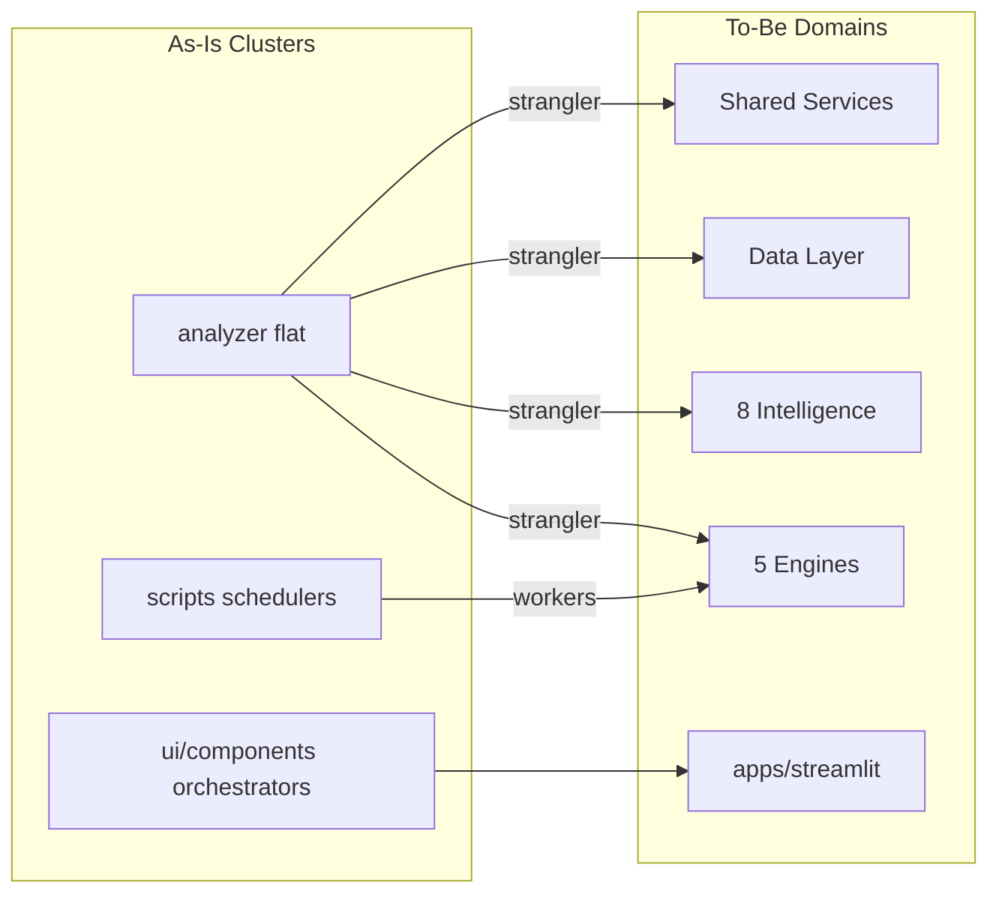
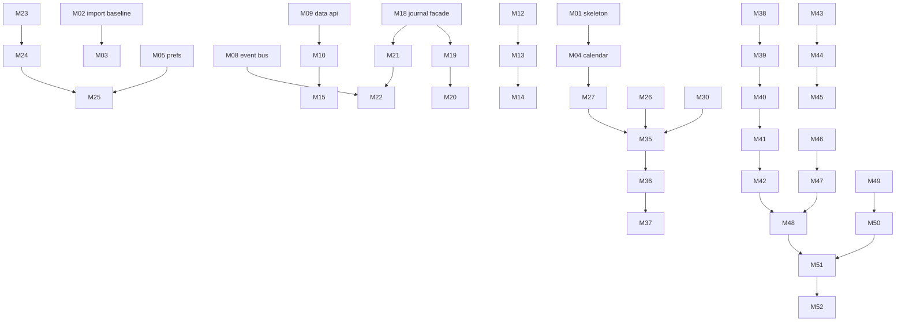

# 06 — Migration Plan: As-Is → Target Investment OS Architecture

**Status:** Documentation only — no code changes in this deliverable  
**References:** [01_Project_Architecture.md](./01_Project_Architecture.md) (as-is), [05_Target_OS_Architecture.md](./05_Target_OS_Architecture.md) (to-be)  
**Principle:** Strangler-fig migration — every step ships independently; `analyzer/` re-exports preserve imports until cutover

---

## 1. Architecture comparison

### 1.1 Structural comparison

| Dimension | As-is (today) | To-be (target) |
|-----------|---------------|----------------|
| **Packaging** | Flat `analyzer/` (163 modules) | `domains/` (13) + `platform/` (2) + `shared/` + `apps/` |
| **Layers** | UI → analyzer (mixed) → data files | UI → Engines → Intelligence → Platform → Shared |
| **Daily driver** | `investment_os.py` + 5 overlapping advisors | `recommendation_engine` (canonical) |
| **Journal** | 3 stores (SQLite + 2 concepts) | `learning_engine/journal` unified facade |
| **Learning** | 4+ tuners, direct imports | `learning_engine` + `GatesUpdated` events |
| **Strategies** | Hardcoded in `strategy_synthesis.py` | TA/Options plugin registries |
| **Explainability** | Pillar strings in synthesis | `evidence_engine` with IDs + labels |
| **Data access** | `providers/router.py` ad hoc | `platform/data_layer` with `MarketDataPort` |
| **Kite** | Monolithic `zerodha.py` (567 LOC) | Split: auth / marketdata / portfolio |
| **Background work** | `app.py` hooks + `scripts/` | `apps/workers/` + event-driven |
| **Deploy unit** | Single Streamlit process | Same initially; API/workers added later |
| **Extension** | JSON learned gates | Plugin registry + JSON gates |

### 1.2 Domain mapping (as-is → to-be)

| As-is module(s) | Target domain | Migration wave |
|-----------------|---------------|----------------|
| `providers/*`, `data.py`, `zerodha.py`, `cache_*` | Data Layer | Wave 2 |
| `markets.py`, `intraday_prefs.py`, `nse_holidays.py` | Shared Services | Wave 1 |
| `market_regime.py`, `market_pulse_scan.py`, `market_session.py` | Market Intelligence | Wave 6 |
| `alpha_ai_report.py`, `screener.py`, `compare.py` | Research Intelligence | Wave 6–8 |
| `signals.py`, `indicators.py`, `intraday_trade_plan.py` | Technical Analysis | Wave 6, 9 |
| `fundamentals.py`, `earnings_calendar.py` | Fundamental Analysis | Wave 6 |
| `news_feed.py`, `delivery_quality.py` | Sentiment Analysis | Wave 6 |
| `nse_options.py`, `live_options_coach.py` | Options Analysis | Wave 6 |
| `india_macro.py`, `gift_nifty.py` | Macro Analysis | Wave 6 |
| `portfolio_*`, `sip_*`, `wealth_plan.py` | Portfolio Intelligence | Wave 6 |
| `intraday_trade_plan.py`, `market_risk.py` | Risk Intelligence | Wave 5 |
| (new) | Evidence Engine | Wave 7 |
| `investment_os.py`, `strategy_synthesis.py`, `intraday_watchlist.py` | Recommendation Engine | Wave 8 |
| `*_journal`, `*_learning`, `eod_learning.py` | Learning Engine | Wave 4 |
| `telegram_*.py`, `session_reminders.py` | Notification Engine | Wave 3 |
| `alpha_ai_llm.py` | AI Layer | Wave 11 |

### 1.3 What does NOT change during migration

- Streamlit UI tabs and user workflows (Home → star → trade → log)
- On-disk data paths (`data/intraday/`, `data/suggestions/journal.db`) until explicit migration step
- Kite OAuth flow and `.env` format (until security wave)
- Autopilot launchd scripts (paths updated only in late waves)
- Test suite must pass after every step

### 1.4 Complexity scale

| Rating | Effort | Typical scope |
|--------|--------|---------------|
| **S** | < 4 hours | New package + re-export; no call-site changes |
| **M** | 1–2 days | Facade + 3–10 call-site updates + tests |
| **L** | 3–5 days | Split god module or break import cycle |

---

## 2. Migration principles

1. **Re-export first, move second, delete last** — `analyzer/foo.py` becomes `from domains... import *` shim
2. **One step = one PR** — independently mergeable and deployable
3. **Feature flags for behavior changes** — e.g. `USE_STRATEGY_REGISTRY=0` default off
4. **Tests gate every step** — `python -m unittest discover -s tests` must pass
5. **No big-bang** — target folder layout exists early; logic migrates over weeks
6. **Broker data paths frozen** until Learning Engine journal unification (Wave 4)

---

## 3. Migration waves overview

| Wave | Theme | Steps | Cumulative outcome |
|------|-------|------:|-------------------|
| **0** | Scaffolding & guardrails | M01–M03 | Target dirs exist; CI baseline |
| **1** | Shared Services | M04–M08 | Calendar, prefs, events extracted |
| **2** | Data Layer | M09–M15 | MarketData facade; zerodha split |
| **3** | Notification Engine | M16–M17 | Telegram behind domain API |
| **4** | Learning Engine | M18–M22 | Unified journal + learning facade |
| **5** | Risk Intelligence | M23–M25 | Risk domain; OS uses facade |
| **6** | Intelligence domains | M26–M34 | 8 intelligence packages (facades) |
| **7** | Evidence Engine | M35–M37 | Evidence IDs on recommendations |
| **8** | Recommendation Engine | M38–M42 | OS canonical in domain package |
| **9** | Strategy plugins | M43–M45 | Registry behind feature flag |
| **10** | Application shell | M46–M48 | Workers + hook extraction |
| **11** | AI Layer & cleanup | M49–M52 | LLM facade; remove shims |

**Total steps:** 52 incremental steps

---

## 4. Incremental migration steps

---

### Wave 0 — Scaffolding & guardrails

#### M01 — Create target directory skeleton

| Field | Detail |
|-------|--------|
| **Purpose** | Establish physical layout for strangler migration without moving logic |
| **Files affected** | **Add:** `contracts/__init__.py`, `contracts/ports.py`, `contracts/types.py`, `shared/__init__.py`, `shared/core/__init__.py`, `platform/__init__.py`, `platform/data_layer/__init__.py`, `platform/ai_layer/__init__.py`, `domains/__init__.py`, `domains/*/ __init__.py` (13 stubs), `apps/__init__.py`, `apps/streamlit/README.md`, `apps/workers/README.md` |
| **Expected result** | Empty packages importable; zero runtime behavior change |
| **Risk** | **Low** — additive only |
| **Rollback** | Delete new directories |
| **Complexity** | **S** |

#### M02 — Document import graph baseline

| Field | Detail |
|-------|--------|
| **Purpose** | Capture current import cycles as CI baseline to prevent new cycles during migration |
| **Files affected** | **Add:** `scripts/check_imports.py`, `.github/workflows/ci.yml` (optional job), `docs/architecture/import_baseline.txt` |
| **Expected result** | CI reports cycle count (19 baseline); fails only on *new* cycles |
| **Risk** | **Low** — CI informational first, enforcing in M03 |
| **Rollback** | Remove CI job |
| **Complexity** | **S** |

#### M03 — Enforce no-new-cycles CI gate

| Field | Detail |
|-------|--------|
| **Purpose** | Block regressions while refactoring |
| **Files affected** | `.github/workflows/ci.yml`, `scripts/check_imports.py` |
| **Expected result** | PR fails if import cycles increase above baseline |
| **Risk** | **Low** — may block messy PRs (intentional) |
| **Rollback** | Revert CI to informational |
| **Complexity** | **S** |

---

### Wave 1 — Shared Services

#### M04 — Extract calendar to `shared/calendar/`

| Field | Detail |
|-------|--------|
| **Purpose** | Move NSE trading calendar and session phase to lowest layer |
| **Files affected** | **Move:** `analyzer/nse_holidays.py` → `shared/calendar/nse.py`, `analyzer/session_phase.py` → `shared/calendar/phases.py`; **Shim:** `analyzer/nse_holidays.py`, `analyzer/session_phase.py` (re-export); **Update:** `analyzer/market_session.py` imports |
| **Expected result** | `from analyzer.nse_holidays import is_nse_trading_day` still works |
| **Risk** | **Low** |
| **Rollback** | Restore original files; delete `shared/calendar/` |
| **Complexity** | **S** |

#### M05 — Extract prefs to `shared/prefs/`

| Field | Detail |
|-------|--------|
| **Purpose** | Centralize user prefs as shared service |
| **Files affected** | **Move:** `analyzer/intraday_prefs.py` → `shared/prefs/intraday.py`, `analyzer/ui_preferences.py` → `shared/prefs/ui.py`; **Shim:** original analyzer paths; **Consumers unchanged** initially |
| **Expected result** | Prefs load/save identical; `data/intraday/prefs.json` unchanged |
| **Risk** | **Low** |
| **Rollback** | Revert shims to full implementation |
| **Complexity** | **S** |

#### M06 — Extract market registry to `shared/core/`

| Field | Detail |
|-------|--------|
| **Purpose** | Markets and India ticker helpers are domain-agnostic |
| **Files affected** | **Move:** `analyzer/markets.py`, `analyzer/india.py` → `shared/core/`; **Shim:** `analyzer/markets.py`, `analyzer/india.py` |
| **Expected result** | Sidebar market select unchanged |
| **Risk** | **Low** |
| **Rollback** | Restore analyzer files |
| **Complexity** | **S** |

#### M07 — Extract observability to `shared/observability/`

| Field | Detail |
|-------|--------|
| **Purpose** | Structured logging as shared primitive |
| **Files affected** | **Move:** `analyzer/structured_log.py` → `shared/observability/logging.py`; **Shim:** `analyzer/structured_log.py` |
| **Expected result** | Autopilot logs unchanged |
| **Risk** | **Low** |
| **Rollback** | Restore single file |
| **Complexity** | **S** |

#### M08 — Add in-process event bus (unused)

| Field | Detail |
|-------|--------|
| **Purpose** | Prepare cycle-breaking; no subscribers initially |
| **Files affected** | **Add:** `shared/events/bus.py`, `shared/events/types.py`, `tests/test_event_bus.py` |
| **Expected result** | Event bus tested; zero production wiring |
| **Risk** | **Low** |
| **Rollback** | Delete `shared/events/` |
| **Complexity** | **S** |

---

### Wave 2 — Data Layer

#### M09 — Create `platform/data_layer/api.py` facade

| Field | Detail |
|-------|--------|
| **Purpose** | Single entry point delegating to existing `providers/router.py` |
| **Files affected** | **Add:** `platform/data_layer/api.py`, `platform/data_layer/models.py` (DataMeta stub); **No consumer changes** |
| **Expected result** | `from platform.data_layer.api import get_live_ltp` works alongside old imports |
| **Risk** | **Low** |
| **Rollback** | Delete new files |
| **Complexity** | **S** |

#### M10 — Relocate providers under `platform/data_layer/providers/`

| Field | Detail |
|-------|--------|
| **Purpose** | Physical Data Layer alignment |
| **Files affected** | **Move:** `analyzer/providers/*` → `platform/data_layer/providers/`; **Shim:** `analyzer/providers/__init__.py` re-exports |
| **Expected result** | All Kite/Yahoo routing works; 76 tests pass |
| **Risk** | **Medium** — many import paths |
| **Rollback** | Move back to `analyzer/providers/` |
| **Complexity** | **M** |

#### M11 — Relocate cache modules to `platform/data_layer/cache/`

| Field | Detail |
|-------|--------|
| **Purpose** | Cache as Data Layer concern |
| **Files affected** | **Move:** `analyzer/cache_utils.py`, `analyzer/pulse_cache.py`, `analyzer/macro_cache.py`; **Shim:** analyzer re-exports; **Update:** `market_pulse_scan.py`, `investment_os.py` (optional direct import) |
| **Expected result** | Pulse cache hit/miss identical |
| **Risk** | **Low–Medium** |
| **Rollback** | Restore analyzer paths |
| **Complexity** | **M** |

#### M12 — Split `zerodha.py`: extract auth module

| Field | Detail |
|-------|--------|
| **Purpose** | First slice of god module — OAuth and credentials only |
| **Files affected** | **Add:** `platform/data_layer/providers/kite/auth.py`; **Modify:** `analyzer/zerodha.py` (import auth); **Shim:** public functions unchanged |
| **Expected result** | Kite login/logout/hydrate token identical |
| **Risk** | **Medium** — OAuth regression |
| **Rollback** | Inline auth back into `zerodha.py` |
| **Complexity** | **M** |

#### M13 — Split `zerodha.py`: extract marketdata module

| Field | Detail |
|-------|--------|
| **Purpose** | LTP and historical fetch separated from auth |
| **Files affected** | **Add:** `platform/data_layer/providers/kite/marketdata.py`; **Modify:** `analyzer/zerodha.py`, `analyzer/kite_stream.py` imports |
| **Expected result** | Live LTP and WebSocket unchanged |
| **Risk** | **Medium** |
| **Rollback** | Revert split |
| **Complexity** | **M** |

#### M14 — Split `zerodha.py`: extract portfolio module

| Field | Detail |
|-------|--------|
| **Purpose** | Holdings import isolated |
| **Files affected** | **Add:** `platform/data_layer/providers/kite/portfolio.py`; **Modify:** `portfolio_live.py` imports via shim |
| **Expected result** | My Portfolio tab sync identical |
| **Risk** | **Medium** |
| **Rollback** | Revert split |
| **Complexity** | **M** |

#### M15 — Migrate 5 pilot callers to `platform.data_layer.api`

| Field | Detail |
|-------|--------|
| **Purpose** | Prove facade adoption without mass refactor |
| **Files affected** | **Modify:** `investment_os.py`, `intraday_data.py`, `gift_nifty.py`, `ui/pages/live_options_advisor.py`, `portfolio_live.py` — switch imports; **Shim:** keep `providers/router` working |
| **Expected result** | Pilot paths use Data Layer API; tests pass |
| **Risk** | **Medium** |
| **Rollback** | Revert 5 files to `providers.router` |
| **Complexity** | **M** |

---

### Wave 3 — Notification Engine

#### M16 — Create `domains/notification_engine/api.py`

| Field | Detail |
|-------|--------|
| **Purpose** | Wrap `telegram_notify.send_telegram_broadcast` behind domain facade |
| **Files affected** | **Add:** `domains/notification_engine/api.py`, `models.py`; **Modify:** `scripts/validate_suggestions.py`, `app.py` sidebar morning button — import from domain; **Shim:** `analyzer/telegram_notify.py` |
| **Expected result** | Telegram sends work identically |
| **Risk** | **Low** |
| **Rollback** | Revert imports to `analyzer.telegram_notify` |
| **Complexity** | **S** |

#### M17 — Consolidate Telegram formatters under notification domain

| Field | Detail |
|-------|--------|
| **Purpose** | Single template location |
| **Files affected** | **Move:** `analyzer/suggestions_telegram.py`, `analyzer/watchlist_telegram.py` → `domains/notification_engine/templates/`; **Shim:** analyzer re-exports; **Update:** schedulers imports |
| **Expected result** | Morning/EOD message format unchanged |
| **Risk** | **Low** |
| **Rollback** | Move templates back |
| **Complexity** | **M** |

---

### Wave 4 — Learning Engine

#### M18 — Create unified journal facade (delegate only)

| Field | Detail |
|-------|--------|
| **Purpose** | Single API over 3 journal stores; no schema merge yet |
| **Files affected** | **Add:** `domains/learning_engine/api.py`, `services/journal/unified_journal.py`; **Delegates to:** `suggestion_journal`, `trade_journal`, `intraday_journal` |
| **Expected result** | `log_trade()` and `get_recent_trades()` work; no UI change |
| **Risk** | **Low** |
| **Rollback** | Delete facade; direct imports |
| **Complexity** | **M** |

#### M19 — Wire Track Record to journal facade

| Field | Detail |
|-------|--------|
| **Purpose** | First production consumer of unified journal |
| **Files affected** | **Modify:** `ui/pages/track_record.py`, `ui/components/trade_journal.py` |
| **Expected result** | Log P&L flow unchanged; same JSON/SQLite writes |
| **Risk** | **Low–Medium** |
| **Rollback** | Revert UI imports |
| **Complexity** | **S** |

#### M20 — Wire Investment OS Review AI to journal facade

| Field | Detail |
|-------|--------|
| **Purpose** | OS Review module uses Learning Engine entry point |
| **Files affected** | **Modify:** `analyzer/investment_os.py` (or future `recommendation_engine`) |
| **Expected result** | Review AI text unchanged |
| **Risk** | **Low** |
| **Rollback** | Direct `trade_journal` import |
| **Complexity** | **S** |

#### M21 — Create learning facade over EOD cycle

| Field | Detail |
|-------|--------|
| **Purpose** | Single `run_eod_learning()` domain API |
| **Files affected** | **Add:** `domains/learning_engine/services/eod_cycle.py`; **Modify:** `app.py` `_maybe_validate_suggestions_eod`, `scripts/validate_suggestions.py` |
| **Expected result** | EOD learning + Telegram identical |
| **Risk** | **Medium** — EOD is critical path |
| **Rollback** | Revert to `analyzer.eod_learning` |
| **Complexity** | **M** |

#### M22 — Publish `GatesUpdated` event after tuning

| Field | Detail |
|-------|--------|
| **Purpose** | Begin cycle-breaking; subscribers optional |
| **Files affected** | **Modify:** `watchlist_learning.py`, `threshold_tuning.py` (publish); **Add:** subscriber stub in `shared/events/` |
| **Expected result** | Tuning still writes same JSON; event logged in debug |
| **Risk** | **Low** — additive |
| **Rollback** | Remove publish calls |
| **Complexity** | **S** |

---

### Wave 5 — Risk Intelligence

#### M23 — Extract position sizing service

| Field | Detail |
|-------|--------|
| **Purpose** | Risk sizing as explicit service |
| **Files affected** | **Add:** `domains/risk_intelligence/services/position_sizer.py`; **Extract from:** `intraday_trade_plan.py` (delegate back) |
| **Expected result** | `suggested_shares` and `max_loss_inr` identical |
| **Risk** | **Medium** — money calculations |
| **Rollback** | Inline sizing in trade plan |
| **Complexity** | **M** |

#### M24 — Create `domains/risk_intelligence/api.py`

| Field | Detail |
|-------|--------|
| **Purpose** | `validate_trade_risk()` and `check_circuit_breakers()` facade |
| **Files affected** | **Add:** `domains/risk_intelligence/api.py`, `models.py`; **Wrap:** `mis_trade_advisory.recent_loss_streak_days`, `intraday_trade_plan` |
| **Expected result** | New API tested; old paths unchanged |
| **Risk** | **Low** |
| **Rollback** | Delete domain |
| **Complexity** | **M** |

#### M25 — Investment OS Risk AI uses risk_intelligence facade

| Field | Detail |
|-------|--------|
| **Purpose** | OS module 5 calls Risk domain |
| **Files affected** | **Modify:** `analyzer/investment_os.py` |
| **Expected result** | Risk AI headline/qty unchanged on Home |
| **Risk** | **Medium** |
| **Rollback** | Revert OS to direct trade_plan |
| **Complexity** | **S** |

---

### Wave 6 — Intelligence domains (facades)

#### M26 — Create `domains/macro_analysis/` facade

| Field | Detail |
|-------|--------|
| **Purpose** | Macro domain public API |
| **Files affected** | **Add:** `domains/macro_analysis/api.py`; **Shim wrap:** `india_macro`, `gift_nifty`, `global_impact`, `global_markets`; **Modify:** `investment_os.py` Macro/Market inputs (optional) |
| **Expected result** | Sector/macro lines on Home unchanged |
| **Risk** | **Low** |
| **Rollback** | Delete facade |
| **Complexity** | **M** |

#### M27 — Create `domains/market_intelligence/` facade

| Field | Detail |
|-------|--------|
| **Purpose** | Regime, session, pulse snapshot API |
| **Files affected** | **Add:** `domains/market_intelligence/api.py`; **Wrap:** `market_regime`, `market_session`, `intraday_pulse_source` |
| **Expected result** | Market AI module unchanged |
| **Risk** | **Low–Medium** |
| **Rollback** | Delete facade |
| **Complexity** | **M** |

#### M28 — Create `domains/fundamental_analysis/` facade

| Field | Detail |
|-------|--------|
| **Purpose** | Fundamental + earnings API |
| **Files affected** | **Add:** `domains/fundamental_analysis/api.py`; **Wrap:** `fundamentals.py`, `earnings_calendar.py` |
| **Expected result** | Single Stock / Alpha AI fundamentals unchanged |
| **Risk** | **Low** |
| **Rollback** | Delete facade |
| **Complexity** | **S** |

#### M29 — Create `domains/sentiment_analysis/` facade

| Field | Detail |
|-------|--------|
| **Purpose** | News + delivery quality API |
| **Files affected** | **Add:** `domains/sentiment_analysis/api.py`; **Wrap:** `news_feed.py`, `delivery_quality.py` |
| **Expected result** | Alpha AI news section unchanged |
| **Risk** | **Low** |
| **Rollback** | Delete facade |
| **Complexity** | **S** |

#### M30 — Create `domains/technical_analysis/` facade

| Field | Detail |
|-------|--------|
| **Purpose** | TA domain entry; no plugin move yet |
| **Files affected** | **Add:** `domains/technical_analysis/api.py`; **Wrap:** `signals`, `indicators`, `multi_timeframe`, `opening_range_confirm`, `intraday_trade_plan` |
| **Expected result** | Suggestions TA columns unchanged |
| **Risk** | **Medium** — large surface |
| **Rollback** | Delete facade |
| **Complexity** | **M** |

#### M31 — Break `candle_narrative` ↔ `options_signal` cycle

| Field | Detail |
|-------|--------|
| **Purpose** | One-way dependency: options imports narrative, not reverse |
| **Files affected** | **Modify:** `analyzer/candle_narrative.py` (remove options import); **Modify:** `analyzer/options_signal.py` |
| **Expected result** | Options signals and narratives identical; cycle count −1 |
| **Risk** | **Medium** |
| **Rollback** | Restore mutual import with lazy load |
| **Complexity** | **M** |

#### M32 — Create `domains/options_analysis/` facade

| Field | Detail |
|-------|--------|
| **Purpose** | Options chain, gate, coach API |
| **Files affected** | **Add:** `domains/options_analysis/api.py`; **Wrap:** `nse_options`, `options_entry_gate`, `live_options_coach` (delegate) |
| **Expected result** | Live Options Coach tab unchanged |
| **Risk** | **Medium** |
| **Rollback** | Delete facade |
| **Complexity** | **M** |

#### M33 — Create `domains/portfolio_intelligence/` facade

| Field | Detail |
|-------|--------|
| **Purpose** | Portfolio, SIP, wealth API |
| **Files affected** | **Add:** `domains/portfolio_intelligence/api.py`; **Wrap:** `portfolio_store`, `portfolio_live`, `sip_planner`, `wealth_plan` |
| **Expected result** | SIP tab + Portfolio tab work; wealth_plan callable from SIP |
| **Risk** | **Low** |
| **Rollback** | Delete facade |
| **Complexity** | **M** |

#### M34 — Create `domains/research_intelligence/` thin facade

| Field | Detail |
|-------|--------|
| **Purpose** | Research API without splitting `alpha_ai_report` yet |
| **Files affected** | **Add:** `domains/research_intelligence/api.py`; **Wrap:** `alpha_ai_report.build_*`, `screener`, `compare` |
| **Expected result** | Alpha AI tab unchanged |
| **Risk** | **Low** |
| **Rollback** | Delete facade |
| **Complexity** | **S** |

---

### Wave 7 — Evidence Engine

#### M35 — Create evidence models and collector stub

| Field | Detail |
|-------|--------|
| **Purpose** | Introduce EvidenceBundle types; collect from one source |
| **Files affected** | **Add:** `domains/evidence_engine/models.py`, `services/collector.py`, `api.py` |
| **Expected result** | `collect_evidence(symbol)` returns bundle; not wired to UI |
| **Risk** | **Low** |
| **Rollback** | Delete domain |
| **Complexity** | **M** |

#### M36 — Attach evidence IDs to strategy synthesis votes

| Field | Detail |
|-------|--------|
| **Purpose** | Each StrategyVote gets `evidence_id` (additive field) |
| **Files affected** | **Modify:** `strategy_synthesis.py` (StrategyVote dataclass), `tests/test_strategy_synthesis.py` |
| **Expected result** | Synthesis verdict unchanged; IDs in debug expander optional |
| **Risk** | **Low–Medium** |
| **Rollback** | Remove field from dataclass |
| **Complexity** | **M** |

#### M37 — Investment OS stores evidence bundle per build

| Field | Detail |
|-------|--------|
| **Purpose** | OS session caches evidence for Review AI |
| **Files affected** | **Modify:** `investment_os.py`; **Add:** optional expander in `investment_os_ui.py` |
| **Expected result** | OS verdict unchanged; "Why" expander shows evidence trace |
| **Risk** | **Low** |
| **Rollback** | Remove collector call |
| **Complexity** | **M** |

---

### Wave 8 — Recommendation Engine

#### M38 — Create `domains/recommendation_engine/api.py` wrapping OS

| Field | Detail |
|-------|--------|
| **Purpose** | Canonical recommendation entry point |
| **Files affected** | **Add:** `domains/recommendation_engine/api.py`; **Delegate:** `investment_os.build_investment_os` |
| **Expected result** | `from domains.recommendation_engine.api import build_investment_os` works |
| **Risk** | **Low** |
| **Rollback** | Delete wrapper |
| **Complexity** | **S** |

#### M39 — Move `strategy_synthesis.py` under recommendation domain

| Field | Detail |
|-------|--------|
| **Purpose** | Physical ownership alignment |
| **Files affected** | **Move:** → `domains/recommendation_engine/services/synthesis.py`; **Shim:** `analyzer/strategy_synthesis.py` |
| **Expected result** | MIS advisory + deep synthesis unchanged |
| **Risk** | **Medium** |
| **Rollback** | Move back |
| **Complexity** | **M** |

#### M40 — Move watchlist builder under recommendation domain

| Field | Detail |
|-------|--------|
| **Purpose** | Recommendation owns watchlist construction |
| **Files affected** | **Move:** `intraday_watchlist.py` → `domains/recommendation_engine/services/watchlist_builder.py`; **Shim:** analyzer; **Update:** `nightly_prep.py` |
| **Expected result** | Nightly scan top-5 identical |
| **Risk** | **High** — core prep path |
| **Rollback** | Restore analyzer location |
| **Complexity** | **L** |

#### M41 — Move `nightly_prep.py` under recommendation domain

| Field | Detail |
|-------|--------|
| **Purpose** | Prep orchestration in Recommendation Engine |
| **Files affected** | **Move:** → `domains/recommendation_engine/services/nightly_prep.py`; **Shim:** `analyzer/nightly_prep.py`; **Update:** schedulers, `unified_hub.py` |
| **Expected result** | Scan tonight's stocks button unchanged |
| **Risk** | **High** |
| **Rollback** | Restore analyzer file |
| **Complexity** | **M** |

#### M42 — Home UI imports recommendation_engine only

| Field | Detail |
|-------|--------|
| **Purpose** | UI decoupled from analyzer internals for OS path |
| **Files affected** | **Modify:** `ui/components/unified_hub.py` — import from `domains.recommendation_engine.api` |
| **Expected result** | Home OS identical |
| **Risk** | **Medium** |
| **Rollback** | Revert to `analyzer.investment_os` |
| **Complexity** | **S** |

---

### Wave 9 — Strategy plugins

#### M43 — Add TA strategy plugin registry (empty + 1 plugin)

| Field | Detail |
|-------|--------|
| **Purpose** | Registry infrastructure with ORB plugin only |
| **Files affected** | **Add:** `domains/technical_analysis/plugins/registry.py`, `plugins/orb_breakout.py`; **Tests:** `tests/test_strategy_registry.py` |
| **Expected result** | Registry tests pass; synthesis still uses old path |
| **Risk** | **Low** |
| **Rollback** | Delete plugins dir |
| **Complexity** | **M** |

#### M44 — Register 3 more plugins (VWAP, trend, fade)

| Field | Detail |
|-------|--------|
| **Purpose** | Expand plugin library |
| **Files affected** | **Add:** `vwap_reclaim.py`, `trend_follow.py`, `range_fade.py` in plugins/ |
| **Expected result** | 4 plugins registered; still not used in production path |
| **Risk** | **Low** |
| **Rollback** | Remove plugin files |
| **Complexity** | **M** |

#### M45 — Feature-flag synthesis via registry

| Field | Detail |
|-------|--------|
| **Purpose** | `USE_STRATEGY_REGISTRY=1` switches pillar source |
| **Files affected** | **Modify:** `domains/recommendation_engine/services/synthesis.py`, `shared/config/feature_flags.py` |
| **Expected result** | Default `0`: identical verdicts; `1`: registry-driven (A/B test) |
| **Risk** | **High** — trading verdicts |
| **Rollback** | Flag default `0`; remove branch |
| **Complexity** | **L** |

---

### Wave 10 — Application shell

#### M46 — Extract `app.py` background hooks to `apps/workers/app_hooks.py`

| Field | Detail |
|-------|--------|
| **Purpose** | Slim entry point; testable hooks |
| **Files affected** | **Add:** `apps/workers/app_hooks.py`; **Modify:** `app.py` (import hooks) |
| **Expected result** | Background EOD/scoring unchanged |
| **Risk** | **Medium** |
| **Rollback** | Inline hooks in app.py |
| **Complexity** | **M** |

#### M47 — Align scripts to domain APIs

| Field | Detail |
|-------|--------|
| **Purpose** | Schedulers call domains, not analyzer internals |
| **Files affected** | **Modify:** `scripts/nightly_prep.py`, `scripts/validate_suggestions.py`, `scripts/autopilot_daily.py`, `scripts/post_close_scan.py` |
| **Expected result** | Autopilot launchd jobs succeed |
| **Risk** | **Medium** |
| **Rollback** | Revert script imports |
| **Complexity** | **M** |

#### M48 — Deprecate first analyzer shim batch (5 modules)

| Field | Detail |
|-------|--------|
| **Purpose** | Remove re-exports once all callers migrated |
| **Files affected** | **Delete shims:** `analyzer/structured_log.py`, `analyzer/session_phase.py`, `analyzer/nse_holidays.py` (after grep confirms zero imports); **Update** remaining imports |
| **Expected result** | Import from `shared/` only |
| **Risk** | **Medium** — missed import breaks app |
| **Rollback** | Restore shim files |
| **Complexity** | **M** |

---

### Wave 11 — AI Layer & final cleanup

#### M49 — Create `platform/ai_layer/api.py` over LLM client

| Field | Detail |
|-------|--------|
| **Purpose** | AI Layer facade with guardrails stub |
| **Files affected** | **Add:** `platform/ai_layer/api.py`, `services/llm_client.py`, `services/guardrails.py`; **Wrap:** `alpha_ai_llm.py`; **Modify:** `alpha_ai_report.py` import |
| **Expected result** | Alpha AI LLM sections unchanged |
| **Risk** | **Low–Medium** |
| **Rollback** | Direct llm import |
| **Complexity** | **M** |

#### M50 — Split `alpha_ai_report.py` — extract 3 sections

| Field | Detail |
|-------|--------|
| **Purpose** | Begin Research Intelligence decomposition |
| **Files affected** | **Add:** `domains/research_intelligence/services/sections/valuation.py`, `business.py`, `technical.py`; **Modify:** `alpha_ai_report.py` delegates |
| **Expected result** | Alpha AI report output identical (snapshot test) |
| **Risk** | **High** |
| **Rollback** | Inline sections |
| **Complexity** | **L** |

#### M51 — Move `ui/` → `apps/streamlit/` (re-export entry)

| Field | Detail |
|-------|--------|
| **Purpose** | Application shell separation |
| **Files affected** | **Move:** `ui/` → `apps/streamlit/ui/`; **Modify:** `app.py` imports; **Add:** root `app.py` thin launcher |
| **Expected result** | `streamlit run app.py` works |
| **Risk** | **High** — many paths |
| **Rollback** | Move ui/ back to root |
| **Complexity** | **L** |

#### M52 — Remove `analyzer/` package (final cutover)

| Field | Detail |
|-------|--------|
| **Purpose** | Complete migration |
| **Files affected** | **Delete:** remaining `analyzer/` shims; **Update:** all imports to domains/platform/shared |
| **Expected result** | No `analyzer` package; tests + CI green |
| **Risk** | **Critical** — only when steps M01–M51 complete |
| **Rollback** | Restore `analyzer/` from git tag |
| **Complexity** | **L** |

---

## 5. Step dependency graph

**Parallel tracks** (can run in separate PRs after Wave 0):

- Track A: Data Layer M09–M15
- Track B: Shared M04–M08
- Track C: Notification M16–M17
- Track D: Learning M18–M22

**Sequential critical path:** M01 → M18 → M38 → M40 → M42 → M52

---

## 6. Verification checklist (every step)

| Check | Command / action |
|-------|------------------|
| Unit tests | `python -m unittest discover -s tests` |
| Import cycles | `python scripts/check_imports.py` (after M03) |
| Home smoke | Manual: Home loads, verdict shows, star pick works |
| Nightly prep | Manual or `python scripts/nightly_prep.py` (after M41) |
| EOD learning | `python scripts/validate_suggestions.py` (after M21) |
| Kite OAuth | Login flow (after M12–M14) |
| Autopilot | `python scripts/autopilot_daily.py --dry-run` if available |

---

## 7. Rollback strategy (global)

| Severity | Action |
|----------|--------|
| Single step failure | `git revert` merge commit; redeploy previous tag |
| Data corruption | Journal DB backed up before M18+; restore `data/suggestions/journal.db` |
| Kite auth broken | Revert M12–M14 together as a group |
| Verdict regression | Set `USE_STRATEGY_REGISTRY=0`; revert M45 |
| Full migration abort | Pin release tag `pre-migration-v1`; `analyzer/` intact |

**Tag before high-risk steps:** M40, M41, M45, M51, M52

---

## 8. Estimated timeline (solo developer)

| Wave | Steps | Calendar | Cumulative |
|------|------:|----------|------------|
| 0 | M01–M03 | 3 days | Week 1 |
| 1 | M04–M08 | 5 days | Week 2 |
| 2 | M09–M15 | 12 days | Weeks 3–4 |
| 3 | M16–M17 | 3 days | Week 5 |
| 4 | M18–M22 | 8 days | Weeks 6–7 |
| 5 | M23–M25 | 4 days | Week 8 |
| 6 | M26–M34 | 15 days | Weeks 9–11 |
| 7 | M35–M37 | 6 days | Week 12 |
| 8 | M38–M42 | 10 days | Weeks 13–14 |
| 9 | M43–M45 | 8 days | Week 15–16 |
| 10 | M46–M48 | 6 days | Week 17 |
| 11 | M49–M52 | 12 days | Weeks 18–20 |

**Total:** ~20 weeks at ~50% engineering / 50% dogfooding

---

## 9. Success criteria (migration complete)

| Criterion | Measure |
|-----------|---------|
| `analyzer/` removed | Zero imports from `analyzer` in production code |
| Import cycles | ≤ 5 (from 19) |
| Domain test coverage | Each `domains/*/tests/` has ≥ 5 tests |
| Home OS | 7 modules via `recommendation_engine` only |
| Learning | Single journal facade; broker P&L required |
| Evidence | Synthesis votes carry evidence IDs |
| Autopilot | Scripts use domain APIs only |
| No user regression | 30-day personal trading journal continuity |

---

## Related documents

- [01_Project_Architecture.md](./01_Project_Architecture.md) — As-is
- [05_Target_OS_Architecture.md](./05_Target_OS_Architecture.md) — To-be
- [03_Technical_Debt.md](./03_Technical_Debt.md) — Debt addressed per wave
- [04_Improvement_Plan.md](./04_Improvement_Plan.md) — Product/phasing alignment

---

*Each step M01–M52 is designed to merge to `main` independently, keep the app runnable, and preserve existing trader workflows.*
