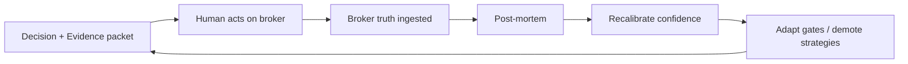
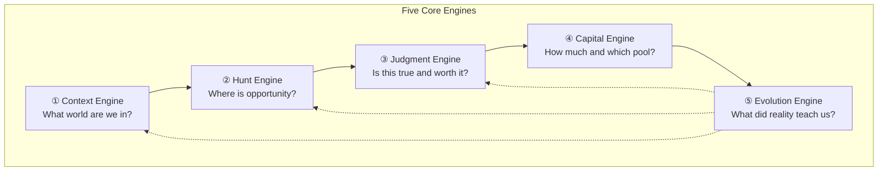

# 08 — Final Investment Operating System Architecture

**Perspective:** Chief Technology Officer × Chief Investment Officer  
**Method:** First principles — no legacy code, no folder trees  
**Audience:** Anyone building software that helps humans invest better  
**Standard:** Decision quality over feature count

---

## Core philosophy

An Investment Operating System is not a screener, a charting app, or an AI that predicts prices.

It is a **disciplined decision factory** that answers one question repeatedly:

> *Given what I know, what I don't know, and the capital I have, what is the highest-quality action right now — including doing nothing?*

The system exists to **preserve capital first**, **compound capital second**, and **learn always**.

### Principles borrowed from great investors

| Investor | Principle encoded in the OS |
|----------|----------------------------|
| **Warren Buffett** | Circle of competence · Moat before momentum · Margin of safety · Say no to most ideas |
| **Charlie Munger** | Invert always ("how do I lose?") · Avoid stupidity over seeking brilliance · Multidisciplinary evidence |
| **Ray Dalio** | Regime matters · Believability-weighted views · Radical honesty about uncertainty · Pain + reflection = progress |
| **Jim Simons** | Edge is statistical, not narrative · Many small tests · Models decay — monitor and adapt · Execution is part of alpha |
| **Peter Lynch** | Know what you own · Stalk before you buy · Story must match numbers · Categorize every opportunity |
| **Stanley Druckenmiller** | Macro sets the chessboard · Bet size follows conviction · Preservation over being right · Change your mind fast when wrong |

### Three laws of the OS

1. **No invented certainty.** Every output carries an uncertainty band. The system never speaks in guarantees.
2. **Broker truth beats model truth.** Learning uses what actually happened to your money, not what the coach hoped would happen.
3. **Default action is WAIT.** Trade only when context, thesis, evidence, risk, and execution align. Silence is a feature.

### What the OS optimizes for

| Optimizes for | Does not optimize for |
|---------------|---------------------|
| Decision quality | Feature count |
| Calibrated confidence | Bullish bias |
| Capital preservation | Activity / churn |
| Explainable reasoning | Black-box scores |
| Learning from mistakes | Vanity win rates |
| Long-term compounding | Daily excitement |

---

## Product vision

**For the individual investor:** A personal **investing brain** that runs your process every day — regime check, opportunity scan, thesis test, size calculation, execution plan, post-mortem — so you trade like a professional even with ₹9,000 or ₹9 crore.

**For the product:** A **trustable decision companion** for Indian markets — SIP wealth track + tactical MIS pool — where users pay for **discipline, explainability, and improvement**, not for hot tips.

**One sentence:** *The OS turns investing from reactive guessing into a repeatable, auditable, self-improving decision process.*

---

## The ten questions — answered

---

### 1. How does capital flow through the system?

Capital is not a setting. It is **flowing water with dams and channels**.

```text
                    TOTAL NET WORTH
                           │
           ┌───────────────┼───────────────┐
           ▼               ▼               ▼
      SACRED CORE     GROWTH ENGINE    TACTICAL POOL
    (never risked)   (SIP / long hold)  (MIS / swing)
           │               │               │
           │               │               ▼
           │               │         DAILY RISK BUDGET
           │               │         (max loss dam)
           │               │               │
           └───────────────┴───────────────┘
                           │
                    AVAILABLE TO DEPLOY
                           │
              ┌────────────┼────────────┐
              ▼            ▼            ▼
           BLOCKED      SIZED        DEPLOYED
         (no edge)   (approved)    (in market)
              │            │            │
              └────────────┴────────────┘
                           │
                    OUTCOMES RETURN
                           │
                    LEARNING RESERVOIR
                  (feeds tomorrow's dams)
```

**Buffett layer:** Sacred core — living expenses, emergency fund, non-negotiable SIP — **never enters the tactical pool**.

**Druckenmiller layer:** Tactical pool has a **daily loss dam**. When the dam fills (max loss hit), **all deployment stops** — not a suggestion, a system veto.

**Dalio layer:** Capital allocation across tracks respects **regime**. In hostile regimes, tactical pool shrinks automatically; growth engine continues on schedule.

**Flow rules:**

| Rule | Meaning |
|------|---------|
| **Separation** | Wealth (SIP) and warfare (MIS) never share the same risk budget |
| **Dam** | Max daily/session loss is computed before any opportunity is shown |
| **Friction** | Deploying capital requires passing every downstream gate |
| **Return** | All outcomes — wins, losses, skips — flow back to learning |

---

### 2. How are opportunities discovered?

Discovery is **stalking**, not spraying.

**Lynch:** You do not buy what you stumble on. You maintain a **watchlist of stories you understand** and wait for the right price and moment.

**Simons:** The machine scans for **statistical anomalies** — unusual volume, regime-aligned setups, relative strength — but human/composite judgment filters noise.

**Druckenmiller:** Discovery is **top-down then bottom-up**. First: is this market worth hunting in? Second: which sectors/names have asymmetry?

#### Discovery pipeline

```text
REGIME FILTER          →  Is hunting allowed today?
        │
UNIVERSE SCAN          →  What moved? What's liquid? What's mispriced?
        │
CIRCLE FILTER          →  Do I understand this? (competence, not hype)
        │
STALK LIST             →  Shortlist with written thesis stub
        │
TRIGGER WATCH          →  Wait for entry condition (not "buy now")
```

**Opportunity types (Lynch categories):**

| Type | OS treatment |
|------|----------------|
| **Compounders** | Growth engine track · long horizon |
| **Stalwarts** | SIP + hold · dividend of safety |
| **Cyclicals** | Tactical only · regime-dependent |
| **Turnarounds** | High skepticism · extra evidence required |
| **Fast growers** | MIS only with tight stops · size capped |
| **Asset plays** | Valuation evidence weighted higher |

**Default:** Most scans produce **zero** actionable opportunities. The OS celebrates an empty stalk list on a bad regime day.

---

### 3. How is evidence collected?

Evidence is **multidisciplinary and adversarial**.

**Munger:** One fact from one lens is dangerous. Collect **multiple independent lenses** that can **contradict** each other.

**Dalio:** Weight evidence by **believability** — track record of that signal type in current regime.

#### Evidence classes

| Class | Examples | Label |
|-------|----------|-------|
| **Hard fact** | Last close, volume, FII flow print, your actual fill price | FACT |
| **Derived metric** | RSI, ADX, IV rank, DCF output | ESTIMATE |
| **Interpretation** | "Sector leading," "moat durable" | OPINION |
| **Assumption** | "Earnings won't surprise," "gap holds" | ASSUMPTION |
| **Unknown** | Missing data, stale feed, conflicting sources | GAP |

#### Collection process

```text
For each opportunity on the stalk list:

  BUSINESS lens     →  Quality, moat, earnings trajectory
  BALANCE lens      →  Leverage, cash, survivability
  VALUATION lens    →  Price vs intrinsic range
  TECHNICAL lens    →  Trend, structure, timing
  SENTIMENT lens    →  News vs rumor, positioning
  MACRO lens        →  Regime, rates, flows, gap risk
  PORTFOLIO lens    →  Correlation, concentration, fit
  ADVERSARIAL lens →  "How do I lose?" (Munger invert)
```

**Rule:** No recommendation without an **evidence packet** — a bounded set of labeled claims, each with source, timestamp, and confidence.

**Rule:** **GAP** labels are first-class. Unknown is better than fabricated.

---

### 4. How is uncertainty measured?

Uncertainty is not fear. It is **honest range estimation**.

**Buffett:** "Risk comes from not knowing what you're doing." Uncertainty rises outside circle of competence.

**Simons:** Model uncertainty = **out-of-sample degradation** + **regime shift detection**.

**Dalio:** Distinguish **known unknowns** (earnings tomorrow) from **unknown unknowns** (policy shock).

#### Uncertainty dimensions

| Dimension | Question | Output |
|-----------|----------|--------|
| **Data uncertainty** | Is data fresh, complete, consistent? | LOW / MED / HIGH |
| **Model uncertainty** | Has this signal worked lately in this regime? | Calibration score |
| **Event uncertainty** | Earnings, policy, expiry, macro print soon? | Event window flag |
| **Execution uncertainty** | Spread, liquidity, gap-through-stop risk? | Slippage band |
| **Thesis uncertainty** | How much of the story is assumption? | Assumption ratio |
| **Personal uncertainty** | Did I sleep, follow rules, emotional state? | Discipline flag |

#### Composite uncertainty score

Not one number pretending to be truth — a **vector** exposed to the user:

```text
Uncertainty: DATA [low] · MODEL [med] · EVENT [high] · EXEC [low] · THESIS [med]
→ Composite: ELEVATED — size reduction mandatory
```

**Druckenmiller rule:** High uncertainty does not mean no trade. It means **smaller bet or wider invalidation**.

---

### 5. How is confidence estimated?

Confidence is **calibrated probability of being right on the thesis**, not excitement.

**Simons:** Confidence = historical hit rate of this **pattern class** in this **regime**, adjusted for decay.

**Dalio:** Confidence = weighted vote of **believable** signals, not democratic average of all signals.

**Buffett:** Confidence is **high only when moat + price + competence align**. Otherwise permanently moderate.

#### Confidence is NOT

- Model output without track record
- LLM eloquence
- Recent winning streak (recency bias)
- Social sentiment

#### Confidence IS

```text
Confidence = f(
    evidence agreement,      # lenses align or fight?
    regime alignment,        # does macro support this bet type?
    historical calibration,  # have we been right on similar setups?
    thesis clarity,          # can you explain in 2 sentences?
    adversarial survival     # did "how I lose" survive scrutiny?
)
```

#### Output format

| Field | Example |
|-------|---------|
| **Confidence** | 62% |
| **Calibration note** | "Similar ORB longs: 58% hit target in range regimes (n=47)" |
| **Disagreement** | "Macro bullish · Technical neutral · Valuation stretched" |
| **Confidence cap** | "Capped at 65% — earnings in 2 days" |

**Law:** Confidence and uncertainty are **both shown**. High confidence + high uncertainty = small size, not no trade.

---

### 6. How is capital allocated?

Allocation is the **most important decision** — more than entry price.

**Druckenmiller:** "It's not whether you're right or wrong — it's how much you make when right and how much you lose when wrong." **Size is the bet.**

**Buffett:** "If you have a hamburger stand, you don't bet the whole partnership on one promotion." **Concentration limits.**

**Dalio:** Diversify across **uncorrelated return streams** — not just names.

#### Allocation hierarchy

```text
1. TRACK      →  Which pool? (Sacred / Growth / Tactical)
2. BUDGET     →  Max loss for this decision (₹ and %)
3. SIZE       →  Shares/contracts from stop distance
4. CONCENTRATION → Sector, single-name, correlated exposure caps
5. RESERVE    → Cash left deliberately undeployed
```

#### Allocation rules (encoded)

| Rule | Source |
|------|--------|
| Never risk sacred core on tactical ideas | Buffett |
| Max loss per trade computed **before** entry | Druckenmiller |
| Size inversely proportional to uncertainty vector | Dalio |
| No second tactical bet if first is open (beginner mode) | Discipline |
| Reduce size after loss streak; never increase to "recover" | Anti-blow-up |
| SIP continues regardless of tactical outcomes | Wealth separation |

#### Allocation veto (automatic)

- Stop too wide for budget → **size = 0**
- Correlation with open exposure too high → **size = 0 or reduce**
- Regime hostile to strategy type → **size = 0**
- Confidence below floor → **size = 0**
- Daily loss dam full → **all tactical size = 0**

---

### 7. How are decisions made?

Decisions are **vetoes in sequence**, not votes for excitement.

**Munger:** "Invert, always invert." The OS runs **failure checks before success checks**.

**Buffett:** "The stock market is a no-called-strike game." **WAIT is the default winning move**.

#### Decision pipeline (the investing brain)

```text
┌─────────────────────────────────────────────────────────────┐
│                    INVESTMENT DECISION PIPELINE                │
└─────────────────────────────────────────────────────────────┘

 ① CONTEXT     What world are we in? (regime, macro, session)
       │ veto → WAIT / DEFENSIVE
       ▼
 ② DISCOVERY   Is there a stalked opportunity with a trigger?
       │ veto → NO HUNT
       ▼
 ③ THESIS      Is the story clear and in my circle?
       │ veto → PASS
       ▼
 ④ EVIDENCE     Do facts support the thesis? Survive invert?
       │ veto → PASS
       ▼
 ⑤ UNCERTAINTY  Is uncertainty acceptable or size-adjusted?
       │ veto → PASS or REDUCE
       ▼
 ⑥ CONFIDENCE   Is calibrated confidence above floor?
       │ veto → PASS
       ▼
 ⑦ ALLOCATION   Is there size > 0 within all limits?
       │ veto → PASS
       ▼
 ⑧ EXECUTION    Is there a plan with stop, target, invalidation?
       │ veto → PASS
       ▼
 ⑨ HUMAN        Does the investor confirm? (OS advises, human commits)
       │
       ▼
    ACT / WAIT / PASS
```

#### Decision outputs (only these)

| Verdict | Meaning |
|---------|---------|
| **ACT** | All gates passed · size > 0 · plan written |
| **WAIT** | Idea valid · timing/regime/session not ready |
| **PASS** | Thesis broken or edge insufficient |
| **DEFENSIVE** | Regime hostile · tactical pool closed |
| **REDUCE** | Act with smaller size · elevated uncertainty |

**No other verdicts.** No "strong buy" hype. No 47-tab ambiguity.

---

### 8. How are trades executed?

Execution is **plan adherence**, not improvisation.

**Simons:** Alpha dies in slippage. The plan includes **how** you enter, not just **whether**.

**Druckenmiller:** "The way to build long-term returns is through preservation of capital and home runs." Execution protects the **downside**; upside is managed in stages.

#### Execution contract (written before order)

| Element | Required |
|---------|----------|
| **Entry condition** | Price/structure trigger — not "whenever" |
| **Invalidation (stop)** | Where thesis dies — non-negotiable |
| **Target ladder** | Partial exits — don't hope for one exit |
| **Time stop** | MIS square-off · thesis expiry |
| **Size** | From allocation engine |
| **Max slippage** | Acceptable deviation from plan |
| **Emotional note** | "Am I chasing?" optional discipline check |

#### Execution monitoring (live)

```text
Plan price ──────── Entry band ──────── Actual fill
                         │
                    SLIPPAGE CHECK
                         │
              Stop placed? ──no── → ALERT (critical)
                         │
              Thesis still valid? ──no── → EXIT (not hope)
```

**Human executes on broker.** OS never auto-trades without explicit future tier. **The OS owns the plan; the human owns the button.**

---

### 9. How are outcomes monitored?

Monitoring compares **three truths**:

| Truth | Source |
|-------|--------|
| **Plan truth** | What the OS prescribed |
| **Coach truth** | What would have happened at plan levels |
| **Broker truth** | What Zerodha says actually happened |

**Learning uses broker truth.** Coach truth is diagnostic only.

#### Monitoring dimensions

```text
POST-TRADE
    │
    ├── P&L truth        →  Actual ₹ vs budget
    ├── Plan adherence   →  Entry/stop/target followed?
    ├── Thesis outcome   →  Was the story right or just lucky?
    ├── Process quality  →  Which gate failed if loss?
    └── Regime context   →  What world were we in?
```

#### Monitoring cadence

| Cadence | Focus |
|---------|-------|
| **Intraday** | Stop placed? Thesis intact? Time stop approaching? |
| **Close** | Log broker P&L · score plan adherence |
| **Weekly** | Calibration drift · win rate by strategy class |
| **Monthly** | Wealth track vs tactical track · rule changes |
| **Quarterly** | Circle of competence review · prune stalk list |

**Lynch:** "Know what you own." The OS asks: *"Can you still explain this position in two sentences?"* If not — flag.

---

### 10. How does the system learn?

Learning is **pain plus reflection**, not parameter twiddling.

**Dalio:** "Pain + reflection = progress." Every loss produces a **structured post-mortem**, not shame.

**Simons:** Models **decay**. The OS tracks **when signals stop working** and demotes them.

**Buffett:** Learning is slow. **Wealth compounding** is the primary learning output; tactical learning is secondary.

#### Learning loop



#### What the system learns (and does not)

| Learns | Does not learn |
|--------|----------------|
| Which strategy classes work in which regimes | To chase yesterday's winner |
| Calibration of confidence scores | From coach-only fake wins |
| Your personal discipline patterns | To increase size after losses |
| Sector/signal combinations that fail | From one lucky trade |
| When to shrink tactical pool | To predict exact prices |

#### Learning outputs

| Output | Effect |
|--------|--------|
| **Confidence recalibration** | "ORB longs overclaimed by 12% in chop" |
| **Strategy demotion** | Pattern class paused until revalidated |
| **Gate tightening** | "Require sector tailwind after 3 stop-outs" |
| **Circle update** | Names you consistently misread removed from stalk |
| **Personal rule** | "You enter early 68% of losses — wait for OR confirm" |

**Minimum sample law:** No rule changes from < 30 decisive outcomes. **Simons discipline on small samples.**

---

## Five core engines

The OS has five engines — not sixteen modules. Each engine maps to how great investors actually work.



---

### ① Context Engine — *Dalio + Druckenmiller*

**Question:** What world are we in — and is it a day to hunt?

| Input | Output |
|-------|--------|
| Macro, VIX, flows, gaps, session | Regime label |
| Sector rotation | Tailwind / headwind map |
| Calendar, events | Event risk windows |
| Personal state | Tactical pool open/closed |

**Verdicts:** `RISK-ON` · `NEUTRAL` · `RISK-OFF` · `CLOSED`

**Buffett overlay:** Context does not block SIP. It blocks **tactical stupidity**.

---

### ② Hunt Engine — *Lynch + Simons*

**Question:** What is worth stalking — and has the trigger fired?

| Input | Output |
|-------|--------|
| Universe scan, liquidity, patterns | Ranked stalk list |
| Lynch category | Opportunity type |
| Circle of competence | Filtered names |
| Trigger conditions | Fired / not fired |

**Simons overlay:** Patterns are **classes**, not narratives. Each class has tracked base rate.

**Lynch overlay:** Every stalk entry has a **two-sentence story stub** or it does not exist.

---

### ③ Judgment Engine — *Buffett + Munger*

**Question:** Is the thesis true enough — and what would make us wrong?

| Input | Output |
|-------|--------|
| Evidence packet (all lenses) | Labeled claims |
| Adversarial invert | Failure modes |
| Uncertainty vector | Composite uncertainty |
| Believability weights | Calibrated confidence |
| Agreement / disagreement map | Clear conflict visibility |

**Munger rule:** The invert pass is **mandatory**. "How do I lose on this?" must have answers that were checked.

**Output:** `THESIS HOLD` · `THESIS WEAK` · `THESIS BROKEN`

---

### ④ Capital Engine — *Druckenmiller + Buffett*

**Question:** How much capital — if any — deserves this bet?

| Input | Output |
|-------|--------|
| Confidence, uncertainty | Size multiplier |
| Stop distance, budget | Shares / lots |
| Portfolio exposure | Concentration check |
| Loss dams, streaks | Veto or reduction |
| Track (wealth vs tactical) | Pool selection |

**Sacred rule:** This engine can return **zero** and that is a **successful output**.

---

### ⑤ Evolution Engine — *Dalio + Simons*

**Question:** What did reality teach us — and what changes tomorrow?

| Input | Output |
|-------|--------|
| Broker truth | Canonical outcome record |
| Plan adherence | Discipline score |
| Gate that failed | Attribution label |
| Regime at time of trade | Stratified stats |
| Sample size check | Adapt / wait / demote |

**Dalio overlay:** Losses produce **principles updates**, not emotional overrides.

**Simons overlay:** Strategy classes have **health metrics** — decay triggers review.

---

## Supporting modules

Supporting modules **feed engines** but do not make decisions.

| Module | Role | Feeds |
|--------|------|-------|
| **Market memory** | Prices, volumes, chains, fundamentals | Hunt, Judgment |
| **Broker mirror** | Actual fills, P&L, positions | Evolution, Capital |
| **Calendar** | Sessions, holidays, earnings, expiry | Context |
| **Competence registry** | What you understand · stalk permissions | Hunt, Judgment |
| **Wealth ledger** | SIP, goals, long-hold positions | Capital |
| **Narrative guard** | Prevents invented metrics in prose | Judgment |
| **Alert channel** | Telegram, push — delivery only | Human attention |
| **Audit trail** | Every verdict, evidence packet, change | Explainability, Evolution |

**Rule:** Supporting modules **never** issue ACT verdicts. Only the pipeline does.

---

## Investment decision pipeline (integrated view)

```text
         CAPITAL FLOWS IN
                │
    ┌───────────▼───────────┐
    │    CONTEXT ENGINE     │  Regime · Session · Dams
    └───────────┬───────────┘
                │
    ┌───────────▼───────────┐
    │     HUNT ENGINE       │  Scan · Stalk · Trigger
    └───────────┬───────────┘
                │
    ┌───────────▼───────────┐
    │   JUDGMENT ENGINE     │  Evidence · Invert · Confidence
    └───────────┬───────────┘
                │
    ┌───────────▼───────────┐
    │   CAPITAL ENGINE      │  Size · Pool · Veto
    └───────────┬───────────┘
                │
    ┌───────────▼───────────┐
    │  EXECUTION CONTRACT   │  Entry · Stop · Ladder · Time
    └───────────┬───────────┘
                │
           HUMAN ACTS
                │
    ┌───────────▼───────────┐
    │  EVOLUTION ENGINE     │  Broker truth · Learn · Adapt
    └───────────┬───────────┘
                │
         CAPITAL FLOWS BACK
                │
         (tomorrow's Context)
```

---

## Data flow

Data is not "ingested." It is **assembled into evidence with lineage**.

```text
EXTERNAL REALITY
  prices · volumes · fundamentals · news · macro · options · broker fills
        │
        ▼
  MARKET MEMORY (timestamped, source-tagged, health-scored)
        │
        ├──────────────────┬──────────────────┐
        ▼                  ▼                  ▼
   CONTEXT            HUNT               JUDGMENT
   (regime)         (patterns)         (evidence packet)
        │                  │                  │
        └──────────────────┴──────────────────┘
                           │
                           ▼
                    DECISION + PLAN
                           │
                           ▼
                    BROKER MIRROR (actual truth)
                           │
                           ▼
                    EVOLUTION (learning reservoir)
```

**Data health is a first-class output.** Stale NSE, expired Kite token, missing earnings — surfaces as **GAP** in evidence, not silent wrong answers.

---

## AI responsibilities

AI is **not the brain**. AI is **language, synthesis, and vigilance** in service of the five engines.

| AI may do | AI may not do |
|-----------|---------------|
| Summarize evidence packets | Invent ROE, PE, or price targets |
| Explain verdicts in plain language | Issue ACT without pipeline gates |
| Classify news vs rumor | Override Capital Engine veto |
| Detect narrative-reality mismatch | Guarantee returns |
| Help write thesis stub | Expand circle of competence without user consent |
| Flag LLM uncertainty | Learn from coach-only P&L |

### AI placement

```text
         ┌─────────────────────────────────┐
         │         JUDGMENT ENGINE          │
         │  ┌─────────────────────────────┐ │
         │  │  AI: summarize · explain    │ │
         │  │  AI: adversarial question gen │ │
         │  │  Numbers: ONLY from evidence │ │
         │  └─────────────────────────────┘ │
         └─────────────────────────────────┘
```

**Simons test:** If removing AI changes the **numeric decision**, the architecture is wrong. AI is prose layer + vigilance, not the quant model.

**Buffett test:** AI must be able to say *"I don't know"* and *"wait"* eloquently.

---

## Learning loop (detailed)

```text
┌──────────────────────────────────────────────────────────────┐
│                     EVOLUTION ENGINE                          │
├──────────────────────────────────────────────────────────────┤
│  INGEST     Broker P&L · fills · adherence score              │
│  ATTRIBUTE  Which gate · which strategy class · which regime    │
│  REFLECT    Post-mortem template (mistake / luck / process)   │
│  CALIBRATE  Confidence vs outcomes by class                   │
│  ADAPT      Demote · tighten · pause · personal rule          │
│  GOVERN     Min sample · version · rollback                   │
└──────────────────────────────────────────────────────────────┘
         │                                    │
         ▼                                    ▼
   HUNT (pattern health)              JUDGMENT (calibration)
         │                                    │
         └────────────────┬───────────────────┘
                          ▼
                    CONTEXT (regime stats)
```

### Learning governance

| Rule | Rationale |
|------|-----------|
| n ≥ 30 before rule change | Simons |
| Every adaptation logged with reason | Dalio |
| Rollback one click | Safety |
| Personal rules ≠ global rules | Lynch circle |
| Coach divergence tracked as KPI | Trust |

---

## Risk loop (detailed)

Risk is not a module. It is a **continuous loop** intersecting every engine.

```text
        ┌─────────────────────────────────────┐
        │           RISK LOOP                  │
        └─────────────────────────────────────┘
              │
   ┌──────────┼──────────┬──────────────┐
   ▼          ▼          ▼              ▼
PRE-DECISION  SIZE    IN-TRADE    POST-TRADE
 Context     Capital  Monitor     Evolution
 veto        veto     alert       streak
```

| Loop stage | Druckenmiller | Buffett |
|------------|---------------|---------|
| **Pre-decision** | Macro hostile → don't play | Don't risk permanent loss |
| **Size** | Bet small when unsure | Never bet sacred core |
| **In-trade** | Cut when thesis breaks | Rule #1: don't lose money |
| **Post-trade** | Loss streak → shrink | Review mistake honestly |

**Kill conditions (automatic tactical pool close):**

- Daily loss dam reached
- N consecutive broker-verified losses
- Data health critical
- User-declared emotional compromise (optional honest flag)

---

## Explainability model

Explainability is not a paragraph. It is a **decision artifact**.

### Every ACT/WAIT/PASS produces

```text
┌─────────────────────────────────────────────────────────┐
│ DECISION ARTIFACT #2026-07-16-AXISBANK-001              │
├─────────────────────────────────────────────────────────┤
│ VERDICT: WAIT                                            │
│ REASON: Context RISK-ON but trigger not fired            │
├─────────────────────────────────────────────────────────┤
│ CONTEXT: Range-bound Nifty · Sector: Banks tailwind      │
│ THESIS:  Short pullback to VWAP after failed breakout    │
│ CATEGORY: Cyclical / tactical                            │
├─────────────────────────────────────────────────────────┤
│ CONFIDENCE: 58% (calibrated) · UNCERTAINTY: ELEVATED     │
│   · event: RBI week                                      │
├─────────────────────────────────────────────────────────┤
│ EVIDENCE (labeled):                                      │
│   [FACT] Price below OR high · source: live              │
│   [ESTIMATE] R:R 1.6x at planned stop · source: plan     │
│   [OPINION] Banks leading sector · source: macro         │
│   [GAP] IV context unavailable · source: chain stale     │
├─────────────────────────────────────────────────────────┤
│ INVERT (how I lose):                                     │
│   · Gap up through stop on policy headline               │
│   · Chop without VWAP reclaim — time stop                │
├─────────────────────────────────────────────────────────┤
│ ALLOCATION: Size would be 12 shares · ₹90 max loss       │
│   → NOT DEPLOYED (WAIT)                                  │
├─────────────────────────────────────────────────────────┤
│ IF ACT: Entry ₹X · Stop ₹Y · T1/T2 ladder · Time 3:20pm  │
└─────────────────────────────────────────────────────────┘
```

### Explainability principles

| Principle | Source |
|-----------|--------|
| Show disagreement between lenses | Dalio |
| Show assumptions explicitly | Munger |
| Show calibration basis | Simons |
| Show what would change verdict | Druckenmiller |
| Never hide WAIT reason | Buffett |

---

## Scalability path

Scale is measured in **decision quality per user**, not folders.

| Stage | Users | Architecture of the brain |
|-------|------:|----------------------------|
| **Solo** | 1 | Personal OS · broker mirror manual · all five engines |
| **Dogfood** | 10 | Same brain · shared calibration research · personal rules stay local |
| **Paid retail** | 1k | Per-user broker mirror · per-user evolution · global pattern classes |
| **Pro** | 10k | Licensed data · faster hunt · strategy marketplace |
| **Platform** | 100k+ | Tenant isolation · human remains execution layer unless licensed OMS |
| **1M** | 1M | Distributed hunt · centralized market memory · edge in evolution + calibration |

**What scales:**

- Pattern class calibration (Simons)
- Regime detection (Dalio)
- Evidence labeling standards (Munger)
- Broker truth ingestion (trust)

**What does not scale cheaply:**

- Personalized circle of competence (Lynch)
- Emotional discipline coaching (human)
- Licensed real-time options chains (cost)

**Streamlit vs API is irrelevant to this document.** The **brain** is the five engines and the pipeline. Delivery mechanism changes; decision factory does not.

---

## Product vision (stages)

### Stage 1 — Personal brain (now)

One investor. Seven questions every morning. Broker truth every evening. **Prove the loop.**

### Stage 2 — Trusted coach (paid)

Explainable artifacts. Calibration transparency. **"Why WAIT"** as valuable as **"ACT."**

### Stage 3 — Pattern marketplace

Strategy **classes** with regime labels and backtested base rates — not black-box tips.

### Stage 4 — Wealth + warfare unified

SIP compound track and MIS tactical track in one capital flow model — **Buffett long + Druckenmiller short cycle**.

### Stage 5 — Institutional retail

Multi-account, compliance artifacts, team believability voting (Dalio) for family offices.

---

## Mapping: investor minds → OS components

| Mind | OS component |
|------|----------------|
| Buffett — moat, margin of safety, say no | Judgment Engine + default WAIT |
| Munger — invert, multidisciplinary | Adversarial lens + evidence classes |
| Dalio — regime, principles, believability | Context Engine + Evolution governance |
| Simons — patterns, calibration, decay | Hunt classes + confidence calibration |
| Lynch — stalk, know what you own, categories | Hunt Engine + competence registry |
| Druckenmiller — macro, size, preservation | Context + Capital Engine + risk loop |

---

## What this architecture refuses to be

| Not this | Because |
|----------|---------|
| Prediction machine | Markets are uncertain; OS embraces it |
| Tip service | Tips skip judgment and capital engines |
| Charting app | Charts feed evidence, not decisions |
| AI oracle | AI explains; engines decide |
| Casino | Default WAIT · dams · invert pass |
| Bloomberg clone | Terminal is data; OS is decisions |
| Hedge fund OMS | Human executes; OS advises with discipline |

---

## One page — the ideal investing brain

```text
CONTEXT  →  Is today a day to hunt?
HUNT     →  What is stalked and triggered?
JUDGE    →  Is it true? How do I lose?
CAPITAL  →  How much — if any?
PLAN     →  Entry · stop · ladder · time
HUMAN    →  Commits on broker
EVOLVE   →  Broker truth → learn → adapt

Default: WAIT
Sacred: SIP / core never at risk
Truth: Zerodha > coach
Confidence: calibrated, capped
AI: explains, never invents
Learning: pain + reflection, n≥30
```

---

## Relationship to prior architecture documents

| Document | Status |
|----------|--------|
| 01–03 (audit) | Historical record of what existed |
| 04–06 (migration) | **Superseded** by this first-principles brain |
| 07 (critique) | Validates that packaging ≠ decisions |
| **08 (this)** | **North star** — design the brain, then build anything |

**Implementation rule:** Any future code, folder, or feature must trace to one of the five engines or a supporting module. If it does not improve the pipeline, it does not ship.

---

*The ideal Investment Operating System is not built to impress architects. It is built so that on your worst trading day, the system saved you from yourself — and on your best day, you know exactly why.*
