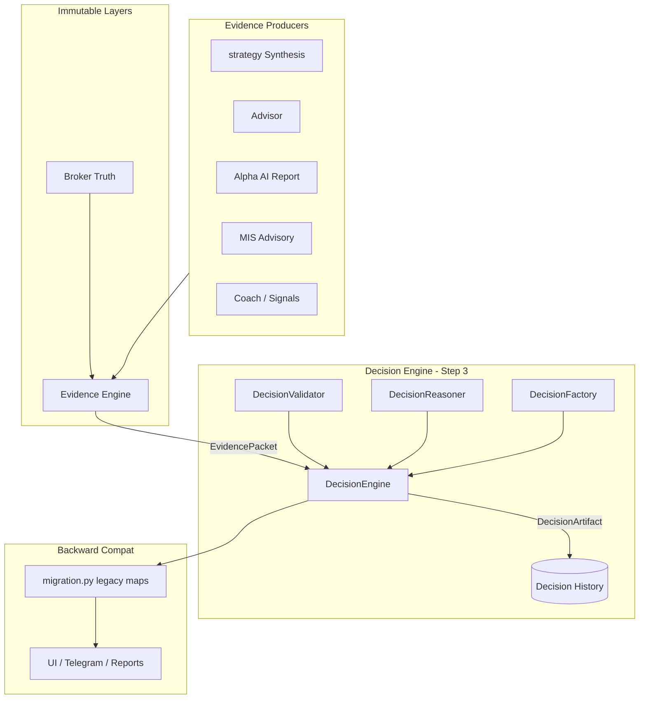

# 12 — Migration Step 3: Decision Engine

**Status:** Implemented  
**Constitution:** [08_Final_Investment_OS_Architecture.md](./08_Final_Investment_OS_Architecture.md)  
**Migration Guide:** [09_Codebase_to_Architecture_Mapping.md](./09_Codebase_to_Architecture_Mapping.md)  
**Prerequisites:** [10_Migration_Step1_Broker_Truth.md](./10_Migration_Step1_Broker_Truth.md), [11_Migration_Step2_Evidence_Engine.md](./11_Migration_Step2_Evidence_Engine.md)  
**Scope:** Decision Engine only — no Capital Engine, Execution Engine, or Learning changes

---

## Goal

The **Decision Engine** is the **only** component in the application allowed to issue investment verdicts.

Every analyzer, strategy, AI report, advisor, coach, or recommendation module is an **Evidence Producer**. They contribute `EvidenceItem` / `EvidencePacket` data. They must **never** return canonical verdicts (`ACT`, `WAIT`, `PASS`, `REDUCE`, `DEFENSIVE`) or raw BUY/SELL recommendations.

Legacy UI, Telegram, and reports continue to work via the **migration layer**, which maps canonical verdicts to historical labels (`BUY`, `NO_TRADE`, `TRADE_OK`, etc.).

---

## Canonical Verdicts

| Verdict | Meaning |
|---------|---------|
| **ACT** | Deploy capital per plan and risk budget |
| **WAIT** | No action now — monitor triggers |
| **PASS** | Skip — no trade / no add |
| **REDUCE** | Trim or avoid adding exposure |
| **DEFENSIVE** | Preserve capital; defensive posture |

**Rules**

- No other verdict strings inside Decision Engine output
- No BUY/SELL text in `DecisionArtifact`
- No recommendation scores on the artifact (confidence is decision confidence, not a legacy “score”)

---

## Package Layout: `analyzer/decision_engine/`

| Module | Class / Symbol | Responsibility |
|--------|----------------|----------------|
| `models.py` | `DecisionArtifact`, `DecisionVerdict`, `DecisionContext`, `RiskSettings` | Canonical types |
| `rules.py` | `DecisionRules` constants, `is_critical_gap()` | Thresholds, critical GAP policy |
| `validator.py` | `DecisionValidator` | Step 1 input validation |
| `reasoner.py` | `DecisionReasoner` | Steps 4–7 scoring and verdict resolution |
| `factory.py` | `DecisionFactory` | Artifact assembly (verdict supplied by engine) |
| `engine.py` | `DecisionEngine` | Pipeline orchestration |
| `history.py` | `DecisionHistory` store | Immutable SQLite archive |
| `serialization.py` | JSON round-trip | Persistence / API |
| `serializer.py` | Public serializer re-exports | Stable import surface |
| `migration.py` | Legacy mapping + attach hooks | Backward compatibility |
| `__init__.py` | Public exports | Package API |

**Immutable (do not modify):** `analyzer/broker_truth/`, `analyzer/evidence_engine/`

---

## Inputs

| Input | Type | Required |
|-------|------|----------|
| Evidence | `EvidencePacket` | Yes |
| Market context | `MarketContext` | Yes |
| Portfolio state | `PortfolioState` | Yes (`known=True`) |
| Capital constraints | `CapitalConstraints` | Yes |
| User profile | `UserPreferences` | Yes |
| Risk settings | `RiskSettings` | Yes |

Bundled as `DecisionContext` inside `DecisionRequest`.

---

## Output: `DecisionArtifact`

| Field | Description |
|-------|-------------|
| `decision_id` | Unique audit ID (`dec_*`) |
| `timestamp` | IST timestamp |
| `verdict` | `ACT` · `WAIT` · `PASS` · `REDUCE` · `DEFENSIVE` |
| `reason` | Primary decision rationale |
| `confidence` | 0–100 decision confidence |
| `uncertainty` | `UncertaintyVector` (5 axes + overall) |
| `supporting_evidence_ids` | Evidence items supporting verdict |
| `conflicting_evidence_ids` | Evidence items in conflict |
| `capital_recommendation` | Sizing guidance (not Capital Engine) |
| `execution_recommendation` | Entry/timing guidance (not Execution Engine) |
| `alternative_actions` | Other valid verdicts considered |
| `invalidation_conditions` | What would change this decision |
| `explainability` | `why`, `why_now`, `why_not` |
| `decision_version` | Schema version (`1.0`) |
| `evidence_packet_id` | Link to Evidence Engine packet |

---

## 8-Step Pipeline

```text
Step 1  Validate EvidencePacket + Context + Risk
           ↓
Step 2  Reject if critical GAP (Risk / Execution / Market categories)
           ↓ PASS artifact
Step 3  Evaluate context (session, regime → uncertainty)
           ↓
Step 4  Evaluate risk (loss streak, conflicts, gate, negative net)
           ↓
Step 5  Evaluate portfolio constraints (known state, open positions)
           ↓
Step 6  Evaluate capital constraints (max trades, loss cap)
           ↓
Step 7  Generate verdict (DecisionReasoner)
           ↓
Step 8  Generate explainable DecisionArtifact (DecisionFactory)
           ↓
        Persist to immutable Decision History (optional, default on)
```

### Validation rejections (Step 1 → WAIT artifact)

- Missing `EvidencePacket`
- Invalid packet (missing ID, subject, completeness &lt; 20%)
- Missing context
- Unknown portfolio (`PortfolioState.known=False`)
- Missing / invalid risk constraints
- Invalid capital

### Critical GAP rejection (Step 2 → PASS artifact)

GAP items in **Risk**, **Execution**, or **Market** categories block positive verdicts. Non-critical category gaps (e.g. Options coverage) inform uncertainty but do not hard-reject.

---

## Explainability Contract

Every `DecisionArtifact` answers:

| Question | Field |
|----------|-------|
| Why? | `reason`, `explainability.why` |
| Why now? | `explainability.why_now` |
| Why not? | `explainability.why_not` |
| Supporting evidence? | `supporting_evidence_ids` |
| Conflicting evidence? | `conflicting_evidence_ids` |
| What would change this? | `invalidation_conditions`, `alternative_actions` |

---

## Decision History

- Path: `data/decision_engine/decisions.db`
- **Insert-only** — `save_decision()` raises `ImmutableDecisionError` on duplicate `decision_id`
- Never overwrite prior decisions
- Future Learning Engine will consume this archive (not implemented in Step 3)

---

## Public API

```python
from analyzer.decision_engine import (
    DecisionEngine,
    DecisionArtifact,
    DecisionVerdict,
    decide_from_packet,
    save_decision,
    fetch_decision,
    attach_decision_to_synthesis,
    attach_decision_to_advice,
    attach_decision_to_alpha_report,
    attach_decision_to_mis_advisory,
)
```

### Issue a decision

```python
engine = DecisionEngine(persist=True)
artifact = engine.decide(
    evidence_packet,
    market=MarketContext(...),
    capital=CapitalConstraints(...),
    portfolio=PortfolioState(...),
    preferences=UserPreferences(...),
    risk=RiskSettings(...),
)
```

---

## Migration: Evidence Producers

| Module | Status | Pattern |
|--------|--------|---------|
| `strategy_synthesis.py` | Migrated | Builds evidence → `attach_decision_to_synthesis()` maps legacy `verdict` |
| `advisor.py` | Migrated | Heuristic action → evidence only → `attach_decision_to_advice()` |
| `alpha_ai_report.py` | Migrated | `attach_decision_to_alpha_report()` sets legacy recommendation |
| `mis_trade_advisory.py` | Migrated | Flags/score → evidence → `attach_decision_to_mis_advisory()` |
| `investment_os.py` | Partial | Consumes synthesis decisions via migrated synthesis |
| Coach / session / daily modules | Pending | Continue emitting signals; route through evidence + decision when touched |

### Legacy mapping (UI only)

| Canonical | Synthesis | Advisor | Alpha AI | MIS |
|-----------|-----------|---------|----------|-----|
| ACT | STRONG_BUY / BUY | STRONG BUY / BUY | Strong Buy / Buy | TRADE_OK |
| WAIT | WAIT | ACCUMULATE / HOLD | Hold | CAUTION |
| PASS | NO_TRADE | AVOID | Avoid | NO_TRADE |
| REDUCE | CAUTION | REDUCE | Reduce | CAUTION |
| DEFENSIVE | CAUTION | HOLD | Hold | OBSERVE |

---

## Backward Compatibility

- Recommendation pages, Telegram, and reports read **legacy fields** (`verdict`, `final_action`, `recommendation`, `TRADE_OK`, etc.)
- Canonical verdicts live only on `decision_artifact`
- Existing tests updated; integration hooks mock-friendly

---

## Tests

`tests/test_decision_engine.py` covers:

- Decision validation (missing packet, portfolio, risk)
- Critical GAP rejection
- Verdict generation (ACT, WAIT, PASS, risk/capital blocks)
- Supporting / conflicting evidence IDs
- Explainability fields
- Immutable history (no overwrite)
- Serialization round-trip (schema v2)
- Legacy mapping
- MIS / synthesis attach hooks
- Artifact integrity (evidence_packet_id + explainability on every decision)
- Attach-hook safe fallbacks (WAIT / HOLD / OBSERVE)
- Architecture guards (DecisionVerdict confined to `decision_engine/`)

Run:

```bash
python -m unittest tests.test_decision_engine tests.test_mis_trade_advisory tests.test_strategy_synthesis -q
```

---

## Architecture Audit (Step 3 Review)

### Verified

| Check | Status |
|-------|--------|
| Only `DecisionEngine` selects canonical verdicts | ✅ Verdict resolution in `DecisionReasoner`; selection orchestrated by `DecisionEngine` only |
| `DecisionFactory` does not autonomously issue verdicts | ✅ Factory receives verdict from engine; `build_deterministic` is engine-only |
| `DecisionHistory` immutable | ✅ Insert-only; `ImmutableDecisionError` on duplicate |
| Every artifact links evidence | ✅ `validate_artifact()` rejects empty/`missing` packet IDs |
| Every decision explainable | ✅ `validate_artifact()` requires `why` / `why_now` / `why_not` |
| No circular imports | ✅ `engine` → `factory/reasoner/validator/history`; `migration` → `engine` (one-way) |
| Thread-safe history | ✅ `threading.RLock` around all DB operations; WAL mode |

### Evidence Producers (migrated orchestrators)

| Module | Role |
|--------|------|
| `strategy_synthesis.py` | Votes → evidence → DE; legacy `verdict` mapped on attach |
| `advisor.py` | Signals → evidence → DE; fallback `HOLD` (not heuristic BUY) |
| `alpha_ai_report.py` | Research evidence → DE; fallback `Hold` / `WAIT` |
| `mis_trade_advisory.py` | Flags/score → evidence → DE; fallback `OBSERVE` |

### Known remaining legacy issuers (out of Step 3 scope)

These modules still emit BUY/SELL-style labels as **evidence inputs** or direct UI strings. They are not Decision Engine consumers yet:

- Intraday stack: `candle_narrative`, `options_signal`, `multi_timeframe`, `chart_horizon`
- Scoring: `signals`, `fundamentals`, `combined`
- Session: `investment_os`, `daily_advisor`, `live_options_coach`
- Parallel path: `evidence_engine.recommend_from_packet` (EE-internal, not canonical)

Migration hooks default to safe legacy labels (`WAIT` / `HOLD` / `OBSERVE`) when Decision Engine attach fails — never heuristic BUY/SELL.

### Fixes applied in audit

1. Moved uncertainty computation from `engine` → `reasoner` (deduplicated logic)
2. Verdict selection for gap/validation paths moved from `factory` → `engine`
3. Added `validate_artifact()` post-build integrity gate
4. `ImmutableDecisionError` no longer silently swallowed
5. Attach-hook fallbacks hardened (no heuristic verdict on DE failure)
6. Removed redundant high-severity conflict check in `reasoner`
7. Critical GAP policy scoped to Risk/Execution/Market categories only

---

## Future Extension Points

| Extension | Hook |
|-----------|------|
| Capital Engine | Replace lightweight `capital_recommendation` with Capital Engine output as **input**, not verdict |
| Execution Engine | Replace `execution_recommendation` with execution plan as **input** |
| Learning Engine | Read-only consumer of `decision_artifacts` table |
| New evidence producers | `EvidenceEngine.build_packet()` → `DecisionEngine.decide()` |
| Policy tuning | `rules.py` thresholds without changing public interfaces |
| Multi-subject decisions | Extend `DecisionRequest` with portfolio-level subject |

---

## What Was Not Built (by design)

- Capital Engine
- Execution Engine
- Learning / model training changes
- Modifications to Broker Truth or Evidence Engine public interfaces

---

## Architecture Diagram



---

*Migration Step 3 complete. Next: Capital Engine (Step 4) per Constitution.*
