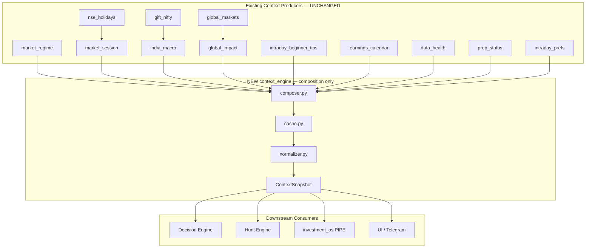

# 13 — Context Engine Architecture Review

**Role:** Chief Software Architect  
**Constitution:** [08_Final_Investment_OS_Architecture.md](./08_Final_Investment_OS_Architecture.md)  
**Migration Guide:** [09_Codebase_to_Architecture_Mapping.md](./09_Codebase_to_Architecture_Mapping.md)  
**Prerequisites:** Broker Truth ✅ · Evidence Engine ✅ · Decision Engine ✅  
**Scope:** Architecture review only — **no code changes**  
**Date:** 2026-07-15

---

## Executive Summary

**Verdict: YES — a Context Engine can be built primarily by composing existing modules.**

The codebase already contains ~18 modules mapped to Context Engine (CTX) in the Migration Guide. Most required signals exist but are **scattered**, **fetched repeatedly**, and use **inconsistent labels** for the same concepts (especially *regime*, *session*, and *volatility*).

The recommended approach is a **thin composition layer** — one public interface (`ContextSnapshot`) that orchestrates existing producers in parallel, normalizes field names, and caches once per session tick. **No wholesale rewrite** of underlying analyzers is required for v1.

| Metric | Finding |
|--------|---------|
| Modules reviewed | **24** context-related |
| Can compose without new logic | **~85%** of `ContextSnapshot` fields |
| Requires new thin adapter only | **~10%** (risk_mode normalization, trading_restrictions aggregation) |
| Genuinely missing in codebase | **~5%** (market breadth, industry-level strength) |
| Duplicate logic hotspots | **6** (regime, session, macro, volatility, sector, market status) |
| Estimated implementation risk | **Low–Medium** (composition + normalization, not greenfield) |

---

## Constitutional Alignment

The Constitution defines Context Engine as:

> **Question:** What world are we in — and is it a day to hunt?  
> **Verdicts:** `RISK-ON` · `NEUTRAL` · `RISK-OFF` · `CLOSED`  
> **Buffett overlay:** Context does not block SIP. It blocks **tactical stupidity**.

The proposed `ContextSnapshot` maps to Constitutional outputs as follows:

| ContextSnapshot field | Constitutional role |
|-----------------------|---------------------|
| `market_regime` | Dalio regime chessboard |
| `market_session` + `market_phase` | Hunt day open/closed |
| `macro_state` + `global_market_state` | Druckenmiller macro layer |
| `volatility_state` | Tactical risk environment |
| `sector_strength` | Sector rotation tailwind/headwind |
| `risk_mode` | Canonical `RISK-ON` / `NEUTRAL` / `RISK-OFF` / `CLOSED` |
| `trading_restrictions` | Tactical pool gates (timing, events, dams) |
| `confidence` | Context certainty (not trade conviction) |

Context Engine produces **environment state only** — not stock verdicts. Stock-level modules (`market_risk`, `relative_strength`, `signals`) feed Hunt/Judgment, not the top-level snapshot.

---

## Proposed Public Interface

### `ContextSnapshot`

Single canonical output object for all downstream engines (Hunt, Decision, Capital).

```python
@dataclass
class ContextSnapshot:
    timestamp: str                    # IST, composition time
    market_regime: str                # Canonical: Trending Bullish | Trending Bearish | Range-bound | Unknown
    market_phase: str                 # pre_market | opening | mid_session | wind_down | closed | weekend | holiday
    market_breadth: str               # broad | mixed | narrow | unknown
    volatility_state: str             # low | normal | elevated | high_fear | unknown
    liquidity_state: str              # normal | thin | unknown (market-wide proxy)
    market_session: dict              # from market_session_status()
    sector_strength: dict             # leader, laggard, ranked sectors
    industry_strength: dict           # placeholder / partial — see gaps
    macro_state: dict                 # VIX, FII/DII, flows summary
    global_market_state: dict         # spillover, bias, drivers
    risk_mode: str                    # RISK-ON | NEUTRAL | RISK-OFF | CLOSED
    trading_restrictions: list[str]   # human-readable gates
    confidence: float                 # 0–100 context confidence
    context_version: str              # e.g. "1.0"
    metadata: dict                    # errors, cache_age, source modules
```

### Public API (composition-only)

```python
def build_context_snapshot(
    *,
    market: str = "india",
    now: datetime | None = None,
    include_global: bool = True,
    use_cache: bool = True,
) -> ContextSnapshot:
    """Single entry point — parallel compose, normalize, cache."""
```

**Rule:** Downstream engines read `ContextSnapshot` only. They do not call `detect_nifty_regime()`, `market_session_status()`, etc. directly (migration over time).

---

## Existing Context Modules — Module-by-Module Review

### Tier 1 — Core context producers (KEEP as-is, compose)

#### `market_regime.py`

| Attribute | Detail |
|-----------|--------|
| **Purpose** | Nifty ADX-based trend vs range classification |
| **Responsibilities** | `detect_nifty_regime()`, `apply_regime_to_action()` |
| **Inputs** | Nifty daily OHLCV (^NSEI), ADX/+DI/-DI |
| **Outputs** | `MarketRegime` — regime label, allow_aggressive flags, banner/message |
| **Dependencies** | `data`, `indicators`, `varsity_knowledge` |
| **Calculates context?** | **Yes** — canonical regime |
| **Duplicates?** | **Yes** — see Duplicate Analysis |
| **Disposition** | **KEEP** — canonical `market_regime` source |

---

#### `market_session.py`

| Attribute | Detail |
|-----------|--------|
| **Purpose** | NSE session clock (open/closed/phase) |
| **Responsibilities** | `market_session_status()` |
| **Inputs** | Current IST time, `nse_holidays.is_nse_trading_day()` |
| **Outputs** | `{status, is_open, phase, next_session, time_ist, date}` |
| **Dependencies** | `nse_holidays` |
| **Calculates context?** | **Yes** — canonical session |
| **Duplicates?** | **Partial** — `session_phase`, `global_markets._session_label`, `intraday_beginner_tips` weekend checks |
| **Disposition** | **KEEP** — canonical `market_session` source |

---

#### `nse_holidays.py`

| Attribute | Detail |
|-----------|--------|
| **Purpose** | NSE trading calendar |
| **Responsibilities** | `is_nse_trading_day()`, `next_nse_trading_day()`, `skip_scheduled_job_reason()` |
| **Inputs** | Date, `data/intraday/nse_holidays.json` |
| **Outputs** | Boolean trading day, holiday labels |
| **Dependencies** | None (stdlib + JSON) |
| **Calculates context?** | **Yes** — session validity |
| **Duplicates?** | No |
| **Disposition** | **KEEP** — supporting calendar for session |

---

#### `india_macro.py`

| Attribute | Detail |
|-----------|--------|
| **Purpose** | India macro snapshot — VIX, sectors, FII/DII, premarket cues |
| **Responsibilities** | `build_india_macro_snapshot()`, `fetch_fii_dii()`, `_vix_regime()` |
| **Inputs** | Yahoo quotes, NSE FII/DII API, `gift_nifty` |
| **Outputs** | `IndiaMacroSnapshot` — vix, sectors, flows, sector leader/laggard |
| **Dependencies** | `gift_nifty`, `nse_session`, `cache_utils` |
| **Calculates context?** | **Yes** — macro + sector rotation + volatility |
| **Duplicates?** | **Partial** — VIX regime duplicated in `options_analytics`; sector ranking duplicated in `investment_os._sector_rankings` |
| **Disposition** | **KEEP** — canonical `macro_state` + `sector_strength` source |

---

#### `global_markets.py`

| Attribute | Detail |
|-----------|--------|
| **Purpose** | World index quotes and rough per-market session labels |
| **Responsibilities** | `fetch_global_snapshot()`, `fetch_quote()`, `_session_label()` |
| **Inputs** | Yahoo Finance (WORLD_INDICES list) |
| **Outputs** | `GlobalMarketSnapshot` with per-quote 1D/5m change |
| **Dependencies** | yfinance |
| **Calculates context?** | **Yes** — global quotes |
| **Duplicates?** | **Partial** — `_session_label()` overlaps `market_session` for India symbols |
| **Disposition** | **KEEP** — raw global quotes; session labels should not be authoritative for NSE |

---

#### `global_impact.py`

| Attribute | Detail |
|-----------|--------|
| **Purpose** | Global → India spillover model |
| **Responsibilities** | `build_india_impact_report()`, correlations, spillover score |
| **Inputs** | `global_markets` snapshot, Nifty history |
| **Outputs** | `IndiaImpactReport` — bias, spillover, predicted move, india_action, confidence |
| **Dependencies** | `global_markets`, numpy/pandas |
| **Calculates context?** | **Yes** — global market state + risk bias |
| **Duplicates?** | **Partial** — `macro_cache` wraps same report; `market_pulse` index scores overlap bias concept |
| **Disposition** | **KEEP** — canonical `global_market_state` source |

---

#### `gift_nifty.py`

| Attribute | Detail |
|-----------|--------|
| **Purpose** | Pre-open Nifty gap cue |
| **Responsibilities** | `fetch_gift_nifty_cue()` — Kite fut → Yahoo proxy |
| **Inputs** | Kite API or Yahoo Nifty |
| **Outputs** | `MacroQuote` gap proxy |
| **Dependencies** | `india_macro`, `kite_stream`, `zerodha` |
| **Calculates context?** | **Yes** — pre-open context |
| **Duplicates?** | Embedded in `india_macro` already |
| **Disposition** | **KEEP** — used via `india_macro`; no separate snapshot field needed |

---

#### `intraday_beginner_tips.py`

| Attribute | Detail |
|-----------|--------|
| **Purpose** | Session timing gates for MIS (9:45 observe, 2:30 wind-down, 3:20 square-off) |
| **Responsibilities** | `session_timing_advice()`, `build_capital_budget()` |
| **Inputs** | Current IST time |
| **Outputs** | `SessionTimingAdvice` — phase, allow_new_entries, prefer_exit |
| **Dependencies** | `penny_stocks` (constants only) |
| **Calculates context?** | **Yes** — intraday phase + trading restrictions |
| **Duplicates?** | **Partial** — overlaps `market_session` phase; capital budget overlaps CAP |
| **Disposition** | **SPLIT** — timing → CTX; capital budget → CAP Engine later |

---

#### `earnings_calendar.py`

| Attribute | Detail |
|-----------|--------|
| **Purpose** | Corporate event risk windows |
| **Responsibilities** | `fetch_corporate_event()`, risk bands, trading guidance |
| **Inputs** | Yahoo earnings dates |
| **Outputs** | `CorporateEvent` with risk_band |
| **Dependencies** | yfinance, `cache_utils` |
| **Calculates context?** | **Yes** — event risk (market-wide when Nifty50 batch fetched) |
| **Duplicates?** | Used inside `market_pulse_scan`, `market_risk`, `news_feed` |
| **Disposition** | **KEEP** — feeds `trading_restrictions` aggregator (not full snapshot field in v1) |

---

#### `data_health.py`

| Attribute | Detail |
|-----------|--------|
| **Purpose** | Live data feed quality context |
| **Responsibilities** | `build_data_health()` |
| **Inputs** | Kite status, `market_session`, provider router |
| **Outputs** | `DataHealth` — ok_for_live_cockpit, warnings |
| **Dependencies** | `kite_status`, `market_session`, `providers` |
| **Calculates context?** | **Yes** — data quality context |
| **Duplicates?** | No |
| **Disposition** | **KEEP** — metadata on snapshot (`metadata.data_health`) |

---

#### `prep_status.py`

| Attribute | Detail |
|-----------|--------|
| **Purpose** | "Is nightly prep complete?" user readiness flag |
| **Responsibilities** | `prep_status_for()`, `is_nightly_prep_complete()` |
| **Inputs** | JSON persistence, `trade_selection` |
| **Outputs** | Prep checklist dict |
| **Dependencies** | `watchlist_history`, `trade_selection` |
| **Calculates context?** | **Yes** — personal readiness (not market state) |
| **Duplicates?** | No |
| **Disposition** | **KEEP** — optional `metadata.prep_complete` on snapshot |

---

### Tier 2 — Orchestrators that already compose context (KEEP, refactor role)

#### `session_advisory.py`

| Attribute | Detail |
|-----------|--------|
| **Purpose** | Live pulse refresh — composes session, indices, macro, regime, global |
| **Responsibilities** | `fetch_pulse_live_update()`, `build_session_advisory()` |
| **Inputs** | Calls 5+ context modules in parallel |
| **Outputs** | `PulseLiveSnapshot` + markdown advisory |
| **Dependencies** | `market_session`, `market_pulse`, `india_macro`, `market_regime`, `global_impact` |
| **Calculates context?** | **Orchestrates** — closest existing prototype for Context Engine |
| **Duplicates?** | Re-fetches same data as `investment_os`, `morning_briefing`, `market_pulse_scan` |
| **Disposition** | **MERGE** → Context Engine composer (logic moves to `context_engine/` facade; prose advisory moves to Decision artifacts) |

---

#### `investment_os.py` (Market AI module only)

| Attribute | Detail |
|-----------|--------|
| **Purpose** | 7-module daily pipeline; Market AI = regime + bias |
| **Responsibilities** | `_regime_favor_avoid()`, `_sector_rankings()`, loads pulse via `_load_pulse()` |
| **Inputs** | `session_advisory` pulse, `detect_nifty_regime`, `session_timing_advice` |
| **Outputs** | `OSModule` headlines + session verdict (PREP/CLOSED/WAIT/TRADE OK) |
| **Dependencies** | Many — acts as pipeline orchestrator |
| **Calculates context?** | **Re-composes** context already in pulse |
| **Duplicates?** | Session verdict duplicates Decision Engine; sector ranking duplicates `india_macro` |
| **Disposition** | **SPLIT** — OS becomes thin PIPE consumer of `ContextSnapshot`; remove embedded context fetch |

---

#### `morning_briefing.py`

| Attribute | Detail |
|-----------|--------|
| **Purpose** | Morning digest assembling session, global, macro, regime, pulse scan |
| **Responsibilities** | `build_morning_briefing()` |
| **Inputs** | Same context modules + `run_market_pulse_scan` |
| **Outputs** | `MorningBriefing` dataclass |
| **Dependencies** | 6+ context modules |
| **Calculates context?** | **Re-composes** |
| **Duplicates?** | Full overlap with `session_advisory` + pulse scan header |
| **Disposition** | **MERGE** → consumer of `ContextSnapshot` + Hunt output |

---

#### `market_pulse_scan.py` (context header only)

| Attribute | Detail |
|-----------|--------|
| **Purpose** | Full universe scan — but also fetches regime, macro, indices at start |
| **Responsibilities** | `run_market_pulse_scan()` parallel fetch of regime/macro/indices |
| **Inputs** | `detect_nifty_regime`, `build_india_macro_snapshot`, `india_market_pulse` |
| **Outputs** | `MarketPulseReport` with embedded context + stock picks |
| **Dependencies** | 22+ modules |
| **Calculates context?** | **Re-composes** context then hunts |
| **Duplicates?** | Same triple-fetch as `session_advisory` |
| **Disposition** | **SPLIT** — context header → Context Engine; scan body → Hunt Engine |

---

### Tier 3 — Partial context contributors (KEEP with normalized role)

#### `market_risk.py`

| Attribute | Detail |
|-----------|--------|
| **Purpose** | Per-symbol risk assessment for beginners |
| **Responsibilities** | `assess_market_risk()`, `assess_nifty_market_risk()` |
| **Inputs** | Price df, fundamentals, `detect_nifty_regime` |
| **Outputs** | `MarketRiskAssessment` — risk_level, trend, beginner_verdict |
| **Dependencies** | `market_regime`, `earnings_calendar`, `options_analytics` |
| **Calculates context?** | **Per-symbol** — not market-wide |
| **Duplicates?** | `_trend_from_chart` overlaps `signals`/`market_pulse` scoring |
| **Disposition** | **SPLIT** — Nifty-level assessment feeds `volatility_state`; stock-level → Hunt/Judgment |

---

#### `options_analytics.py`

| Attribute | Detail |
|-----------|--------|
| **Purpose** | IV rank/percentile, PCR, OI buildup |
| **Responsibilities** | Options volatility analytics per chain |
| **Inputs** | NSE option chain, history |
| **Outputs** | `OptionsAnalytics` — iv_band, india_vix_regime |
| **Dependencies** | `nse_options`, `earnings_calendar` |
| **Calculates context?** | **Partial** — index-level IV context |
| **Duplicates?** | `india_vix_regime` duplicates `india_macro._vix_regime()` |
| **Disposition** | **KEEP** — secondary `volatility_state` enricher for options track |

---

#### `news_feed.py`

| Attribute | Detail |
|-----------|--------|
| **Purpose** | Stock-level NSE announcements + earnings |
| **Responsibilities** | `fetch_stock_news()` |
| **Inputs** | NSE corporate announcements API |
| **Outputs** | `StockNewsBundle` |
| **Dependencies** | `earnings_calendar`, `nse_session` |
| **Calculates context?** | **Per-symbol** event context |
| **Duplicates?** | Overlaps `earnings_calendar` |
| **Disposition** | **KEEP** — Hunt/Judgment input, not snapshot-level |

---

#### `macro_cache.py`

| Attribute | Detail |
|-----------|--------|
| **Purpose** | Daily-cached wrapper for `build_india_impact_report` |
| **Responsibilities** | `get_daily_india_macro()` |
| **Inputs** | `global_impact` |
| **Outputs** | Cached `IndiaImpactReport` |
| **Dependencies** | `global_impact`, `cache_utils` |
| **Calculates context?** | **Cache layer only** |
| **Duplicates?** | `india_macro` has own cache; two cache keys for macro |
| **Disposition** | **MERGE** → unified Context Engine cache (single TTL policy) |

---

#### `intraday_prefs.py`

| Attribute | Detail |
|-----------|--------|
| **Purpose** | User capital, risk %, beginner/equity modes |
| **Responsibilities** | `load_intraday_prefs()` |
| **Inputs** | JSON prefs |
| **Outputs** | `IntradayPrefs` |
| **Dependencies** | None |
| **Calculates context?** | **Personal context** — affects `risk_mode` and restrictions |
| **Duplicates?** | Spans CTX + CAP per Migration Guide |
| **Disposition** | **SPLIT** — personal gates → Context; sizing → Capital Engine |

---

### Tier 4 — Thin wrappers / UI adapters (MERGE)

#### `session_phase.py`

| Attribute | Detail |
|-----------|--------|
| **Purpose** | UI phase labels for Suggestions home |
| **Responsibilities** | `suggestions_ui_phase()`, `phase_banner_text()` |
| **Inputs** | `market_session_status()`, `watchlist_history` |
| **Outputs** | `pre_market | live | post_close | weekend` |
| **Calculates context?** | **Adapts** session — does not compute new state |
| **Duplicates?** | **Yes** — third session phase taxonomy |
| **Disposition** | **MERGE** → `market_session` extended phase enum + UI mapping table |

---

#### `market_pulse.py`

| Attribute | Detail |
|-----------|--------|
| **Purpose** | Index technical pulse + regime label from composite score |
| **Responsibilities** | `analyze_index()`, `india_market_pulse()`, `overall_market_verdict()` |
| **Inputs** | Index OHLCV, `signals.analyze()` |
| **Outputs** | `IndexPulse` with regime Bullish/Bearish/Neutral |
| **Calculates context?** | **Yes** — but uses different regime definition than ADX |
| **Duplicates?** | **Yes** — major regime duplication |
| **Disposition** | **SPLIT** — index TA scores → `market_breadth` input; remove `IndexPulse.regime` label or rename to `ta_bias` |

---

### Tier 5 — Not context engine (exclude from composition)

| Module | Reason |
|--------|--------|
| `watchlist_sector.py` | Watchlist concentration check — portfolio/hunt, not market sector strength |
| `relative_strength.py` | Stock vs benchmark — Hunt signal |
| `signals.py` / `fundamentals.py` / `combined.py` | Stock scoring — Hunt/Judgment |
| `candle_narrative.py` / `multi_timeframe.py` | Per-symbol TA — Hunt |
| `small_trader_intraday.py` | Holdings MIS scan — Hunt + presentation |
| `daily_advisor.py` | Holdings guidance — Judgment/orchestration |
| `portfolio_risk.py` / `risk.py` | Portfolio-level — Capital Engine |
| `autopilot_alerts.py` / `session_reminders.py` | Alert delivery — Supporting |

---

## Duplicate Analysis

### 1. Market regime (CRITICAL)

| Source | Definition | Labels |
|--------|------------|--------|
| `market_regime.detect_nifty_regime()` | ADX + DI | Trending Bullish / Bearish / Range-bound / Unknown |
| `market_pulse.analyze_index()` | Composite TA score | Bullish / Bearish / Neutral |
| `market_risk._trend_from_chart()` | SMA stack | Uptrend / Downtrend / Sideways |
| `global_impact._bias_from_score()` | Global spillover | BULLISH / BEARISH / NEUTRAL |

**Inconsistency:** Four modules use the word "regime" or "bias" with different methodologies. `strategy_synthesis`, `mis_trade_advisory`, and `investment_os` all call `detect_nifty_regime()` — but UI also shows `market_pulse` regime and `overall_market_verdict`.

**Resolution:** `ContextSnapshot.market_regime` = **ADX only** (`market_regime.py`). Rename pulse output to `index_ta_bias`. Map global bias to `global_market_state.bias`.

---

### 2. Session / phase (HIGH)

| Source | Phase labels |
|--------|--------------|
| `market_session` | pre_market, open, after_hours, weekend, holiday |
| `intraday_beginner_tips` | pre_open, opening, mid_session, wind_down, square_off, weekend |
| `session_phase` | pre_market, live, post_close, weekend |
| `global_markets._session_label` | Open / Closed per world market |

**Inconsistency:** Three IST session taxonomies for the same trading day. Decision Engine `MarketContext` uses `market_session` + `session_timing_advice` separately.

**Resolution:** `ContextSnapshot.market_session` = `market_session_status()`. `market_phase` = `session_timing_advice().phase` during live days; map closed days to `market_session.phase`.

---

### 3. Macro (MEDIUM)

| Source | What it fetches |
|--------|-----------------|
| `india_macro.build_india_macro_snapshot()` | VIX, sectors, FII/DII, gift cue |
| `global_impact.build_india_impact_report()` | Global quotes, spillover, correlations |
| `macro_cache.get_daily_india_macro()` | Cached global_impact only |
| `market_pulse_scan` | Fetches both india_macro + regime + indices in parallel |
| `session_advisory.fetch_pulse_live_update()` | Same parallel fetch |
| `morning_briefing` | Same again |

**Inconsistency:** No shared cache across orchestrators; macro fetched 3–5× per user session.

**Resolution:** Context Engine fetches once, caches 60s (live) / 24h (global impact). Deprecate `macro_cache` as separate entry point.

---

### 4. Volatility (MEDIUM)

| Source | Volatility signal |
|--------|-------------------|
| `india_macro._vix_regime()` | India VIX thresholds (12/15/20) |
| `options_analytics` | IV rank/percentile per chain + india_vix_regime |
| `market_risk` | ATR%, max drawdown per symbol |
| `intraday_stock_picker` | Per-stock volatility band |

**Inconsistency:** Market-wide VIX regime computed in two places with same thresholds.

**Resolution:** `ContextSnapshot.volatility_state` = `india_macro.vix_regime` normalized to enum. Options IV enriches `metadata.options_volatility` only.

---

### 5. Sector strength (MEDIUM)

| Source | Sector signal |
|--------|---------------|
| `india_macro` | sector_leader, sector_laggard from 8 Nifty sector indices |
| `investment_os._sector_rankings()` | Re-sorts macro sectors OR watchlist sector counts |
| `market_pulse_scan` | Embeds macro sectors in report |
| `watchlist_sector` | Concentration warning (different concept) |

**Inconsistency:** "Sector strength" sometimes means macro rotation, sometimes watchlist concentration.

**Resolution:** `ContextSnapshot.sector_strength` = `india_macro` leader/laggard/ranked list only.

---

### 6. Market status / risk mode (HIGH)

| Source | Status output |
|--------|---------------|
| `investment_os` | PREP / CLOSED / WAIT / TRADE OK / NO TRADE |
| `session_advisory` | market_verdict prose |
| `global_impact` | BULLISH / BEARISH / NEUTRAL + india_action text |
| Constitution | RISK-ON / NEUTRAL / RISK-OFF / CLOSED |

**Inconsistency:** No module emits Constitutional context verdicts. `investment_os` verdict overlaps Decision Engine.

**Resolution:** New thin **normalizer function** in Context Engine (not new data sources):

```
CLOSED      ← market_session.is_open == False
RISK-OFF    ← regime Trending Bearish OR spillover < -25 OR vix high_fear
RISK-ON     ← regime Trending Bullish AND spillover > 25 AND vix normal/low
NEUTRAL     ← default
```

---

## Gaps in Codebase vs ContextSnapshot

| Field | Status | Source / Gap |
|-------|--------|--------------|
| `timestamp` | ✅ Compose | `datetime.now(IST)` |
| `market_regime` | ✅ Compose | `market_regime.detect_nifty_regime()` |
| `market_phase` | ✅ Compose | `intraday_beginner_tips.session_timing_advice()` |
| `market_breadth` | ⚠️ **Derive** | No dedicated module. Approximate from `india_market_pulse()` avg score or pulse scan pick distribution. v1: `unknown` acceptable. |
| `volatility_state` | ✅ Compose | `india_macro.vix_regime` |
| `liquidity_state` | ⚠️ **Partial** | No market-wide liquidity index. v1: infer from `data_health` + session phase. Per-stock liquidity stays in Hunt. |
| `market_session` | ✅ Compose | `market_session_status()` |
| `sector_strength` | ✅ Compose | `india_macro` sectors |
| `industry_strength` | ❌ **Missing** | Only stock-level `industry` in `nse_data` / `alpha_ai_report`. No Nifty industry rotation module. v1: empty dict + GAP flag. |
| `macro_state` | ✅ Compose | `india_macro` |
| `global_market_state` | ✅ Compose | `global_impact` |
| `risk_mode` | ⚠️ **Normalize** | Thin adapter over regime + global + session (no new fetch) |
| `trading_restrictions` | ✅ Compose | Aggregate `session_timing_advice`, earnings critical bands, `prep_status`, loss dams from prefs |
| `confidence` | ✅ Compose | `global_impact.confidence` mapped to 0–100 |
| `context_version` | ✅ Trivial | Static version string |

**Conclusion:** 11/14 fields compose from existing modules today. 3 require derivation, normalization, or honest GAP labeling — not greenfield implementations.

---

## Reuse Opportunities

### Existing composition patterns to reuse

1. **`session_advisory.fetch_pulse_live_update()`** — Already parallel-fetches regime, macro, indices, global. **Best prototype** for Context Engine composer.

2. **`market_pulse_scan.run_market_pulse_scan()`** — ThreadPoolExecutor pattern for regime + macro + indices. Reuse executor layout, not full scan.

3. **`india_macro.build_india_macro_snapshot()`** — Already cached 60s via `cache_utils`.

4. **`global_impact.build_india_impact_report()`** — Already cached 24h via `macro_cache` (to be unified).

5. **`investment_os._load_pulse()`** — Already consumes `PulseLiveSnapshot`; becomes direct `ContextSnapshot` consumer.

6. **`DecisionEngine.MarketContext`** — Already accepts regime, session, timing. Maps 1:1 from `ContextSnapshot` subset.

### Fetch reduction estimate

| Current | After Context Engine |
|---------|---------------------|
| `investment_os` fetches pulse | Reads snapshot |
| `morning_briefing` fetches regime+macro+global | Reads snapshot |
| `market_pulse_scan` fetches regime+macro+indices | Reads snapshot; scan starts at stocks |
| `session_advisory` fetches all | Becomes `build_context_snapshot()` |
| `strategy_synthesis` calls regime+timing separately | Reads snapshot |

**Estimated duplicate fetch reduction: 60–70%** for context header data.

---

## Modules to Merge

| Merge target | Sources | Rationale |
|--------------|---------|-----------|
| **Context composer** | `session_advisory.fetch_pulse_live_update` + header of `market_pulse_scan` | Single orchestration point |
| **Session phase enum** | `session_phase` → `market_session` | One phase taxonomy |
| **Macro cache** | `macro_cache` → Context Engine cache layer | One TTL policy |
| **Advisory prose** | `session_advisory.build_session_advisory` → Decision Engine explainability | Context = facts only |
| **Sector display** | `investment_os._sector_rankings` → read `ContextSnapshot.sector_strength` | Remove re-sort logic |

---

## Modules to Keep (unchanged implementations)

| Module | Role in Context Engine |
|--------|------------------------|
| `market_regime.py` | `market_regime` field |
| `market_session.py` + `nse_holidays.py` | `market_session` field |
| `india_macro.py` | `macro_state`, `sector_strength`, `volatility_state` |
| `global_markets.py` | Input to global_impact |
| `global_impact.py` | `global_market_state` |
| `gift_nifty.py` | Via india_macro |
| `intraday_beginner_tips.py` | `market_phase`, `trading_restrictions` |
| `earnings_calendar.py` | Event restrictions (optional enrich) |
| `data_health.py` | Snapshot metadata |
| `prep_status.py` | Personal readiness metadata |
| `intraday_prefs.py` | Personal context inputs (partial) |
| `options_analytics.py` | Options track enrich (optional) |

---

## Modules to Remove (from Context concern — not delete code)

| Module | Action |
|--------|--------|
| `macro_cache.py` | Deprecate public API → internal cache in Context Engine |
| `session_phase.py` | Deprecate after phase enum merged into `market_session` |
| `market_pulse.overall_market_verdict()` | Demote to Hunt metadata — not context verdict |
| `session_advisory` markdown builder | Move to presentation/Decision — not Context Engine |

---

## Recommended Folder Structure

```
analyzer/
  context_engine/              # NEW — thin composition layer only
    __init__.py                # build_context_snapshot(), ContextSnapshot
    composer.py                # Parallel orchestration (from session_advisory pattern)
    normalizer.py              # risk_mode, volatility_state, phase mapping
    cache.py                   # Unified TTL (replaces macro_cache pattern)
    models.py                  # ContextSnapshot dataclass
    migration.py               # ContextSnapshot → DecisionEngine.MarketContext

  # Existing modules UNCHANGED — called by composer only
  market_regime.py
  market_session.py
  india_macro.py
  global_markets.py
  global_impact.py
  ...
```

**Principle:** `context_engine/` contains **zero market math**. All calculations stay in existing modules. Composer + normalizer only.

---

## Migration Plan

### Phase 0 — Document & freeze interfaces (this review)

- [x] Audit existing modules
- [ ] Approve `ContextSnapshot` schema
- [ ] Approve canonical regime = ADX (`market_regime` only)

### Phase 1 — Composition facade (P0)

1. Create `analyzer/context_engine/` with `build_context_snapshot()`
2. Implement composer by **extracting** `session_advisory.fetch_pulse_live_update()` logic
3. Add `normalizer.py` for `risk_mode`, `volatility_state`, `market_phase`
4. Unified cache (60s live / 24h global)
5. **No changes** to underlying modules

### Phase 2 — Consumer migration (P1)

| Consumer | Change |
|----------|--------|
| `investment_os.py` | Replace `_load_pulse()` with `build_context_snapshot()` |
| `decision_engine/migration.py` | `market_context_from_snapshot()` |
| `strategy_synthesis.py` | Read snapshot instead of direct regime/timing calls |
| `mis_trade_advisory.py` | Read snapshot for session/regime |
| `morning_briefing.py` | Read snapshot header |

### Phase 3 — Dedup cleanup (P2)

1. Merge `session_phase` into `market_session`
2. Deprecate `macro_cache` public API
3. Rename `IndexPulse.regime` → `ta_bias` in `market_pulse.py`
4. Remove parallel fetches from `market_pulse_scan` header

### Phase 4 — Gap fills (P3, optional)

1. `market_breadth` — advance/decline or pulse scan distribution (if needed)
2. `industry_strength` — only if Nifty industry index data added
3. `liquidity_state` — market-wide volume vs 20D average

---

## Implementation Order

```text
1. context_engine/models.py          — ContextSnapshot schema
2. context_engine/composer.py        — parallel compose (copy session_advisory pattern)
3. context_engine/normalizer.py      — risk_mode, phase, volatility enums
4. context_engine/cache.py           — unified TTL
5. context_engine/migration.py       — → DecisionEngine.MarketContext
6. Wire investment_os (highest visibility)
7. Wire decision_engine migration
8. Wire strategy_synthesis + mis_trade_advisory
9. Deprecate session_phase, macro_cache
10. Tests + docs 14_Migration_Step4_Context_Engine.md
```

---

## Estimated Risk

| Risk | Severity | Mitigation |
|------|----------|------------|
| Regime label confusion during migration | **High** | Freeze canonical ADX regime; rename pulse "regime" to `ta_bias` in docs first |
| Cache staleness during live session | **Medium** | 60s TTL + `metadata.cache_age_sec` on snapshot |
| `risk_mode` normalizer too simplistic | **Medium** | v1 rules documented; tunable without changing producers |
| Missing breadth/industry fields | **Low** | Explicit GAP in snapshot; Hunt unaffected |
| Orchestrator fetch regression | **Low** | Composer extracted from battle-tested `session_advisory` |
| Breaking UI during consumer migration | **Medium** | Parallel run: old pulse + new snapshot; compare in tests |
| Yahoo/NSE API failures | **Existing** | `metadata.errors[]` already pattern in india_macro/global_markets |

**Overall risk: Low–Medium** — Composition of proven modules, not new market logic.

---

## Architecture Diagram



---

## Final Answer

**Can the Context Engine be built primarily by composing existing modules?**

### Yes.

The codebase already implements ~85% of required context signals across 18+ modules. The missing work is:

1. **One thin composer** (pattern exists in `session_advisory.fetch_pulse_live_update`)
2. **One normalizer** for Constitutional `risk_mode` and consistent enums
3. **One cache policy** (pattern exists in `india_macro` + `macro_cache`)
4. **Consumer rewiring** to read `ContextSnapshot` instead of re-fetching
5. **Label cleanup** — stop calling four different things "regime"

No new market math is required for v1. Industry strength and market breadth are honest GAPs that can ship as `unknown` until dedicated data is added.

---

*Next step when approved: Migration Step 4 implementation plan (`14_Migration_Step4_Context_Engine.md`).*
