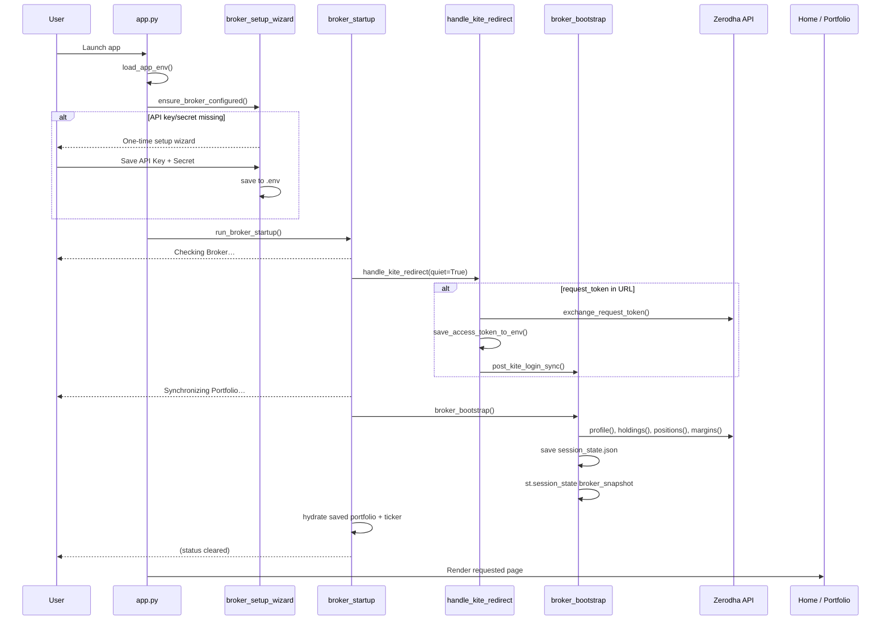
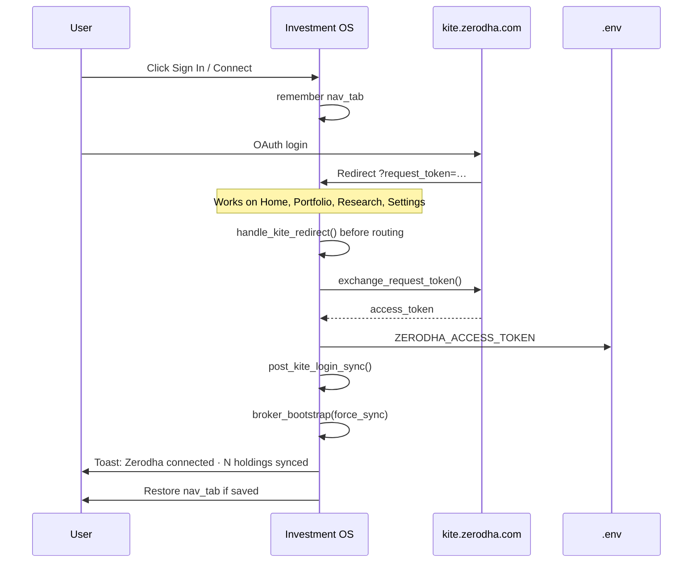

# Phase 1 — Personal Broker Connection Implementation

**Date:** 2026-07-16  
**Scope:** Broker Connection UX + Startup Experience only  
**Related:** [Personal_Broker_Experience.md](./Personal_Broker_Experience.md)

---

## Files Changed

| File | Change |
|------|--------|
| `ui/broker/__init__.py` | **New** — broker package exports |
| `ui/broker/state.py` | **New** — `BrokerSnapshot`, `data/broker/session_state.json` |
| `ui/broker/bootstrap.py` | **New** — `broker_bootstrap()`, verify + sync |
| `ui/components/broker_setup_wizard.py` | **New** — one-time API Key/Secret wizard |
| `ui/components/broker_startup.py` | **New** — startup pipeline before any page |
| `ui/components/broker_connect.py` | **New** — connect/reconnect gates (no API forms) |
| `ui/components/portfolio_broker_header.py` | **New** — Portfolio broker status strip |
| `app.py` | Unified startup; OAuth on Home; removed sidebar Kite forms |
| `ui/pages/zerodha.py` | Removed API forms; broker gate + header |
| `ui/components/kite_auth.py` | Quiet OAuth; user-friendly errors |
| `ui/components/kite_connect.py` | Sidebar stub (no forms) |
| `ui/components/kite_banner.py` | Sign-in only banner |
| `ui/components/empty_states.py` | Updated connect copy |
| `analyzer/kite_status.py` | User-facing messages (no sidebar references) |
| `analyzer/portfolio_live.py` | User-facing sync error message |
| `tests/test_broker_bootstrap.py` | **New** — bootstrap unit tests |

**Not modified:** Broker Truth, Context/Evidence/Decision/Learning engines, OAuth exchange logic, portfolio analysis.

---

## Startup Sequence Diagram



---

## OAuth Flow Diagram



---

## Manual Testing Checklist

### First-time setup
- [ ] Delete `ZERODHA_API_KEY` / `ZERODHA_API_SECRET` from `.env`
- [ ] Launch app → only setup wizard appears (no sidebar API fields)
- [ ] Enter API Key + Secret → Save → app continues without re-prompting

### Startup (configured + valid token)
- [ ] Launch app → brief “Checking Broker…” then “Synchronizing Portfolio…”
- [ ] Home opens without credential forms
- [ ] `data/broker/session_state.json` updated with last sync
- [ ] Portfolio shows broker header: Status, Last Sync, Value, P&L, Cash, Positions

### OAuth routing
- [ ] With `nav_tab=Home`, complete Zerodha login → token exchanged successfully
- [ ] With `nav_tab=My Portfolio`, complete login → returns and syncs
- [ ] No manual `request_token` paste required

### Disconnected / expired
- [ ] Remove/clear `ZERODHA_ACCESS_TOKEN` → Portfolio shows only “Broker not connected” + Connect
- [ ] Expired token → “Session expired” + Sign In (no API forms)

### Error handling
- [ ] Simulate network failure → “Internet unavailable” or “Unable to connect” (no Python traceback)
- [ ] Cached portfolio still visible on offline/error states

### Regression
- [ ] Portfolio analysis, Daily Advisor, Home dashboard unchanged in behavior
- [ ] No API Key fields on Home, Portfolio, or sidebar

---

## Test Results

```text
python -m unittest tests.test_broker_bootstrap -v
→ 10/10 passed

python -m unittest discover -s tests -p 'test_*.py'
→ 451 tests — 450 passed, 1 failed (pre-existing, unrelated)

Failure: test_watchlist_learning.TestWatchlistLearning.test_report_win_rate
  AssertionError: 0 != 8
```

Broker bootstrap tests: **10/10 OK**. Full suite: **450/451** (one unrelated watchlist learning failure).

---

## Migration Summary

| Before | After |
|--------|-------|
| API forms in sidebar + Portfolio | One-time wizard only when `.env` missing keys |
| Home skipped OAuth callback | OAuth runs before every page, including Home |
| Manual sync on Portfolio setup tab | Automatic `broker_bootstrap()` on startup |
| Developer messages / stack traces | User-facing broker states + Retry |
| `request_token` paste in UI | OAuth redirect only (Advanced CLI unchanged) |
| Shared-app profile name field | Removed — single-user `default` profile |

**Rollback:** Restore `render_kite_connect_sidebar()` in `app.py` and revert `ui/pages/zerodha.py` Kite Connect API mode if needed. Broker snapshot file is safe to delete.

---

*Phase 1 complete. Do not proceed to Phase 2 without explicit request.*
