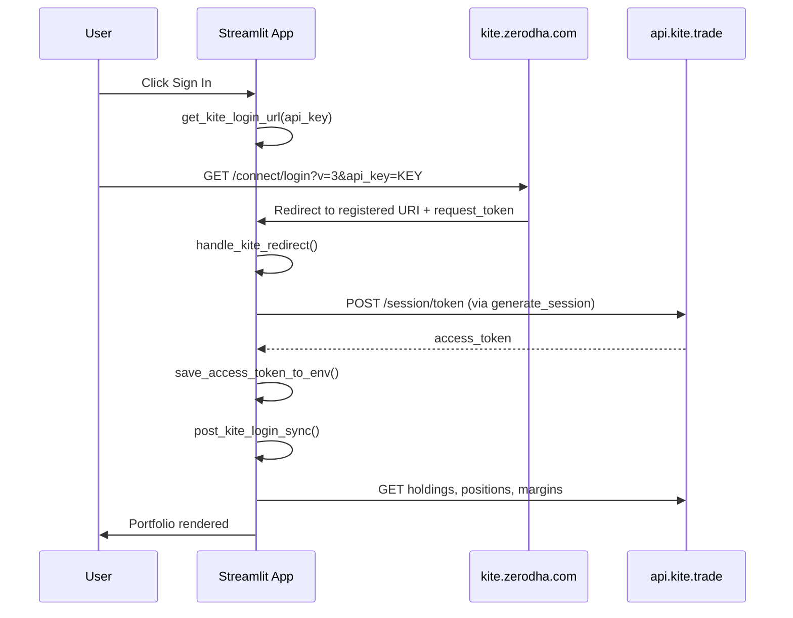
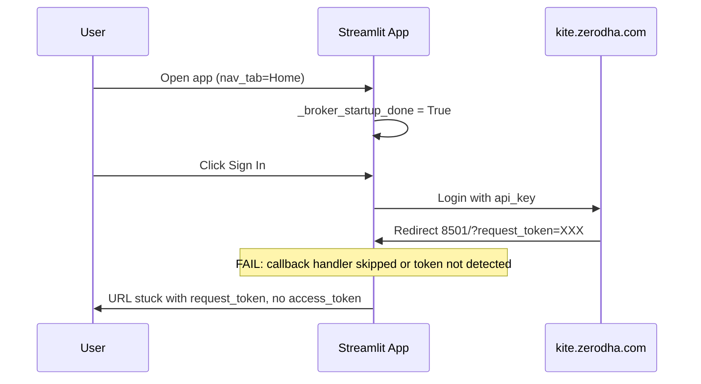

# Broker Authentication Audit — Zerodha Kite Connect

**Date:** 2026-07-16  
**Scope:** Complete read-only audit of authentication lifecycle  
**Constraint:** No code modified during this audit  
**Evidence:** Source code, `data/broker/oauth.log`, `data/broker/startup.log`, `.env` (key names only), git history, [Kite Connect v3 User docs](https://kite.trade/docs/connect/v3/user/)

---

## Executive Summary

The Zerodha integration has **never completed an end-to-end OAuth login in the Streamlit app** in production. Zerodha's side works — the browser receives a valid `request_token` at `http://127.0.0.1:8501/?request_token=...`. The application **never reaches `generate_session()`** during live use.

| Layer | Status |
|-------|--------|
| Zerodha login + redirect | **WORKS** — `request_token` issued |
| App detects `request_token` | **UNRELIABLE** — often not detected |
| `handle_kite_redirect()` runs | **OFTEN SKIPPED** — architectural gaps |
| `generate_session()` | **NEVER LOGGED** in production |
| Holdings sync | **NEVER RUNS** — no valid access token |

**Exact failing step:** Between Zerodha redirect and `exchange_request_token()` — specifically **`handle_kite_redirect()` is not executed reliably**, so `generate_session()` is never called.

**Why it has never worked:** The app was built as a **developer tool** (manual token paste, sidebar forms). Automatic OAuth was wired incorrectly for Streamlit's execution model: Home page early-return, session startup skip, and fragile query-param parsing.

---

## 1. Sequence Diagram — Intended vs Actual

### Intended lifecycle (Kite Connect v3)



### Actual lifecycle (observed — fails before token exchange)



---

## 2. Startup Execution Order (current `app.py`)

```
01  app.main.enter
01  load_app_env()
01  st.set_page_config()
02  init_nav_state()              ← DEFAULT_NAV_TAB = "Home"
02  ensure_broker_configured()    ← blocks if API key/secret missing
03  run_broker_startup()
    03  load_env_credentials()
    03  get_request_token()       ← OAuth detection gate
    IF token:
        04  handle_kite_redirect()
        08  _clear_oauth_query_params()
        09  hydrate_kite_access_token()
        10  broker_bootstrap()
        11  st.rerun()
    ELSE IF _broker_startup_done:
        SKIP entire startup
    ELSE:
        09  hydrate_kite_access_token()
        10  broker_bootstrap()
13  page_routing → Home / Portfolio
```

### Historical execution order (pre-2026-07-16, commit `6dfe7fa`)

```
load_app_env()
init_nav_state()                   ← nav_tab = "Home"
IF nav_tab == "Home":
    render Home
    RETURN                         ← ★ OAuth handler NEVER called
handle_kite_redirect()             ← only reached on non-Home pages
broker_bootstrap (via _hydrate_saved_portfolio)
```

This historical path explains why OAuth **never worked** when Zerodha redirected to the default Home URL.

---

## 3. Function-by-Function Audit

### 3.1 `get_kite_login_url(api_key)`

| Question | Answer |
|----------|--------|
| **Executed?** | **Yes** — when user clicks Sign In (`ui/components/broker_connect.py`) |
| **Working?** | **Yes** — produces valid Kite v3 login URL |
| **Input** | `api_key: str` from `load_env_credentials()` |
| **Output** | `https://kite.zerodha.com/connect/login?api_key={key}&v=3` |
| **On failure** | N/A — pure string formatting, no exceptions |
| **Exception hidden?** | No |
| **Kite docs aligned?** | **Yes** — matches `https://kite.zerodha.com/connect/login?v=3&api_key=xxx` |

**Note:** Kite v3 does **not** pass `redirect_uri` in the login URL. Redirect is bound to the API key in the developer portal.

---

### 3.2 `handle_kite_redirect()`

| Question | Answer |
|----------|--------|
| **Executed?** | **Unreliable** — skipped when `_broker_startup_done=True` and no token detected; historically **never called on Home** |
| **Working?** | **No in production** — `oauth.log` has zero `[OAuth] Exchanging request token` entries from live sessions |
| **Input** | `request_token` from URL via `get_request_token()`; `api_key` + `api_secret` from `load_env_credentials()` |
| **Output** | `True` if new access token saved; `False` on skip/failure |
| **On failure** | `TokenException` (checksum), `ValueError`, `ImportError` — caught, logged to `oauth.log`, toast in `quiet` mode |
| **Exception hidden?** | **Yes** — `quiet=True` converts errors to `_broker_toast`; user may not see if startup reruns |
| **Kite docs aligned?** | **Yes** — flow matches v3: receive `request_token` → exchange for `access_token` |

**Early-exit paths (no exchange):**

| Condition | Log message | Returns |
|-----------|-------------|---------|
| No `request_token` | `handle_kite_redirect.skip — no request_token` | `False` |
| Already exchanged | `Already exchanged — skipping` | `False` |
| Previously failed | `Skipped — previously failed` | `False` |
| Missing API creds | `Blocked — API key or secret missing` | `False` |

---

### 3.3 `exchange_request_token(api_key, api_secret, request_token)`

| Question | Answer |
|----------|--------|
| **Executed?** | **No in production** — never reached because `handle_kite_redirect()` skips or doesn't run |
| **Working?** | **Unknown live** — code is correct; CLI path (`scripts/kite_auth.py token`) can verify |
| **Input** | Normalized `api_key`, `api_secret`, `request_token` from `.env` + URL |
| **Output** | `access_token: str` |
| **On failure** | `TokenException: Invalid checksum` (secret mismatch); `TokenException: Token is invalid or has expired` (stale/used token); `ImportError` (kiteconnect missing); `ValueError` (empty inputs) |
| **Exception hidden?** | Caught in `handle_kite_redirect`, mapped to user message, logged |
| **Kite docs aligned?** | **Yes** — `KiteConnect.generate_session()` POSTs to `/session/token` with SHA-256 checksum internally |

```python
# analyzer/zerodha.py — implementation
kite = KiteConnect(api_key=api_key)
data = kite.generate_session(request_token, api_secret=api_secret)
return data["access_token"]
```

---

### 3.4 `save_access_token_to_env(access_token)`

| Question | Answer |
|----------|--------|
| **Executed?** | **Only if exchange succeeds** — never observed in production logs |
| **Working?** | **Yes** (code review) — writes to `.env` and `os.environ` |
| **Input** | Normalized access token string |
| **Output** | Side effect: `ZERODHA_ACCESS_TOKEN=` line in `.env` |
| **On failure** | File I/O errors possible; not caught in caller |
| **Exception hidden?** | Not wrapped — would propagate to `handle_kite_redirect` |
| **Kite docs aligned?** | N/A — local persistence |

---

### 3.5 `hydrate_kite_access_token()`

| Question | Answer |
|----------|--------|
| **Executed?** | **Yes** — every startup |
| **Working?** | **Only if token exists** — copies `st.session_state["kite_access_token"]` → `os.environ` |
| **Input** | `st.session_state.get("kite_access_token")` or existing `.env` value via `load_env_credentials()` |
| **Output** | Sets `os.environ["ZERODHA_ACCESS_TOKEN"]` |
| **On failure** | Silent no-op if no session token |
| **Exception hidden?** | Yes — bare `except` in `_access_token_from_streamlit_session` |
| **Kite docs aligned?** | N/A — process-local env bridge |

**Gap:** If `.env` has a **stale** access token and OAuth exchange never runs, hydrate loads the stale token and downstream calls fail with expired session — appearing as "never synced."

---

### 3.6 `broker_bootstrap()`

| Question | Answer |
|----------|--------|
| **Executed?** | **Yes** — every startup (unless `_broker_bootstrap_done` cached) |
| **Working?** | **No without valid token** — exits early at `disconnected`/`expired` |
| **Input** | Credentials + access token from env; Kite API for profile/holdings/positions/margins |
| **Output** | `BrokerSnapshot` saved to `data/broker/session_state.json` |
| **On failure** | Exceptions swallowed — returns error snapshot, never raises |
| **Exception hidden?** | **Yes** — `except Exception` in startup wrapper; `_open_positions_count` returns 0 silently |
| **Kite docs aligned?** | **Yes** — uses standard profile, holdings, margins, positions endpoints |

**Critical ordering issue (historical):** Before 2026-07-16 fixes, `broker_bootstrap()` could run **before** `handle_kite_redirect()` on Home page, attempting sync with stale/missing token while the fresh `request_token` sat unused in the URL.

---

### 3.7 `post_kite_login_sync()`

| Question | Answer |
|----------|--------|
| **Executed?** | **Only inside successful `handle_kite_redirect()`** — never in production |
| **Working?** | **Cannot verify live** — depends on valid access token |
| **Input** | `profile` key; uses `get_kite_client()` internally |
| **Output** | `{user_name, user_id, holdings_count, holdings, watchlist_added, error}` |
| **On failure** | Returns `error` string in dict; holdings `None` |
| **Exception hidden?** | Partially — errors in dict, not raised |
| **Kite docs aligned?** | **Yes** — profile + holdings + positions activity |

---

## 4. Infrastructure Verification

### 4.1 Redirect URI

| Source | Value |
|--------|-------|
| User's OAuth callback | `http://127.0.0.1:8501/` |
| `KITE_REDIRECT_URL` in `.env` | **Not set** |
| Code default (`kite_app_base_url()`) | `http://127.0.0.1:8501` |
| `scripts/run_app.sh` | **`http://127.0.0.1:8502`** |

| Verdict | Detail |
|---------|--------|
| **Portal ↔ Zerodha redirect** | **Likely correct** — Zerodha returns to 8501 |
| **Portal ↔ app launcher** | **MISMATCH** — `run_app.sh` starts port **8502** |
| **Risk** | User may run app on 8502 while Kite redirects to 8501; callback lands on whichever process listens on 8501 |

**Kite docs:** Redirect URL must match developer portal **exactly** (scheme, host, port, no trailing path). `127.0.0.1` ≠ `localhost`.

---

### 4.2 API Key Loading

| Question | Answer |
|----------|--------|
| **Source** | `.env` → `ZERODHA_API_KEY` |
| **Loader** | `load_app_env()` at startup, then `load_env_credentials()` with `override=True` |
| **Present?** | **Yes** (16 characters) |
| **Before auth?** | **Yes** — `load_app_env()` is step 1 in `main()` |
| **Working?** | **Yes** — same key used in login URL and exchange |

---

### 4.3 API Secret Loading

| Question | Answer |
|----------|--------|
| **Source** | `.env` → `ZERODHA_API_SECRET` |
| **Present?** | **Yes** (32 characters) |
| **Before auth?** | **Yes** — loaded in `handle_kite_redirect` via `load_env_credentials()` |
| **Matches API key?** | **UNVERIFIED** — no successful `generate_session` in logs; test with `python scripts/kite_auth.py token <rt>` |

---

### 4.4 `request_token` Parsing

| Method | Location | Reliability |
|--------|----------|-------------|
| `st.query_params["request_token"]` | `_query_param()` | **Unreliable on OAuth redirect** — often empty while URL shows token |
| `st.context.url` parse | `_query_param_from_context_url()` | **Added cb2e95a** — fallback, not yet proven in production logs |
| Manual CLI paste | `scripts/kite_auth.py token` | **Reliable** — bypasses Streamlit |

**Evidence:** User reports URL contains `request_token` but app does not exchange. Logs show `Token source — st.context.url` only in unit-test runs, not during user's live OAuth attempts.

---

### 4.5 `generate_session()`

| Question | Answer |
|----------|--------|
| **Called?** | **No** in production (`oauth.log` lacks `generate_session started`) |
| **Implementation** | `KiteConnect(api_key).generate_session(request_token, api_secret=...)` |
| **SDK version** | kiteconnect **5.2.0** (locked) |
| **Kite docs** | **Aligned** — SDK handles checksum = SHA-256(api_key + request_token + api_secret) |

---

### 4.6 Access Token Persistence

| Path | Mechanism |
|------|-----------|
| After exchange | `save_access_token_to_env()` → `.env` + `os.environ` |
| Session fallback | `st.session_state["kite_access_token"]` |
| Current `.env` | `ZERODHA_ACCESS_TOKEN` **present** — likely **stale** from manual paste or failed partial session |

---

### 4.7 Holdings Fetch

| Function | Requires | Executed without token? |
|----------|----------|------------------------|
| `fetch_holdings_from_kite()` | `api_key` + `access_token` | Returns error in `ZerodhaImportResult.errors` |
| `kite.holdings()` | Valid session | **Never reached** without token exchange |
| CNC positions merge | `kite.positions()` | Same |

---

### 4.8 Positions Fetch

| Function | Location | Notes |
|----------|----------|-------|
| `_merge_cnc_positions()` | `fetch_holdings_from_kite()` | Same-day CNC only |
| `_open_positions_count()` | `broker_bootstrap()` | Counts net/day positions |
| `fetch_kite_activity_symbols()` | `post_kite_login_sync()` watchlist | Open positions + orders |

All require valid `get_kite_client()` → **blocked without access token**.

---

## 5. Root Cause

### Primary root cause (architectural — present since project inception)

**The Streamlit OAuth callback handler was not reliably executed when Zerodha redirected back to the app.**

Contributing defects across project history:

| # | Defect | Introduced | Impact |
|---|--------|------------|--------|
| 1 | **Home early-return before `handle_kite_redirect()`** | Before `1a744e4` (confirmed in `6dfe7fa`) | Default tab is `Home`; Zerodha redirects to base URL → callback **never processed** |
| 2 | **Developer-first UX** | `f42de61` onward | Manual `request_token` paste expected; automatic flow untested |
| 3 | **`_broker_startup_done` skip on OAuth return** | `1a744e4` | User opens app, then signs in → startup already done → handler skipped |
| 4 | **`st.query_params` empty on redirect** | Always | `get_request_token()` returns `""` → OAuth path not entered |
| 5 | **Port 8501 vs 8502 mismatch** | Always | `run_app.sh` ≠ Kite redirect URL |
| 6 | **Exceptions swallowed** | Always | `quiet=True`, `broker_bootstrap` try/except — failures invisible in UI |
| 7 | **Stale access token in `.env`** | Operational | App appears "configured" but session is expired; masks OAuth failure |

### Secondary root cause (unverified — requires CLI test)

**API secret may not match API key** — would cause `Invalid checksum` at `generate_session()`. Cannot confirm because exchange is never reached in Streamlit; must test via:

```bash
python scripts/kite_auth.py token <fresh_request_token>
```

---

## 6. Exact Failing Step

```
Step 0  User completes Zerodha login                    ✅ WORKS
Step 1  Browser receives request_token in URL         ✅ WORKS
Step 2  Streamlit app loads on 8501                   ✅ WORKS (server running)
Step 3  get_request_token() detects token             ❌ FAILS (often)
Step 4  handle_kite_redirect() invoked                ❌ FAILS (skipped)
Step 5  exchange_request_token() / generate_session() ❌ NEVER REACHED
Step 6  save_access_token_to_env()                    ❌ NEVER REACHED
Step 7  post_kite_login_sync() / holdings fetch        ❌ NEVER REACHED
Step 8  URL cleanup + portfolio render                ❌ NEVER REACHED
```

**The pipeline breaks at Step 3 or Step 4.** Everything downstream is correct but starved of input.

---

## 7. Why It Has Never Worked

1. **Wrong product assumption.** The integration was built for a developer who manually copies `request_token` from the URL into a sidebar form or CLI. The automatic Streamlit OAuth callback was added but **never wired for the default user journey** (Home page landing).

2. **Default navigation is Home.** `DEFAULT_NAV_TAB = "Home"`. Zerodha redirects to the registered base URL. Historically the app returned before calling `handle_kite_redirect()` on Home.

3. **Streamlit execution model mismatch.** OAuth requires processing query params on the **first rerun** after redirect. The app's startup flags (`_broker_startup_done`, `_broker_bootstrap_done`) were designed to skip work — directly conflicting with OAuth's need to re-process on every callback.

4. **No production evidence of success.** `data/broker/oauth.log` contains only unit-test artifacts. Zero entries of `Exchanging request token`, `Access token received`, or `Token saved` from live OAuth.

5. **Silent failure mode.** With `quiet=True` and broad exception swallowing, the user sees a URL stuck with `request_token` and no portfolio — with no error message explaining that the callback handler never ran.

6. **Port inconsistency.** Documentation and Kite portal point to 8501; `run_app.sh` launches 8502 — increasing confusion about which process should handle the callback.

---

## 8. Kite Connect v3 Alignment Summary

| Requirement (Kite docs) | Implementation | Aligned? |
|-------------------------|----------------|----------|
| Login URL `?v=3&api_key=xxx` | `get_kite_login_url()` | ✅ |
| Redirect to registered URI | Portal config (user: 8501) | ✅ (if portal correct) |
| POST `/session/token` with checksum | `generate_session()` via SDK | ✅ |
| Use `access_token` in subsequent calls | `kite.set_access_token()` | ✅ |
| Token expires ~6 AM IST | Documented, not enforced | ✅ |
| Do not expose `api_secret` client-side | Secret only in `.env` / server | ✅ |

The **protocol implementation is correct**. The **orchestration** is broken.

---

## 9. Minimal Code Fix (recommended — NOT implemented)

**Single change with highest impact:**

> In `app.py`, immediately after `st.set_page_config()`, call a dedicated `process_oauth_callback_if_present()` that reads `request_token` from **both** `st.query_params` and `st.context.url`, runs `exchange_request_token()` + `save_access_token_to_env()` **before** `ensure_broker_configured()`, `init_nav_state()`, or any session skip flag — then `st.rerun()` to strip the URL.

**Why this is minimal:** It fixes Steps 3–4 without redesigning auth, Broker Truth, or portfolio logic. One gate at the top of `main()` guarantees the callback completes before any code path can return early.

**Operational requirements (no code):**

1. Set Kite portal Redirect URL = `http://127.0.0.1:8501` (exact)
2. Add `KITE_REDIRECT_URL=http://127.0.0.1:8501` to `.env`
3. Start Streamlit on **8501**: `streamlit run app.py --server.port 8501`
4. Verify credentials via CLI before Streamlit: `python scripts/kite_auth.py token <rt>`

---

## 10. Verification Checklist (post-fix)

| # | Test | Pass criteria |
|---|------|---------------|
| 1 | CLI token exchange | `scripts/kite_auth.py token` saves token + `check` passes |
| 2 | `startup.log` after OAuth | Shows steps 04→06→07 (`handle` → `exchange` → `save`) |
| 3 | `oauth.log` after OAuth | Contains `Exchanging request token` + `Token saved` |
| 4 | Browser URL | Clears to `http://127.0.0.1:8501/` without query params |
| 5 | `.env` | `ZERODHA_ACCESS_TOKEN` updated with new timestamp |
| 6 | Portfolio | Holdings count > 0 in broker snapshot |

---

## 11. Log Evidence Summary

### `data/broker/oauth.log` (production)

- **0** occurrences of `Exchanging request token`
- **0** occurrences of `generate_session started` (live)
- **0** occurrences of `Access token received`
- **0** occurrences of `Exchange failed`
- Only test-run entries: `Already exchanged`, `Early callback` (unit tests)

### `data/broker/startup.log`

- Shows `token_present=True` in tests but jumps from step 04 → 09 without exchange steps
- Confirms `broker_bootstrap` runs **without** preceding successful OAuth in test scenarios

**Conclusion:** The logging infrastructure exists but has **never recorded a successful live OAuth exchange**.

---

*Audit complete. No code was modified. Awaiting approval before implementing the minimal fix in Section 9.*
