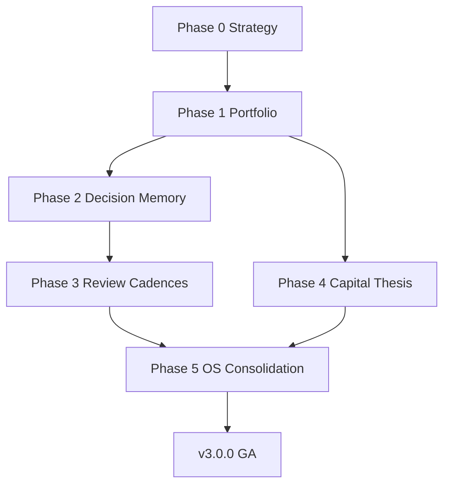

# APEX V3 — Roadmap

**Document ID:** APEX-V3-ROADMAP  
**Version:** 0.8  
**Status:** ACTIVE — Sprints T–V shipped (v3.0.0-rc1 prep)  
**Date:** 2026-08-11  
**Owner:** Product  
**Parent:** [APEX_V3_PRODUCT_STRATEGY.md](./APEX_V3_PRODUCT_STRATEGY.md)  
**Baseline:** v2.0.0 GA

---

## Program Overview

APEX V3 extends the **Daily Decision Experience** (V2 GA) into a full **Investment Operating System** — portfolio intelligence, decision memory, and review cadences — without violating frozen architecture or product constitution.

**Program duration:** ~18 months (Q4 2026 → Q4 2027)  
**Release model:** Milestone tags (`v3.0.0-alpha`, `v3.0.0-beta`, `v3.0.0`)  
**Quality bar:** Regression gate + full suite 100%; no undocumented failures

---

## Phase Map

```text
2026 Q4          2027 Q1          2027 Q2          2027 Q3          2027 Q4
    │                │                │                │                │
    ▼                ▼                ▼                ▼                ▼
 Phase 0          Phase 1          Phase 2          Phase 3          Phase 4–5
 Strategy         Portfolio        Decision         Review           Capital +
 (NOW)            Intelligence     Memory           Cadences         OS Nav
```

---

## Phase 0 — Product Vision & Strategy ✅

| ID | Deliverable | Status |
|----|-------------|--------|
| V3-P0-001 | Product Strategy | ✅ Approved |
| V3-P0-002 | Roadmap | ✅ Approved |
| V3-P0-003 | Information Architecture | ✅ Approved |
| V3-P0-004 | Feature Backlog | ✅ Approved |
| V3-P0-005 | Product Review sign-off | ✅ Approved |

**Exit criteria:** Product Review approved; no production code ✅

---

## Phase 1 — Portfolio Intelligence (Q4 2026) — IN PROGRESS

**Theme:** Answer *"What do I own and is it healthy?"*

| ID | Milestone | Outcome | Status |
|----|-----------|---------|--------|
| **V3-101** | **Portfolio Command Center** | Overview screen, contracts, assembly, Understand SSOT | **✅ Shipped** |
| **V3-102** | **Holdings Experience** | Inventory ledger, search/filter/sort, row Understand, watchlist | **✅ Shipped** |
| **V3-103** | **Portfolio Review** | Theme-first review queue, explanation, Understand, Research handoff | **✅ Shipped** |
| V3-104 | Allocation indicators | Policy drift vs bucket tags per row | **✅ Shipped** |
| V3-105 | Health scoring surface | Reuse APS-005 patterns at portfolio level | **✅ Shipped** |
| V3-106 | Integration tests | Render-level; 100% gate | ✅ 69-test gate |

**Dependencies:** Zerodha connected; existing portfolio use cases  
**Non-goals:** Rebalance execution; tax optimization

**Target tag:** `v3.0.0-alpha1`

---

## Phase 2 — Research & Decision Memory (Q1 2027) — IN PROGRESS

**Theme:** *"Should I invest in this company?"* · *"What did I decide and what happened?"*

| ID | Milestone | Outcome | Status |
|----|-----------|---------|--------|
| **V3-201** | **Research Workbench** | 7-question workflow, Investment Decision, Understand, Proof | **✅ Shipped** |
| **V3-202** | **Research Journal Integration** | Draft → confirm → immutable entry; Timeline · Drafts · Entry Detail | **✅ Shipped** |
| V3-203 | Decision Receipt | Immutable receipt on ACT/WAIT with proof link | **✅ Shipped** |
| V3-204 | Weekly Review | Sunday ritual; broker reconcile | **✅ Shipped** |
| V3-205 | Journal page shell | Trade log integration; Receipts sub-tab | **✅ Shipped (merged into Review)** |
| V3-206 | Discipline metrics | Process score (not P&L leaderboard) | **✅ Shipped (trends)** |

**Target tag:** `v3.0.0-alpha2`

---

## Phase 3 — Review Cadences (Q2 2027)

**Theme:** *"Am I on track this month/quarter?"*

| ID | Milestone | Outcome | Status |
|----|-----------|---------|--------|
| V3-301 | Monthly Portfolio Doctor | Drift, concentration, sacred core check | **✅ Shipped** |
| V3-302 | Quarterly review | Thesis + goal progress | **✅ Shipped** |
| V3-303 | Review contracts | Shared compositor for cadence surfaces | **✅ Shipped** |
| V3-304 | Notification hooks | Optional Telegram/email digest (existing infra) | **✅ Shipped (v1)** |

**Target tag:** `v3.0.0-beta1` — criteria met; GA hardening in Sprint S

---

## Phase 4 — Capital & Thesis (Q3 2027)

**Theme:** *"Where does new money go?"*

| ID | Milestone | Outcome | Status |
|----|-----------|---------|--------|
| V3-401 | New Capital workflow | UX-004 implemented | **✅ Shipped (v2 tranches)** |
| V3-402 | Thesis Tracker | Per-symbol thesis + invalidation | **✅ Shipped** |
| V3-403 | Investment Book | Long-form thesis storage (read-only export) | **✅ Shipped** |
| V3-404 | Explore integration | Screener → Research → Today handoff | **✅ Shipped** |

**Target tag:** `v3.0.0-beta2`

---

## Phase 5 — OS Consolidation (Q4 2027)

**Theme:** One Investment OS; retire legacy tabs

| ID | Milestone | Outcome | Status |
|----|-----------|---------|--------|
| V3-501 | 5-page nav GA | Today · Portfolio · Research · Review · You | **✅ Shipped** |
| V3-502 | Legacy tab redirects | All bookmarks preserved | **✅ Shipped** |
| V3-503 | Investor DNA v1 | Profile + behavior summary | **✅ Shipped** |
| V3-504 | Contextual Learning | Lessons tied to user verdicts | **✅ Shipped** |
| V3-505 | V3 GA hardening | RC pattern; docs freeze | **✅ RC prep** |

**Target tag:** `v3.0.0-rc1` — run `npm run rc:checklist` before tag

---

## Cross-cutting tracks (all phases)

| Track | Owner | Notes |
|-------|-------|-------|
| **Quality** | Engineering | Extend 54-test gate; integration tests per milestone |
| **Accessibility** | UX + Eng | WCAG baseline maintained |
| **Documentation** | Product | ETS per milestone; APEX-015+ series |
| **Design system** | UX | Extend V2 tokens; no duplicate CSS |
| **Trust / Proof** | Product | Expand proof overlay to portfolio |

---

## V2 maintenance window

During V3 program, V2 GA receives:

- P0 bug fixes only on frozen surfaces
- No hierarchy changes to Home Command Center
- Dependency / CI hygiene (V2.1 pattern)

---

## Milestone dependency graph



---

## Release train

| Tag | Phase | Expected |
|-----|-------|----------|
| — | Phase 0 docs | 2026-08-06 ✅ |
| **V3-101** | **Portfolio Command Center** | **2026-08-06 ✅** |
| **V3-102** | **Holdings Experience** | **2026-08-06 ✅** |
| **V3-103** | **Portfolio Review** | **2026-08-06 ✅** |
| **V3-201** | **Research Workbench** | **2026-08-06 ✅** |
| **V3-202** | **Research Journal Integration** | **2026-08-06 ✅** |
| `v3.0.0-alpha1` | Portfolio Intelligence (remaining) | 2026-12 |
| `v3.0.0-alpha2` | Decision Memory | 2027-03 |
| `v3.0.0-beta1` | Review Cadences | 2027-06 |
| `v3.0.0-beta2` | Capital & Thesis | 2027-09 |
| **`v3.0.0`** | OS Consolidation GA | 2027-12 |

---

## Open decisions (Product Review)

1. Trades dock → Journal vs Home sub-route?
2. Session ribbon — wire or remove in V3.1 maintenance?
3. Alpha AI — Research-only or also Portfolio drill-down?
4. Investor DNA — Phase 5 or separate V3.1 program?
