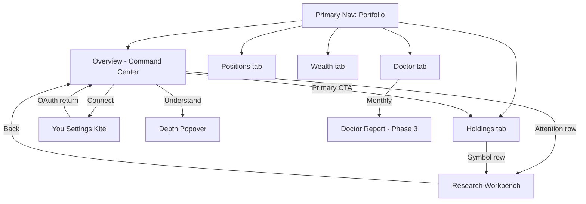

# V3 Portfolio Command Center — Product & UX Design

**Document ID:** V3-PCC-001  
**Version:** 0.1  
**Status:** DRAFT — Phase 1 Design  
**Date:** 2026-08-06  
**Owner:** Product · UX · Architecture  
**Baseline:** v2.0.0 GA (frozen — no production changes)  
**Parent:** [APEX_V3_PRODUCT_STRATEGY.md](./APEX_V3_PRODUCT_STRATEGY.md) · [APEX_V3_INFORMATION_ARCHITECTURE.md](./APEX_V3_INFORMATION_ARCHITECTURE.md)  
**Screen ID:** SCR-P-001 (Portfolio › Overview — default landing)

---

## Design Questions — Answers

| # | Question | Answer |
|---|----------|--------|
| 1 | What should the investor see first? | **Portfolio Health Hero** — a single plain-language verdict: *healthy*, *needs attention*, or *connect broker*. Not total value. Not P&L. |
| 2 | What deserves the largest visual emphasis? | The **health verdict line** + one supporting reason (e.g. concentration, stale sync, one holding flagged). Mirrors Home Verdict Hero hierarchy. |
| 3 | What actions should be immediately available? | **Primary:** Review attention items · **Secondary:** Help me understand · **Tertiary:** Sync / Open Holdings. No trade execution. |
| 4 | What belongs above the fold? | Hero · Action Row · Status Strip (value, holdings count, sync, cash). Max 3 attention rows if issues exist. |
| 5 | What belongs below the fold? | Allocation snapshot · weakest/strongest one-liners · sector concentration · Holdings preview (5) · broker truth footer. |
| 6 | What should never appear? | Manual CRUD · CSV paste · daily verdict duplicate · intraday ticker · gamification · social · full signals table · "Analyze" gate before any answer · trading CTAs. |

**10-second test:** User reads hero → knows if portfolio is OK → knows what to do next.

---

## 1. Screen Objectives

### Primary question (frozen)

> **What do I own and is it healthy?**

### Success criteria

| Objective | Measure |
|-----------|---------|
| Instant comprehension | User states health status within 10 seconds |
| Action clarity | User identifies next step without scrolling (when issues exist) |
| Trust | Broker-sourced numbers labeled; stale state visible |
| Calm | No anxiety-inducing P&L hero; no red/green flashing |
| Continuity | Feels like Home Command Center's sibling, not a CRUD admin page |

### Non-objectives (this screen)

- Issue buy/sell verdicts (Home owns daily decision)
- Replace Holdings list (separate sub-tab)
- Replace Portfolio Doctor (monthly cadence sub-tab)
- Show full research depth inline

### Personas served

| Persona | Need met |
|---------|----------|
| Busy professional | One-glance health + "what needs me" |
| Disciplined allocator | Allocation vs policy at a glance |
| Learning investor | Understand popover teaches without overwhelming |

---

## 2. Wireframes (ASCII)

### 2.1 Desktop — connected, healthy portfolio

```text
┌──────────────────────────────────────────────────────────────────────────────┐
│  [ Home ] [ Portfolio ● ] [ Research ] [ Journal ] [ You ]     🟢 Synced 2m  │
├──────────────────────────────────────────────────────────────────────────────┤
│  Overview │ Holdings │ Positions │ Wealth │ Doctor                            │
├──────────────────────────────────────────────────────────────────────────────┤
│                                                                              │
│  ┌─ PORTFOLIO HEALTH HERO ─────────────────────────────────────────────────┐ │
│  │                                                                          │ │
│  │   ● Healthy                                                              │ │
│  │   Your portfolio is well diversified across 12 holdings.                 │ │
│  │   No concentration or sync issues today.                                 │ │
│  │                                                                          │ │
│  └──────────────────────────────────────────────────────────────────────────┘ │
│                                                                              │
│  [ View all holdings ]          [ Help me understand ▾ ]                     │
│                                                                              │
│  ┌──────────┬──────────┬──────────┬──────────┬──────────┐                   │
│  │ ₹42.8L   │ +0.4%    │ 12       │ ₹1.2L    │ Synced   │  STATUS STRIP     │
│  │ Value    │ Today    │ Holdings │ Cash     │ 2m ago   │                   │
│  └──────────┴──────────┴──────────┴──────────┴──────────┘                   │
│                                                                              │
│  ─── below fold ───────────────────────────────────────────────────────────  │
│                                                                              │
│  ┌─ ALLOCATION SNAPSHOT ──────────────┐  ┌─ ATTENTION ─────────────────────┐ │
│  │ Core 58% │ Tactical 32% │ Cash 10%│  │ Nothing needs attention today.  │ │
│  │ ▓▓▓▓▓▓▓▓░░░░░░░░░░░░░░░░░░░░░░░░░ │  │                                 │ │
│  │ vs policy: on track               │  │                                 │ │
│  └───────────────────────────────────┘  └─────────────────────────────────┘ │
│                                                                              │
│  ┌─ STANDOUTS ─────────────────────────────────────────────────────────────┐ │
│  │ Strongest  RELIANCE  +18.2% total  ·  Weakest  INFY  −4.1% total       │ │
│  └──────────────────────────────────────────────────────────────────────────┘ │
│                                                                              │
│  ┌─ TOP HOLDINGS (preview) ────────────────────────────────────────────────┐ │
│  │ RELIANCE   14%   Healthy    │  TCS   11%   Healthy    │  … +10 more     │ │
│  └──────────────────────────────────────────────────────────────────────────┘ │
│                                                                              │
│  Zerodha Console is source of truth for holdings and P&L.                    │
└──────────────────────────────────────────────────────────────────────────────┘
```

### 2.2 Desktop — needs attention

```text
┌─ PORTFOLIO HEALTH HERO ─────────────────────────────────────────────────────┐
│  ⚠ Needs attention                                                          │
│  62% of your portfolio is in Financial Services — above your 40% limit.     │
│  One holding has deteriorating business health.                             │
└─────────────────────────────────────────────────────────────────────────────┘

[ Review 2 items ]              [ Help me understand ▾ ]

┌─ ATTENTION LIST (max 3) ────────────────────────────────────────────────────┐
│  1. HDFCBANK   Concentration   Sector now 62% vs 40% policy   [ Research → ]│
│  2. WIPRO      Health flag     Business health declined         [ Research → ]│
└─────────────────────────────────────────────────────────────────────────────┘
```

### 2.3 Desktop — broker disconnected

```text
┌─ PORTFOLIO HEALTH HERO ─────────────────────────────────────────────────────┐
│  ○ Connect broker                                                           │
│  Link Zerodha to see live holdings, health, and allocation.                 │
└─────────────────────────────────────────────────────────────────────────────┘

[ Connect Zerodha ]             [ Continue with saved portfolio ]

Status Strip shows: last saved snapshot date · holdings count (if any) · stale badge
```

### 2.4 Mobile — above fold

```text
┌─────────────────────────┐
│ Portfolio          Sync │
├─────────────────────────┤
│ Overview │ Holdings …  │
├─────────────────────────┤
│                         │
│  ● Healthy              │
│  Well diversified.      │
│  12 holdings.           │
│                         │
│ [ View holdings ]       │
│ [ Understand ▾ ]        │
│                         │
│ ₹42.8L  +0.4%  12  Cash │
│                         │
│ ⚠ 0 need attention      │
└─────────────────────────┘
     [ Home ][ Port ][ … ]
```

---

## 3. Component Hierarchy

```text
PortfolioPageShell
├── PrimaryNav (global — 5 items)
├── PortfolioSubNav (segmented: Overview | Holdings | Positions | Wealth | Doctor)
└── PortfolioCommandCenter (Overview tab only)
    ├── PortfolioHealthHero
    │   ├── HealthBadge (Healthy | Needs attention | Connect | Stale)
    │   ├── HeadlineAnswer (one sentence)
    │   └── SupportingReason (one line, optional second)
    ├── PortfolioActionRow
    │   ├── PrimaryCTA (contextual)
    │   └── UnderstandGateway (popover trigger)
    ├── PortfolioStatusStrip
    │   ├── TotalValueChip (broker truth)
    │   ├── DayChangeChip (muted, broker truth)
    │   ├── HoldingsCountChip
    │   ├── CashChip
    │   └── SyncFreshnessChip
    ├── BelowFoldRegion (content-visibility deferred)
    │   ├── AttentionListCard (0–3 items)
    │   ├── AllocationSnapshotCard
    │   ├── StandoutsCard (strongest / weakest)
    │   ├── HoldingsPreviewCard (max 5 rows)
    │   └── BrokerTruthFooter
    └── PortfolioDepthPopover (on Understand — APS-style expanders)
        ├── AllocationExplanation
        ├── ConcentrationExplanation
        ├── HoldingHealthExplanation
        └── PolicyVsActualExplanation
```

**Render rule:** Components are projection-only. No health scoring logic in UI layer (future `PortfolioOverviewContract`).

---

## 4. User Journey

### 4.1 Primary — morning check (connected)

```text
Home (verdict) → user wonders "is my book OK?"
    → Portfolio nav
    → reads Health Hero (< 3 sec)
    → Healthy: reassurance, optional scroll for allocation
    → Needs attention: Primary CTA → Attention list → Research handoff per symbol
    → returns Home or Journal
```

### 4.2 Secondary — post-trade validation

```text
Journal (trade logged) → Portfolio
    → Status Strip confirms new holdings count / allocation shift
    → Allocation snapshot shows drift vs policy
    → optional Understand popover
```

### 4.3 Tertiary — first visit (disconnected)

```text
Portfolio nav → Connect hero
    → Connect Zerodha (You › Settings flow) OR saved portfolio fallback
    → on sync complete → hero transitions to Healthy / Needs attention
```

### 4.4 Edge — stale sync

```text
Hero: "Data may be outdated — last synced 18 hours ago"
Status Strip: amber sync chip
Primary CTA: Sync now
Hero health verdict: qualified ("based on Aug 5 snapshot")
```

---

## 5. Interaction Model

| Interaction | Behavior |
|-------------|----------|
| **Primary CTA** | Contextual: Review N items · View holdings · Connect · Sync now |
| **Help me understand** | Popover (not navigation) — Portfolio Depth expanders |
| **Attention row tap** | Navigate Research › Workbench with symbol context |
| **Holdings preview row** | Navigate Portfolio › Holdings, scroll to symbol |
| **Allocation card tap** | Expand inline or open Understand › Allocation section |
| **Standouts tap** | Research handoff for that symbol |
| **Sync chip tap** | Trigger sync; show progress; no page reload hero jump |
| **Sub-nav tabs** | Replace content region; Overview remains default return |

**No inline editing.** No drag-reorder. No buy/sell buttons on this screen.

---

## 6. Navigation Flow



**Entry points to Overview:**

- Primary nav › Portfolio (default sub-tab)
- Home Status Strip › portfolio chip (future V3-1)
- Post-onboarding redirect

**Exit points:**

- Research (symbol depth)
- Holdings (full list)
- Home (daily verdict)
- You › Settings (broker)

---

## 7. Card Specifications

### 7.1 Portfolio Health Hero

| Field | Spec |
|-------|------|
| **Purpose** | Answer health in one glance |
| **Badge states** | `Healthy` (green-neutral) · `Needs attention` (amber) · `Connect broker` (neutral) · `Stale` (amber qualifier on any state) |
| **Headline** | Max 120 chars; plain language; no ticker symbols in headline |
| **Supporting reason** | Max 160 chars; optional second line |
| **Visual weight** | Largest type on page; badge + headline only above fold |
| **Empty** | Connect broker copy; no fabricated health score |

### 7.2 Portfolio Action Row

| Field | Spec |
|-------|------|
| **Primary CTA** | One button; label changes by state (see Interaction Model) |
| **Secondary** | Text button or ghost: "Help me understand" |
| **Spacing** | Same rhythm as Home Action Row (V2 parity) |

### 7.3 Status Strip Chips

| Chip | Source | Notes |
|------|--------|-------|
| Total value | Broker LTP × qty | Label "Value"; not hero-sized |
| Day change | Broker | Muted color; % only; no animation |
| Holdings count | Broker | Integer |
| Cash | Broker margins | "Available cash" |
| Sync | Sync metadata | "Synced Xm ago" / "Stale" |

Max 5 chips. Wrap on mobile to 2 rows.

### 7.4 Attention List Card

| Field | Spec |
|-------|------|
| **Visibility** | Hidden when zero items; hero still says Healthy |
| **Max items** | 3 (respect "never overwhelm") |
| **Row fields** | Symbol · Flag type · One-line reason · Research → |
| **Flag types** | Concentration · Health · Policy drift · Stale thesis (Phase 4) |
| **Sort** | Severity desc |

### 7.5 Allocation Snapshot Card

| Field | Spec |
|-------|------|
| **Buckets** | Core · Tactical · Cash (from capital policy) |
| **Visual** | Horizontal stacked bar; percentages labeled |
| **Policy line** | "vs policy: on track" / "over by X%" |
| **Interaction** | Tap → Understand › Allocation |

### 7.6 Standouts Card

| Field | Spec |
|-------|------|
| **Content** | Strongest + Weakest by total return % (broker truth) |
| **Format** | One line each; symbol + % |
| **Not shown** | Intraday winners/losers leaderboard |

### 7.7 Holdings Preview Card

| Field | Spec |
|-------|------|
| **Rows** | Top 5 by weight |
| **Columns** | Symbol · Weight % · Health chip |
| **Footer** | "+N more → View all holdings" |
| **Interaction** | Row → Holdings tab |

### 7.8 Broker Truth Footer

| Field | Spec |
|-------|------|
| **Copy** | "Zerodha Console is source of truth for holdings and P&L." |
| **Always visible** | Below fold; sticky on mobile optional |

---

## 8. Desktop Layout

| Zone | Width | Content |
|------|-------|---------|
| **Header** | 100% | Primary nav + sync indicator |
| **Sub-nav** | 100% | Segmented control, left-aligned |
| **Hero** | max 720px centered | Health Hero full width of content column |
| **Action Row** | same | Horizontal button group |
| **Status Strip** | same | 5 chips inline |
| **Below fold grid** | 2-col ≥1024px | Left: Allocation + Standouts · Right: Attention + Preview |
| **Footer** | 100% | Broker truth |

**Breakpoints:**

- ≥1280px: content max-width 960px centered
- 1024–1279px: 2-col grid
- <1024px: see Tablet

**Density:** Generous whitespace; match Home Command Center vertical rhythm.

---

## 9. Tablet Layout

| Zone | Behavior |
|------|----------|
| Primary nav | Collapsed labels optional; icons + text |
| Sub-nav | Horizontally scrollable segmented control |
| Hero | Full width; same hierarchy |
| Status Strip | 5 chips wrap to 2 rows |
| Below fold | Single column stack: Attention → Allocation → Standouts → Preview |
| Understand popover | Centered modal sheet (not tiny popover) |

Portrait and landscape share one column below fold.

---

## 10. Mobile Layout

| Zone | Behavior |
|------|----------|
| Primary nav | Bottom bar (5 items) |
| Sub-nav | Scrollable pills below page title |
| Hero | Full width; badge + 2 lines max above fold |
| Action Row | Primary full-width button; Understand below |
| Status Strip | 2×2 chip grid + sync row |
| Attention | Max 2 visible; "View all" if 3 |
| Below fold | Collapsed sections with chevrons optional |
| FAB | Ask (global) does not overlap Primary CTA |

**Thumb zone:** Primary CTA in lower third above bottom nav.

---

## 11. Progressive Disclosure Strategy

| Layer | Content | Access |
|-------|---------|--------|
| **L0 — Hero** | Health verdict + reason | Always visible |
| **L1 — Strip** | Key numbers | Always visible |
| **L2 — Below fold** | Allocation, attention, preview | Scroll |
| **L3 — Understand popover** | Why health scored; policy math; sector breakdown | Explicit tap |
| **L4 — Sub-tabs** | Full holdings, positions, wealth, doctor | Sub-nav |
| **L5 — Research** | Symbol APS depth | Handoff from row |

**Rule:** Never require L3 to answer L0. Popover explains; it does not gate the verdict.

**APS parity:** Portfolio Depth popover mirrors Home Understand popover pattern — same expander UX, different contract sections.

---

## 12. Accessibility Considerations

| Requirement | Implementation |
|-------------|----------------|
| **Landmarks** | `main` for command center; `region` + `aria-labelledby` per card |
| **Hero** | `role="status"` for health badge changes post-sync |
| **Color** | Health states use icon + text, not color alone |
| **Focus** | Visible `:focus-visible` on all CTAs and attention rows (V2-004 pattern) |
| **Motion** | Respect `prefers-reduced-motion`; no P&L flash animations |
| **Screen reader** | Hero read first; strip announces "12 holdings, synced 2 minutes ago" |
| **Contrast** | WCAG AA on all text; muted P&L still ≥4.5:1 |
| **Touch targets** | ≥44×44px on mobile rows and chips |

---

## 13. Performance Considerations

| Technique | Application |
|-----------|-------------|
| **CSS bundle** | Extend `APEX_PARTNER_EXPERIENCE_CSS` pattern; page-scoped additions pre-built |
| **content-visibility** | Below-fold cards deferred (V2-004 pattern) |
| **No hero blocking** | Show hero from cached snapshot while sync runs in background |
| **Strip numbers** | Update in place after sync; no full page flash |
| **Holdings preview** | Cap at 5 rows; full list lazy on Holdings tab |
| **Popover** | Render on first open only |
| **Target** | LCP ≤2.5s on cached; TTI for Primary CTA immediate |

---

## 14. Success Metrics

| Metric | Target | Method |
|--------|--------|--------|
| **10-second comprehension** | ≥80% users correctly state healthy vs needs attention | Moderated usability (n≥8) |
| **Time to primary action** | ≤15 sec when attention items exist | Session analytics |
| **Scroll depth** | ≥60% healthy users need not scroll | Analytics |
| **Understand popover rate** | 15–30% sessions (teaching, not dependency) | Event |
| **Research handoff quality** | ≥70% attention taps open Research with symbol | Funnel |
| **Sync recovery** | ≥90% stale states resolve in-session | Sync events |
| **Anxiety proxy** | ↓ bounce within 5 sec vs legacy My Portfolio | Compare V2 baseline |
| **Trust** | Broker footer visible; zero "wrong number" reports | Support |

**North star:** User answers *"Is my portfolio OK?"* without opening Holdings or Doctor.

---

## 15. Future Extensibility

| Extension | Phase | Hook in this design |
|-----------|-------|---------------------|
| Portfolio Doctor summary | V3-3 | Doctor tab; optional badge on hero when monthly review due |
| Thesis invalidation flags | V3-4 | New Attention flag type |
| New Capital suggestion | V3-4 | Action Row variant when cash > policy |
| Weekly Review link | V3-2 | Status Strip chip "Weekly review ready" |
| Home Status Strip chip | V3-1 | Deep link to Overview with hash |
| Investor DNA overlay | V3-5 | You › DNA; not on Overview |
| Multi-broker | Out of scope | Would require hero + footer redesign |

**Contract readiness (future ETS — not implemented here):**

- `PortfolioOverviewContract` → Hero + Strip
- `PortfolioAttentionContract` → Attention list
- `PortfolioAllocationContract` → Snapshot card
- `HoldingHealthContract` → Preview row chips

**Frozen constraints preserved:**

- Home Command Center untouched
- No verdict logic in presentation
- Broker truth boundaries unchanged

---

## Appendix A — State Matrix

| State | Hero badge | Primary CTA | Attention list |
|-------|------------|-------------|----------------|
| Connected · healthy | Healthy | View all holdings | Hidden |
| Connected · issues | Needs attention | Review N items | 1–3 rows |
| Disconnected · saved | Connect broker | Connect Zerodha | Hidden |
| Disconnected · none | Connect broker | Connect Zerodha | Hidden |
| Stale · any | Qualified badge | Sync now | May show stale flags |
| Sync in progress | Previous + spinner | Syncing… | Previous data, dimmed |

---

## Appendix B — Legacy Absorption

| Legacy surface | Absorbed into |
|----------------|---------------|
| My Portfolio header metrics | Status Strip |
| Analyze portfolio button | Health Hero (always on) |
| Risk section | Attention list + Understand popover |
| Daily Advisor summary | Doctor tab (monthly); not duplicated here |
| Manual entry / CSV | You › Settings (never Overview) |

---

## Product Review Checklist

- [ ] 10-second test passed on all state wireframes
- [ ] Hero hierarchy mirrors Home Command Center
- [ ] No constitution violations (no gamification, no trading-app drift)
- [ ] Broker truth labeling approved
- [ ] Primary CTA variants approved per state matrix
- [ ] Contract names approved for Phase 1 ETS
- [ ] Ready for Phase 1 ETS authoring (no code until ETS approved)

**Next step after approval:** ETS V3-101 Portfolio Command Center · wireframes in design tool optional
