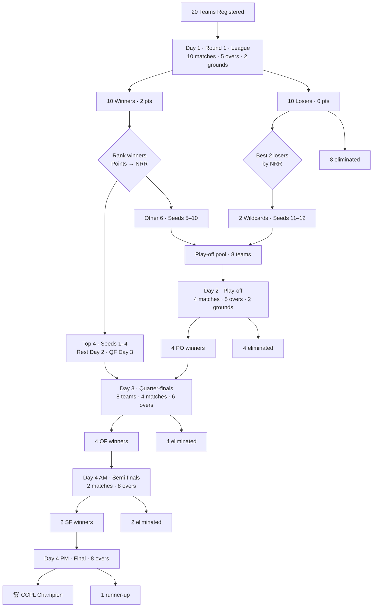

# CCPL — Tournament Workflow (20 Teams)

## Visual workflow (top → bottom)



---

## Text workflow (top → bottom)

*Read top → bottom. Team counts in [brackets]. Two grounds (G1/G2) run in parallel where noted.*

```
                              [20 teams]
                                   |
                                   v
+------------------------------------------------------------------+
|  DAY 1  |  ROUND 1 (LEAGUE)  |  10 matches  |  5 overs/side  |  2 grounds |
|  G1: M1-M5  |  G2: M6-M10  |  Random draw published before Day 1 |
+------------------------------------------------------------------+
                                   |
                    +--------------+--------------+
                    |                             |
                    v                             v
            [10 WINNERS]                   [10 LOSERS]
             2 pts each                      0 pts
                    |                             |
         Rank: Points -> NRR              Rank: NRR only (no points)
                    |                             |
        +-----------+-----------+                 |
        |           |           |                 |
        v           v           |                 v
   [TOP 4]     [OTHER 6]       |            [BEST 2]
   Seeds 1-4   Seeds 5-10      |            Wildcards
   BYE Day 2   enter play-off   |            Seeds 11-12
   (rest)      Day 2 play-off   |
        |           |           |                 |
        |           +-----+-----+-----------------+
        |                 |
        |                 v
        |    +----------------------------------------------------+
        |    |  DAY 2  |  PLAY-OFF  |  4 matches  |  5 overs  |  2 grounds |
        |    |  PO1:  5 v 12    PO2:  6 v 11   (G1)                 |
        |    |  PO3:  7 v 10    PO4:  8 v  9   (G2)                 |
        |    |  [8 teams in]  ->  [4 winners]  |  4 eliminated     |
        |    +------------------------+---------------------------+
        |                             |
        +-------------+---------------+
                      |
                      v
        +----------------------------------------------------------+
        |  DAY 3  |  QUARTER-FINALS  |  4 matches  |  6 overs  |  2 grounds |
        |  [8 teams: 4 direct seeds + 4 play-off winners]         |
        |  QF1: Seed 1  v  PO4 winner     QF2: Seed 2  v  PO3 win  |
        |  QF3: Seed 3  v  PO2 winner     QF4: Seed 4  v  PO1 win  |
        |  [4 winners]  |  4 eliminated                               |
        +---------------------------+------------------------------+
                                    |
                                    v
        +----------------------------------------------------------+
        |  DAY 4 AM  |  SEMI-FINALS  |  2 matches  |  8 overs       |
        |  SF1: QF1 winner  v  QF4 winner                          |
        |  SF2: QF2 winner  v  QF3 winner                          |
        |  [2 winners]  |  2 eliminated                             |
        +---------------------------+------------------------------+
                                    |
                                    v
        +----------------------------------------------------------+
        |  DAY 4 PM  |  FINAL  |  1 match  |  8 overs               |
        +---------------------------+------------------------------+
                                    |
                                    v
                           CCPL CHAMPION  [1]


  WHO GOES OUT WHEN
  -----------------------------------------------------------------
  End of Round 1     8 losers (no wildcard)           out: 8
  End of Play-off    4 play-off losers                out: 4
  End of QF          4 quarter-final losers           out: 4
  End of SF          2 semi-final losers              out: 2
  End of Final       1 runner-up                      out: 1
  -----------------------------------------------------------------
  Total matches: 21  |  Days: 4  |  Squad: 11-12
  Overs: League/Play-off 5  |  QF 6  |  SF/Final 8
  Tie-break: Points -> NRR -> Head-to-head
```

---

## Match format (overs per side)

| Phase | Matches | Overs/side | Day |
|-------|---------|------------|-----|
| **Round 1 (League)** | 10 | **5** | Day 1 |
| **Play-off** | 4 | **5** | Day 2 |
| **Quarter-finals** | 4 | **6** | Day 3 |
| **Semi-finals** | 2 | **8** | Day 4 AM |
| **Final** | 1 | **8** | Day 4 PM |

*One knockout phase per day after league — easier logistics, more rest between rounds.*

---

## Sample Day 1 schedule (realistic ops view)

*~30 min slot per league match (5 overs + changeover). Two grounds = 5 matches each.*

| Slot (approx) | Ground 1 | Ground 2 |
|---------------|----------|----------|
| 08:00–08:30 | R1-M1 (5 ov) | R1-M6 (5 ov) |
| 08:45–09:15 | R1-M2 | R1-M7 |
| 09:30–10:00 | R1-M3 | R1-M8 |
| 10:15–10:45 | R1-M4 | R1-M9 |
| 11:00–11:30 | R1-M5 | R1-M10 |
| 11:45–13:00 | Lunch + seeding (Top 4, wildcards, play-off bracket) | |

**Day 2 (play-off):** ~30 min slots · **5 overs** · Top 4 rest  
**Day 3 (QF):** ~35 min slots · **6 overs**  
**Day 4 (SF + Final):** ~45 min slots · **8 overs**

**End of Day 1:** Publish seeds 1–12. Top 4 notified — rest Day 2, QF on Day 3.

---

## Seeding logic (after Round 1)

| Seed | Source | Enters |
|------|--------|--------|
| 1–4 | Top 4 winners (Points → NRR) | Rest Day 2 · QF Day 3 |
| 5–10 | Other 6 winners (ranked 5→10) | Play-off Day 2 |
| 11–12 | Best 2 losers by NRR | Play-off Day 2 |
| — | Remaining 8 losers | Eliminated |

*Play-off pairings: 5v12, 6v11, 7v10, 8v9 (higher seed vs lower seed).*

---

## Compact pipeline (top → bottom)

```
START
  │
  ▼
20 Teams
  │
  ▼
Round 1 ─────────────── 10 matches (Day 1)
  │
  ├─── Top 4 winners ────────────────┐
  │                                 │
  ├─── 6 other winners ──┐          │
  │                      ├──→ Play-off ── 4 matches (Day 2)
  └─── 2 wildcards ──────┘          │
                                    ▼
                         Quarter-finals ── 4 matches (Day 3)
                                    │
                                    ▼
                         Semi-finals ── 2 matches (Day 4 AM)
                                    │
                                    ▼
                         Final ── 1 match (Day 4 PM)
                                    │
                                    ▼
                              🏆 CHAMPION
```

---

## Stage summary (top → bottom)

| Stage ↓ | Teams in | Matches | Overs | Day | Teams out |
|---------|----------|---------|-------|-----|-----------|
| **20 Teams** | 20 | — | — | — | — |
| **Round 1 (League)** | 20 | 10 | 5 | 1 | 8 losers out |
| **Top 4 + Play-off pool** | 12 | — | — | 1 | — |
| **Play-off** | 8 | 4 | 5 | 2 | 4 out |
| **Quarter-finals** | 8 | 4 | 6 | 3 | 4 out |
| **Semi-finals** | 4 | 2 | 8 | 4 AM | 2 out |
| **Final** | 2 | 1 | 8 | 4 PM | 1 runner-up |
| **🏆 Champion** | 1 | — | — | — | — |

**Total: 21 matches · 4 days**

---

## Step-by-step workflow

### Phase 0 — Before tournament
| Step | Action | Owner |
|------|--------|-------|
| 0.1 | Finalize 20 teams + captains | Planning team |
| 0.2 | Confirm squads (min 11, max 12) | Captains |
| 0.3 | Open draw for Round 1 pairings | Planning team |
| 0.4 | Publish schedule + rules | Pratham |

---

### Phase 1 — Round 1 (Day 1)
| Step | Action | Output |
|------|--------|--------|
| 1.1 | 20 teams → 10 matches | 10 winners, 10 losers |
| 1.2 | Record scores + calculate NRR | Standings table |
| 1.3 | Rank 10 winners → pick **Top 4** | Seeds 1–4 → **Direct QF** |
| 1.4 | Rank 10 losers → pick **Best 2 NRR** | 2 wildcards |
| 1.5 | Combine: 6 winners + 2 wildcards | **8 teams** → Play-off |
| 1.6 | Seed play-off teams as 5–12 | Play-off bracket ready |

---

### Phase 2 — Play-off (Day 2)
| Step | Action | Output |
|------|--------|--------|
| 2.1 | PO-1: Seed 5 vs Seed 12 | 1 winner |
| 2.2 | PO-2: Seed 6 vs Seed 11 | 1 winner |
| 2.3 | PO-3: Seed 7 vs Seed 10 | 1 winner |
| 2.4 | PO-4: Seed 8 vs Seed 9 | 1 winner |
| 2.5 | **4 play-off winners** qualify | Join QF |

---

### Phase 3 — Quarter-finals (Day 3)
| Step | Action | Output |
|------|--------|--------|
| 3.1 | QF1: Seed 1 vs PO-4 winner | 1 winner |
| 3.2 | QF2: Seed 2 vs PO-3 winner | 1 winner |
| 3.3 | QF3: Seed 3 vs PO-2 winner | 1 winner |
| 3.4 | QF4: Seed 4 vs PO-1 winner | 1 winner |
| 3.5 | **4 QF winners** | → Semi-finals |

---

### Phase 4 — Semi-finals + Final (Day 4)
| Step | Action | Output |
|------|--------|--------|
| 4.1 | SF1: QF1 winner vs QF4 winner | SF1 winner |
| 4.2 | SF2: QF2 winner vs QF3 winner | SF2 winner |
| 4.3 | FINAL: SF1 vs SF2 | 🏆 **Champion** |


---

## Match timeline

| Day | Phase | Matches | Overs | Cumulative |
|-----|-------|---------|-------|------------|
| Day 1 | Round 1 (League) | 10 | 5 | 10 |
| Day 2 | Play-off | 4 | 5 | 14 |
| Day 3 | Quarter-finals | 4 | 6 | 18 |
| Day 4 AM | Semi-finals | 2 | 8 | 20 |
| Day 4 PM | Final | 1 | 8 | **21** |

---

## Teams remaining after each phase

| After | Teams left | Eliminated |
|-------|------------|------------|
| Round 1 | 12 (4+8) | 8 losers (no wildcard) |
| Play-off | 8 (4+4) | 4 play-off losers |
| QF | 4 | 4 |
| SF | 2 | 2 |
| Final | 1 🏆 | 1 |

---

## Ranking rules (same at every stage)

1. **Points** (Win = 2, Tie = 1, Loss = 0)
2. **Net Run Rate (NRR)**
3. **Head-to-head** (if applicable)

---

## Roles

| Role | Responsibility |
|------|----------------|
| **Planning team** | Draw, schedule, NRR calculation, seeding |
| **Captains** | Squad 11–12, team on field |
| **Umpires** | Neutral officiating |
| **Scorers** | Scores + NRR |
| **Volunteers** | Logistics, registration |
