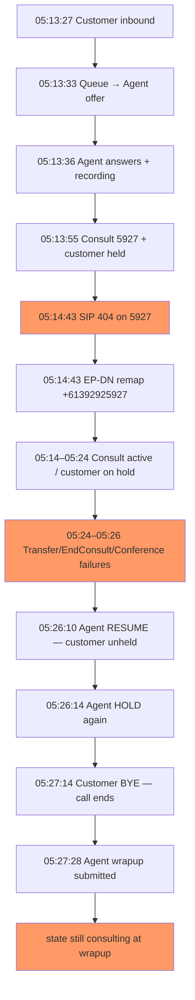

# Complete Call Timeline — Interaction 351cc6b4-f189-4383-96bb-5fc235e6d22b

**Customer ANI:** 00410036402  
**Agent:** Muralidharan Subramanian (`8ffcdcc7-4835-42e5-9deb-9f2b46fa0b9e`)  
**Org:** Crown Resorts (`68bbf765-3646-4d3f-a170-3edba9082081`)  
**DC:** prodanz1 / ANZ1  
**Correlation ID:** `484961fc-1ef1-4a9b-9a54-89faba6c5f47`

**Total call duration:** 13 min 47 sec (05:13:27 → 05:27:14 UTC)  
**AEST equivalent:** 15:13:27 → 15:27:14

---

## Call summary

| Metric | Value |
|--------|-------|
| Direction | Inbound |
| Queue | Example_Queue |
| Talk + consult time | ~13:47 |
| Customer on hold (consult) | ~12 min (05:13:55 → 05:26:11) |
| Consult target | 5927 → EP-DN +61392925927 (Crown Gifts) |
| Consult ended cleanly? | **No** — `AgentConsultEnded` never delivered |
| Final interaction state at wrapup | **`consulting`** (stuck) |
| Call end trigger | Customer disconnect (BYE) — no agent END click logged |

---

## Phase 1 — Agent ready (05:12–05:13:19 UTC)

```
05:12:47  Agent Desktop startup, session 067be260-cd43-4de5-9f58-df30e5e4c34e
05:12:47  Feature flag ON: wxcc_consult_to_entry_point_dn
05:13:19  Agent state → Available (tracking 5cfcae78)
```

---

## Phase 2 — Customer inbound & queue (05:13:27 UTC)

```
05:13:27  INVITE from customer 00410036402 → DNIS +613xxxxx951
05:13:27  SIP 180 Ringing, channel create on Freeswitch 10.192.124.234
05:13:27  ContactNew → flowcontrol → IVR music-in-queue
05:13:27  QueueAddContact → customer enters queue
05:13:28  Early IVR leg teardown (ConversationEnd on queue leg)
```

**Call Leg 1** (customer ↔ platform): starts 05:13:27.145

---

## Phase 3 — Agent answers (05:13:33–05:13:36 UTC)

```
05:13:33  AgentContactReserved
05:13:33  AgentOfferContact (ACD)
05:13:36  AgentContactAssigned — agent connected to customer
05:13:36  CallRecordingStarted
```

**Desktop (AEST):**
```
15:13:33  Offer received
15:13:36  Assigned + recording started
```

**Call Leg 2** (agent ↔ customer media): starts 05:13:33.227, duration 13:41

---

## Phase 4 — Consult initiated to 5927 (05:13:55 UTC)

```
05:13:55  desktop → routing-api: consultRoute
05:13:55  Customer auto-held (AgentContactHeld)
05:13:55  ConversationCreateConsult, dialCall originate
05:13:55  INVITE sip:5927@cc-au.bcld.webex.com
05:13:55  ur → notifs: AgentConsultCreated (leg 6d35d7ca, DN, dest=5927)
```

**Desktop (AEST):**
```
15:13:41  CONSULT clicked
15:13:55  CONSULT initiated → DN 5927
15:13:55  AgentContactHeld
15:13:55  AgentConsultCreated — leg 6d35d7ca, type DN
```

**Call Leg 3** (consult to 5927): 05:13:55.322 → 05:14:43.798 (48 sec)

---

## Phase 5 — SIP 404 & EP-DN remap (05:14:43 UTC)

```
05:14:43  SIP/2.0 404 Not Found from Crown CUCM 10.80.2.69 (bare 5927)
05:14:43  CHANNEL_HANGUP on 5927 consult channel
05:14:43  ConversationConsultCreated — new EP leg 0886edac
05:14:43  ur → notifs: AgentConsultCreated (EP-DN, dest=+61392925927)
05:14:43  Flow: GSC_CROWN_GIFTS_2025 / EP_CROWN_GIFTS
```

**Desktop (AEST):**
```
15:14:43  AgentConsultCreated — leg 0886edac, type EP-DN, +61392925927
15:14:43  ContactUpdated
```

**Defect:** Zombie leg `6d35d7ca` not cleaned up; active leg `0886edac` created.

---

## Phase 6 — Consult active, customer on hold (05:14:43–05:23:35 UTC)

```
05:14:55  ContactUpdated (consult progress)
05:23:35  Consult leg reconnect activity (Call Leg 4 starts)
05:23:39  ContactUpdated (desktop)
```

**~9 minutes** — agent connected to Crown Gifts EP/IVR; customer remains on hold; desktop shows consult UI with minimal events (keepalives only).

**Call Leg 4** (EP consult path): 05:23:35.644 → 05:27:14.549 (3:39)

---

## Phase 7 — Agent recovery attempts (05:24–05:26 UTC)

### Transfer failures (HTTP 400 — empty `to`)

```
05:24:22  consultTransferRoute → 400 (aa17f729)
05:24:46  consultTransferRoute → 400 (8a89ec03)
05:25:48  consultTransferRoute → 400 (f60fe17f)
05:26:16  consultTransferRoute → 400 (22766669)
```

### End Consult ×3 (HTTP 202, but no AgentConsultEnded)

```
05:24:49  endConsultRoute → ConsultEnd → ConversationEnded on leg 6d35d7ca ONLY
05:25:25  endConsultRoute → same wrong-leg close (ffc38fd4)
05:26:26  endConsultRoute → same wrong-leg close (9b85370c)
```

**Desktop:** Each End Consult blocks ~20s → `Service.aqm.reqs.Timeout` waiting for `AgentConsultEnded`.

### Conference failures (HTTP 400 — missing `.to`)

```
05:26:18  consultConferenceRoute → 400 (9e5647da)
05:26:24  consultConferenceRoute → 400 (f8ae05f0)
```

---

## Phase 8 — Manual resume & re-hold (05:26:10–05:26:14 UTC)

```
05:26:10  desktop → agentUnHoldRoute
05:26:11  ConversationUnheld → AgentContactUnheld (customer off hold)
05:26:11  Recording resumed
05:26:14  desktop → agentHoldRoute (customer held again)
```

**Desktop (AEST):**
```
15:26:10  RESUME clicked — workaround to unhold customer
15:26:11  AgentContactUnHeld
15:26:14  HOLD clicked again
```

**Note:** Consult state never cleared — `AgentConsultEnded` still not sent.

---

## Phase 9 — Call end (05:27:14 UTC)

```
05:27:14  BYE from customer 00410036402 (customer disconnect)
05:27:14  CHANNEL_HANGUP on agent/customer legs
05:27:14  ConversationEnd → ContactEnded
05:27:14  ur → qrm: AgentWrapup
05:27:14  ur → notifs: ContactEnded, AgentWrapup
05:27:14  Recording stopped, uploadCPaasRecording
05:27:14  Conference destroy, all legs torn down
```

**Desktop (AEST):**
```
15:27:14  AgentContactEnded (no prior END click — customer hung up)
15:27:14  AgentWrapup event
15:27:16  AI post-call summary received
```

**No `AgentConsultEnded` at any point in the entire call.**

---

## Phase 10 — Wrap-up complete (05:27:28 UTC)

```
05:27:28  desktop → agentWrapUpRoute
05:27:28  ContactWrapupDone → AgentWrappedUp
05:27:28  ContactDelete, agent returns to routing pool
```

**Desktop (AEST):**
```
15:27:28  POST /wrapup → 202 (tracking 3a5c99d1)
15:27:28  AgentContactWrappedUp
```

**Critical state at wrapup (from desktop log):**
- `"state": "consulting"` — consult never formally ended
- Both consult legs still in media map: `6d35d7ca` (5927) and `0886edac` (EP-DN)
- EP participant `+61392925927` / EP_CROWN_GIFTS: `hasLeft: false`

---

## Call legs summary (from ladder)

| Leg | Calling | Called | Start | End | Duration |
|-----|---------|--------|-------|-----|----------|
| 1 | 004xxxxx402 | +613xxxxx951 | 05:13:27 | 05:27:14 | 13:47 |
| 2 | 004xxxxx402 | 6620 (agent) | 05:13:33 | 05:27:14 | 13:41 |
| 3 | +613xxxxx951 | 5927 (DN consult) | 05:13:55 | 05:14:43 | 0:48 |
| 4 | +613xxxxx927 | 31548 (EP consult) | 05:23:35 | 05:27:14 | 3:39 |

---

## Key events never fired

| Event | Expected when | Actual |
|-------|---------------|--------|
| AgentConsultEnded | Each End Consult success | **Never** (0 in notifs) |
| AgentConsultTransferFailed | Transfer to Crown Gifts | Transfer failed at API (400) before routing |
| Clean consult state exit | End Consult or Transfer | State stuck `consulting` through wrapup |

---

## Complete call flow (mermaid)


