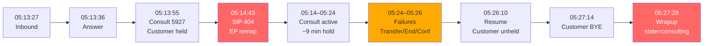
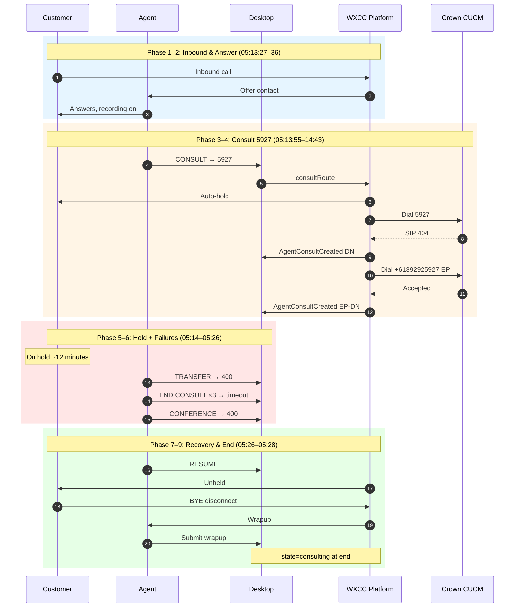
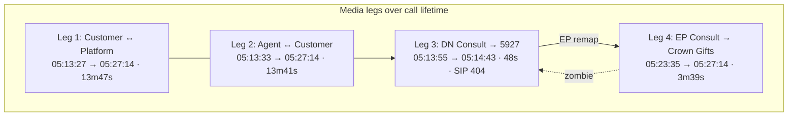

# Complete Call Workflow Diagram

**Interaction:** `351cc6b4-f189-4383-96bb-5fc235e6d22b`  
**Customer:** 00410036402 · **Agent:** Muralidharan Subramanian  
**Duration:** 13m 47s (05:13:27 → 05:27:14 UTC)

---

## Complete call workflow (single diagram)

```mermaid
flowchart TD
    subgraph P1["① INBOUND — 05:13:27"]
        C1[Customer 00410036402 calls]
        C2[SIP INVITE → Queue / IVR]
        C3[QueueAddContact — music on hold]
        C1 --> C2 --> C3
    end

    subgraph P2["② AGENT ANSWER — 05:13:33–36"]
        A1[AgentContactReserved]
        A2[AgentOfferContact ACD]
        A3[AgentContactAssigned]
        A4[CallRecordingStarted]
        A1 --> A2 --> A3 --> A4
    end

    subgraph P3["③ CONSULT START — 05:13:55"]
        S1[Agent clicks CONSULT]
        S2[Dial Number: 5927]
        S3[Customer AUTO-HELD]
        S4[AgentConsultCreated<br/>leg 6d35d7ca · DN]
        S1 --> S2 --> S3 --> S4
    end

    subgraph P4["④ SIP 404 + EP REMAP — 05:14:43"]
        E1[Dial 5927 → Crown CUCM 10.80.2.69]
        E2[SIP 404 Not Found]
        E3[EP-DN remap via feature flag]
        E4[Dial +61392925927 Crown Gifts]
        E5[AgentConsultCreated<br/>leg 0886edac · EP-DN]
        E6[⚠ Zombie leg 6d35d7ca not removed]
        E1 --> E2 --> E3 --> E4 --> E5 --> E6
    end

    subgraph P5["⑤ CONSULT ACTIVE — 05:14:43–05:24"]
        W1[Agent connected to Crown Gifts IVR/queue]
        W2[Customer remains on HOLD ~12 min]
        W3[Desktop: consult UI, minimal events]
        W1 --> W2 --> W3
    end

    subgraph P6["⑥ RECOVERY FAILURES — 05:24–05:26"]
        F1[TRANSFER ×4 → HTTP 400 empty to]
        F2[END CONSULT ×3 → HTTP 202 then 20s freeze]
        F3[CONFERENCE ×2 → HTTP 400 missing to]
        F4[ConsultEnd closes wrong leg 6d35d7ca only]
        F5[AgentConsultEnded NEVER sent]
        F1 --> F4
        F2 --> F4 --> F5
        F3 --> F4
    end

    subgraph P7["⑦ MANUAL WORKAROUND — 05:26:10"]
        M1[Agent clicks RESUME]
        M2[Customer UNHELD ✓]
        M3[Agent clicks HOLD again 05:26:14]
        M1 --> M2 --> M3
    end

    subgraph P8["⑧ CALL END — 05:27:14"]
        X1[Customer sends BYE disconnect]
        X2[All SIP legs torn down]
        X3[AgentContactEnded]
        X4[AgentWrapup + recording stopped]
        X1 --> X2 --> X3 --> X4
    end

    subgraph P9["⑨ WRAPUP — 05:27:28"]
        Z1[Agent submits wrapup]
        Z2[AgentContactWrappedUp]
        Z3[⚠ state still consulting]
        Z4[⚠ Both consult legs still in media map]
        Z1 --> Z2 --> Z3 --> Z4
    end

    C3 --> A1
    A4 --> S1
    S4 --> E1
    E6 --> W1
    W3 --> F1
    W3 --> F2
    W3 --> F3
    F5 --> M1
    M3 --> X1
    X4 --> Z1
    Z4 --> END([Call complete<br/>Consult never completed])

    style E2 fill:#f66,stroke:#333,color:#fff
    style E6 fill:#f66,stroke:#333,color:#fff
    style F1 fill:#fa0,stroke:#333
    style F2 fill:#fa0,stroke:#333
    style F3 fill:#fa0,stroke:#333
    style F5 fill:#f66,stroke:#333,color:#fff
    style M2 fill:#6f6,stroke:#333
    style Z3 fill:#f66,stroke:#333,color:#fff
    style Z4 fill:#f66,stroke:#333,color:#fff
```

---

## Horizontal timeline view

---

## Swimlane — complete call

---

## Call legs across the workflow

---

## Legend

| Symbol | Meaning |
|--------|---------|
| 🔴 Red nodes | Failure / defect |
| 🟠 Orange nodes | API rejection (400) |
| 🟢 Green nodes | Successful recovery step |
| ⚠ | Stuck / incomplete state |
