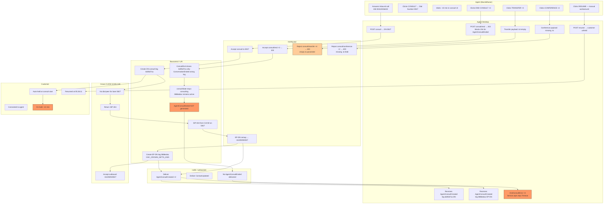
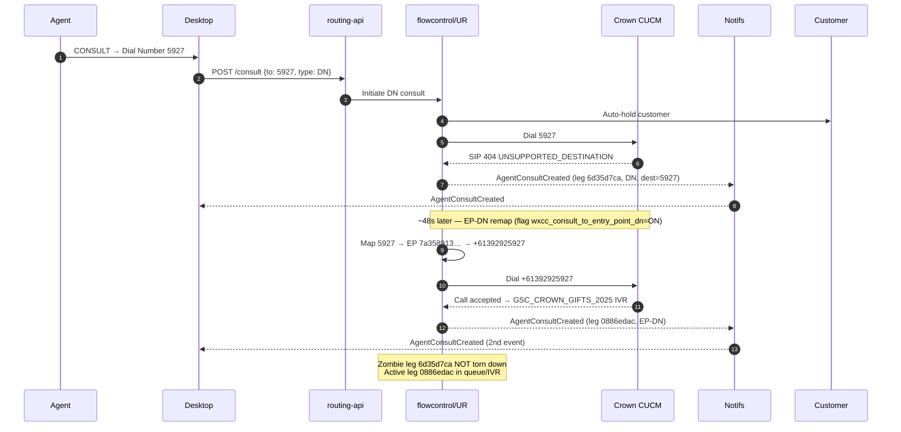
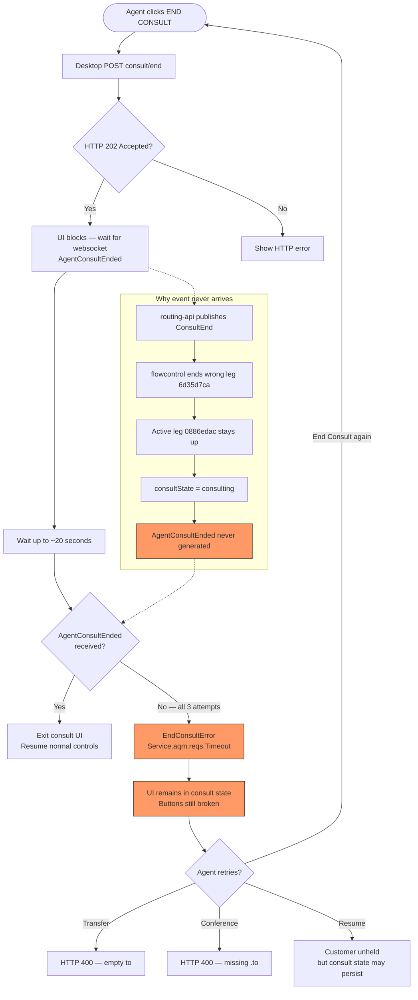
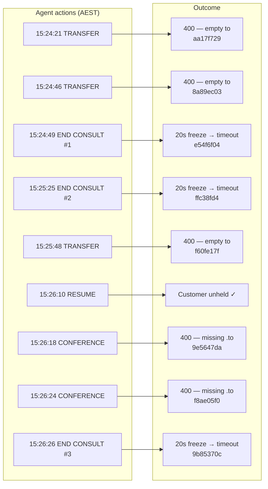
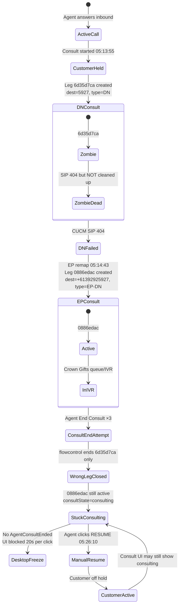
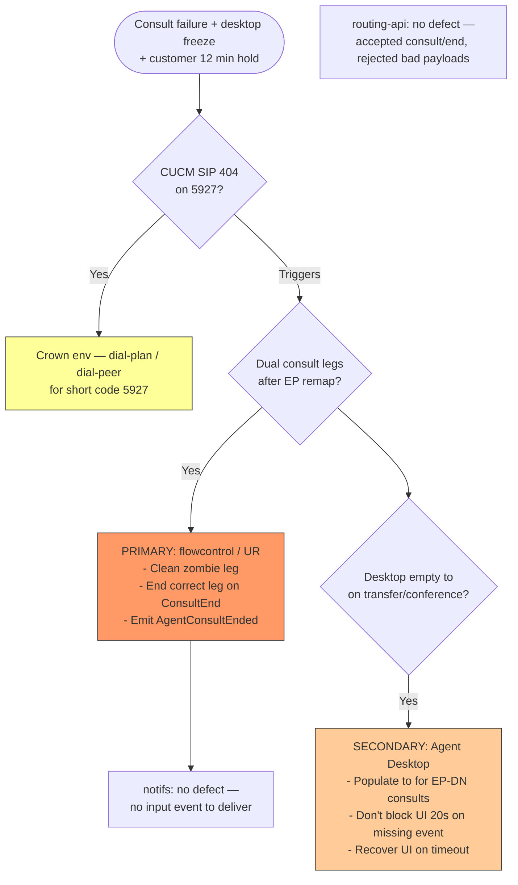

# Crown Resorts Consult Failure — Workflow

**Interaction:** `351cc6b4-f189-4383-96bb-5fc235e6d22b`  
**Correlation:** `484961fc-1ef1-4a9b-9a54-89faba6c5f47`  
**Date:** 2026-07-09 05:13–05:27 UTC (15:13–15:27 AEST)

---

## 1. End-to-end incident workflow

---

## 2. Consult initiation workflow (5927 → EP-DN remap)

---

## 3. Desktop freeze workflow (End Consult)

---

## 4. Agent recovery attempts workflow (05:24–05:27)

---

## 5. Dual consult leg state workflow

---

## 6. Responsibility workflow (defect routing)

---

## Key identifiers

| Item | Value |
|------|-------|
| Interaction ID | `351cc6b4-f189-4383-96bb-5fc235e6d22b` |
| DN consult leg | `6d35d7ca-0ca2-4d21-9880-8a0a1926e68c` |
| EP-DN consult leg | `0886edac-9801-4174-b293-872d893445e0` |
| EP ID (Crown Gifts) | `7a358913-645d-4bb7-a1bd-91ed6cd2e0b2` |
| End Consult tracking | `e54f6f04`, `ffc38fd4`, `9b85370c` |
| Transfer 400 tracking | `aa17f729`, `8a89ec03`, `f60fe17f` |
