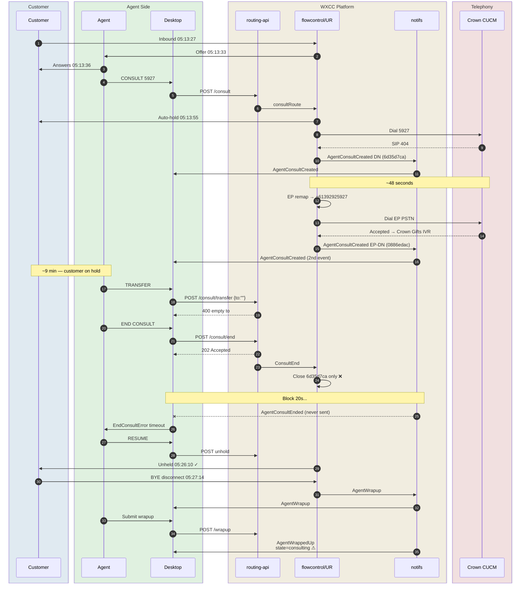
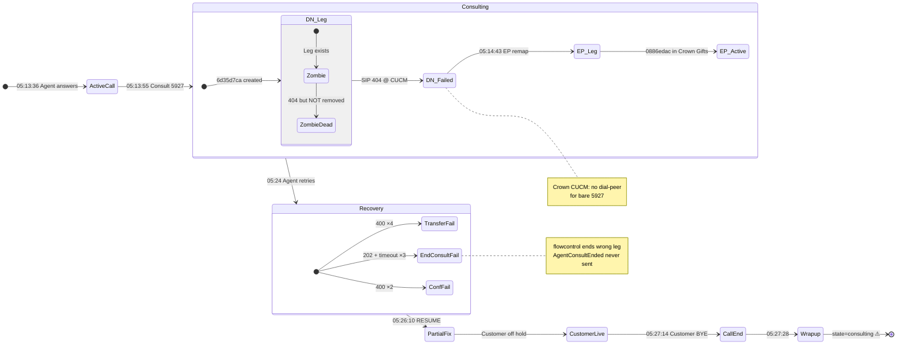
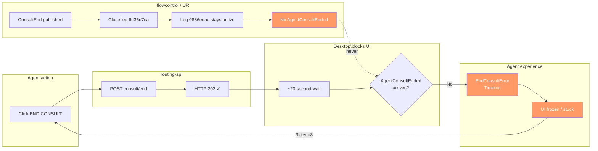
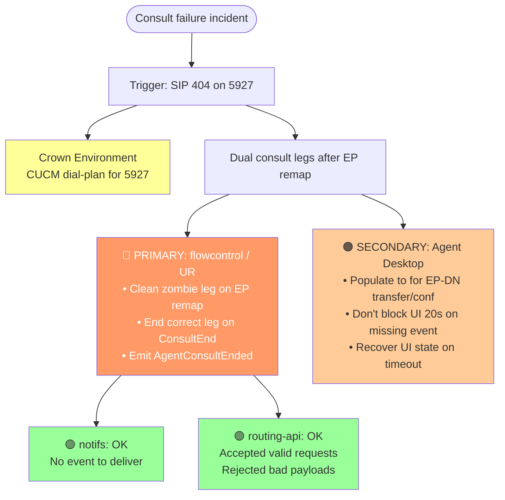

# Crown Consult Failure — Workflow Diagrams

**Interaction:** `351cc6b4-f189-4383-96bb-5fc235e6d22b`  
**Date:** 2026-07-09 · **Duration:** 13m 47s · **DC:** prodanz1

> Paste any diagram below into Jira, Confluence (Mermaid macro), GitHub, or [mermaid.live](https://mermaid.live) to render.

---

## Diagram 1 — Complete call workflow (master)

```mermaid
flowchart TD
    START([Customer calls 00410036402]) --> QUEUE[Queue / IVR<br/>05:13:27]
    QUEUE --> ANSWER[Agent answers<br/>05:13:36]
    ANSWER --> TALK[Brief conversation<br/>~19 seconds]

    TALK --> CONSULT[Agent: CONSULT → 5927<br/>05:13:55]
    CONSULT --> HOLD[Customer AUTO-HELD]

    HOLD --> DNLEG[DN consult leg created<br/>6d35d7ca]
    DNLEG --> DIAL5927[Dial 5927 via CUCM]
    DIAL5927 --> SIP404{SIP 404?<br/>CUCM 10.80.2.69}

    SIP404 -->|Yes| EPREMAP[EP-DN remap ~48s later<br/>+61392925927 Crown Gifts<br/>05:14:43]
    EPREMAP --> EPLEG[EP consult leg created<br/>0886edac]
    EPLEG --> ZOMBIE[⚠ Zombie leg 6d35d7ca<br/>NOT cleaned up]

    ZOMBIE --> WAIT[Agent in consult ~9 min<br/>Customer still on hold]

    WAIT --> FAILZONE{Agent tries to recover<br/>05:24–05:26}

    FAILZONE -->|Transfer ×4| T400[HTTP 400<br/>empty to field]
    FAILZONE -->|End Consult ×3| E202[HTTP 202 accepted<br/>then 20s UI freeze]
    FAILZONE -->|Conference ×2| C400[HTTP 400<br/>missing .to]

    E202 --> NOWS[No AgentConsultEnded<br/>Wrong leg closed only]
    T400 --> STUCK
    C400 --> STUCK
    NOWS --> STUCK[UI stuck in consulting state]

    STUCK --> RESUME[Agent clicks RESUME<br/>05:26:10]
    RESUME --> UNHOLD[Customer unheld ✓]
    UNHOLD --> REHOLD[Agent clicks HOLD<br/>05:26:14]

    REHOLD --> CUSTEND[Customer disconnects BYE<br/>05:27:14]
    CUSTEND --> WRAPUP[Agent wrapup<br/>05:27:28]
    WRAPUP --> ENDSTATE[⚠ State still consulting<br/>Both consult legs present]

    ENDSTATE --> DONE([Call complete<br/>Consult never completed])

    style SIP404 fill:#f96,stroke:#333,color:#fff
    style ZOMBIE fill:#f96,stroke:#333,color:#fff
    style T400 fill:#fc9,stroke:#333
    style C400 fill:#fc9,stroke:#333
    style NOWS fill:#f96,stroke:#333,color:#fff
    style STUCK fill:#f96,stroke:#333,color:#fff
    style ENDSTATE fill:#f96,stroke:#333,color:#fff
    style UNHOLD fill:#9f9,stroke:#333
```

---

## Diagram 2 — Swimlane sequence (systems view)

---

## Diagram 3 — Dual consult leg state machine

---

## Diagram 4 — Desktop freeze workflow

---

## Diagram 5 — Defect routing (who owns what)

---

## Diagram 6 — Timeline Gantt view

```mermaid
gantt
    title Complete Call Timeline (UTC)
    dateFormat HH:mm:ss
    axisFormat %H:%M

    section Customer
    Inbound call           :05:13:27, 14m
    On hold (consult)      :crit, 05:13:55, 12m
    Briefly unheld         :05:26:10, 4s
    On hold again          :05:26:14, 60s
    Disconnects BYE        :milestone, 05:27:14, 0s

    section Agent
    Answers call           :05:13:36, 13m38s
    Consult to 5927        :05:13:55, 13m19s
    Recovery attempts      :crit, 05:24:21, 2m5s
    Resume customer        :05:26:10, 4s
    Wrapup                 :05:27:28, 30s

    section Consult Legs
    DN leg 5927 (404)      :crit, 05:13:55, 48s
    EP leg +61392925927    :05:14:43, 12m31s

    section Failures
    Transfer 400 ×4        :crit, 05:24:22, 2m
    EndConsult timeout ×3  :crit, 05:24:49, 2m
    Conference 400 ×2      :crit, 05:26:18, 10s
```

---

## Key IDs (reference)

| Item | Value |
|------|-------|
| Interaction | `351cc6b4-f189-4383-96bb-5fc235e6d22b` |
| DN consult leg | `6d35d7ca-0ca2-4d21-9880-8a0a1926e68c` |
| EP-DN consult leg | `0886edac-9801-4174-b293-872d893445e0` |
| Crown Gifts EP | `7a358913-645d-4bb7-a1bd-91ed6cd2e0b2` |
| PSTN mapped | `+61392925927` |
| End Consult tracking | `e54f6f04`, `ffc38fd4`, `9b85370c` |
